COMPUTER - MY FRIEND

I have a lot of fun with my friends like Penny, Jodu, Sharpy and many others. How can a computer be our friend?

Computer

Places where computers can be seen

Types of computer

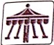

##### LET'S HAVE FUN

##### Sing along-

Computer! Computer! Be my friend,

Computer! Computer! Our friendship will have no end,

Computer! Computer! Let me write my name,

Computer! Computer! Let me play a game,

Computer! Computer! Let me draw the Sun,

Computer! Computer! Let me have some fun.

We all have friends. We like to play with them. Let us meet a new friend .....

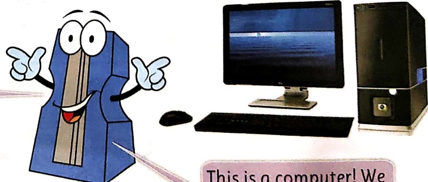

This is a computer! We can play with it like we play with our other friends.

##### MY COMPUTER

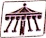

##### LET'S HAVE FUN

computer

Fill your new friend Computer with colours of your choice.

month 60

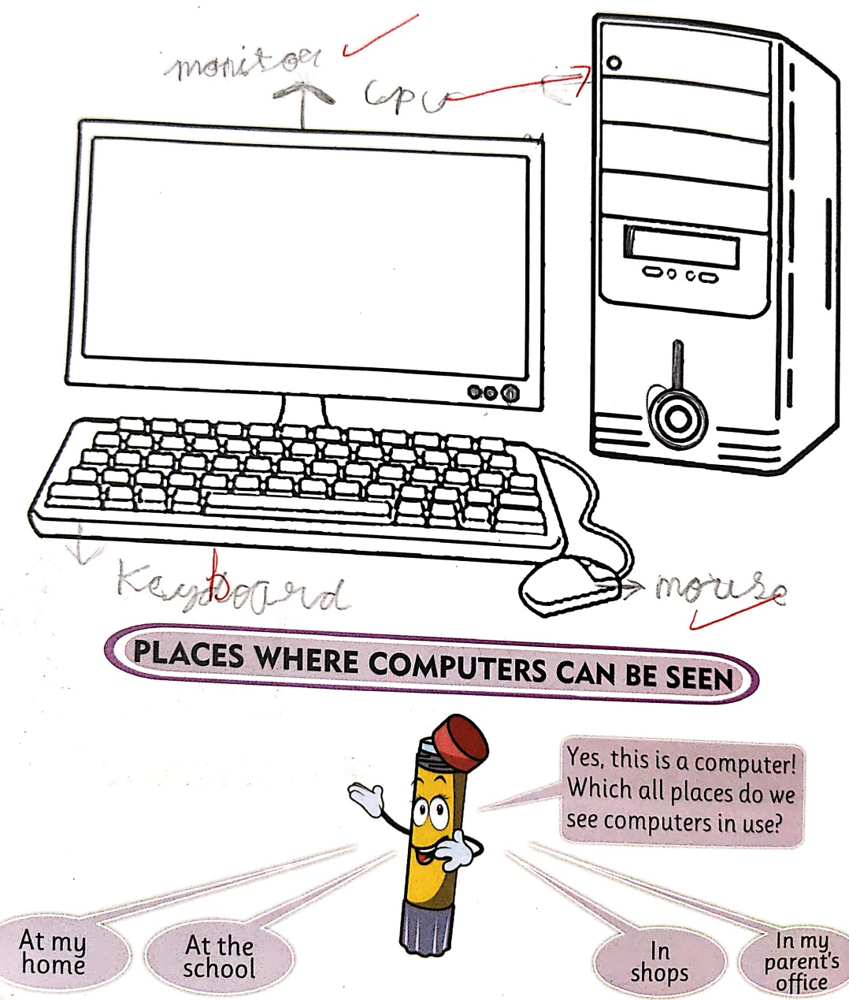

PLACES WHERE COMPUTERS CAN BE SEEN

Yes, this is a computer! Which all places do we see computers in use?

At the school

In shops

#### We can see computers at most of the places. Let us see the places where computers are seen.

At homes

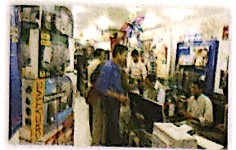

At shops and malls

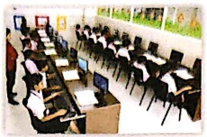

At schools

At airports

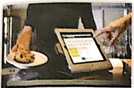

At restaurants

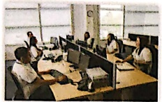

In offices

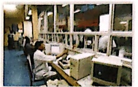

At railway stations

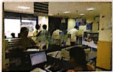

In banks

TYPES OF COMPUTER

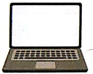

This is a laptop.

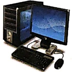

#### We can see different types of computer all around. Some are big and some are very small.

This is a desktop.

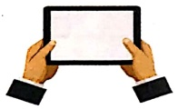

This is a tablet.

##### WISDOM BOX

Smartphone is also a type of computer.

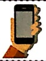

Look carefully at the pictures given above about "Places Where Computers Can Be Seen" and fill in the blanks.

1. We can see desktops in use in/at ___ and in office.

2. We can see tablets in use in/at ___

3. We can see laptops in use in/at - Aamk8

4. We can see ___ in use at shops and malls.

##### WORD MASTER

friendship - relation between friends

library - A room where books are kept

restaurant - A place where we eat meals and pay for it

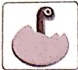

##### LET'S TRY

A. Write whether true or false.

1. Tablet is a type of computer.

2. Laptop is a very big computer.

3. Computers can be seen in a mall.

4. Computers can not be our friend.

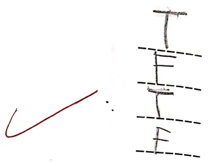

B. Fill in the blanks using words from the Help-Box.

[Table 1](tables/table_001.html)

We can play with our friends. In the same way we can play with

computals also. They can be big or small. They are mostly found at

all places.

##### LET'S LEARN

## C. Match the following.

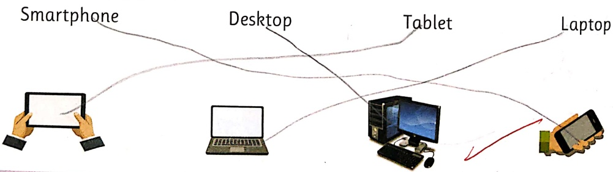

D. Unjumble the given letters to write meaningful words.

1. MPUCOTRE

2. PALOPT

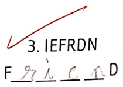

##### LET'S MASTER

E. Select the correct type of computer from the choices given.

1. Priya is travelling to Delhi for some office work.

She should carry a  $ \underline{\text{laptop}} $--- (desktop/laptop) with her.

2. Maria is going for a morning walk.

She should carry a small phone (laptop/ smartphone) with her.

3. Angad works in a bank.

He should do his office work on a desk (desktop/tablet).

4. I play games and watch cartoons on a smartphone (smartphone / desktop / laptop/tablet).

F. Answer the following.

批注：V134 L.W

1. Name any two places where you can see computers in use.

At home

In شاھد and malls

2. Name any one quality of a computer that makes it your friend.

It works very fast

3. Name any two types of computers.

tablur

laptop

4. Name the type of computer which is the biggest and the heaviest of all.

Despite p If we

FUN WITH FRIENDS

Look around with your friends for pictures of computers. Paste or draw the picture of your new friend - Computer on a chart paper. Also, name which type of computer is it. Is it a desktop? Is it a laptop? Is it a tablet? Is it a smartphone?

# MORE ABOUT COMPUTERS...

#### COMPUTERS THEN

This is the picture of the first computer. It was so big that it occupied a full room.

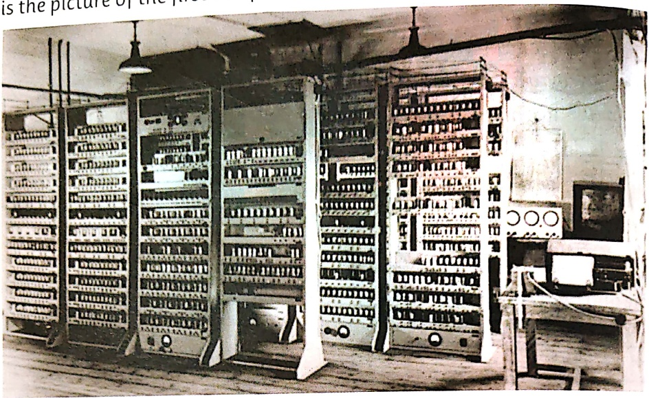

##### COMPUTERS NOW

This is the picture of a smartphone that easily fits in our hand.

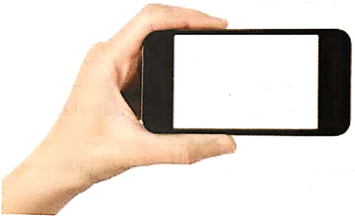

Computer is my new friend. It is a machine.

Do you know, my friend Kainchi is also a machine. It helps us to cut and make new things. How is my friend-computer, a smart machine?

Machine

Features of a machine