COMPUTER - A SMART MACHINE

I never get tired.

I never make mistakes.

I can do a lot of work like paint, write and play music.

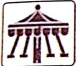

I can store a lot of things, like pictures, books, songs and movies.

I work very fast.

I do what you ask me to do.

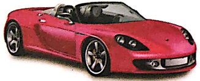

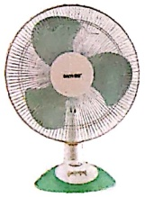

##### WORD MASTER

machine- a man-made thing that helps us do our work easily fuel- things like petrol, wood that give power to machines to work

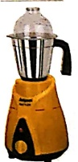

##### LET'S TRY

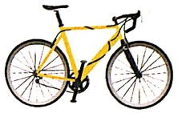

A. Tick the machines.

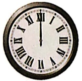

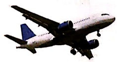

✓

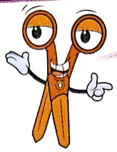

×

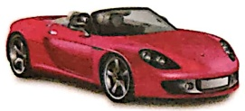

✓

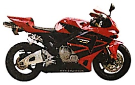

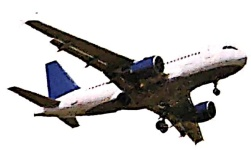

B. Write whether true or false.

1. A washing machine runs on fuel.  $ \underline{F} $

2. Smartphone is a machine as it makes our work easy.  $ \underline{T} $

3. Sun is not a machine as it is not made by people.  $ \underline{F} $

4. A computer gets tired easily.  $ \underline{F} $

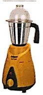

##### LET'S LEARN

C. Match the following.

A machine that runs on fuel.

A machine that runs on electricity.

2.

A machine that runs on human power.

3 It is not a machine.

4 D. Unjumble the given letters to write meaningful words.

1. ULEF F U L

2. TSRAM S M a g T

3. IYLECETCRIT E L E C A N I E T T Y

4. EMCANHI M a g h I N E

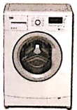

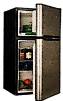

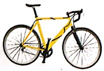

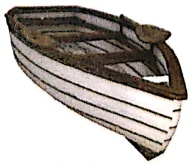

#### LET'S MASTER

E. Select the correct option from the choices given.

1. Meera's car does not get tired as it is a  $ \underline{\text{machine}} $ (thing/machine).

2. Aryan's computer never makes mistake as it is a  $ \underline{\text{smart}} $ (smart/small) machine.

3. A car helps us  $ \underline{\text{go on}} $ (save/easy) our time.

4. We can  $ \underline{\text{store}} $ pictures in a computer.

1. Name any two machines that run on electricity.

## F. Answer the following.

matchbin.

2.Name any two machines that run on fuel.

Helen for

Sincerely bus

3. Write any two features of computer that make it a smart machine.

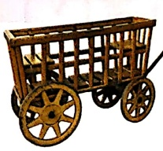

4. Name two things that are not made by people.

### FUN WITH FRIENDS

Paste or draw pictures of machines that you use. Write E if they run on electricity, F if they run on fuel and H if they run on human power.

# MORE ABOUT COMPUTERS...

##### COMPUTERS THEN

This is a picture of parts of a computer from earlier times.

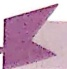

##### COMPUTERS NOW

This is a picture of parts of a computer in today's time. These are so small a compared to computer parts  $ \underline{\text{seen in the above}} $ picture.

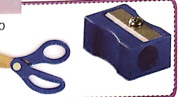

My friend Computer is a smart machine. It can do the work that I ask it to do.

####