COMPUTER - A HANDY MACHINE

My friend Gadbad is very helpful. If I make any mistake it erases that. How useful and helpful is a computer? Why do we use a computer?

Uses for me

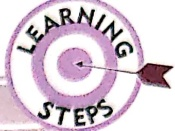

Uses for my family

Uses for people around me

Benefits of a computer

### Computer is a very useful machine. It helps us to do a lot of things.

##### USES FOR ME

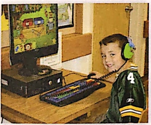

To play games

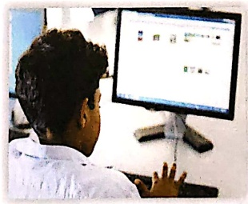

To attend online classes

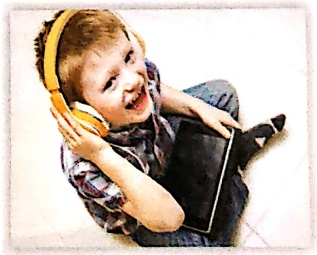

To listen to music

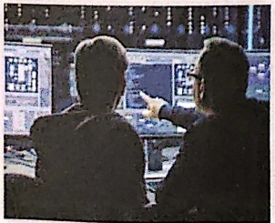

To know about different things

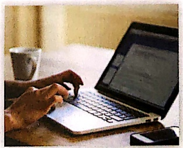

To type letters

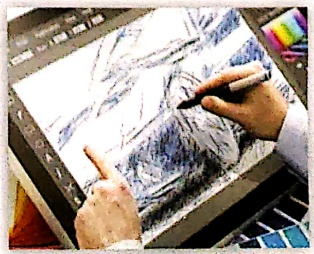

To draw and paint

For my sister
 

#### USES FOR MY FAMILY

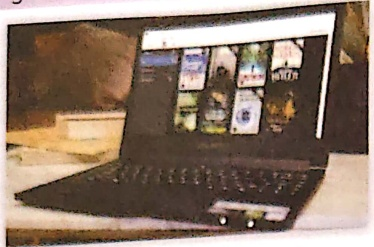

She reads books on it.

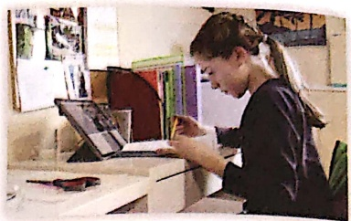

She solves sums faster on it.

For my parents
 

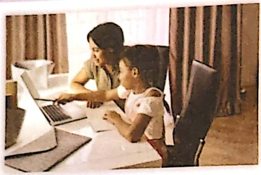

to help me get details for my school projects

to pay bills online

to shop online

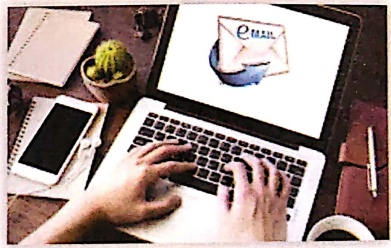

to send emails and messages

around the world

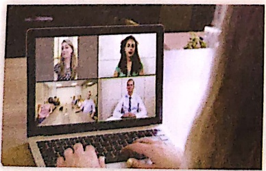

to attend office meetings

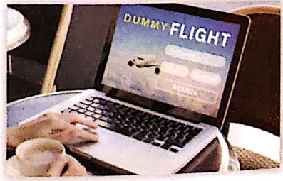

to book tickets online

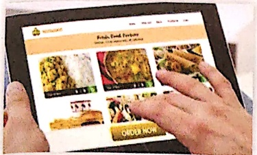

to order food online

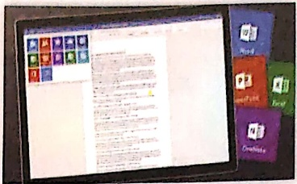

to store a lot of things like office work, letters in it

We all watch movies and cartoons on it.

At schools
 

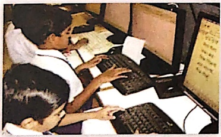

for teaching and learning

In offices

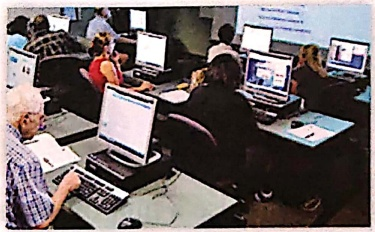

In libraries
 

for office work

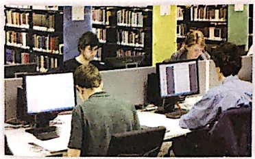

for keeping details of books issued

and returned

At airports/ railway stations
 

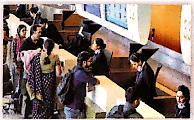

for booking tickets

##### In hospitals

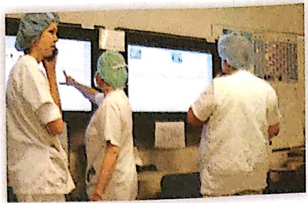

for keeping details of patients

##### In shops/restaurants

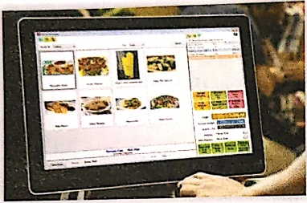

for making bills

##### In vehicles

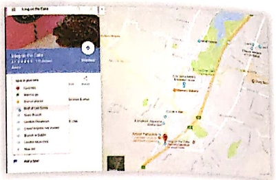

for showing a map to the location

##### In banks

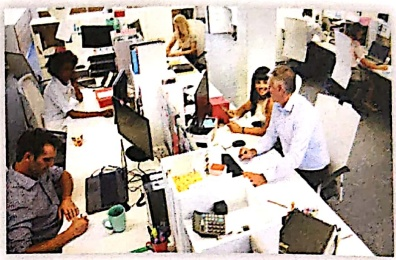

for keeping details of money

withdrawn and deposited

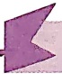

##### WISDOM BOX

ATM is also a type of computer. We can withdraw and deposit money using this machine.

##### BENEFITS OF A COMPUTER

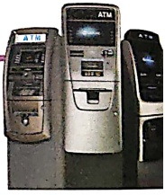

• It does not make mistakes.

We can do our work faster.

• It saves our time.

• It can do different types of work.

Computer is helpful in many ways.

• It can connect us to any place in the world.

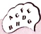

##### WORD MASTER

handy-useful

mistake-an error

online- connected to internet

deposit- a sum of money kept in a bank

location-place

patient- a person who is taking medical treatment

benefit- good for us

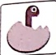

##### LET'S TRY

A. Write whether true or false.

1. We can listen to music on a computer.

2. We cannot draw on a computer.

3. We cannot type a letter on a computer.

4. A computer can make bills.

B. Fill in the blanks using words from the Help-Box.

[Table 1](tables/table_001.html)

1. My sister can solve the sums ___ on a computer.

2. We can _____ tickets on a computer.

3. Computer is used for making ___.

4. In banks, a computer is used for keeping details of ___ withdrawn and deposited.

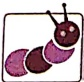

##### LET'S LEARN

C. Match the following.

A computer is used for teaching and learning

at home

A computer is used to make bills

at railway station

A computer is used to book tickets

A computer is used to watch cartoons

D. Unjumble the given letters to write meaningful words. at schoo

at restaurant

1. CMIUS M___ ___ ___

2. YAHND H___ ___ ___

3. PEODSTI D___ ___ ___ ___

4. NOLEIN O______

##### LET'S MASTER

E. Select the correct options from the choices given.

In a _____ (library/bank), a computer is used to keep the details of _____ (bills/money) withdrawn and deposited. Computer at _____ (shop/home/hospital) is used to keep the details of _____ (money/patients/books).

F. Answer the following.

1. Write any two uses of a computer at home.

2. Write two benefits of a computer.

3. Give any two online uses of a computer.

4. Name some activities you do on your computer.

### FUN WITH FRIENDS

Watch a rhyme or a cartoon with your friend on a computer and draw one of the characters from that cartoon/rhyme on the given computer screen.

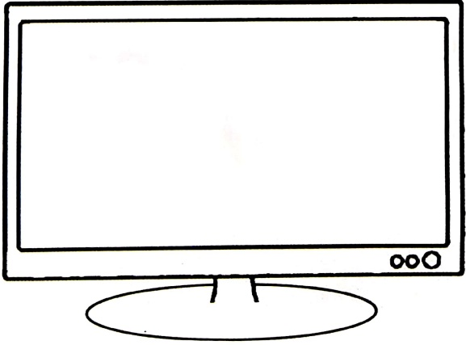

##### MORE ABOUT COMPUTERS...

##### USES OF COMPUTERS THEN

Earlier, computers were just used to solve big mathematical sums faster.

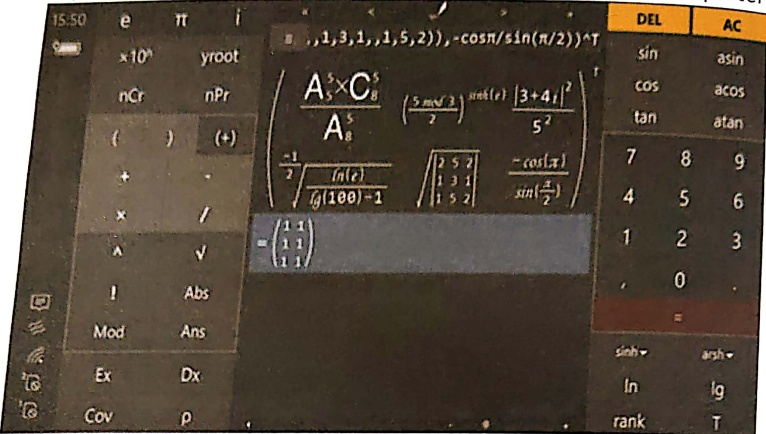

##### USES OF COMPUTERS NOW

Now, computers are used to do a lot of things in our day to day life like painting, reading and shopping.

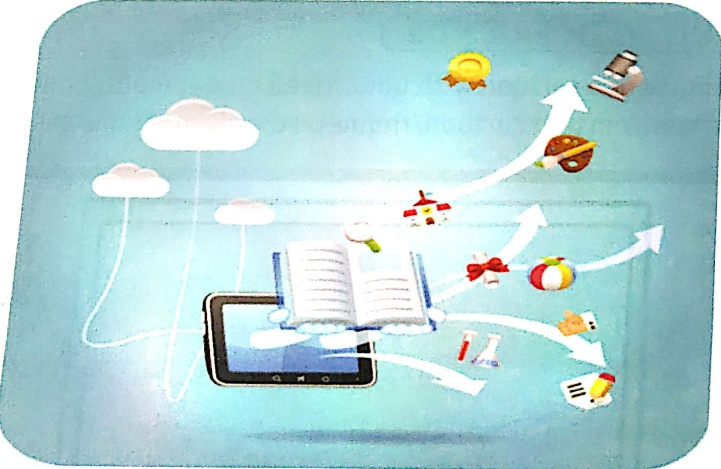

Computer is a very useful and helpful friend. I want to know more about it.

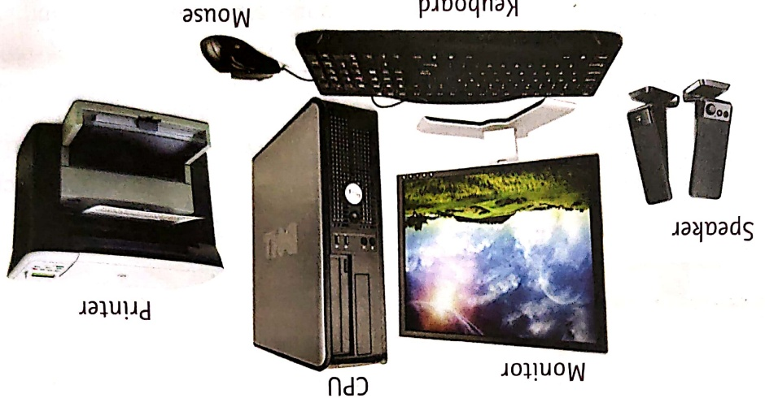

PARTS OF A COMPUTER

We also have different body parts like Jaime, and so does a computer. Each part of a computer does some special work.

Memory and storage in a computer

The mouse

The keyboard

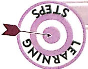

Parts of a computer

Do you know about my friend Jaime? He has many body parts like legs, tail and ears. What are the different parts of a computer?

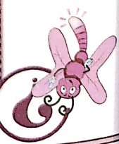

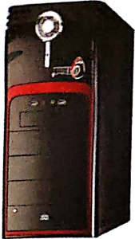

• All the parts of a computer are connected to the CPU.

• The way our brain controls all the different parts of our body, the CPU controls all the parts of the computer and makes them work together.

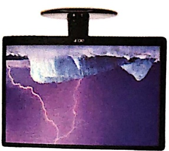

• CPU is the brain of a computer.

• It looks like a box.

Central Processing Unit (CPU)

• We can see videos and play games on a monitor.

• It shows us what we are doing on the computer.

Monitor

• A monitor looks like a television screen.

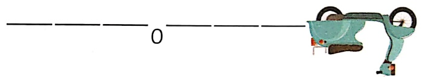

B L ___ K B O ___ D

Now, identify this machine.

Hint: The name of this machine rhymes with the word COMPUTER.

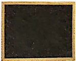

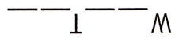

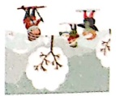

Name of rhyming computer part

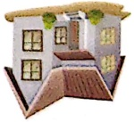

Name it

Let me tell you how to use keyboard.

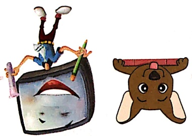

Computer! How can I write my name on your monitor?

• There are different types of keys on the keyboard.

• We can type on the computer by pressing the keys.

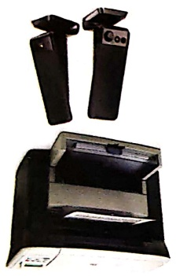

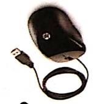

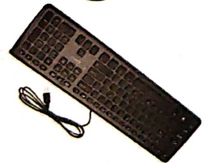

##### THE KEYBOARD

Speakers

• Speakers are used to listen to any sound or music on a computer.

Printer

• A printer is used to take prints of our work on a paper.

• It is used to point and select items on the monitor.

• It can also be used to draw and play games.

• This is a computer mouse.

Mouse

• The way we use pencil to write on a paper, we can use a keyboard to write on a computer.

• Each key has a letter, symbol or a word on it.

• The keyboard is made up of many small buttons called keys.

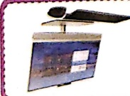

KeyBoard

All-in-one is a type of desktop computer that has the CPU inside the monitor.

WISDOM BOX

Look for the longest key on the keyboard and colour it

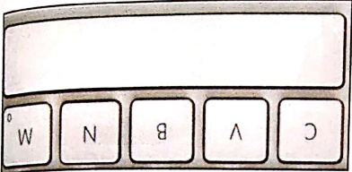

Spacebar Key.

We use it to give space between two words or wherever needed.

All the other keys are called Special Keys. The longest key on the keyboard is called the

The keys with numbers on them are called Number Keys. Number Keys are used to type numbers. They are 10 in number (from 0 to 9).

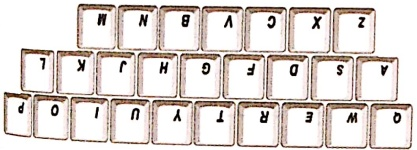

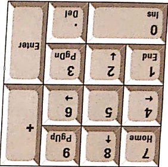

The keys with letters on them are called Alphabet Keys. Alphabet Keys are used to type words and sentences. They are 26 in number (from A to Z).

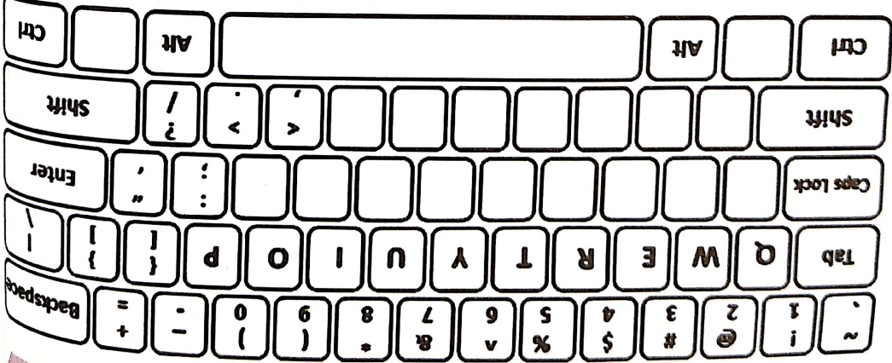

Fill in the missing keys of the keyboard and colour all the keys that have letters in pink colour, all the keys that have numbers in green colour and all the other keys in yellow colour.

This is the Backspace Key. It is the "Gadbad' of a computer. It can erase the letters or numbers on the left of the cursor.

Cursor is a bright blinking line that shows the place from where you can start typing.

##### What is a cursor?

This is the Enter Key.

It is used to move the cursor to the next line.

Write the new words that you will get.

Bedroom – Press space bar after letter 'd'.

Pencilbox - Press space bar after letter 'l'.

Waterbottle - Press space bar after letter 'r'.

Spiderman - Press space bar after letter 'r'.

 $$ \Box^{\cdots} $$ 

Carpet-Cursor is just after t, press backspace thrice-

Jugnu - Cursor is just after the last u, press backspace twice-

Pink-Cursor is just after k, press backspace once -

Press Backspace after 'L'.

• Now, type any letter on the keyboard and capital letters will appear on the

• The light on the key is turned on.

• Press the Caps Lock Key.

computer screen.

When we move the mouse, we see an arrow moving on the screen. This arrow is called the Mouse Pointer. Just like our finger, a mouse helps us to point and select things on a

Mouse Pointer

• Mouse wire

• Scroll wheel

• Right button

Left button

Parts of a Mouse:

This computer mouse can also work without a wire. It is called a wireless mouse.

WISDOM BOX

It has a wire like the tail of a mouse. It is joined to the CPU from its wire.

. It is small in size.

This is a computer mouse. It helps us to tell the computer what to do.

##### THE MOUSE

Write your name on the computer after the Caps Lock key is put on.

Single click

Dro

Drag and drop

Place the mouse pointer on the item to be moved. Press and hold the left mouse button.

Double click means pressing the left click! mouse button twice quickly.

click! This action makes two click sounds and opens an item.

Right Click means pressing the right mouse button once. This action shows a list of commands on the monitor.

Pressing a computer mouse button once without moving the mouse is called a single click. This action selects an item.

Press my buttons and the sound you hear is "click". It is called clicking.

Different mouse actions:

• Single click

• Double click

• Right click

• Drag and drop

Correct way to hold the mouse

This is a computer mouse. We should hold the mouse in the right way.

What is data, memory and storage?

Complete the following.

• My name is ___

• I study in ___

#### LET'S HAVE FUN

Memory and Storage in a Computer

Computer stores a lot of data like games, letters, drawings, movies, and songs in its

Which button will you press for dragging and dropping an item?

Which button will you press for a double-click?

Which button will you press for a left-click?

Which button will you press for a right-click?

Tick as per the questions asked.

#### LET'S HAVE FUN

an item.

You can see the selected item moved to a new place.

Keeping the mouse button pressed, move the pointer to a new place. This is called dragging an item. Now release the mouse button. This is called dropping

Memory card

To answer all the questions, you had to think and recall things. Just as we store everything in our memory, a computer also stores everything in its memory. We use different storage devices to keep our thing safe.

In the same way, a computer stores the data in storage devices like a hard disk, a memory card, a DVD and a pen drive.

• What was the best gift that you got for your birthday?

• What all did you eat at the party?

• Name the friends whom you had invited for your last birthday party.

All the things that you just wrote or drew is data.

Data is a collection of words, numbers, pictures, or sounds.

Now, think and answer the following.

My birthday is on

e. The mouse can print what you see on the monitor.

d. You can listen to a song on a computer through its speakers.

c. The mouse helps us to point at items.

b. The keyboard looks like a television.

B. Write whether true or false.

a. The CPU is the most important part of a computer.

CPU cat rat cup board keyboard mouse blackboard phone speaker mat printer cupboard cooker monitor

A. Identify the parts of a computer and circle them.

LET'S TRY

WORD MASTER

connect - to join together

blink - a light that goes on and off

storage - place for putting things to keep them safe

Match the following things with their storage place.

LET'S HAVE FUN

mouse).

to the computer.

4. I can move the pointer on the screen by using the ___ (monitor)

3. Saurabh wants to play music. He should connect ___ (printer/speaker)

(keyboard/ monitor).

2. Vartika is watching a cartoon movie on the computer

mouse).

E. Select the correct computer part from the choices given.

1. Pari can type a letter to her friend with the help of a ___ (keyboard)

LET'S MASTER

hey

4. I can type capital letters - SPAC KOCL -

hey.

3. I work like an eraser - ABCACESPK

hey.

2. I can move the cursor to the next line - REETN -

hey

1. I am the longest key on the keyboard - ABCSRPAE -

D. Unjumble the given letters to find the names of keys on the keyboard:

C. Like we have different boay parts for different functions, so does a computer Match the parts based on the similarity in functions performed.

Look around with your friends for pictures of computers. Paste or draw the pictures of different storage devices of a computer on a chart paper. Also write their names.

FUN WITH FRIENDS

can start typing.

4. Name the bright blinking line on the monitor that shows the place from where you

3. Name any three storage devices of a computer.

2.Name any three mouse actions.

1. Name the three types of keys of the keyboard.

F. Answer the following

Computer data is now stored in small ticket size cards called memory cards and pe

drives.

##### COMPUTERS NOW

Computer data was stored in huge magnetic drums earlier.

COMPUTERS THEN

MORE ABOUT COMPUTERS..

Now, write all the correct letters from 1 to 8 in the same order to find the mystery

word.

8. It comes between D and F

7. It comes just after F

6. It comes just before B

5. It comes before V and after T

4. It is between F and H

3. It comes just before O

2. It is the first letter in the alphabet

1. It comes just after K

Help Box

Write the correct letter in the blank.

Let's follow the commands

Commands

I can speak many different languages to connect with my friends. What language does a computer understand?

Language of a computer

010110110

In English, we have 26 letters from A to Z. In Hindi, we have 52 letters. In the same way, a computer language has just two numbers: 0 (Zero) and 1 (One).

WISDOM BOX

I want to understand my friend Computer. What is the language of a computer?

A computer understands machine language.

### LANGUAGE OF A COMPUTER

Match the following.

Activity Sheet 1 - Coding Fun

Your friend computer understands code. Code tells the computers to do all the helpful things that they do for us.

Pihu and Mihir are going to a park. Guide them by drawing the correct arrow to the park and complete the code.

You have drawn the ball at the position, as per the commands. Computer also does the same. It follows our commands.

2085231518124

25 15 21 1 18 15 21 14 4

A B C D E F G H I J K L M N O P Q R S T U V W X Y Z

1 2 3 4 5 6 7 8 9 10 11 12 13 14 15 16 17 18 19 20 21 22 23 24 25 26

Solving a code is called the decoding. Can you decode the secret message from the computer with the help of the given decoding key?

Activity Sheet 3 - Decoding Fun

Activity Sheet 2 - Coding Fun

Draw the correct number of dots on the dice so that the number of dots is equal to the mber on the computer monitor. The first one has been done for you.

3→6↓ 2→4↑ 4→4↓ 2→2↑ 4→2↓ 1→1↓ 2←2↑ 2←2↓ 4←4↑ 2←4↓ 4←5↑ 2←2

2↑2→2↓2→2↓2←2↓2←2↑2←2↑2←

Follow the given codes and start drawing from the green dot to get a plus

snake.

Activity Sheet 6 - Ordering Fun

Pitara is fond of photography. He has clicked four pictures of a volcano. Can you put them in the correct order?

4. The bus stand is to the ___ of the park.

3. The bus stand is to the ___ of the hospital.

2.The police station is to the _____ of the ATM.

1. The ATM is to the ___ of the petrol pump.

Am I in the right direction? Use the compass and the diagram of the town to help fill the correct direction in the blank.

There is a relationship between figure A and B. Form a similar relationship between figure C and D by selecting the correct figure from the options given below. The first one has been done for you.

Gloves is to

as

Socks is to

Activity Sheet 9 - Connecting Fun

Puppy is to as

Kitten is to

Activity Sheet 8 - Connecting Fun

Can you order the steps for washing hands?

Activity Sheet 7 - Ordering Fun

[Table 2](tables/table_002.html)

such that each picture comes once in each row  $ \rightarrow $ and column  $ \downarrow $

Use the pictures from the Help-Box at the bottom to draw and complete the Sudoku.

A computer doesn't forget things, it doesn't get tired and doesn't make mistakes, but a computer cannot think on its own. It just follows our commands. Finally, who is smarter, you or the computer? Why do you think so?

Can a computer think?

Does a computer make mistakes?

Can you think? ---

Does a computer get tired?

Do you make mistakes?

Can a computer solve sums quickly? ---

Does a computer forget things?

Do you get tired?

Can you solve sums quickly? ---

Do you forget things?

How is a computer different from you? Write 'Y' for yes or 'N' for no in the blanes

#### LET'S HAVE FUN

• Computer follows our commands.

• Computer understands machine language.

- Computer has different parts.

• Computer is a very useful and helpful machine.

• Computer is a smart machine.

• Computer is our friend.

Now, you know that:

### ← ⬆️ ⬆️

Turn Right

Go Straight

Turn Second Left

Turn Left

C. Match the following.

LET'S LEARN

4. Decoding tells the computer to do helpful things.

3. A computer can understand machine language.

2. A computer can make mistakes.

1. People around the world speak just one language.

B. Write whether true or false.

speaker English French Punjabi Math

Tamil

mouse

German

A. Identify and circle the names of languages.

Hindi

LET'S TRY

decode - solving a code

code - use symbol for a message

command - to order

connect - join or link

WORD MASTER

2. What is the position of the triangle in the picture?

F. Answer the following.

1. Name the language that a computer understands.

E. Circle the odd one out.

##### LET'S MASTER

4. Solving a code is called CDOEIDNG - D ___

3. A computer follows MMOCDNAS - C__ __ __ __ __ __ __

2. I am a smart machine - ROCPMTUE - C__

1. I am the language of a computer - AMCIHEN - M

##### Sequence Chain

Draw/paste pictures of activities that you do in a day, from waking up in the morning to going to bed at night.

FUN WITH FRIENDS

 $ 2\downarrow 2\rightarrow 2\downarrow 2\leftarrow $

4. Which shape will you get on using the given command?

Computer follows our commands and understands machine language.

# python Java

Python and Java are the most popular computer languages.

COMPUTERS NOW

COMPUTERS THEN

Fortran is one of the oldest computer language.

Always take permission of your elders or teachers before using a computer.

Take help of your elders or teachers whenever in need.

Things that we should do when we use a computer.

####