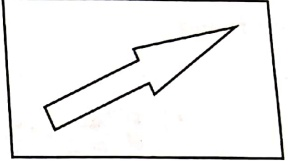
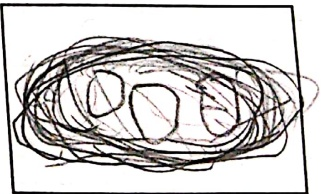
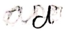

Subject: ENGLISH GRAMMER

#### ENGLISH GRAMMAR

GRADE 1

[Table 1](tables/table_001.html)

##### Practice Sheet-1

Date:  $ \underline{\text{19.3.26}} $

Draw and write a naming word with each letter using the appropriate articles and frame a sentence with it.

a

 $ \underline{\text{an arrow}} $

 $ \underline{\text{Rahul shot an arrow at the target.}} $

##### e

an

on.egg

T eat on egg every morning.

a. gift gift

I got a girl in my birth

a Merit

One day I came a third in

Team 1 — me

1913

[Table 2](tables/table_002.html)

Practice Sheet-2

Date:  $ \underline{\text{333.20.}} $

Fill in the blanks and illustrate the animals in the column to complete the letter to your friend.

Dear Anneora

went to the zoo yesterday.

saw a lion.

saw a beautiful

saw a

saw an elephant!

I enjoyed myself.

Your friend,

Adviñita Shukla

[Table 3](tables/table_003.html)

Practice Sheet-3

Date: 24.3.26

Circle the correct use of a or an with green colour and incorrect use with orange colour. One has been done for you.

The Mehta family is going on a picnic to an park.

Mother packs a apple and a mango.

She also keeps a bottle of juice and a sandwich for herself.

The children keep a aeroplane and an football to play.

Father takes a book to read.

<table border=1 style='margin: auto; word-wrap: break-word;'><tr><td style='text-align: center; word-wrap: break-word;'>Grade: 1</td><td style='text-align: center; word-wrap: break-word;'>