Subject: English Grammar</td><td style='text-align: center; word-wrap: break-word;'>Topic: Nouns</td></tr></table>

Reading Worksheet

Noun is a name of a person, place, animal or thing.

A noun is also called as naming word.

Proper nouns are name specific people, things, and places. They are always capitalized.

A common noun are names of a person, animal, place, or thing. A common noun starts with a lowercase letter, unless it is the first word in a sentence.

##### Example

Person

a girl (Common Noun)

Riya (Proper Noun)

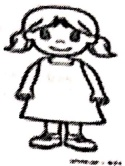

She is a girl. Her name is Riya.

Place

a school (Common Noun)

Seth M.R. Jaipuria (Proper Noun)

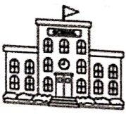

Seth M.R. Jaipuria is a famous school.

- Thing

food (Common Noun)

Maggi (Proper Noun)

My favourite food is Maggi.

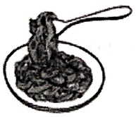

• Animal

a dog (Common Noun)

Bruno (Proper Noun)

Bruno is my pet dog.

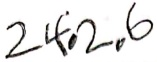

[Table 1](tables/table_001.html)

Practice Sheet-4

Date:24.26

Draw and colour two more images in each column as directed by the teacher.

[Table 2](tables/table_002.html)

[Table 3](tables/table_003.html)

Practice Sheet-5

Date: 24.26

From the given set, list nouns as names of persons, places, animals and things.

principal village book street

snake alligator teacher Lucknow

carpenter pencil-box zebra horse

palace ship cobbler watch king

peacock chair bus-stop

[Table 4](tables/table_004.html)

[Table 5](tables/table_005.html)

##### Practice Sheet-6

Date: 9.426

Fill in the blanks with the correct naming word with the help of the image. You may use the spellings of few difficult words from the word box. Note – not all words are in the help box, only the difficult ones are there.

mason, igloo, rabbit, drum, queen, moon, castle, stars, king

Example: I write with a  $ \underline{\text{pen.}} $

1. The ... is under the ...

2. Eskimos live in an ___

3. I can see the moon and stars at night.

4. The  $ \underline{\text{King}} $ and the  $ \underline{\text{queen}} $ live in a big castle.

5. The  $ \underline{\text{mason}} $ building a  $ \underline{\text{wall}} $ building a  $ \underline{\text{char}} $  $ \underline{\text{Cham}} $  $ \underline{\text{7/4}} $

6. I have a  $ \underline{\text{king}} $ and a  $ \underline{\text{drum}} $.

[Table 6](tables/table_006.html)

Practice Sheet-7

Date: 8476

#### Circle the proper noun in yellow and  $ \underline{\text{underline}} $ the common noun in green.

1. India is the seventh largest  $ \underline{\text{country}} $ in the  $ \underline{\text{world}} $.

2. Radha bought a bicycle for her brother.

3. USA is one of the most developed  $ \underline{\text{countries}} $ in the world.

4. Red Riding Hood met the  $ \underline{\text{fox}} $ in the  $ \underline{\text{forest}} $.

5. Mr Tony Stark walks his  $ \underline{\text{dog}} $ everyday.

6. The boy ran to his  $ \underline{\text{mother}} $.

7. The flat was in the middle of Lenin Street.

8. The  $ \underline{\text{reporter}} $ went to Noida for the  $ \underline{\text{news}} $ coverage.

9. The  $ \underline{\text{milk}} $ tastes sour.

10. Rose is a beautiful  $ \underline{\text{girl}} $.

11. I have read a novel by Emily Bronte.

12. King Arthur was a noble king.

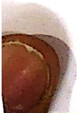

9.4,26

[Table 7](tables/table_007.html)

Practice Sheet-8

 $ \underline{\text{Rewrite the sentences correctly.}} $

1) I live in  $ \underline{\text{lucknow}} $.

I live in lucknow.

I love in Luck know.

I live in Lucknow.

2) There are many  $ \underline{\text{Schools}} $ in my City. Schools I hear are many books in my city.

3) Today is  $ \underline{\text{thursday}} $.

Today is Thursday

4) My brother's name is rohan

My brother is name is Roton.

[Table 8](tables/table_008.html)

Practice Sheet-9 10.4.2.6

Write proper nouns for the given common nouns and then use them to frame sentences.

1. chocolate

Cadbury- Cadbury

I love cadbury chocolate.

I like to eat Cadbury Chocolates.

2. country

Country India

India is most beautiful country beautiful beautiful beautiful beautiful beautiful beautiful beautiful beautiful beautiful beautiful beautiful beautiful beautiful beautiful beautiful beautiful beautiful beautiful beautiful beautiful beautiful beautiful beautiful beautiful beautiful beautiful beautiful beautiful beautiful beautiful beautiful beautiful beautiful beautiful beautiful beautiful beautiful beautiful beautiful beautiful beautiful beautiful beautiful beautiful beautiful beautiful beautiful beautiful beautiful beautiful beautiful beautiful beautiful beautiful beautiful beautiful beautiful beautiful beautiful beautiful beautiful beautiful beautiful beautiful beautiful beautiful beautiful beautiful beautiful beautiful beautiful beautiful beautiful beautiful beautiful beautiful beautiful beautiful beautiful beautiful beautiful beautiful beautiful beautiful beautiful beautiful beautiful beautiful beautiful beautiful beautiful beautiful beautiful beautiful beautiful beautiful beautiful beautiful beautiful beautiful beautiful beautiful beautiful beautiful beautiful beautiful beautiful beautiful beautiful beautiful beautiful beautiful beautiful beautiful beautiful beautiful beautiful beautiful beautiful beautiful beautiful beautiful beautiful beautiful beautiful beautiful beautiful beautiful beautiful beautiful beautiful beautiful beautiful beautiful beautiful beautiful beautiful beautiful beautiful beautiful beautiful beautiful beautiful beautiful beautiful beautiful beautiful beautiful beautiful beautiful beautiful beautiful beautiful beautiful beautiful beautiful beautiful beautiful beautiful beautiful beautiful beautiful beautiful beautiful beautiful beautiful beautiful beautiful beautiful beautiful beautiful beautiful beautiful beautiful beautiful beautiful beautiful beautiful beautiful beautiful beautiful beautiful beautiful beautiful beautiful beautiful beautiful beautiful beautiful beautiful beautiful beautiful beautiful beautiful beautiful beautiful beautiful beautiful beautiful beautiful beautiful beautiful beautiful beautiful beautiful beautiful beautiful beautiful beautiful beautiful beautiful beautiful beautiful beautiful beautiful beautiful beautiful beautiful beautiful beautiful beautiful beautiful beautiful beautiful beautiful beautiful beautiful beautiful beautiful beautiful beautiful beautiful beautiful beautiful beautiful beautiful beautiful beautiful beautiful beautiful beautiful beautiful beautiful beautiful beautiful beautiful beautiful beautiful beautiful beautiful beautiful beautiful beautiful beautiful beautiful beautiful beautiful beautiful beautiful beautiful beautiful beautiful beautiful beautiful beautiful beautiful beautiful beautiful beautiful beautiful beautiful beautiful beautiful beautiful beautiful beautiful beautiful beautiful beautiful beautiful beautiful beautiful beautiful beautiful beautiful beautiful beautiful beautiful beautiful beautiful beautiful beautiful beautiful beautiful beautiful beautiful beautiful beautiful beautiful beautiful beautiful beautiful beautiful beautiful beautiful beautiful beautiful beautiful beautiful beautiful beautiful beautiful beautiful beautiful beautiful beautiful beautiful beautiful beautiful beautiful beautiful beautiful beautiful beautiful beautiful beautiful beautiful beautiful beautiful beautiful beautiful beautiful beautiful beautiful beautiful beautiful beautiful beautiful beautiful beautiful beautiful beautiful beautiful beautiful beautiful beautiful beautiful beautiful beautiful beautiful beautiful beautiful beautiful beautiful beautiful beautiful beautiful beautiful beautiful beautiful beautiful beautiful beautiful beautiful beautiful beautiful beautiful beautiful beautiful beautiful beautiful beautiful beautiful beautiful beautiful beautiful beautiful beautiful beautiful beautiful beautiful beautiful beautiful beautiful beautiful beautiful beautiful beautiful beautiful beautiful beautiful beautiful beautiful beautiful beautiful beautiful beautiful beautiful beautiful beautiful beautiful beautiful beautiful beautiful beautiful beautiful beautiful beautiful beautiful beautiful beautiful beautiful beautiful beautiful beautiful beautiful beautiful beautiful beautiful beautiful beautiful beautiful beautiful beautiful beautiful beautiful beautiful beautiful beautiful beautiful beautiful beautiful beautiful beautiful beautiful beautiful beautiful beautiful beautiful beautiful beautiful beautiful beautiful beautiful beautiful beautiful beautiful beautiful beautiful beautiful beautiful beautiful beautiful beautiful beautiful beautiful beautiful beautiful beautiful beautiful beautiful beautiful beautiful beautiful beautiful beautiful beautiful beautiful beautiful beautiful beautiful beautiful beautiful beautiful beautiful beautiful beautiful beautiful beautiful beautiful beautiful beautiful beautiful beautiful beautiful

3. cartoon

miPaPepig PeppaPig

My fanourite cartoonite

Pepapippa:

Peppa Pig.

Cham

1014

[Table 9](tables/table_009.html)

Practice Sheet-10

Date:  $ \underline{\text{1347.6}} $

Observe the given picture carefully and frame sentences.

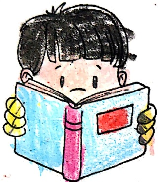

a. A boy is reading a book.

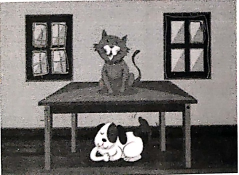

b. A d o r J o a p u r i a ?

[Table 10](tables/table_010.html)

Date: 134.26

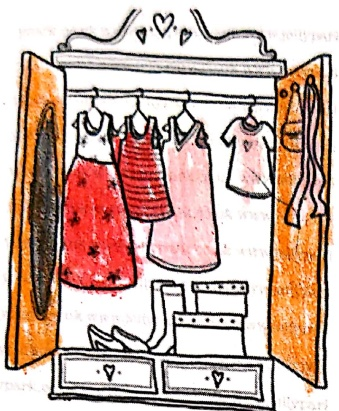

c. There are clothes in the cupboard.

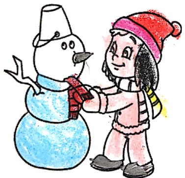

d. A good is making Inoceman.

314

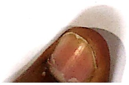

[Table 11](tables/table_011.html)

Practice Sheet-11

Date:134.24

Observe the given picture carefully and complete the given sentences.

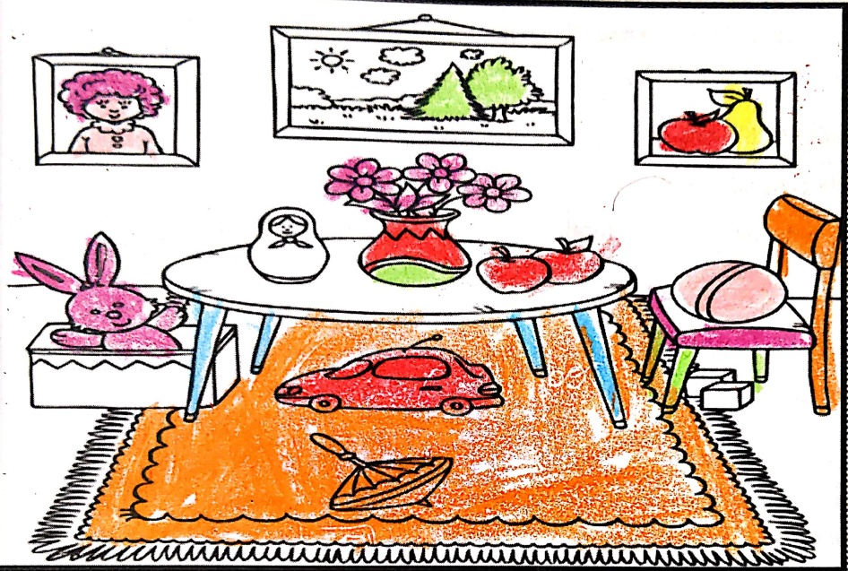

Rehan (proper noun) loves his room. He has many  $ \underline{\text{tops}} $ (common noun) in his room. There is  $ \underline{\text{a}} $ (article) beautiful scenery hanging  $ \underline{\text{ten}} $ (preposition) the wall. His favourite stuff toy, bunny rabbit is  $ \underline{\text{in}} $ (preposition) the toy box. Two small boxes are kept  $ \underline{\text{under}} $ (preposition) the chair(s) (punctuation mark) Rohan loves to eat  $ \underline{\text{an}} $ (article) apple everyday as it keeps him healthy and makes him strong(·) (punctuation mark)

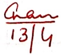

□

<table border=1 style='margin: auto; word-wrap: break-word;'><tr><td style='text-align: center; word-wrap: break-word;'>Grade: 1</td><td style='text-align: center; word-wrap: break-word;'>