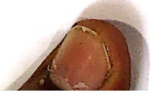
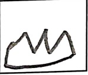
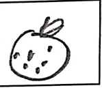
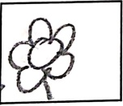
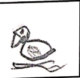
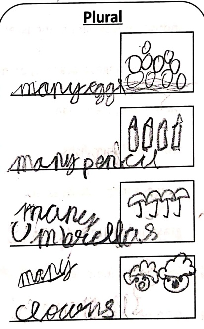
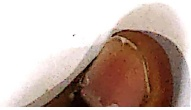
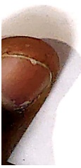
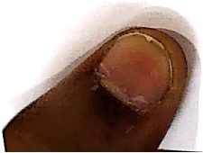
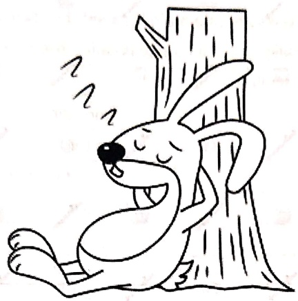

Subject: English Grammar</td><td style='text-align: center; word-wrap: break-word;'>Title: Nouns (Singular/Plural)</td></tr></table>

##### Reading Worksheet

Date:  $ \underline{\text{11.5.26}} $

A singular noun is a noun that refers to only one person, place, animal or thing. Example-boy, school, dog, pen.

A plural noun is a noun that refers to more than one person, place, animal or thing. Example-boys, schools, dogs, pens.

Rules for changing singular noun to plural.

Rule 1- By adding 's'
 

[Table 1](tables/table_001.html)

Rule 2- By changing the word completely.
 

[Table 2](tables/table_002.html)

[Table 3](tables/table_003.html)

[Table 4](tables/table_004.html)

[Table 5](tables/table_005.html)

Rule 3- Nouns that remains the same in singular as well as in plural.
 

[Table 6](tables/table_006.html)

##### Practice Sheet-1

Date:11.5.26

Jim is stuck with a difficult task to post the words in the correct box. Help him in arranging these words and illustrate.

[Table 7](tables/table_007.html)

#####  $ \underline{\text{Singular}} $

October

of orange

(1) Aplocua

a duck

[Table 8](tables/table_008.html)

Practice Sheet-2

Date: ___

Circle the correct plural form of the word from the list.

 $ \underline{\text{Example-}} $ ox- oxes, $ \underline{\text{oxen}} $, oxies

1) child- children, childs, child

2) woman- woman, womanies, women

3) tooth-teeth, toothies, tooth

4) mouse-mouses, mice, mousves

5) orange- oranges, oranges, orange

6) man-mans, men, man

7) fish- fish, fishes, fishs

8) sheep-sheeps, sheepes, sheep

9) grass- grasses, grass, graas

10) foot-foots, feets, feet

11) hair- hairs, hair, hare

12) duck-ducks, duckling, duck

[Table 9](tables/table_009.html)

Practice Sheet-3

Date: ___

Complete the given table and illustrate.

[Table 10](tables/table_010.html)

[Table 11](tables/table_011.html)

##### Practice Sheet-4

Date: ___

Choose the correct word to fill in the blank

Example- Rahul has a pet  $ \underline{\text{dog}} $. (dogs)

We have two  $ \underline{\text{feet}} $. (foot)

1. Here are many_____.(flower)

2. He has a _____.(cycle)

3. I have many _____.(pencil)

4. There are three _____ in the basket. (egg)

5. Geeta ate an _____. (orange)

6. Many _____were playing in the park (boy).

7. The seven _____ ran out of the hole. (mouse)

8. I saw many _____ in the pond . (duck)

9. A_____ was standing under the tree. (woman)

[Table 12](tables/table_012.html)

Practice Sheet-5

Date: ___

Ravi just got his English Test score. He doesn't know where he went wrong. Help him in correcting his mistakes from the given paragraph. Identify the errors. Write the correct nouns in the space provided.

I have a red shiny bicycle. I ride my bicycle with my three friend _____. I take it to the park where many childs _____ are present. My best friend is rahul _____.

He also has a bicycle. His bicycle is blue in colours____. We love riding our bicycles. Rahul says his bicycle is the best in the school.

Identify the errors in the given sentences and re-write them correctly.

1. The child is playing in the park.

_____

2. Kalpana Chawla was the first Indian mans to fly to space.

_____

3. The fishs in the sky are brightly coloured.

_____

4. India is the capital of new delhi.

[Table 13](tables/table_013.html)

Practice Sheet-6

Date: ___

Frame the sentences with the given nouns and illustrate the same:

1. child

2. mice

3. umbrella

4. fish

5. teeth

6. woman

[Table 14](tables/table_014.html)

Practice Sheet-7

Date: ___

Fill in the blanks using suitable words from the bracket.

One day, Bunny, the rabbit was sleeping _____ (preposition) a tree when _____ (article) pebble fell on his head. He woke up. _____ (proper noun of rabbit) thought that a part of the sky was falling. He started running and kept shouting, "The sky is falling! The sky is falling! Run for your lives!"

Many _____(animal / animals) and birds believed Bunny and started running with him. The butterfly who was sitting next to Bunny started laughing. "Hold on, friends!" she said. "Don't listen to Bunny. It was just _____(article) pebble that fell _____(preposition) his head."

All the animals and _____(birds/bird) were amazed by the butterfly's presence of mind.

<table border=1 style='margin: auto; word-wrap: break-word;'><tr><td style='text-align: center; word-wrap: break-word;'>Grade: 1</td><td style='text-align: center; word-wrap: break-word;'>