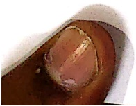

Subject: English Grammar</td><td style='text-align: center; word-wrap: break-word;'>Title: Nouns (Gender)</td></tr></table>

Reading Worksheet

Gender: The gender of a noun tells whether the person or animal is male (masculine or female (feminine)).

Masculine: A noun that talks about a male is called the masculine gender.

Feminine: A noun that talks about a female is called the feminine gender.

[Table 1](tables/table_001.html)

[Table 2](tables/table_002.html)

Practice Sheet-1

Date: ___

Select the appropriate gender to complete the sentence.

Example - The  $ \underline{girl} $ wore a skirt to the party. (boy/girl)

1. The _____ is a very tall man. (king/queen)

2. The red _____ is sitting on her eggs. (cock/hen)

3. The _____ is a very beautiful girl.(princess/prince)

4. The _____ loves her cubs. (tigress/tiger)

5. Veena is Mr.Goel's _____. (son/daughter)

6. My _____ has a big moustache. (uncle/aunt)

7. Sheila's_____ is wearing a blue saree. (grandmother/grandfather)

8.A _____ dances in the rain. (peacock/peahen)

9. A _____ is the king of the jungle. (lion/lioness)

10. My sister's daughter is my ___. (nephew/niece)

11. A _____. (fox/vixen) gives birth to a baby fox.

12. My _____ is a handsome man. (father/mother)

[Table 3](tables/table_003.html)

Practice Sheet-2

Date: ___

Read the given sentence and rewrite the sentence correctly:

Example

The  $ \underline{\text{cock}} $ lays eggs.

 $ \underline{\text{The hen lays eggs.}} $

1. The  $ \underline{king} $ wore a red dress and a tiara.

2. My  $ \underline{\text{father}} $ is driving her car.

3. The  $ \underline{\text{tigress}} $ is India's national animal.

4. The  $ \underline{boys} $ wear ribbons in their hair.

5. My  $ \underline{\text{grandfather}} $ wears bangles.

[Table 4](tables/table_004.html)

Practice Sheet-3

Date: ___

Frame sentences using the given pair of genders.

1. nephew and niece

2. lion and lioness

___

##### Practice Sheet-4

Fill in the blanks.

Once upon ___ (article) time there lived a king and a ___ (feminine gender-king) in a ___ (common noun). One day, the couple was blessed with a cute little girl and a ___ (masculine gender-girl). The boy grew up and became a smart prince while the girl became an elegant ___ (feminine gender- prince). The prince was very fond of animals. He went to a jungle and saw a ___ (feminine gender-tiger) playing and cuddling her cubs. He felt very happy on seeing this. He returned home and told his ___ (masculine gender-mother) that he wanted to have a pet. Whereas the king's ___ (feminine gender-son) was fond of gardening so she requested her ___ (feminine gender-father) to get her some ___ (sapling)

<table border=1 style='margin: auto; word-wrap: break-word;'><tr><td style='text-align: center; word-wrap: break-word;'>Grade: 1</td><td style='text-align: center; word-wrap: break-word;'>