Subject: English Grammar</td><td style='text-align: center; word-wrap: break-word;'>Topic: Pronouns</td></tr></table>

Date: ___

Reading Worksheet

A pronoun is a word which is used in place of a noun.

'This' is used for singular nouns which are close to us.

Example-

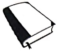

This is a book.

'That' is used for singular nouns which are far from us.

Example- That is a book.

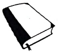

'These' is used for plural nouns which are close to us.

Example-

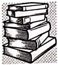

These are books.

'Those' is used for plural nouns which are far from us.

Example- Those are books.

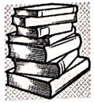

[Table 1](tables/table_001.html)

Practice Sheet-5

Date: ___

Use 'he' or 'she' to fill in the blanks.

Example:

 $ \underline{He} $ is my adorable grandson.

 $ \underline{She} $ is a talented princess.

1. _____ is a cunning king.

2. _____ is a hardworking milkmaid.

3. _____ is Ram, my best friend.

4. _____ is Radha, the sweetest girl of the class.

5. _____ is wearing a vibrant saree.

6. _____ is a postman who always smiles.

7. _____ had a brown beard.

8. _____ is my youngest sister.

9. _____ is my favourite niece.

10. _____ is a caring nurse.

[Table 2](tables/table_002.html)

Practice Sheet-6

Date: ___

Complete the following sentences with he / she / his / her / it :

1. I have a friend. ___ name is Raj. ___ has a toy car. ___ is a super car.

2. I have a friend. ___ name is Rani. ___ dances well.

3. Rahul is my friend. ___ loves to play cricket.

He has a bat. ___ is his favourite.

4. Ravi is my best friend. Sapna is ___ sister.

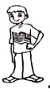

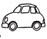

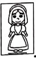

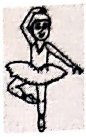

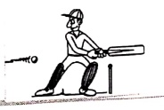

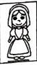

5. Reema is a chef. _____ cooks well.

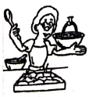

6. Yash is my cousin brother. _____ is a lawyer.

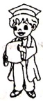

[Table 3](tables/table_003.html)

Practice Sheet-7

Date : ___

Observe the picture and fill in the blanks with he, she, his, or her.

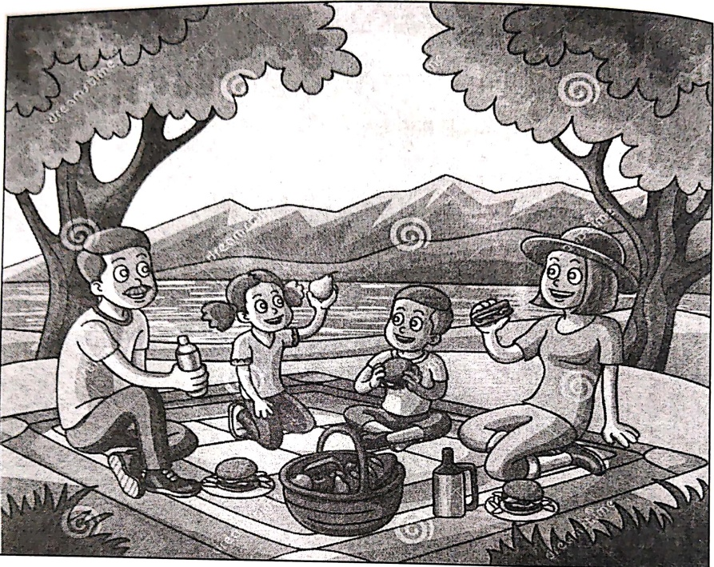

It is a bright sunny day. Merlin is enjoying the picnic, in a resort with ..... parents and younger brother. ..... brother is happily eating a burger. ..... name is Sam and ..... is a five years old boy. They are sitting on a mat with many eatables on it. Merlin is holding a green guava and ..... father looks mesmerized by the beauty of the nature. Their mother explains them the importance of sharing and caring during the lunch. ..... tells them to be compassionate to all the humans, plants and animals. ..... believes that her children will soon inculcate these values to make their lives meaningful.

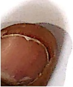

[Table 4](tables/table_004.html)

Practice Sheet-8

Date: ___

Complete the story. Use he, she, his, her

Ram saw an aeroplane in the sky.___ called Rahul and___ friends to see it. Rahul said, "I have many toy aeroplanes at home."___ invited ___ friends to ___ home. ___ even called Rani. ___ was Ram's sister.___ liked aeroplanes a lot. The next day when Rani went to ___ school, ___ told ___ friends Pinky and Sonal about the aeroplanes which ___ saw at Rahul's place. They were very happy to know about it. On Rani's birthday Pinky and Sonal gifted ___ a toy aeroplane. Rani was very happy to see ___ gift.

Pick a noun from the story and illustrate it in the space given below:

[Table 5](tables/table_005.html)

Practice Sheet-9

Date: ___

Look at the pictures.

Fill in the blanks with 'he' or 'she' and frame a sentence using 'his' or 'her'.

Example-

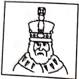

 $ \underline{He} $ is a king.

 $ \underline{\text{His crown is very big.}} $

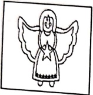

1. _____ is a fairy.

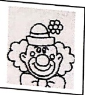

2. _____ is a clown.

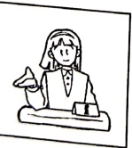

3. _____ is a teacher.

[Table 6](tables/table_006.html)

Practice Sheet-10

Date: ___

Identify the errors and rewrite the sentences:

1. She is my son. She loves to take care of animals.

1.

irat Kohli is a football player. She plays for India.

2._____

arendra Modi is the President of USA. She is a great leader.

3._____

4. My mother gave his clothes to his sister.

other gave his clothes to his sister.

4. _____

5. Rahul is a brave boy. She likes to play football.

is a brave boy. She likes to play football.

5. _____

[Table 7](tables/table_007.html)

Practice Sheet-11

Date : ___

Fill in the blanks with suitable words.

Mother duck walked back___(common noun)with ___(pronoun ducklings. She had taken six of them to ___(article)_____(common noun)for a swim. When___(pronoun) reached back home, she started counting them one, two, three, four and five! "Oh dear!" said Mother___(feminine gender- drake). "Where is the sixth one?" Mother duck went back to look for the lost duckling. She looked behind the bushes, under the___(tree) and over the fence. The little duckling was nowhere. Mother duck went to the pond. Splash, splash! There was the little duckling swimming and playing in the pond with the ___(common noun). She took the sixth duckling back home. The drake was happy to see ___(pronoun)little one.

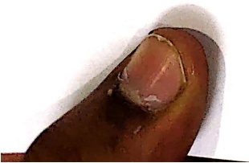

<table border=1 style='margin: auto; word-wrap: break-word;'><tr><td style='text-align: center; word-wrap: break-word;'>Grade: 1</td><td style='text-align: center; word-wrap: break-word;'>