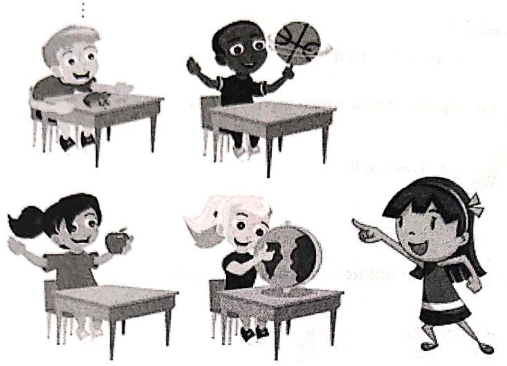
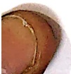

Subject: English Grammar</td><td style='text-align: center; word-wrap: break-word;'>Title: Pronouns (This and That)</td></tr></table>

Practice Sheet-1

Date: ___

Look at the given picture and fill in the blanks.

In_____(article) class there were some_____(common noun) who had brought some interesting objects with them. Ria said, "____ is_____(article) apple and it very healthy." Priya immediately pointed towards Rahul and said, "____ is a ball and love to play with it." Richa took out her globe and said, "____ is my globe, my fat gave it to me on my birthday." All the _____(common noun) enjoyed showing the favourite object.

##### Practice Sheet-2

Frame a sentence with the given words 'this' and 'that'.

this-___

that-___

<table border=1 style='margin: auto; word-wrap: break-word;'><tr><td style='text-align: center; word-wrap: break-word;'>Grade: 1</td><td style='text-align: center; word-wrap: break-word;'>