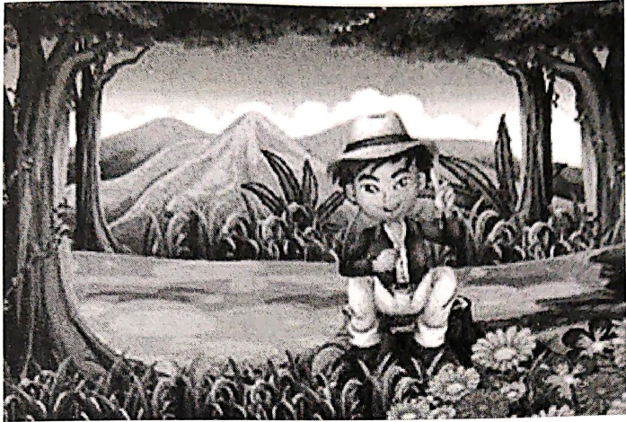

Subject: English Grammar</td><td style='text-align: center; word-wrap: break-word;'>Title: Pronouns (These and Those)</td></tr></table>

Practice Sheet-3

Date: ___

Look at the given picture and fill in the blanks.

There was ___ (article) boy named ___ (Proper Noun). He loved nature. One day he was sitting in a park. He was amazed by the greenery all around. He said, "___ (Those/These) flowers are so colourful and beautiful." Then, he saw the mountains and said, "___ (Those/These) mountains must be really enormous; I wish I could go there! And ___ (those/these) white clouds behind the mountains look wonderful." Suddenly, a climber caught his attention and he said, "___ (Those/These) climbers are holding the bark of the tree so tightly.

##### Practice Sheet-4

Frame a sentence with the given word 'these' and 'those'.

these-___

those-___

<table border=1 style='margin: auto; word-wrap: break-word;'><tr><td style='text-align: center; word-wrap: break-word;'>Grade: 1</td><td style='text-align: center; word-wrap: break-word;'>