Subject: English Grammar</td><td style='text-align: center; word-wrap: break-word;'>Topic: Prepositions</td></tr></table>

##### Reading Worksheet

A preposition is a word used before a noun or a pronoun to show the position of an object in relation to the other object.

Prepositions are of many kind.

For Example —

in/on/under/behind/infront of/between.

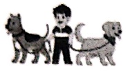

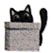

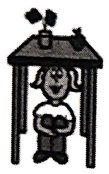

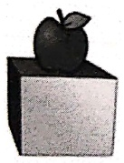

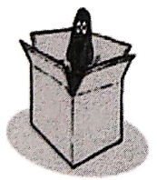

The boy is between the dogs.

The girl is under the table.

The cat is behind the box.

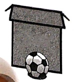

The apple is on the box.

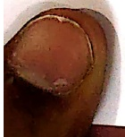

The dog is in the box.

The ball is in front of the box.

[Table 1](tables/table_001.html)

practice Sheet-1

Date: ___

Look at the picture, read and circle the words that are appropriate.

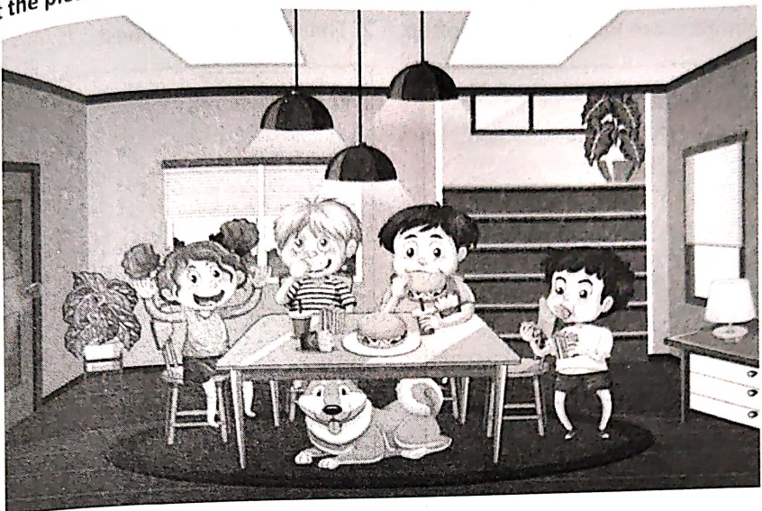

1. The cat/dog is under/in the table.

2. The boy is sitting on/under the chair.

3. The mat/lamp is on/in the floor.

4. The burger is on / in the plate.

5. The lamp is under/on the drawer.

6. The pot is kept on/in the stairs.

7. The children are sitting under/in the roof.

8. The dog is sitting on/in the carpet.

[Table 2](tables/table_002.html)

Practice Sheet-2

Date : ___

Read the statement and illustrate.

1. The raindrops are falling on the rooftop. 2. The eggs are in the nest.

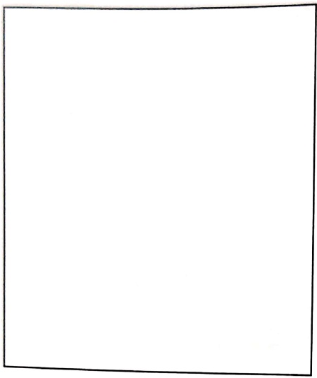

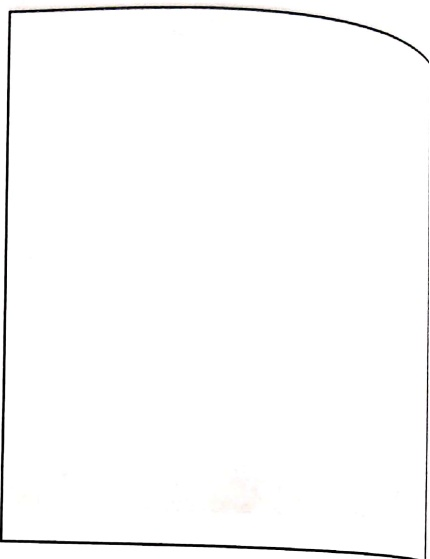

3. The Sun is behind the clouds.

4. The car is parked under the tree.

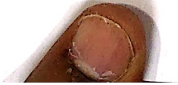

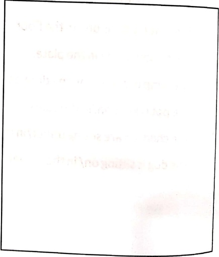

[Table 3](tables/table_003.html)

Practice Sheet-3

Date: ___

Example

observe the given pictures and fill in the blanks with appropriate prepositions.

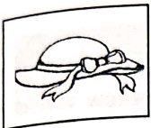

The bow is  $ \underline{on} $ the hat.

1.

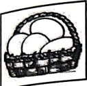

2.

The eggs are_____ the basket.

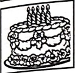

3.

The candles are _____ the cake.

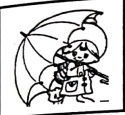

4.

The boy is _____ the umbrella.

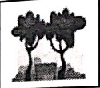

5.

The bench is _____ the trees.

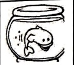

The fish is _____ the bowl.

6.

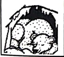

The bear is _____ the cave.

7.

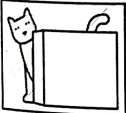

The cat is _____ the box.

8.

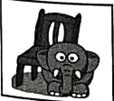

The elephant is _____ the chair.

[Table 4](tables/table_004.html)

Practice Sheet-4

Date : ___

Read the given story and illustrate accordingly to show the position of things discuss the story.

##### Story

A little black haired boy lived near a river in a house with yellow windows. He was sail his wooden toy boat in the river on sunny days. There were many pink fish in river. A bird made a nest on the tree. The Sun hid behind the clouds. There was green grass the river bank. The little boy was very happy and enjoyed playing with his boat, but forgo toy car under the tree.

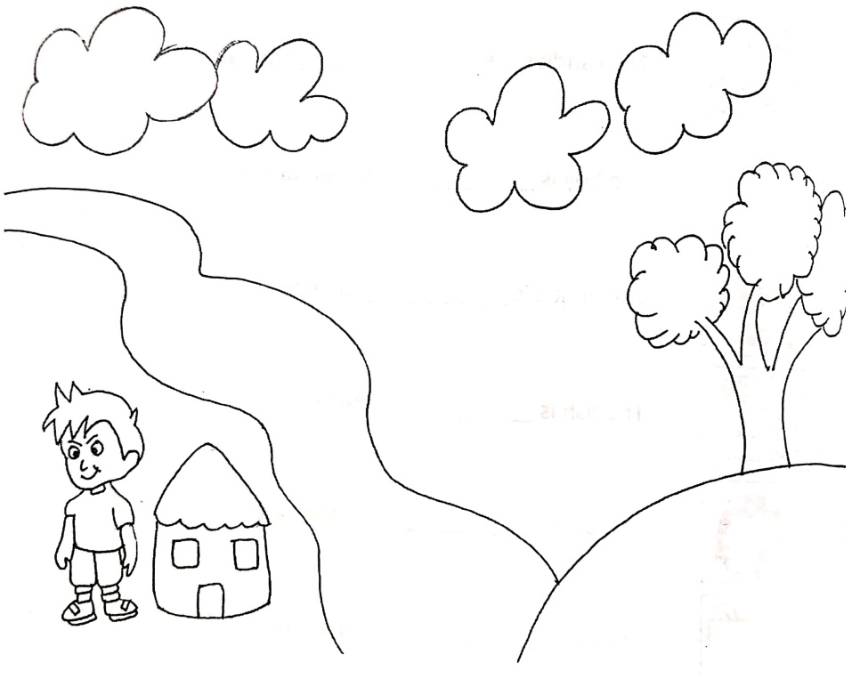

[Table 5](tables/table_005.html)

practice Sheet-5

Date: ___

Q1. Where is the ball?

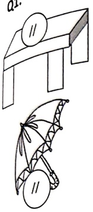

_____

_____

___

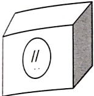

___

##### Q2. Observe the given pictures, identify the errors and rewrite the sentences correctly.

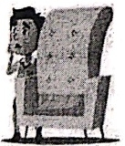

The boy is under the sofa.

500

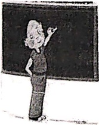

The teacher is writing in the black board.

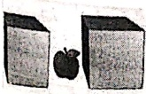

The apple is kept on the boxes.

[Table 6](tables/table_006.html)

Practice Sheet-6

Date: ___

Look at the picture, and write 5 sentences using the prepositions in / on / under/ in front of / behind/ between.

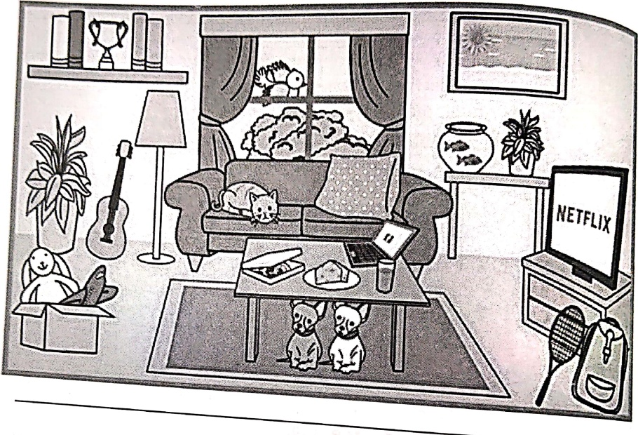

1.

2.

3.

4. ___ ___

5.

6.

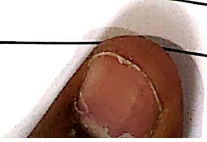

[Table 7](tables/table_007.html)

practice Sheet-7

Date: ___

Look at the picture and complete the paragraph using the suitable words from the jacket.

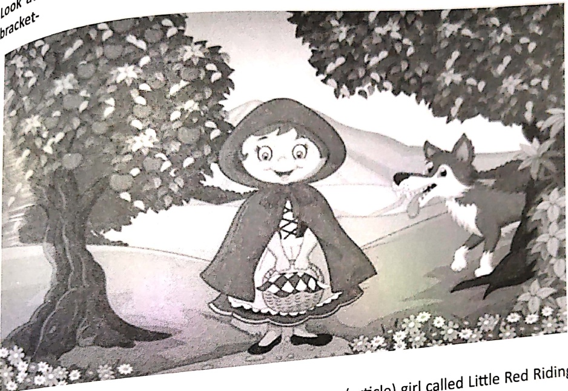

Once upon ___ (article) time, there was ___ (article) girl called Little Red Riding Hood. She lived ___ (preposition) a small house. One day, her mother said, "Keep these fruits ___ (preposition) a ___ (noun) and take them to your grandma as she is not well"

Little Red Riding Hood set off to her grandma's house. She lived on the other side of the forest. As Little Red Riding Hood was going through the woods, she met ___ (article) wolf. The wolf hid ___ (preposition) the trees. He was waiting for ___ (pronoun). The wolf asked, "Where are you going ___ ("punctuation mark") Little Red Riding Hood said, I am going to see my grandma because she is not well."

<table border=1 style='margin: auto; word-wrap: break-word;'><tr><td style='text-align: center; word-wrap: break-word;'>Grade: 1</td><td style='text-align: center; word-wrap: break-word;'>