Subject: English Grammar</td><td style='text-align: center; word-wrap: break-word;'>Topic: Adjectives</td></tr></table>

#####  $ \underline{\text{Reading}} $  $ \underline{\text{Material}} $:

Describing words (Adjectives): An adjective is a word that is used to describe something about a noun. They are also called describing words.

Example: soft, warm, dry, big, tall, small, beautiful, funny, etc.

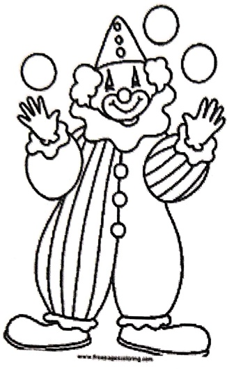

Rolo is a  $ \underline{\text{funny}} $ clown.

The  $ \underline{black} $ dog jumped over the bar.

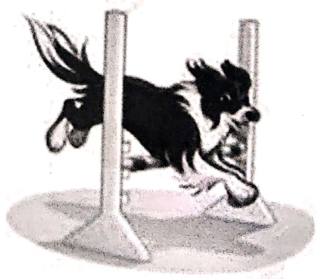

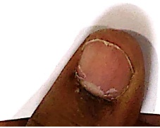

[Table 1](tables/table_001.html)

[Table 2](tables/table_002.html)

[Table 3](tables/table_003.html)

Practice Sheet-1

Date : ___

Select the describing word that best describes the underlined noun and write it the given space.

Example-

A  $ \underline{parrot} $ is  $ \underline{green} $. (green/black)

1. The  $ \underline{\text{giraffe}} $ is _____. (tall/small)

2. A  $ \underline{circle} $ is always _____. (square/round)

3.  $ \underline{\text{December}} $ is a _____ month. (cold/hot)

4. The  $ \underline{\text{feathers}} $ of a dove are white and _____. (hard/soft)

5. A  $ \underline{bear} $ is a very _____ animal. (strong/ long)

6. A  $ \underline{\text{watermelon}} $ is _____ from inside. (blue/red)

7. The  $ \underline{\text{forest}} $ is very _____, at night. (yellow/dark)

8. A  $ \underline{whale} $ is a _____ water animal. (big/small)

9. I have a _____  $ \underline{\text{tortoise}} $ for a pet. (wild/small)

10. The  $ \underline{\text{pastries}} $ are very _____. (sweet/spicy)

11. The _____ (foolish/clever)  $ \underline{\text{dog}} $ barked at its reflection and lost its food.

12. The _____ ( poor/rich)  $ \underline{\text{beggar}} $ begged for food.

13. The _____ ( brave/ coward)  $ \underline{\text{knight}} $ fought the fiery dragon.

[Table 4](tables/table_004.html)

practice Sheet-2

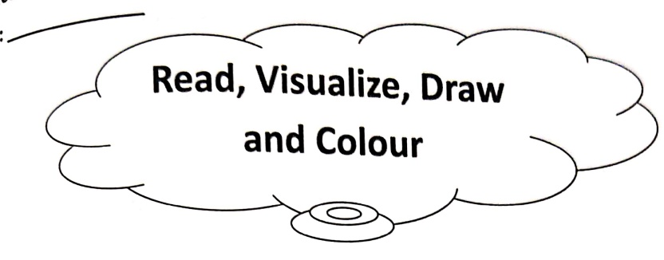

Read each sentence very carefully. Underline the adjectives and illustrate.

Example- A black old car tyre hung from a thin branch as a swing.

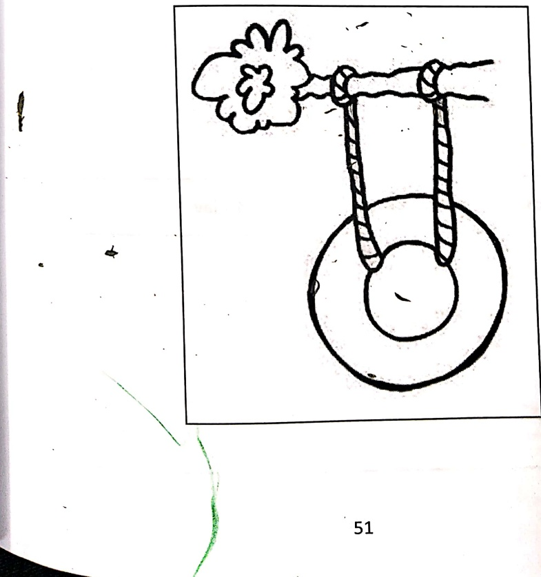

[Table 5](tables/table_005.html)

1. Two red dotted birds sat on the blue flower.

2. Three ducks were swimming in a row in the pond.

3. I got a purple toy car and a yellow toy plane for my birthday.

[Table 6](tables/table_006.html)

practice Sheet-3

date: ___

#### sensational Words

ose words from the word bank to describe each picture.

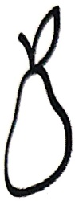

It tastes ___.

It looks ___.

It feels ___.

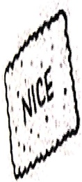

It feels _____.

It tastes _____.

It sounds ___.

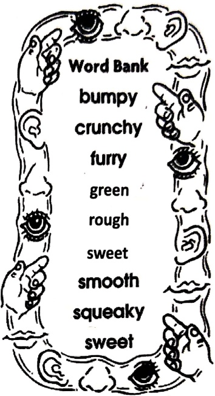

It looks ___.

It sounds ___.

It feels _____.

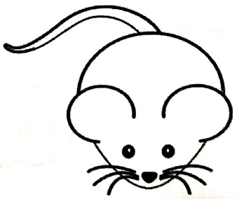

[Table 7](tables/table_007.html)

Practice Sheet-4

Date : ___

Mystery Boxes

Describing words help you imagine how something looks, feels, smells, or tastes

Read the describing words to guess the mystery object. Use the word bank to

[Table 8](tables/table_008.html)

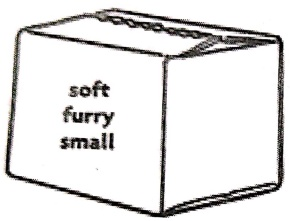

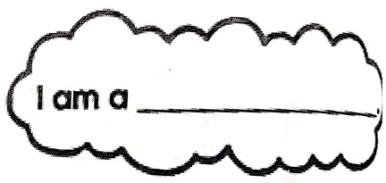

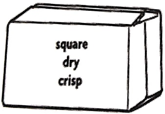

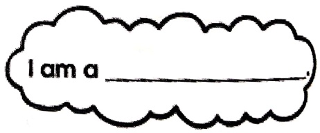

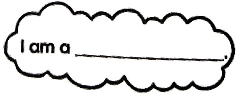

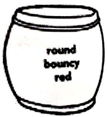

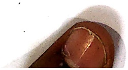

[Table 9](tables/table_009.html)

practice Sheet-5

Date: ___

pick the suitable adjective from the bracket and rewrite the sentences correctly.

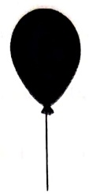

1. The balloon is circle in shape. (long, fat, round)

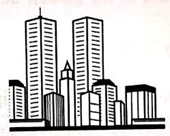

2. I saw a long building. (tall, thick, little)

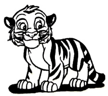

3. Tiger is a domestic animal. (wild, tall, sharp)

[Table 10](tables/table_010.html)

##### Practice Sheet-6

Date : ___

Fill in the blanks using suitable words.

I have a ___ (adjective) garden [] (punctuation) There are ___

(adjective) trees and plants in it. My brother likes to take care of little ___

(noun) in the garden. ___ (pronoun) invites his friends for a picnic every Saturday. They play together in the ___ (common noun). They often see ___ (article) monkey sitting on the branch of a mango tree [] (punctuation) I like to practice yoga as an esay every morning in my garden before going to ___

(common noun). There are many beautiful ___ (common noun) like roses, orchids and lilies in my garden. These flowers help us in bringing ___

(adjective) fragrance into my house. Gardening increases our love and dedication for nature and motivates us to grow more plants.

Illustrate your 'Dream Garden'

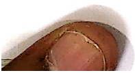

<table border=1 style='margin: auto; word-wrap: break-word;'><tr><td style='text-align: center; word-wrap: break-word;'>Grade: 1</td><td style='text-align: center; word-wrap: break-word;'>