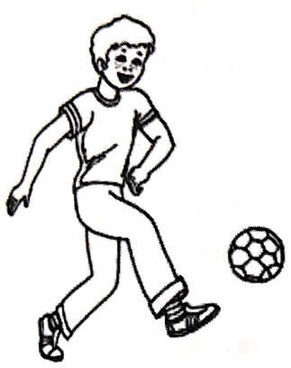
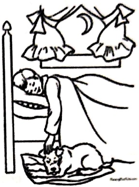
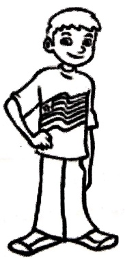
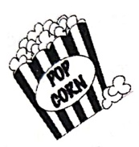
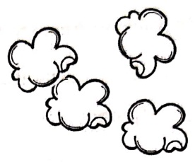
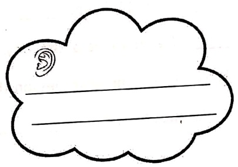
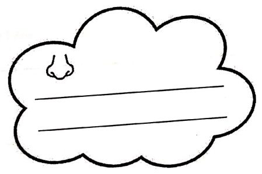
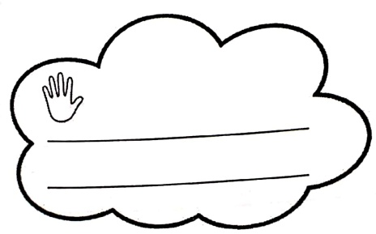
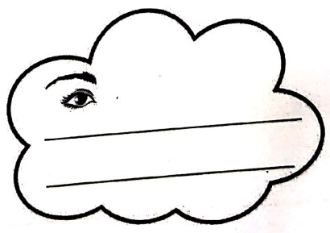

Subject: English Grammar</td><td style='text-align: center; word-wrap: break-word;'>Topic: Verbs</td></tr><tr><td colspan="3"></td></tr></table>

Reading Worksheet

Date: ___

Verb A verb is a word that tells what someone or something is doing. A verb is also called a 'doing word' or an 'action word'.

Example: run, spin, sleep, fall, jump, climb, draw, watch, swim, etc.

Rahul is  $ \underline{\text{playing}} $.

Satish is  $ \underline{\text{sleeping}} $.

Tom is  $ \underline{\text{standing}} $.

[Table 1](tables/table_001.html)

##### Reading Worksheet

Date : ___

Verbs change their form according to the number of nouns they are used for.

Verbs used for yesterday are called the verbs in past tense.

Verbs used for today are called the verbs in the present tense.

Verbs which take '-ed' in the past form.

[Table 2](tables/table_002.html)

Verbs which change completely.

[Table 3](tables/table_003.html)

Verbs which do not change in their Past Tense

[Table 4](tables/table_004.html)

[Table 5](tables/table_005.html)

practice Sheet-1

Date: ___

Match the following using different colour crayons

[Table 6](tables/table_006.html)

Fill in the blanks with 'is', 'am' or 'are'

1.I _____ playing football.

2. Geeta ___ writing a letter.

3. There _____ many animals in the zoo.

4. The bags _____ in the cupboard.

5.The glass ___ full.

6. Preeti and Hema _____ best friends.

7. There _____ a man outside the house.

8. It _____ eight o'clock now.

9.They _____ my friends.

10. He _____ playing.

11. My brother and I _____ in the same class.

[Table 7](tables/table_007.html)

Practice Sheet-2

Date: ___

Fill in the blanks with 'has' or 'have'

Example- He  $ \underline{has} $ four cars.

You  $ \underline{\text{have}} $ long hair.

1. He _____ a blue hat.

2. We _____ five apples.

3. Meena _____ many dolls.

4. The camel _____ a big hump.

5. They _____ a big garden.

6. Govind and Arti _____ gone to Shimla.

##### Practice Sheet-3

Fill in the blanks with is/am /are/has/have.

Hello! My name ___ Rohan. I ___ from Lucknow. I love to make new friends.

Ria ___ my best friend. I go to school daily. There ___ many children in my

class. Ritvik brings his favourite colourbox everyday to school. He ___ a huge

collection of crayons and paints. Sometimes, when I forget to get my colours to schools

then he shares his colours with me. I ___ some punch papers which Ritvik and I

use for drawing and colouring in our free time.

[Table 8](tables/table_008.html)

#### practice Sheet-4

Date: ___

### Identify the errors and rewrite the sentences:

1. Mymother are baking a cake.

ther are baking a cake.

1.

2. Water are colour less

2. ___

3. The Sun rise in the west

4. Bruno are enjoying his biscuits.

runo are enjoying his biscuits.

4. ___

5. Our parents is very fond of us.

5.

[Table 9](tables/table_009.html)

Practice Sheet-5

Date: ___

Rewrite the sentences correctly.

1) Lotus are the national bird of india.

2) I woke up at 6:00 am everyday.

___

3) He cutted the paper with the help of a scissors.

4) Last month, I see a rainbow at night.

5) Yesterday, she buoyed a new car for her sister.

[Table 10](tables/table_010.html)

Practice Sheet-6

Date:___

My five senses & Popcorn:

POPCORN

My popcorn tastes salty.

[Table 11](tables/table_011.html)

Practice Sheet-7

Date: ___

##### Fill in the blanks with appropriate words.

Yesterday, I ___ (verb) ___ (article) boy ___ (preposition) the road.

___ (pronoun) was talking on the ___ (noun). There was a

___ (adjective) hole on the road. Since the he was busy talking, he did not

notice it and ___ (verb) down. ___ (pronoun) got badly wounded. Some

people ___ (verb) to help the boy. The boy realized ___ (pronoun)

mistake and learnt a very important lesson that we should always be careful while

walking ___ (preposition) the ___ (noun).

##### Illustrate the story

<table border=1 style='margin: auto; word-wrap: break-word;'><tr><td rowspan="2">Grade: 1</td><td style='text-align: center; word-wrap: break-word;'>