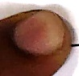
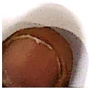

Subject: English Grammar</td><td style='text-align: center; word-wrap: break-word;'>Topic: Conjunctions</td></tr></table>

Reading Worksheet

Date : ___

Conjunction: A conjunction is a word that joins two or more words, group of words

sentences together. 'and', 'but', 'because' are conjunctions.

We use 'and' to join two words or sentences.

Example- lock  $ \underline{\text{and}} $ key

I have a pear. I have an orange.

I have a pear  $ \underline{and} $ an orange.

We use 'because' to show reason.

Example - I am carrying an umbrella. It is raining.

I am carrying an umbrella because it is raining.

[Table 1](tables/table_001.html)

#### practice Sheet-1

Date: ___

Rewrite the sentences using 'commas' and 'and' appropriately:

1) Rohan bought a book. Rohan bought a pack of crayons.

2) My brother likes to play badminton. I like to play badminton.

___

3) John fell down. John cut his knee.

Tina packed her jeans pink top shoes for the trip.

5) Priya Riya Sia are best friend.

[Table 2](tables/table_002.html)

Practice Sheet-2

Date : ___

Q1) Fill in the blanks using 'because':

1) Kriti did not go to the party _____ she was feeling sick.

2) Raj was late for the meeting _____ he missed the bus.

3) I could not finish my homework _____ the power went out.

4) My friends decided to cancel the trip ___ of the weather forecast.

5) I am taking an umbrella ___ ___ it might rain in the evening.

Q2) Join the sentences using 'because' and rewrite the sentences.

[Table 3](tables/table_003.html)

1)

2)

3)

4)

5)

[Table 4](tables/table_004.html)

#### practice Sheet-3

Date: ___

Q1) Fill in the blanks using 'and' and 'because':

1) Emily was tired _____ decided to take a nap.

2) John likes pizza _____ pasta.

3) David went to the store _____ he needed to buy groceries.

4) Neha did not come to the party _____ she had other plans.

5) Tom enjoys reading _____ learning new things.

6) Jack and Anna were late _____ the traffic was heavy.

##### Q2) Choose the correct option:

1. Rohini is a wonderful orator _____ a dancer.

a) because b) and

Rohan studies everyday _____ he wants to improve his grades.

a) because b) and

3. Ram did not attend the meeting _____ he had an appointment with the doctor.

a) because b) and

4. My cousins and I went to the beach _____ the weather was perfect.

a) because b) and

[Table 5](tables/table_005.html)

Practice Sheet-4

Date: ___

Find the errors and rewrite the sentences correctly.

1) Mother made a wonderful salad with tomatoes cucumber, and lemons.

2) Heera went to the airport and saw aeroplanes, helicopters, gliders.

3) The meeting was postponed and because the weather was bad.

4) It was a long and hot, and tiring journey.

5) Children love to run jump hop skip.

6) Rohan stayed, at home because he felt sick.

[Table 6](tables/table_006.html)

Practice Sheet-5

Date: ___

Fill in the blanks using appropriate conjunctions.

My friend Rina is a kind person. She enjoys painting ___(, /and) reading books ___(and/,) playing the piano. Rina is very talented ___(and/because) she practices everyday. Her parents support her interests ___(and/because) they want her to excel in playing piano ___(and/because) painting. Rina's paintings are colourful ___(and/,) her drawings are full of details. The piano sounds soothing ___(because/and) she plays it well. On weekends, she likes to relax ___(because/,/and) resting is also important.

##### Practice Sheet-6

Date: ___

#####  $ \underline{\text{Fill in the blanks.}} $

Jane was ___ (article) elephant who loved ___ (playing/loving) all day long. She played with anything day, ___ (pronoun) got. One day, ___ (pronoun) was ___ (running/caring) in the ___ (common noun). Since it was a ___ (sunny/yellow) day, ___ (proper noun) got tired and felt thirsty. So, ___ (pronoun) decided to ___ (verb) some water to quench ___ (pronoun) thirst. Soon ___ (pronoun) spotted a pond ___ (conjunction) quickly dipped her ___ (trunk/leg) into the ___ (adjective) water ___ (conjunction) drank it to satisfy her thirst. Jane was happy ___ (conjunction) it was time to play again.

<table border=1 style='margin: auto; word-wrap: break-word;'><tr><td style='text-align: center; word-wrap: break-word;'>Grade: 1</td><td style='text-align: center; word-wrap: break-word;'>