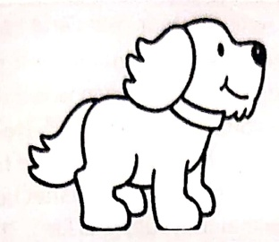

Subject: English Grammar</td><td style='text-align: center; word-wrap: break-word;'>Topic: Comprehension</td></tr><tr><td colspan="3"></td></tr></table>

practice Sheet 1

Date: 11.5.26

read the following passage carefully and answer the following questions:

Rex's father gifted him a dog on his birthday. He named him Chestnut. Rex loves to play with his dog. Sometimes, he takes his dog to the park. Rex throws a ball and Chestnut catches it. They run, jump and chase each other. Chestnut is very loyal.

1. What does Rex love to do?

Reaสเครียด to play with them

2. How did Rex and Chestnut spend time with each other?

___

3. Where does Rex take his dog, Chestnut?

4. Identify and write two naming words from the given passage.

___

[Table 1](tables/table_001.html)

Practice Sheet 2

Date: ___

Read the following passage carefully and answer the following questions:

Anna and Kevin went to see the planetarium at the museum. When they went there, the teacher showed them where to leave their coats and backpacks. A special guide takes them on a tour. Kevin learnt about sun, moons and stars around us. He was mesmerized by the beauty of moons and stars. Kevin was delighted at the end of the tour and thought, "I will definitely come back someday". He collected his things and boarded the bus back to his school. On the way, Anna asked her friends to name their favourite planet. She said that Saturn is her favourite planet because it has many rings. Kevin said, "Earth is my favourite planet as it supports life". The teacher wanted Anna and Kevin to make a project on the planet Saturn. Both of them decided to work together.

1. What did Anna and Kevin carry to the planetarium?

2. Why was Saturn Anna's favourite planet?

3. Name the planet that supports life.

4. Identify any two naming words and the pronouns used for them.

___

[Table 2](tables/table_002.html)

Practice Sheet 3

Date:___

the following passage carefully and answer the following questions:

Jaguar's are large wild cats. They have yellow fur with black spots. Jaguar's live in the rain forests of South America. They live alone and sleep on tree branches. Did you know that, jaguars hunt at night? They can see better at night. Jaguar's are meat eaters. They use sharp teeth and strong claws to catch wild pigs, deer and other land animals. Most cats do not like water, but jaguars love to swim! They swim to catch fish.

1. What do jaguars love to do?

___

2. When do jaguars hunt for their prey?

_____

5. Where does the jaguar live?

_____

4. Do you think it is good to cage animals?

___

5. Write two naming words used in the passage.

_____

[Table 3](tables/table_003.html)

##### Practice Sheet 4

Date: ___

Read the following passage carefully and answer the following questions:

A little boy was playing near a farm when he saw a signboard, 'Puppies for sale'. He requested his father to take a pup. His father agreed. They went there and told the farmer that they would like to buy one pup. The farmer let out a shrill whistle and out of the doghouse came running four little balls of fur. The boy's eyes lit up with delight. He then notices another pup, running towards him in an awkward manner, trying his best to catch up with others. The little boy made up his mind to buy that pup. The farmer told the boy not to take that pup and choose another one as it limps and would never be able to run or play. The boy quietly rolled up one leg of his trousers to reveal a wooden leg. He then looked up at the farmer and said, "I too do not run well and the pup's world need someone who understands him."

1. Who were the four little balls of fur?

2. Why did the farmer ask the boy to choose another pup?

_____

3. If you were in place of the little boy whom would you choose and why?

_____

4. Select two suitable words from the following to describe the little boy and frame a sentence with anyone of them.

naughty, foolish, lovable, understanding, greedy, kind

Frame sentence-

<table border=1 style='margin: auto; word-wrap: break-word;'><tr><td style='text-align: center; word-wrap: break-word;'>Grade: 1</td><td style='text-align: center; word-wrap: break-word;'>