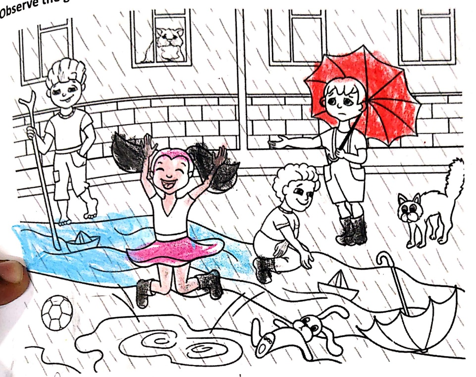
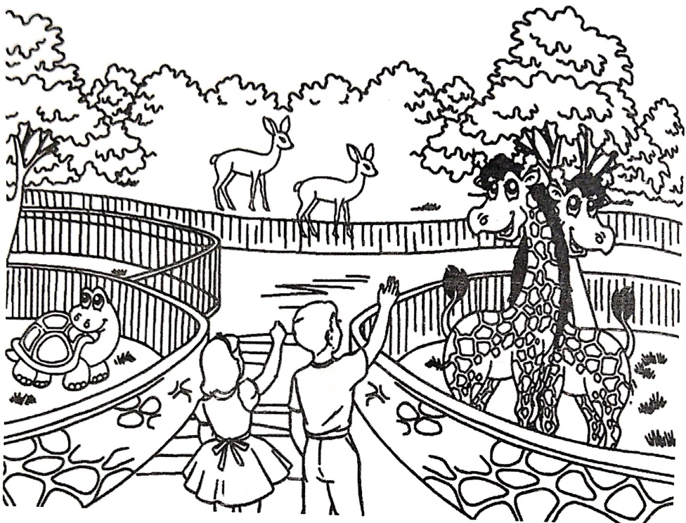
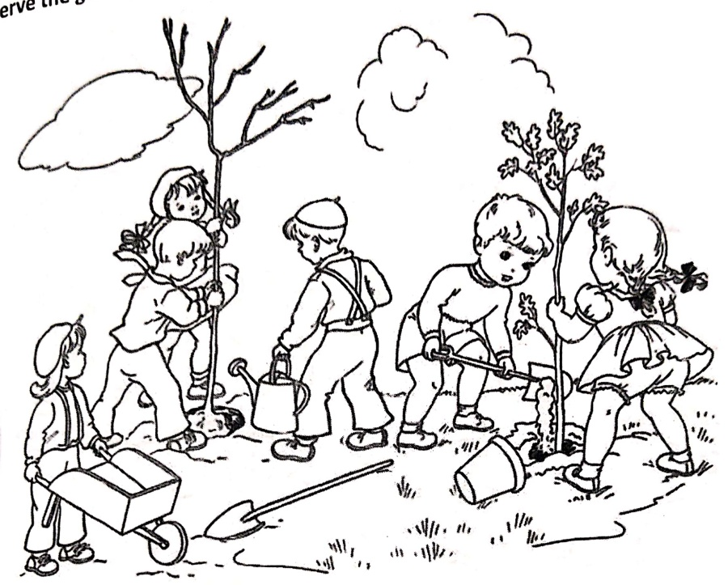
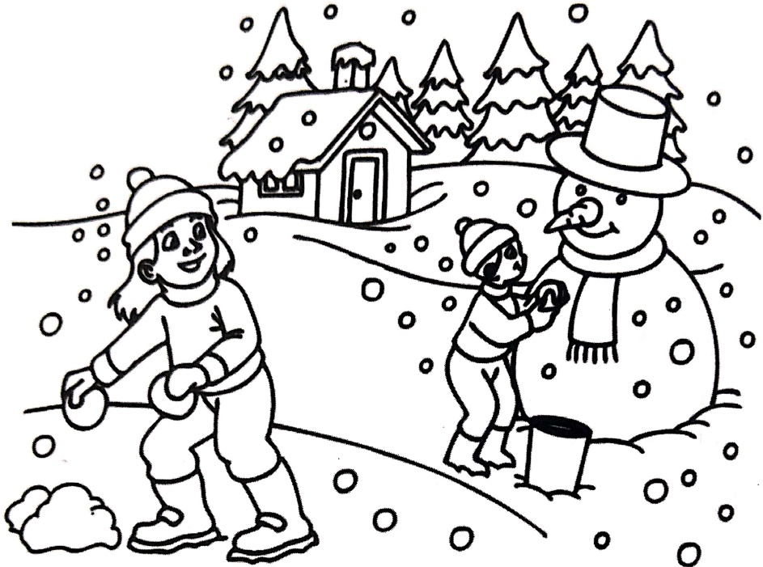

Subject: English Grammar</td><td style='text-align: center; word-wrap: break-word;'>Topic: Picture Composition</td></tr></table>

Date: 27.4.26

Observe the given picture and write few lines about it.

I'm raining days

2 in the railing one rabbit is rising pail on the rain one rabbit is pail side down A cat is in the house one plot.

[Table 1](tables/table_001.html)

Date: ___

Observe the given picture and write few sentences about it.

一

[Table 2](tables/table_002.html)

Date: ___

Observe the given picture and write few lines about it.

二

[Table 3](tables/table_003.html)

Date: ___

Observe the given picture and write few lines about it.

一

<table border=1 style='margin: auto; word-wrap: break-word;'><tr><td style='text-align: center; word-wrap: break-word;'>Grade: 1</td><td style='text-align: center; word-wrap: break-word;'>