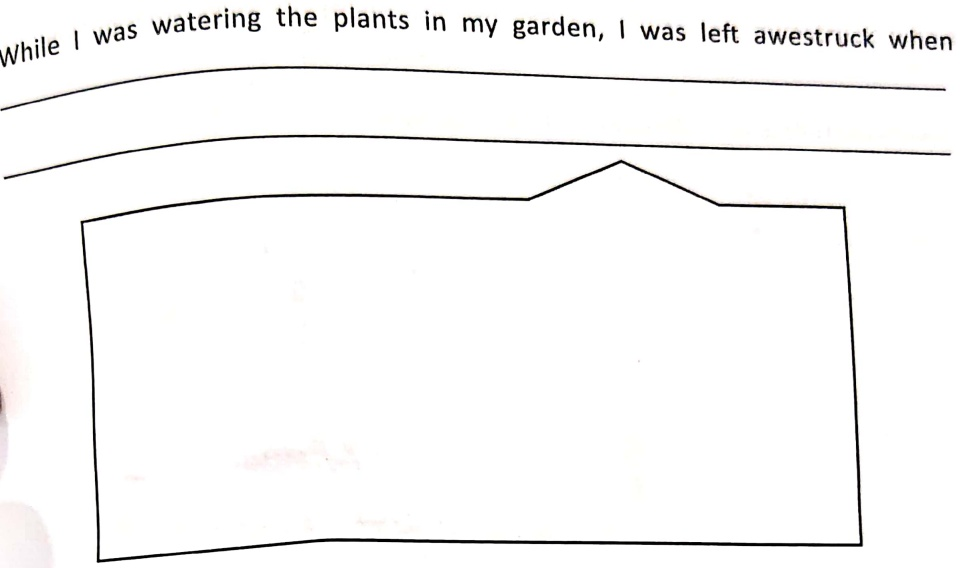
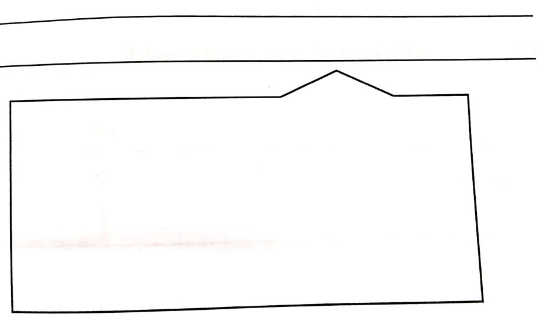

Subject: English Grammar</td><td style='text-align: center; word-wrap: break-word;'>Topic: Stretching out Actions</td></tr></table>

#### stretching out Actions

Children! It's time for you to put on your thinking caps and stretch out the given sentences. Let's soar high on the wings of visualization and creativity.

1. While I was watering the plants in my garden, I was left awestruck when _____

2. My father and I went to the top of the water slide and then.....

_____

<table border=1 style='margin: auto; word-wrap: break-word;'><tr><td style='text-align: center; word-wrap: break-word;'>Grade: 1</td><td style='text-align: center; word-wrap: break-word;'>