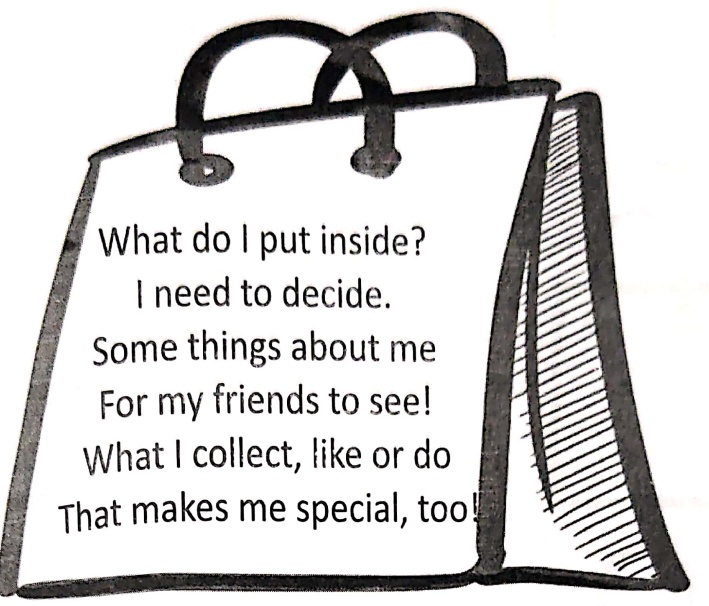
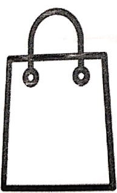
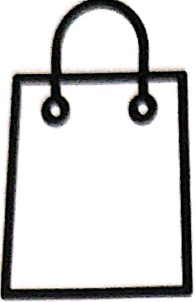

Subject: English Grammar</td><td style='text-align: center; word-wrap: break-word;'>Topic: All About Me</td></tr></table>

All About Me Bag!
 

What do I put inside?

I need to decide.

Some things about me

For my friends to see!

What I collect, like or do

That makes me special, too!

Write the names of 5 things that you want to keep in your goodie bag and why?

[Table 1](tables/table_001.html)

<table border=1 style='margin: auto; word-wrap: break-word;'><tr><td style='text-align: center; word-wrap: break-word;'>Grade: 1</td><td style='text-align: center; word-wrap: break-word;'>