Subject: English Grammar</td><td style='text-align: center; word-wrap: break-word;'>Topic: Vocabulary</td></tr></table>

#####  $ \underline{\text{Reading Worksheet}} $

Quantifiers indicates the quantity of something.

much - There isn't  $ \underline{\text{much}} $ rice left in the bowl.

many-Jack has  $ \underline{\text{many}} $ friends in the society.

more - You like  $ \underline{\text{more}} $ sugar in your milk than I do.

most-Most of the seats in the cinema hall were booked.

few-They went on the trip a $ \underline{\text{few}} $ days ago.

little - There is a  $ \underline{\text{little}} $ milk in the refrigerator.

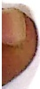

less-There is  $ \underline{less} $ water in the glass.

some-  $ \underline{\text{Some}} $ children in the class went for a picnic.

a lot of- I have  $ \underline{\text{a lot of}} $ books in my bookshelf.

####  $ \underline{\text{Sequencing words}} $ sequence the order of events.

To make a lemonade-

Firstly, you need to have some lemons, sugar and a pinch of salt with you.

Next, slice the lemons and squeeze them in a glass of water.

Then, add a table spoon of sugar to it.

After that, add a pinch of salt and stir it well.

Finally, garnish it with some mint leaves and your lemonade is ready.

# Summer Holiday Homework

Date: ___

Q1. From the given word bank pick up the nouns and put them in the correct column.

Jaipur, school, Roy, hospital, bear, Kashmir, lion, friend, table, fork, cupboard, Taj Mahal, India, computer

[Table 1](tables/table_001.html)

Q2. Rewrite the sentences correctly.

1. peacock is the national animal.

2. my uncle lives in Mumbai.

3. tina is my friend she loves to play with me ___.

4. moon are a planet.

5. My brother rahul gave his clothes to the underserved.

6. rohan and peter gifted a barbie doll to parul on her birthday

_____

1. riya's father brought natraj pencils for her from the market.

### Q3. Fill in the blanks with suitable words.

1. The ___ is barking.

2. Mira ate _____ (article) orange.

3. I ___ (is/am) going to the ___ (noun) to buy vegetables.

4. The ___(noun) ___(are/is) open on Sunday.

5. _____ are my favourite snacks.

6. We saw many _____ at the zoo.

7. There are no _____ in the box.

8. _____ went to the park.

9. ___ and ___ are best friends.

#### Q4. Fill in the blanks with suitable words.

There is ___ (article) pink Lotus in a ___ lake. (proper noun) There were two ___ (common noun) swimming in the ___ (common noun) (punctuation mark) A little ___ (common noun) comes to play near the lake. She falls into the lake. She cannot come out. She starts crying. ___ (article) kind woman hears her cry. She jumps into the lake and saves her. The happy girl says, 'Thank you, Aunty.'

##### Q5. Frame sentences:

1. market-

2. beautiful-

3. excited-

4. an-

5. a

Q6. Write two words that sound the same as (Rhyming words)-

1. cake-_____，_____

2. moon-___, ___

3. name-___，___

4. race-___，___

5. pile-_____，_____

6. walk-___, ___

Q7. Fill in the blanks by choosing the correct word.

1. Rohan made a straight _____(line/pine)

2. The third pig's house was made of _____(brick/trick)

3. He _____ (came/game) to the party.

4. We went to Mumbai in a ___(train/grain)

Q8. Make new words ending with -ed, -ing

wash-_____，_____

cook-_____，_____

look-_____，_____

Jump-_____，_____

9. Write as many words as you can from the given word.

TELEVISION

Illustrate any one word which you have written.

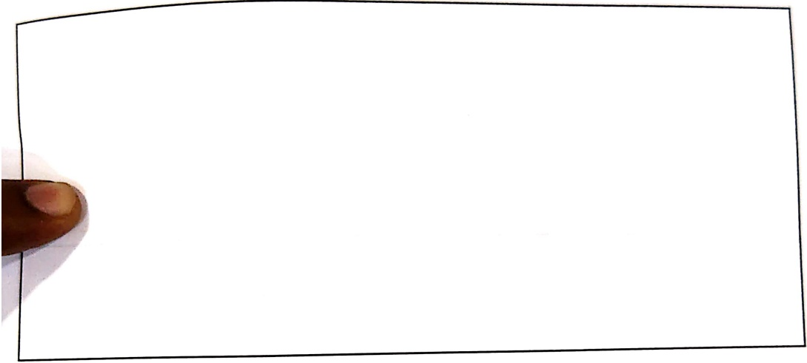

Q10. Write 5-6 sentences on 'My Best Friend'.

letra.

##### Illustrate-

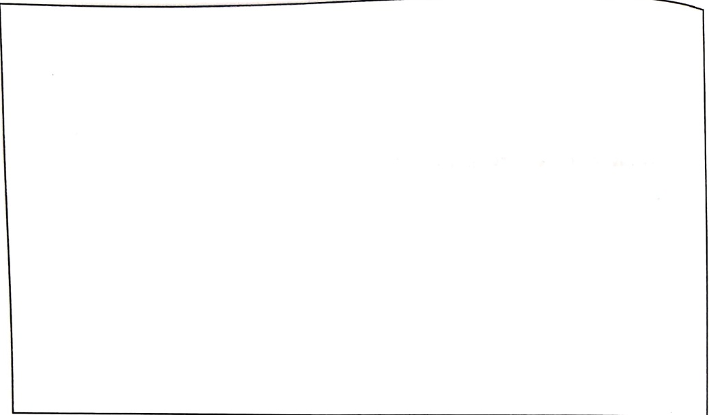

# Winter Holiday Homework

Date: ___

Q1. Fill in the blanks with suitable words and use any two words to frame sentences.

1. The clever _____ is having lunch with _____ giant.

2. A _____ has lovely wings.

3. My _____ are torn. I should buy new ones.

Frame sentences:

1.

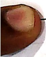

##### Q2. Complete the given sentences:

1. I was going to my school and on my way, I

saw_____

2. While planting some saplings in my garden yesterday, I was surprised to see _____

##### Q3. Fill in the blanks with he/she/his/her:

1. Ritika has many chocolates. ___ wants to share with ___ friends.

2. Abhimanyu bought a badminton racket for _____ younger brother.

3. Vivan went to a mall. _____ had a great day.

4. ___ is her sister.

##### Q5. Rewrite the sentences correctly.

1. harsh are eating a choco pie. She shares it with her brother

_____

2. trees give us carbon dioxide.

___

Frame one sentence using both the articles 'a' and 'an'

_____

##### Q6. Fill in the blanks.

There_____(is/are) many _____(orange) kept _____(preposition) the_____(noun). I ate two _____(egg) for breakfast. Then, I went to keep my _____(book) in my_____(common noun) bag. Before I could go off to sleep I made sure to put back all the _____(toy) lying on the floor.

##### Brain Game

Q7. Fill in the blanks with parts of the body.

1. ___ opener

2. _____ twister

3. Water_____nut

4. _____watch

5. _____biting finish

Q8. Fill in the blanks by choosing the opposite pair of words from the given word bank.

old, clean, ugly, late, young, beautiful

1. We should keep our room _____.

My grandfather is _____ but I am _____ .

3. I missed my school because I slept _____ last night.

3. ___ duckling was sad because she was not ___.

4. The ___ frame a sentence using any one pair of opposite words.

Q9. Observe the given picture carefully and write few lines about it.

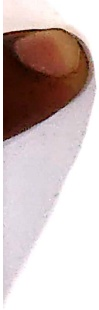

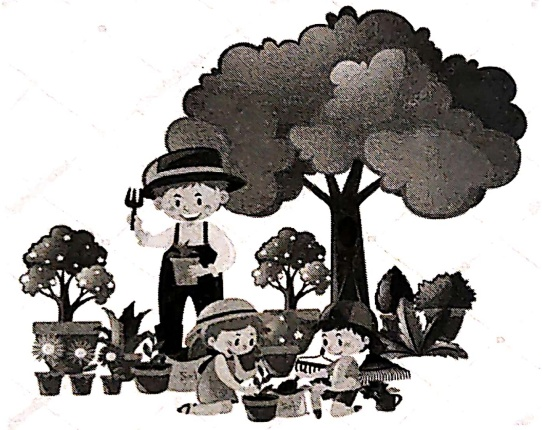

二

二

二

二

二

# CATCH 'EM YOUNG....

ADVAITA SHUKLA

CLASS 1A

The early years Empowering English Grade 1 & 2 textbooks acknowledge the natural intelligence, growing curiosity and dynamic learning in the child, in addition to keeping his/her literacy (reading and writing skills) in mind.

At this stage, teachers and parents are expected to expose children to the language through a wide variety of stories, poems, sight words, phonics, auditory discrimination activities and oral opportunities. The books and teacher's manuals support you completely with this.

Like all Empowering English books, Grade 1 & 2 books look at the genres of English. Description, discussion, reporting, argument, persuasion, narrative and imagination genres are scaled and layered. Skills like mind mapping for ideas, locating information, categories, sequencing, poetry skills, grammar and punctuation skills are deliberately layered throughout the two years to appropriate age levels.

As abilities in children in a class have fairly big fluctuations, so also, from school to school children are at different levels. It is important to use discretion and have a mix of teacher read out stories and individual reading at this stage.

Children are amazing with new words. So, vocabulary needs to be understood from context rather than from words taught to them. Good exposure will lead to excellent language skills. The more we read to them, the better they will be.

Teachers are provided with manuals that have learning outcome tables and a rich array of oral activities, word building, spelling tools, a delightful sound reader for phonic activity and a daily grammar process guide.

I am indebted to the Australian International School, Jakarta for the many insights I got when teaching English language learners in grade 1.

Special thanks to Kaizin Pooniwala for lovingly illustrating this book.

Usha Pandit

# HOW TO PLAN THE YEAR WITH EMPOWERING ENGLISH GRADE 1 BOOK.

As children are developing as readers and language users at this stage, it is very important to focus on their skills regularly and consistently. Please read this carefully before you plan your English lessons.

plan for 30 teaching weeks.

##### Prose

There are 19 units. These units should be read by the teacher and/or students. Questions can be done orally or as written comprehension. Oral class discussions, vocabulary and language practice, phonics, and punctuation exercises are to be done regularly. Depending upon the current levels of the child, you will need to read some of the stories or give instructions appropriately.

##### Literature

The teacher reads the stories to the class from a list of traditional, classic and contemporary stories and asks children oral comprehension questions on plot, character and messages. She can use a range of skills. Children are encouraged to retell the story, or answer simple questions on it at the end of each story. When the teacher reads the story, the child is exposed to structure, vocabulary, contextual meanings and rhythms of the language.

##### Extra Reading

The prose units can be used for class reading with the teacher and for independent reading. However, children must be in a reading programme, looking at books for pictures, words, illustrations, predicting events and endings by reading simple books at their reading levels. A running record must be maintained for this. Reading aloud to an adult must be done everyday. Remedial and recovery reading programmes must be done for struggling readers. Children must have a reading record for the library books they borrow. Teachers must read one story everyday to children starting from Pre Primary.

##### Writing

Children will be exposed to written pieces in the 8 genres namely: Descriptive, Narrative, Imaginative, Procedure, Discussion, Reporting, Argument and Persuasion skills. They will do some guided writing and move towards independent writing before the end of the year. Complete sentences with full stops and capital letters should be aimed for. You will need to add a few creative writing topics for your children. All children will not reach the same level.

##### Poetry

There are a few poems with exercises to be done that are part of the lessons. But it would be very beneficial to read a lot of poems to the children every

## 1. Jim's Pet Dog Nix

Jim has a pet dog and his name is Nix.

Jim likes to play with his pet dog.

Nix wags his tail when he is happy.

He jumps with joy when he sees Jim.

If Jim throws a ball Nix runs after it.

He sits on his paws and begs for food.

Look how he sits on his red mat.

Jim has put a blue collar on him.

That is to tell everyone he belongs to J

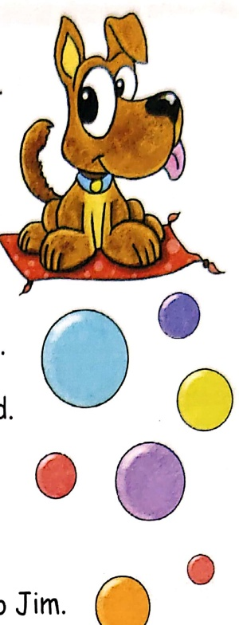

##### Questions

##### Say and write

1. Jim's pet dog's name is ___.

2. Jim's pet dog wags his_____ when he is happy.

3. He _____ with joy

4. He_____ after a ball.

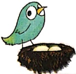

## CONTENTS

[Table 2](tables/table_002.html)

5. The dog sits on the floor. Yes or No? _____

6. The two colours we find in the story are _____ and _____ .

7. Jim wants everyone to know the dog is his. So he has put a _____ on Nix.

## Discussion

Pets

##### Language

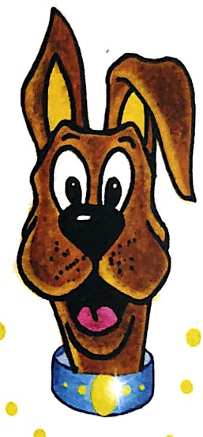

1.  $ \underline{\text{Structure practice}} $: May I please.....

What do you say when:

a) You want to drink water in class?

b) You want to borrow a pencil from your friend?

c) You want to go to the washroom?

2.  $ \underline{\text{Choose and write}} $

Choose the right word ending in -ine

Please draw a straight _____. (line / fine)

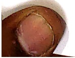

We went to ___ in a big restaurant. (mine / dine)

The ___ tree is very tall. (wine / pine)

## 3.  $ \underline{\text{Look, say and write}} $

Look at the grid given below and make words.

One line is done for you.

[Table 3](tables/table_003.html)

Extension: Make a silly sentence using some of these words.

The big pig wearing a wig began to dig for the fig.

4.  $ \underline{\text{Think, say and write}} $

Fill in the blanks with words ending in -ick.

I can  $ \underline{\text{kill}} $ the football high up in the air. The man beat his donkey with a  $ \underline{\text{umbrella}} $. The camera went  $ \underline{\text{moa}} $ and took a photo. The house was made of red  $ \underline{\text{cloud}} $. My magic  $ \underline{\text{arm}} $ with a coin is very clever.

##### Phonics

1. $ \underline{\text{Reading practice}} $

pet, mat, sit, him, all, put, tell, belong

pop, pin, gun, nap, bet, pan, pen, sun

2. $ \underline{\text{Read, choose and colour}} $

Find rhyming pairs.

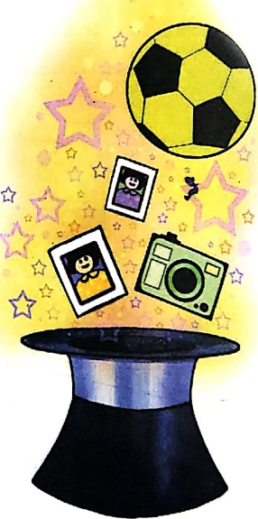

Use a different colour to colour each pair.

all bit net frog strike spell put face

crawl foot log him fell skim space split

sweat stall mike

##### Writing

My Pet Cat

Write the first three sentences on your own.

For the rest, choose from the words given in the box and copy into the blanks.

1. I love my pet ___

2. Her name is Sike.

3. She lives in my  $ \underline{\text{most}} $____.

4. She looks very  $ \underline{\text{hot}} $ .

5. She feels  $ \underline{\text{good}} $ .

6. She smells  $ \underline{\text{cutey}} $.

7. She likes to  $ \underline{\text{immed}} $ me.

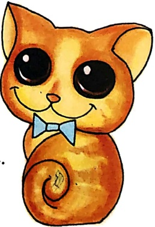

Looks: cute, sweet, clever, sharp, fluffy,

Feels:  $ \underline{\text{soft, cuddly, loveable, silky}} $

Smells: nice, clean, good

Likes to: sit with, lie on, snuggle up to

##### Speaking

I, me, myself

Children to speak on likes, dislikes, dad and mum, their jobs, siblings, others in house, house location and pets if any.

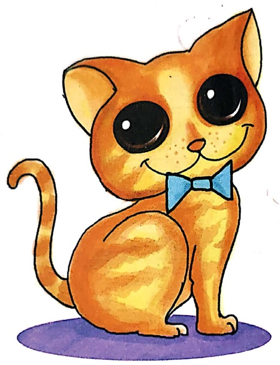

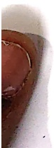

## 2. A Caterpillar and a Spider

(Read aloud with actions)6.5.2.6

Caterpillar

Brown and furry

Caterpillar in a hurry

Take your walk

To the shady leaf or stalk

Or what not

Which may be the chosen spot

No toad spy you

-lovering bird of prey pass you

spin and die

-o live again a butterfly

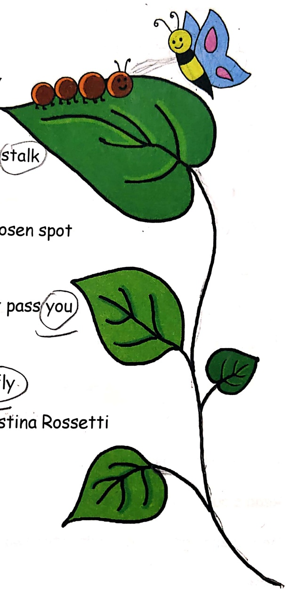

Christina Rossetti

##### Questions

Say and write

1. This poem is about a _____

2. The colour of the caterpillar is _____

3. If you touch a caterpillar it will feel

_____

4. Where does the caterpillar live?

The caterpillar lives _____

5. Caterpillars are eaten by _____ and _____.

6. Caterpillars grow into ___.

7. Circle the rhyming words in the poem.

##### Phonics

1.  $ \underline{\text{Say, listen and think}} $

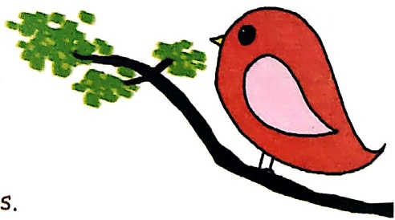

Read aloud: -alk & -ock words.

Do the endings of the words in the two lines given below look the

same?

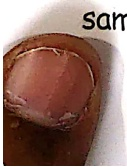

Say them aloud to find out if they sound the same?

a) Walk, talk, stalk, chalk,

b) Rock, lock, sock, mock, clock, flock, frock

Incy Wincy Spider

(Say this with actions, using your fingers and hands.)

Incy wincy spider

Ran up the spout.

Down came the rain

And washed the spider out.

Out came the sun

And dried up all the rain.

Incy wincy spider

Ran up the spout again.

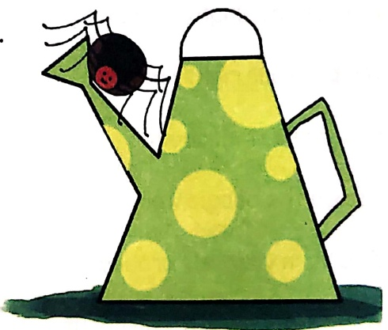

Discussion:

Creepy crawlies

##### Language

1.  $ \underline{\text{Say, think and do}} $

Make new words with endings

-ame: Came, s___, I___, g

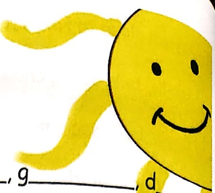

-ain: Rain, tr____, gr____, pl

## 2.  $ \underline{\text{Sing and act}} $

Position song (up, down, in, out, around)

You put your right leg in,

you put your right let out

you put your right leg in

and shake it all about

You do the boogie woogie

And turn yourself around

And that's what it's all about.

##### Continue with:

i. You put your right hand up, you put your right hand down.

ii. You put your left hand in, you put your left hand out...

iii. Right shoulder, left shoulder / right hip, left hip / whole self....

##### phonics

Reading practice:

Out, shout, spout, stout

Down, frown, gown, brown

Sink, pink, sock, suit

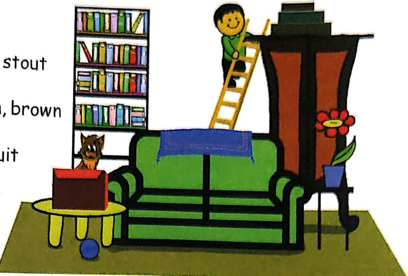

##### Writing

Look, read, think and write

Picture writing:

Look at the picture given above.

Write sentences about it using these words:

in, on, above, up, down, under, over, against, beside

on top of

a.  $ \underline{\text{The cat is in the box.}} $

b. The rug_____

c. The boy_____

d. The ball _____

e. The vase_____

## 3. The Cow jumped over the Moon

Hey, diddle diddle,

The cat and the fiddle,

The cow jumped over the moon;

The little dog laughed

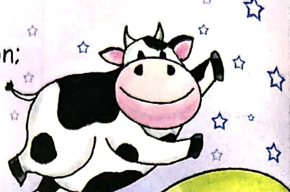

To see such sport,

And the dish ran away with the spoon.☆

##### Language

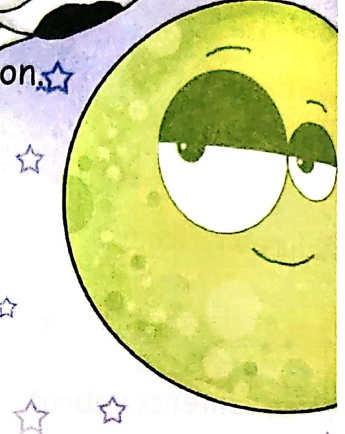

1.  $ \underline{\text{Read, think, say and write}} $

A magic man has mixed up these words.

Help me put them right.

a) are you who?

b) at I home am.

c) dog cute named is my Nix pet.

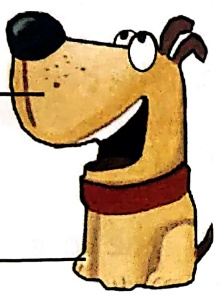

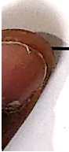

d) Ram the shop to toy did go?

2.  $ \underline{\text{Listen, think and do}} $

 $ \underline{\text{Naming words}} $

Underline all the animals and things in this poem

A noun is a naming word.

It is the name of a person, place, animal or thing.

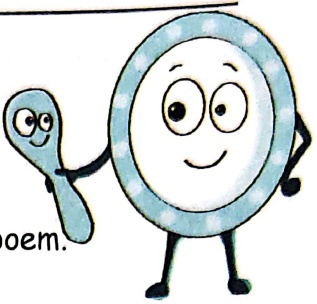

 $ \underline{\text{Play in groups}} $: One child recites the alphabet in his/her mind. When the teacher calls out 'stop', the child gives the group the alphabet she has reached. The group decides on a name of person, place, animal, and thing starting with that letter. Teacher writes the group words on the board. The first group that gets their words on the board wins the round. The teacher titles the board work: Nouns.

The Noun Game

[Table 4](tables/table_004.html)

##### Phonics

1.  $ \underline{\text{Reading practice}} $

can, stamp, bath, cat, blue, sat, mom

2.  $ \underline{\text{Read, say and listen}} $

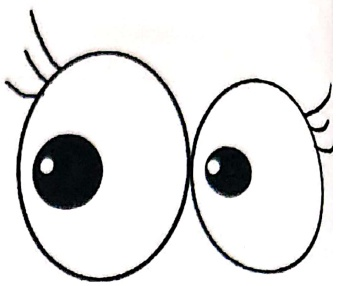

Read aloud: Oon words

moon spoon boon noon soon 100n balloon

monsoon cartoon typhoon baboon

## 3.  $ \underline{\text{Read, say and listen}} $

Magic e and the letter 'a'

Hear the letter name in the sound of 'a' when the word ends in

the letter e

Say c $ \underline{a} $n, say c $ \underline{a} $ne

Say m $ \underline{a} $n, say m $ \underline{a} $ne

Say p $ \underline{a} $n, say p $ \underline{a} $ne

Read more of 'a' words with the magic e

came, d $ \underline{a} $me, f $ \underline{a} $me, g $ \underline{a} $me, l $ \underline{a} $me, n $ \underline{a} $me, t $ \underline{a} $me

bane, c $ \underline{a} $ne, l $ \underline{a} $ne, m $ \underline{a} $ne, p $ \underline{a} $ne

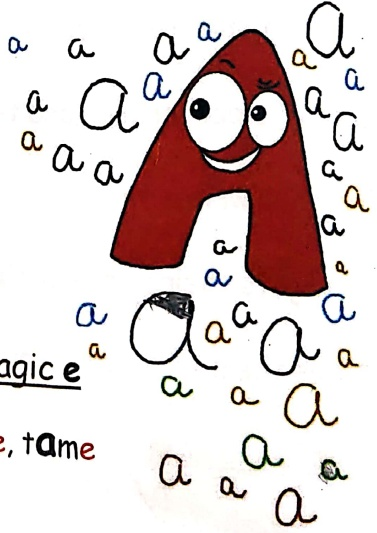

base, case, face, lace, race

bake, brake, cake, fake, lake, make, shake, take, wake

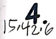

#### The Three Little Rabbits

There were three little rabbits.

The first one was black.

The second one was grey.

The third one was white.

They were all good and clean.

They  $ \underline{\text{lived}} $ in a  $ \underline{\text{house}} $ with a green roof.

One day they found a hole in the roof.

Then it  $ \underline{\text{began}} $ to rain on the roof.

The  $ \underline{\text{water}} $ fell drip, drip, drip.

The three little rabbits could not  $ \underline{\text{sleep}} $.

"Let us keep a  $ \underline{\text{bucket}} $  $ \underline{\text{under}} $ the hole," said the grey rabbit.

"Let us go to  $ \underline{\text{another}} $ house," said the black rabbit.

"Let us fix the roof," said the white one.

What do you  $ \underline{\text{think}} $ they should they do?

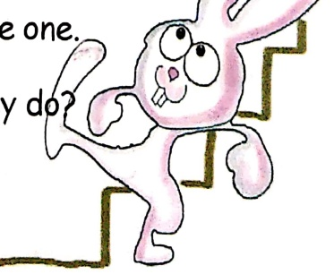

##### Questions

Say and write

1. Copy the colour names from the lesson in the blanks below:

heack, gray white

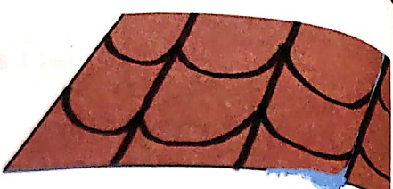

2. Say aloud all the number words you can find in the lesson.

3. Why were the rabbits not able to sleep?

The rabbits were not able to sleep because

the rafter dripping

4. Answer orally: What did each rabbit want to do?

5. What should the rabbits do? Give them advice.

I think you should _____

6. Choose and circle the words below to describe the rabbits.

Clever, happy, sad, cunning, sly, kind, cool, foolish, nice, mad, silly, stupid, jolly

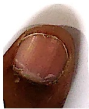

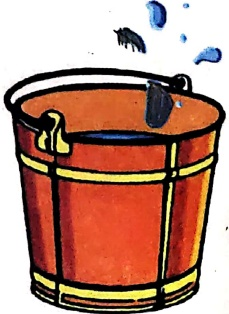

##### Language

## 1.  $ \underline{\text{Read,think and do}} $

Word building

How many sensible words can you make?

[Table 5](tables/table_005.html)

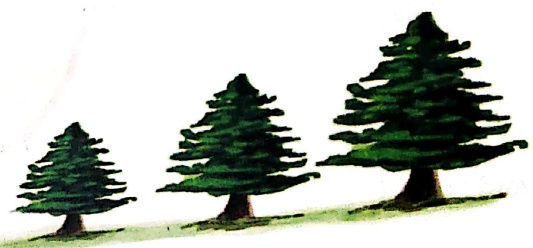

2.  $ \underline{\text{Read, find and do}} $

Fill in the blanks with position words from the lesson:

a) There was a hole  $ \underline{\text{in}} $ the roof.

b) It was raining  $ \underline{on} $ the roof.

c) Let us keep a bucket  $ \underline{\text{under}} $ the hole.

3.  $ \underline{\text{Read, think, choose and write}} $

Choose the right word from the words in the brackets.

a) We keep figs  $ \underline{\text{in}} $____ a box. (in /on)

b) Keep the flower vase  $ \underline{on} $____ the table.(in/on)

c) The cat is asleep  $ \underline{\text{wonder}} $ the tree. (over / under)

##### Phonics

1.  $ \underline{\text{Look, read and listen}} $

 $ \underline{\text{Read aloud}} $: -ean, -eep, -ain, -oof words clean, mean, bean, lean

creep, keep, sleep, sweep

rain, pain, stain, grain

roof, hoof, woof, proof

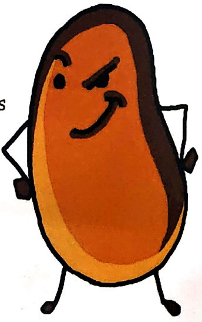

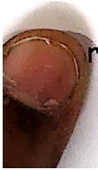

2. Read, Say and Do

Make new words with -ed, -ing endings.

Add-ed and -ing to these words to make new words.

Example: Wash /washed /washing

Wash want wish talk pick

Guided Writing using a Map.

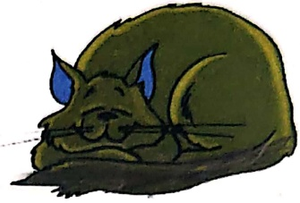

Look at the map given on the next page.

Choose one word from the brackets and fill in the blanks.

Pirate Treasure

Blackeye, the ___(tailor/pirate) has

hidden some ___ (wood/gold) on the Islands of Doom.

The Islands of Doom have _____ (seven/eight) coconut trees.

There are many _____ (monkeys/ goats) living _____ (in/under) the trees.

Nearby there is a _____ (small/ large)

mountain.

In the mountain there ___(has/is) a cave.

There are ___ (snakes /snails) inside the cave.

The map shows that the gold is hidden ___

(between/ behind) two coconut trees.

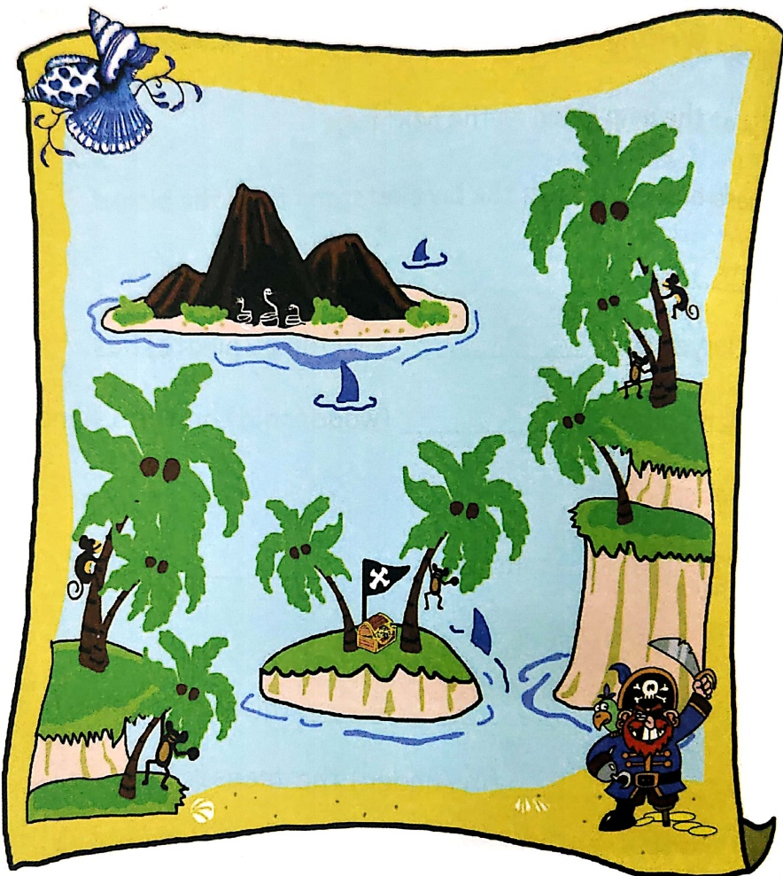

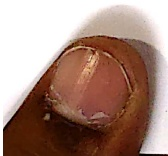

## 5. My Fluffy Cat

My cat is a fluffy little ball of brown fur.

When he was a small kitten he used to squeak.

So we named him Squeak.

He is playful and fun to watch.

He bats pieces of paper and wool.

He jumps after a rubber ball.

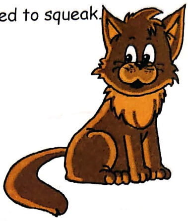

He drinks milk and eats cat food.

He is very careful when he walks on the table.

He hunts and brings in a live rat into the house.

My sister does not like his gift.

My sister is scared of rats.

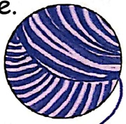

She squeals and screams.

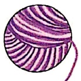

Dad takes the rat and lets it out in the garden.

The rat hurries into the bushes as fast as he can.

Squeak has brought us many gifts to show his love.

A bird, a frog, and even a tiny rabbit.

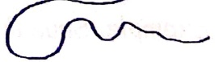

He holds them gently so they are not hurt.

They are always let out safe and sound.

##### Questions

Say and Write

1. What colour is Squeak?

2. Why does Squeak walk carefully around the kitchen table?

3 What does Squeak bring home?

4. Why did sister scream?

6. What did the rat do?

5. What did father do?

7. Are the animals hurt?

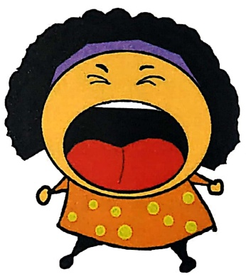

##### Language

1.  $ \underline{\text{Structure practice}} $: is + ing

Act like Squeak so that the class can guess the action. Example: Squeak is batting paper (action of batting)

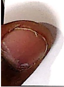

## 2.  $ \underline{\text{Describing words}} $

Describing words are called adjectives.

Fill in the blanks with sensible words from the box.

The rat is _____

The bird is _____

The frog is_____

The rabbit is_____

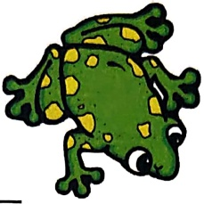

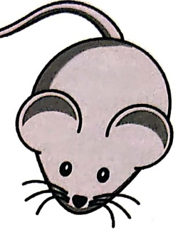

Small, colourful, slimy, scared, croaking, big, chirping, fluffy, white, swift, green, soft, slippery

## 3.  $ \underline{\text{Find out and write}} $

 $ \underline{\text{Young ones}} $

A  $ \underline{\text{kitten}} $ becomes a cat.

1_____ becomes a rat.

_____ becomes a cow.

_____ becomes a dog.

A _____ becomes a lion.

4.  $ \underline{\text{Make new words}} $

Add -ed, and -ing endings to these words.

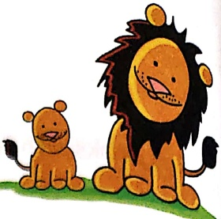

Example: ask - asked - asking

Boil -

Bump

Clean -

Cook -

##### Make/do

1. 'Small', 'tiny', 'little' are all words that show small size.

Make a list of tiny animals and insects.

2. Make a mini book of domestic animals. Paste animals on one side and on the other side write one action of each animal.

3. The cat played with paper, rubber, wool. Feel different objects in a bag (without looking) and say what they feel like (wood, silk, cotton, plastic, metal, leather, stone, cardboard).

Example: I can feel something soft. I think it is a scarf. It must be made of silk.

##### Phonics

1.  $ \underline{\text{Reading Practice:}} $

pin, ice, dish, fix, lie, tight, dice, fire

2. 'Q' needs a' u': /kw/ sounds

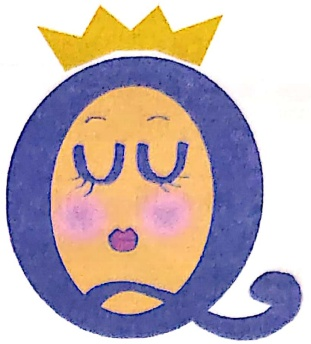

'Q' is a queen. She goes first.

Her bodyguard 'u' always goes after her.

The  $ \underline{queen} $ saw a rat. She let out a s $ \underline{que} $ak and a s $ \underline{que} $al.

Underline the 'qu' in these words and say them aloud.

Quack, queer, question, quest, quill, quote, squawk

## 3.  $ \underline{\text{Read aloud}} $ : Magic e and the letter "i"

Hear the letter name in the sound of 'i' when the word ends in the letter 'e'

Say h $ \underline{i} $d, say h $ \underline{i} $de

Say r $ \underline{i} $d, say ride

Say n $ \underline{i} $l, say n $ \underline{i} $le

Read more of "i" words with the magic e

dice, lice, mice, nice, rice

bike, hike, like, mike, pike, spike

bide, hide, slide, snide, tide, wide

bile, file, mile, nile, pile, tile

chime, dime, lime, mime, time

dive, five, give, hive, jive, live

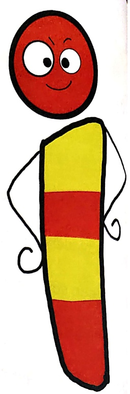

#### Shared Oral Story

Do an oral alphabet story with the teacher in class.

#### Squeak The Cat

Squeak the cat likes to A- attack, B- bound, C- catch, D- dodge

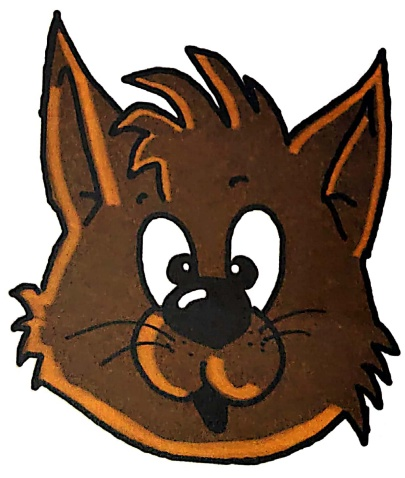

#### Mr. Phil Falls III

r. Phil is in bed and very ill.

e looks dull and pale.

lis body is full of pain.

says he has the chills.

w could Mr. Phil fall ill?

; eats well, and does his drill.

. Small is not very tall.

looks at Mr. Phil's mouth.

looks at Mr. Phil's tongue.

I have caught a bug.

I you eat street food?" asks Dr. Small.

ite a pie in a stall at the mall, that's all!

I can that make me ill? " says Mr. Phil.

ell, it did do that," says Dr. Small.

I'll take this red pill and this blue one.

nk a full jug of water each day

you will be well Mr. Phil.

##### Questions

Say and write

1. What was wrong with Mr. Phil?

He was _____.

2. Underline three things in the lesson that tell us Mr. Phil was ill

3. Tick the right answer.

Mr. Phil fell ill because:

a) He was not eating well.

b) He ate a pie at a stall.

c) He forgot to do his drill

d) He went to the mall.

4. Doctor Small looked at Mr. Phil's _____ and Mr. Phil's _____.

5. Dr. Small gave Mr. Phil two pills one was _____ and the other was _____.

6. How much water should Mr. Phil drink each day?

7. In pairs, act as Dr. Small and Mr. Phil using their words.

##### Skills

 $ \underline{\text{Look, choose, write and share}} $

picture description

Describe any one of the two people in the pictures by choosing from the box as many words as you can.

Thin, fat, old, young, small, big, tired, smart, well-dressed, neat, tall, short, grey-haired, simple, dark, fair, has thick hair, is bald, has a beard, small eyes, big nose, thick lips, thin lips, wears a hat, wears glasses, has a mole

## Discussion

Street food and stomach bugs.

##### Language

1.  $ \underline{\text{Look, say and write}} $

Choose words from the box below and write the names of Mr. Phil's body parts. Use the words given below to fill the boxes on the opposite page.

head, hair, face, forehead, eyebrow, eye, ear, cheek, lips, chin, neck, chest, shoulder, forearm, hip, elbow, wrist, fingers, leg, thigh, calf, ankle, knee, feet, toes

2.  $ \underline{\text{Think, say and write}} $

I end with -ull, -ell, -ill, or - all. What am I?

a) I am made of bone. I protect your brain.

sk_____.

b)I have to be wiped if I create a mess.

sp_____.

c)I am high and made of bricks. I keep out thieves.

I am a w____.

d) I am used in fights. I am the male of a cow.

I am a b____.

f)I come out of garbage. I am a bad sm____.

## 3.  $ \underline{\text{Think, Say and Write}} $

All the words you need to fill these blanks can be found in the lesson.

I am thirsty. I need a  $ \underline{dr} $____.

The  $ \underline{st} $____ is very dusty, even the leaves of the trees are brown.

The robber was  $ \underline{c} $____ by the police.

There is no  $ \underline{w} $____ in the tap.

Open your  $ \underline{m} $____ said the dentist. We taste with our  $ \underline{t} $____

##### Phonics

1.  $ \underline{\text{Reading practice}} $:

Beat, bike, bake, boat, sink, soak, seat, safe

2.  $ \underline{\text{Find and say aloud}} $

Underline all the -all, -ell, -ull, and -ill words in the lesson.

The -all words in red.

The -ell words in blue.

The -ull words in purple.

The -ill words in green.

##### Punctuate

Use capital letters and a full stop.

mr phil is now well and dr small is happy

## 7. Calendar Poems

Thirty days has September

Thirty days has September,

April, June, and November.

All the rest have thirty one,

Except February,

Which has twenty eight,

Till a leap year gives it one day more.

##### Questions

Think, say and do

1. Underline the months that have 31 days:

January, February, March, April, May, June, July, August, September, October, November, December.

2. Did you know a leap year comes once in 4 years?

##### Read this poem

Monday's Child Is Fair Of Face

Monday's child is fair of face.

Tuesday's child is full of grace.

Wednesday's child has no foe.

Thursday's child has far to go.

Friday's child is loving and giving.

Saturday's child works hard for a living.

And a child that's born on Sunday,

warm and bright like a sunny ray.

##### question

nd and share

nd out what day of the week you were born.

##### ionics

ading practice

ne, pine, shape, bone, cute, beat, pen, paper, pencil

## 8. Jack and the Bean Stalk

There was a young boy called Jack.

He lived with his mother in a shack.

They did not own much and were poor.

They did have an old brown cow.

It stopped giving any milk.

So mother said, 'let us sell this old cow.

Jack frowned and said, "How can we sell our

Mother scowled.

So Jack walked slowly to town.

To sell the old brown cow.

He found a thin man with his hat over his bro

who showed Jack five small beans to sow.

The beans are magic vowed the man.

They will grow into a big strong tree!

"Wow," said Jack and sold the cow for the beans.

Jack's mother said "You are late. Where have you been?

When Jack told her he had sold the cow for beans, she was very cross.

"I have never seen such a foolish boy!" she growled. She threw the beans out of the window, and Jack had to sleep without any meal!

The next day his room was in shadow of a thick bean stalk that had grown in the night. What a sight it was! Jack climbed up the tall bean stalk and saw a large giant with a crown sitting at the table. He was counting a stack of money. Under the table was a sack of gold. Jack saw that the sack was his father's. He knew that the giant had stolen the gold. He hid from the big giant and waited for him to fall asleep. Jack crept up to the gold, took it, and ran down the tree.

The giant woke up and ran after him.

Jack ran faster and got to the ground.

Clever Jack showed everyone his father's sack.

The giant was taken away by the giant police.

Mother and Jack are now rich.

They proudly own a big house in town.

##### Questions

Say and write

1. Put in the right order.

Write the letters of

the new order in the space below.

a) Jack ran down the tree with the gold

b) The beans grew into a tall tree.

c) Jack sold his cow for beans.

d) Jack saw a big giant on top of the tree.

The right order is: ___, ___, ___.

2. Why did Jack have to sleep without?

3. How do we know that the beans were magical?

4. How did Jack know the gold was his?

5. What happened to the giant in the end?

6. What happened to Jack in the end?

7. If they had not sold the cow, what could

Jack and his mother have done for money?

8. What if the giant had caught Jack?

9. Act out the story in class.

10. Underline the adjectives.

##### Language

1.  $ \underline{\text{Read, find, choose and do}} $

Find and underline the following opposite words in the lesson. Big, clever, up, young, thin, small, woke, foolish, old, down, thick, asleep

Fill in the blanks in each sentence with a pair of opposites from the words given above. Use each word only once.

a) The giant was very ____ and Jack was very ____ ____.

b) This tree has a ___ trunk but its branches are very ___.

c) My grandfather is very ___ and I am very ___.

d) When I _____ up in the morning,

my baby sister was still a _____

e) The man went ___ the tree and came ___ with a mango.

f) The _____ crow felt silly because he lost his cheese to the _____ wolf.

##### Phonics

1.  $ \underline{\text{Read, say and listen}} $

Read aloud: ea/ee sounds

Do they make the same sound?

Story words: Been, meal, tree, sleep, bean, seen

2.  $ \underline{\text{Say, listen, think and do}} $

Read aloud: Ow sound

Say 'grow', say 'cow'.

Is the sound of 'ow' the same?

Say aloud the words given below and colour them by their sound.

Colour the word red if the sound is 'ow' as in 'grow'

Colour the word in blue if the sound is 'ow' as in 'cow'

Brown, cow, now, scowled, frowned, brow, sow, vowed, grow,

wow, window, shadow, crown, down, own, throw, know, crow,

crowd, bow, bowed, row, slow

3.  $ \underline{\text{Say and listen}} $

Read aloud: ou sounds

Found, house, proud, ground, loud, sound, mouse, bound, cloud

4.  $ \underline{\text{Find, say and do}} $

In small groups pick out the Br, gr, tr, pr, fr, cr words from the lesson.

Write one more word that begins with these words in your

notebooks.

Example: br: brown, brave

5.  $ \underline{\text{Say, listen and do}} $

Read aloud: -ack words

Jack stack sack shack

Make two more words ending in -ack.

6.  $ \underline{\text{Say, listen and do}} $

Read aloud: -old words

gold sold told

Make two more words ending in -old.

7.  $ \underline{\text{Say, listen, think and choose}} $

Read aloud: th words

Say '  $ \underline{\text{the}} $ ' , say '  $ \underline{\text{thin}} $ ' .

Is the 'th' sound in both these words the same?

Say aloud the words given below.

Write them in the correct list in the table according to their sound.

th words: they, thick, thank, then, that, threw, with, thumb, this, there, path, bath, brother, thirsty

[Table 6](tables/table_006.html)

8.  $ \underline{\text{Read, listen, and think}} $

Read aloud : j and g sounds

Say 'Jack' and say 'giant'.

Is the sound of 'j' and 'g' the same?

Say gum, say gem

Read aloud: hard and soft 'g' sounds

Soft 'g' makes a sound like 'j'

Hard 'g' : Give, grow, growled, gold, got, ground

Goat, goose, gun, gum, green, gorilla, garde

Soft 'g' : gym, gentle, ginger, giraffe

## 9. Manu Kaka's Special Pets

Some people have dogs and some have cats.

Some keep fish, and some like parrots for pets.

Manu kaka has odd pets.

He lives in a big house.

It has a large pond at the back.

He has a black alligator that eats fish for snacks.

At home, he keeps four pet tortoises.

One of them is a hundred years old.

They eat green leaves and vegetables.

The elephant eats stacks of sugarcane and coconuts.

In one room Manu kaka has a glass tank full of snakes.

They need a dozen eggs to eat in a day.

When he was younger Manu kaka had a pet tiger

It gave his friends a fright.

He gave it away to the zoo.

Manu kaka says that he is going to get a dinosaur.

My brother says Manu kaka is joking.

#### Questions

 $ \underline{\text{Say and write}} $

1 Draw Manu kaka's house and all the animals in it.

2. Where would you find all these animals together?

3. Which of Manu kaka's two pets are vegetarian?

4. The alligator is in a pond, the snakes are in a glass case, and the elephant is in the courtyard. Where would Manu kaka have kept the tiger?

5. Why does brother think Manu kaka is joking?

6. Underline all the nouns and circle all the adjectives in the

story.

Skills

Read, think and group

Fill in columns with any 3 land animals, water creatures, flying creatures and creepy crawlies you know of.

[Table 7](tables/table_007.html)

Choose a few of these creatures to draw your own zoo.

Writing

 $ \underline{\text{Think and write}} $

If I had a ___(name of a wild animal) as a

pet, I would keep it in a _____. (place name)

I would feed it _____ and _____.

(names of food)

My friends would be ___.

(feeling word) to see it.

They would say that my pet is very ___.

(describing word).

## Discussion

care of pets.

Is it right to cage tigers and snakes?

##### Language

1.  $ \underline{\text{Find and underline}} $

Underline the -ack words in the lesson.

2.  $ \underline{\text{Read, choose and write}} $

Choose words from the box given on the following page and fill in the blanks.

a) We keep money in a ___.

b) They put a stone in the water and it ___.

c) The ceramic box fell down and there was a ___ on it.

d) The dog ___ all the water in its bowl.

e) The ___ of potatoes has been stolen.

f) I played a ___ on my friend on April Fool's Day.

g) The donkey was given a ___ by his cruel master

Prank, crack, smack, sack, plank, track, bank, frank, sank, drank, stank

3.  $ \underline{\text{Think and find}} $

Find words in the text that sound like these words:

carrot - _____

mouse - _____

fig - ___

light - _____

too - ___

4.  $ \underline{\text{Read, think and match}} $

Match the names of the animals to their homes.

[Table 8](tables/table_008.html)

5. Read, choose, write

Advertise a pet shop. Cut and stick animal pictures.

Write something about the animals.

Choose words from the box to help you write your advertisement.

best, buy me, loveable, cute, big, small, furry,

soft, clever, active, faithful, loving

## 6.  $ \underline{\text{Think and write}} $

Make as many small words as you can with any one of these words.

Alligator. Elephant. Tortoise. Dinosaur.

7.  $ \underline{\text{Read and write}} $

Add: -ed and -ing endings to these words. Make oral sentences with these new words. Example: Call - called - calling

End -

Dust -

Fill

## 10. GRANDPA'S GLASSES

Grandpa wanted to read the newspaper.

He settled down in his armchair.

He took the morning paper onto his lap.

He looked for his reading glasses on the table.

They were not there.

He looked under the table.

They were not there.

He went to his bedroom and searched.

They were not on the bed or in the cupboard.

They were not on top of the shelf.

"Oh where could they be," wondered grandpa.

He called out to grandma.

"Have you seen my glasses?" he asked her.

Grandma came to the room to search.

She looked at grandpa and laughed.

"They are on top of your head," she said.

He had pushed his reading glasses on top of his head.

Grandpa laughed too.

#### Questions

Say and write

1. Why did grandpa look for his reading glasses?

2. Name the places grandpa looked to find his glasses?

3. Why did grandma laugh?

What would she be thinking?

4. Why did grandpa laugh?

What would he be thinking?

5. Have you forgotten anything and searched for it? Talk about it to the class.

##### Language

1.  $ \underline{\text{Think and write}} $

a) Words that stand for other words.

i) Grandpa looked for his reading glasses.

 $ \underline{He} $ could not find them.

The underlined  $ \underline{he} $ stands for 'grandpa'.

ii) Grandpa looked for his reading glasses.

 $ \underline{\text{They}} $ were not on the cupboard.

The underlined word  $ \underline{they} $ stands for 'glasses'

b) Underline the words that stand for 'grandma' in the story.

c) In two of the sentences given below remove the repeated word 'Sanjay' and write a word to stand in their place.

Sanjay is a teacher.

Sanjay is a tall man.

Sanjay has two children.

2.  $ \underline{\text{Read,choose and write}} $

Choose the right word from the bracket and fill in the blanks.

a) I  $ \underline{look} $ for grandpa's glasses (look/looks)

b) Sudha ___ too. (look/looks)

c) Mala and Maya _____ too. (look/looks)

d) You must also ___ for them. (look/looks)

e) We all _____ for them. (look/looks)

f) Only the dog does not _____ for grandpa's glasses. (look/looks)

##### phonics

1.  $ \underline{\text{Read aloud and underline}} $

Underline all words beginning with sh in blue.

Underline all words ending in -sh words in red.

a) They just shut the shop that has shirts of all shades on the shelf.

b) She sells shells of all shapes on the shore where waves splash.

c) In a flash, the car went "crash" into a bush and we heard the windows smash.

d) Take out the trash and I will give you some cash to have a bash.

e) Sharks are big fish that show shockingly sharp teeth

f) Stand in a queue. Don't shout, don't shove, don't be short tempered, don't crush other children.

2.  $ \underline{\text{Think and write}} $

Fill in the blanks with words beginning with 'sh'

a) I am an animal. I have wool on my back. I am a _____.

b) I go on water. I take people to many lands. I am a _____.

c) I am worn on the feet. Sometimes I pinch. I am a

Make your own riddles with sh words

3.  $ \underline{\text{Read aloud and underline}} $

Underline words that begin with ch- in red, and those that end in -ch in blue.

chip, chap, cheap, chirp, child, change, chess, chase, chew, chop, such, march, teacher, chat, chalk, cheat, cheese, chime, match, hatch, rich, beach, chubby, chilly, chef, chief, cherry, choose, catch, batch,

punch, bunch, lunch, each, chair, chain, chick, chimney, chin, china, church, chocolate, chipmunk, chimp, cheetah, cheese, cheek

4. Think and write

Fill in the blanks with ch words

a) We play in the sand when we go to the ___.

b) We had rice and dhal for _____.

c) Teacher writes on the black board with ___.

Make your own fill in the blanks with ch words.

##### Punctuate

but capital letters and full stops in this sentence.

aya and ram looked for grandpas glasses

## 11. Ryan's Room

Ryan's room is a big mess.

There are clothes on the bed.

His toys are all over the floor.

A plate with crumbs of cake is on the table.

His books are open on the carpet.

Ryan's mother is not pleased with him.

She says, "Look at the mess. Clean it up".

Ryan put the books in the bookshelf.

He put away the toys into the toy box.

He put the plate into the kitchen sink.

He folded his clothes and put them in the cupboard.

The room was soon glowing.

Ryan's mother is very pleased now.

"You are a good boy," she says

I will take you to the circus."

#### Questions

say and write

1. List four things that show Ryan's room is in a mess.

2. What made Ryan's mother happy?

3. It would be easy to clean Ryan's room. Yes/No _____

4. Ryan was taken to the ___ as reward for cleaning his room.

5. What reward do you get for being good?

6. Are you like Ryan or different from him?

## Discussion:

Bad habits

##### Language:

1.  $ \underline{\text{Think, say and learn}} $

Explaining: using because.....

Why is your room so messy?

....because I forgot to clean it

Why are you late to school?

Why are you wearing black shoes?

Why do you want water?

## 2.  $ \underline{\text{Think and match}} $

Read and match these objects to where they are kept

[Table 9](tables/table_009.html)

##### Phonics:

## 1.  $ \underline{\text{Think and write}} $

In groups, think of as many words as you can that rhyme with:

fold, mess, floor, book, sink, box, toy, room, good.

## 2.  $ \underline{\text{Read, think and make words}} $

Look at the grid given below and make words.

One is done for you.

[Table 10](tables/table_010.html)

## 3.  $ \underline{\text{Read, think and choose}} $

Odd one out

Circle the word that does not begin with the same sound.

Cake, crumbs, clothes, carpet, circus, clean, cupboard

##### Language

3.  $ \underline{\text{Read, think and write}} $

Position words:

Look at this picture and fill in the blanks

Ryan's shoes are _____ the bed.

Ryan's books are_____ the first shelf

Ryan's toys are_____ the books.

Ryan's clothes are_____ the cupboard.

4. Use this picture for counting and naming objects.

## 12. My New Squeaky Shoes

My shoes are new and squeaky shoes.

They are very shiny, creaky shoes.

I wish I had my leaky shoes

That mummy threw away.

I liked my old brown leaky shoes

Much better than these squeaky shoes

I've got to wear today.

Say and write

##### Questions

1. Why does the writer like his old brown leaky shoes?

2. What happened to the old shoes?

3. Why are the old shoes called 'leaky'?

##### Language

1.  $ \underline{\text{Think and write}} $

Give group names for the words in each sentence.

One is done for you.

a) Shoes, slippers, sandals, trainers.

Group name:  $ \underline{\text{footwear}} $

b) Shirt, top, frock, coat, T-shirt, trousers, pants.

Group name: _____

c) earrings, chains, rings, necklace, nose-ring

Group name: ___

2.  $ \underline{\text{Choose and write}} $

Choose from words given above.

Write a description by filling in the blanks.

Akshay wore a striped_____ and silk _____ .

In his left ear he had a ___.

On his feet he wore fashionable ___.

3.  $ \underline{\text{Think, choose and write}} $

Fill in the blanks with words ending with -ple/-ble.

Use the meaning of the word in the brackets for help.

a) My mother packed an _____ for my lunch (name of fruit)

b) I could not hear what she said because she

(speak under breath)

c) The boy tripped on a stone and _____ (lost balance)

d) He is a rich man but he is _____ (not proud)

e) The queen wore a ___ dress. (not dressy)

4.  $ \underline{\text{Think and write}} $

Fill in the blanks with words beginning in the letters given in red

a) Let us go to sw_____ in the river.

b) There was sn_____ on top of the mountain.

c) Sonu looks sm_____ in his new shirt.

d). Don't sl_____ and fall on the wet floor.

e) West_____ at the red light.

f) My top sp_____ very fast.

Write one more word that begins with sw, sn, sm, sl, st and sp

5.  $ \underline{\text{Read, think and say}} $

Look at the given example with your class.

Try to do the same with the given words.

Example:

Run - running - ran

Sing - singing - sang

Bring, say, come, go

Sit, make, take, break, have

Do, buy, begin, build, eat

##### Phonics

 $ \underline{\text{Read aloud and listen}} $

Umbrella, unicorn, under, truck, fish, blue, name, train, road, load, boat, bone, truck, stick, drum, door, cube, blue, boom

##### Speaking

I like.....

I dislike.....

I prefer.....

## 13. Copyright the Fireflies

Gopi had gone to visit grandma.

It was a very pleasant night, a gentle breeze was blowing.

He saw many little lights outside his window:

They floated like golden stars in the darkness.

He wore his black woollen jumper and went out.

He could hear the croak of frogs, the chirp of crickets, and the sound of drums.

He went to catch the green and gold flying lights but they moved away.

He ran around jumping up, and down, to catch one light.

Grandma came out and laughed.

"Those are fireflies," she said.

"They glow and so they are called 'glow worms' too.

Other night animals do not try to prey on  $ \underline{\text{them}} $ because they glow bright.

You can catch them in a jar to look at them.

Then you must let them go.

That is the right thing to do."

Gopi brought a glass jar and a few flew into the jar.

He closed the jar lightly.

He enjoyed looking at them.

Then he gently let them out and let them fly away

One by one, until there were none left.

##### Questions

#####  $ \underline{\text{Say and write}} $

1. What was the colour of Gopi's jumper?

2. At what time do firelies fly around?

3. What is another name for fireflies?

4. Why do fire flies glow in the dark?

5. Why did Gopi let the fireflies out of the jar?

Art

Add some gold sparkles to the picture on this page.

## Discussion

An experience you have had with your grandma or grandpa.

skills

Think and do

a) Class chart of night creatures.

List creatures of the night to make a class chart.

b) Make Gopi's Jar.

Take a black chart paper and draw the night sky with the moon and stars. Draw a big jar in the centre. Make glow worms with gold paper to stick inside the jar.

##### Language

1.  $ \underline{\text{Choose and write}} $

Choose the right word from the brackets.

a) The bird is _____ to its nest. (Fly/ flying/ flew)

b) Birds _____ in the air. (Fly/ flying/ flew)

c) The birds _____ away when we went up to them. (Fly/ flying/ flew)

d) They have ___ to see grandma. (Go / going / gone)

e) We are ___ to the park. (Go / going / gone)

f) May I ___ home now? (Go / going / gone)

2.  $ \underline{\text{Think and write}} $

Arrange these words in order of size: small to big

Few, one, none, many

3.  $ \underline{\text{Find and underline}} $

Underline all the things you can find in the story.

A naming word is called a noun.

All things are nouns.

##### Guided writing

1.  $ \underline{\text{Read, choose and write}} $

Describe what you saw when you looked out of the window.

Use the words in the brackets to help you.

Sound and action words can be acted out in class first.

a) When I looked out of the window I saw a

_____ (colourful, bright, shiny,

glittering, sparkling) _____

(name of thing).

b) It made a ___ sound (squeaky, clear, sweet, soft, high, low, roaring, hissing, loud, booming) when it cried out.

c) It began to _____(crawl, creep, sneak, tiptoe) forward.

d) Then it began to _____(bounce, dash, gallop, hurry, race, ram, run, rush, speed, spin, spring, zip, zoom) towards me.

##### Phonics

1.  $ \underline{\text{Read and listen}} $

grandma, green, brought, bright, breeze, frog, croak crickets, drums.

Make one more word beginning with:

gr, br, fr, cr and dr

## 2.  $ \underline{\text{Read and make words}} $

Make words beginning with bl, cl, fl, gl, pl, sl

[Table 11](tables/table_011.html)

## 14. Shopping at the Food Mall

Aunt Bina took us to the food mall.

Each of us had some money to spend on food.

Hamida bought a large bar of chocolate.

feroz bought a bag of chips.

I bought a tasty puff pastry.

Maria bought a jar of mango jam.

Hari bought a slice of pizza.

Charles bought a delicious strawberry tart.

We went back home and shared our food.

We got to eat a bit of everything.

sharing is a clever thing to do.

##### Questions

Say and write

1. Where did the children buy food from?

2. Who bought something that was not sweet?

3. Which of the foods is made?

4. Which of the foods are made from fruits?

5. Why is it clever to share?

Skills

This chart is shaped like a pie. It is divided into 4 parts: morning, afternoon, evening and night.

In each quarter write what you ate yesterday.

A good diet has vegetables, milk, grains, fruits, nuts, snack food, meats and water.

How many items that you ate yesterday were healthy?

##### Language

## 1.  $ \underline{\text{Think and say}} $

Think of words that rhyme with these words:

jam, tart, food, chips, slice, bag.

choose from the words in the box to fill the blanks.

you can only choose each word once.

A $ \underline{bar} $ of chocolate

Abag of chips

 $ \underline{\text{A slice}} $ of pizza

A ___ of soup

A ___ of rice

A ___ of cookies

A ___ of flowers

A ___ of fruits

basket, bunch, plate, batch,

bowl

## 3.  $ \underline{\text{Think and write}} $

Aunt Bina did some shopping at the mall.

Write the food items in the column to match their tastes in the

given table. The first one is done for you.

[Table 12](tables/table_012.html)

#### Aunt Bina's shopping

coffee, banana, jam, chaat, gulab jamun, soup, tea, cashewnuts, grapes, neem juice, mango, chocolate

4.  $ \underline{\text{Think and create}} $

Advertise a car

Cut a picture of a car and stick in your notebook.

Add words to your advertisement.

Words to help you:

Fast, cheap, best, classy, sleek, roomy, luxury

3. Look at the house given to you and name as many rooms as you can in it.

Look

phonics:

1. Read wh- words

What, where, why, when, whether

Choose the right wh- word and fill in the blanks.

a) _____ is your name?

b) _____ do you live?

c) _____ is your birthday?

d) _____ are you late?

2.  $ \underline{\text{Say and learn}} $

Oral structure practice: Make as many wh- questions as you can.

Why is the sky blue? Why is.....

Where are your toys? Where are.....

When did you come here? When did.....

What is the meaning of 'brave'? What is .....

3.  $ \underline{\text{Read, say and listen}} $

Magic e and the letter 'o'

Hear the letter name in the sound of 'o' when the word ends in the letter e

Say 'r $ \underline{o} $d', say 'r $ \underline{o} $de'

Say f $ \underline{or} $, say f $ \underline{ore} $

Say c $ \underline{o} $n, say c $ \underline{o} $ne

 $ \underline{\text{Read more 'o' words with the magic e}} $

Ose - dose, hose, lose, nose, pose, rose

ole - cole, hole, mole, pole, role, sole

oke- coke, joke, poke, woke

ore-bore, core, gore, more, sore, tore, wore

bone, cone, lone, tone

BUT these are different sounds. Read and find out.

one, come, done, gone, none, dove, love, move

### oral story

read, choose and do

groups, make an oral story to share.

choose the people for your story.

joy, girl, magician, robber, police, pilot.

choose the place for your story.

big house, a farm, a castle, a beach.

Choose the problem in your story.

|fight, a robbery, someone is hurt, something is lost

Find a solution for the problem.

##### unctuate

1other bought rice dhal bread and oil at patel store

## 15. The Vegetable Basket

Bindu didi brings vegetables in a large basket.

She has tomatoes and onions and potatoes to sell.

There are greens and beans and cabbage,

cauliflower and carrots and cucumbers,

peas and radish and capsicum.

So colourful and so healthy.

The broccoli looks like little trees in a forest.

The lady fingers are pointed but not sharp.

The bitter gourd reminds me of a bumpy crocodile.

The pumpkins are smooth, plump and yellow.

Some vegetables like drumsticks and snake gourds are

long, others like yams and beets are caked in mud.

Some vegetables can be eaten raw.

Most need their skins removed before they are cooked.

I think vegetables are good to look at,

but not much fun to eat.

Mother says that we grow big and strong,

if we eat all our vegetables!

I say that to myself, when I eat my vegetables.

(Bring vegetables to class for naming)

#### Questions

 $ \underline{\text{say and write}} $

1. Two vegetables starting with the letter 'c'.

They are _____ and _____

2. Two vegetables that are long.

3. ___ looks like a forest of trees.

4. Why do beets and yams need to be cleaned well?

5. Which vegetables can be eaten raw?

6. Complete orally: Children should eat vegetables because.....

7. Say which vegetables you like best and which ones you dislike.

8. Draw and colour a vegetable.

The Vegetable song

(tune: Mary had a little lamb)

We are  $ \underline{\text{pumpkins}} $,  $ \underline{\text{big}} $ and  $ \underline{\text{round}} $,

Big and round, big and round.

We are pumpkins, big and round,

Seated on the ground.

We are string beans green and fine....growing on a vine.

We are onions pink and white....we make soup taste right.

We are carrots, orange and long...help us sing the song.

We are cabbages green or red....see our funny head.

We are corn stalks tall and straight...don't we just taste great!

### language

choose and write

choose one right word from the bracket to fill in the blanks.

a) ———— mangoes are sweet.( this/ those)

b) Take _____ blanket. (this / these)

c) See ___ boys there, they are lost. (these /those)

2.  $ \underline{\text{Make many words from one}} $

VEGETABLE or CAULIFLOWER

##### Phonics

Read aloud and listen: ea words

meat, heat, seat, beat

meal, deal, heal, seat

ear, fear, hear, near

bear, pear, tear, wear

##### Punctuate

Use capital letters, commas and full stop.

the fruit shop has apples mangoes strawberries

melons and bananas

## 16. Eve and Steve

How are you?

Thank you' and ' please'

Were best friends

Of a boy called Steve.

But his naughty sister

Who was called Eve

Would yawn, burp

And loudly sneeze.

Discussion

Good manners

##### Language

Make new words

Look at these examples with your class.

Examples:

Get-getting-got

Put - putting - put

Make new words as done in the example with the following words:

Find, fly, keep, know

leave, meet, pay, put

cut, see, sell, send,

speak, tell, think, bite,

blow, catch

## 17. and Friends

(Listen and read after the teacher)

spidy spider had no friends. The other bugs did not like the way he looked. His thin long arms gave them a big scare. When he called out to them they would either fly away or go under the earth. Besides, they had heard stories. Besides, they had heard stories of spiders who trapped insects in their webs.

Spidy did not belong to the sky or to the earth. His home was somewhere in between, on a strange looking web. He hung on that web that was not even part of a tree. So the other bugs did not like him.

However, Spidy was not like other spiders. The webs he spun were slippery but very safe. No insect would get trapped in them.

Each day he watched ladybugs, worms, flies, grasshoppers, wasps, ants, centipedes, bees and butterflies playing in the forest. No one came near him.

Then he had an idea. One day he made a web across two trees and made it look like a hammock. He spun another web across three trees and it became a trampoline. He put out two long strings on a single branch and made a strong web for the seat of a swing. He then began rocking on the hammock and bouncing on the trampoline and swinging on the swing. Wheeeeeeeeeeee.....

The other bugs were so happy to see so many playthings.

They thought Spidy was smart. They forgot to be afraid

of Spidy and joined in the fun. All the insects had a

wonderful time. After that Spidy was never without

friends. His slippery webs made him very popular.

#### Questions

say and write

Draw lines to match the pictures to the names of the insects.

Grasshopper

Worm

Butterfly

Honey Bee

Ant

Centipede

Wasp

Lady Bug

2. Orally, in complete sentences, give 2 reasons why the other bugs did not like Spidy.

3. How did Spidy become popular?

4. Underline and mark any 8 nouns (N) and any 4 adjectives (A).

##### Skills

## 1.  $ \underline{\text{Make and create}} $

Design a thank you card for Spidy from the animals for the wonderful time they had.

## 2.  $ \underline{\text{Think and write}} $

Draw lines to match the columns to show cause and effect.

The first one is done for you.

[Table 13](tables/table_013.html)

## 3.  $ \underline{\text{Make new words with endings}} $

Add -ed and -ing endings to these words:

join, jump, kick, knock

## 4.  $ \underline{\text{Combine letters and endings}} $

Choose a single letter or two letters from the first column and make words with -ash, -ish or -ush.

[Table 14](tables/table_014.html)

##### Phonics

1.  $ \underline{\text{Read aloud and listen}} $

sp, st, sw, sl, sm words

Spider, spin, stay, strong, stories, smart, smile, slim, slide, slippery, swim, swing,

2.  $ \underline{\text{Read, say and listen}} $

Magic e and the letter 'u'

Hear the letter name in the sound of 'u' when the word ends in

the letter e

Say c $ \underline{u} $t, say c $ \underline{u} $te

Say  $ \underline{u} $s, say  $ \underline{u} $se

Say c $ \underline{u} $b, say c $ \underline{u} $be

 $ \underline{\text{Read more}} $ 'u' words with magic e

fuse, june, tune, tube, mule, fume

##### Speaking

I'm good at.....

I'd like to learn.....

I want to be.....

## 18. Ella the Elephant

listen and read after the teacher

When Ella was a baby elephant she would forget to eat because she loved to play. Her mother thought she was just being playful. But Ella had a problem. She could not remember.

she had many friends in the forest. The monkey Bholu, the giraffe Lamboo, the panther Panna, the fox Fakira, the many birds and even the little ants were her friends. She could not remember their names and so she called the monkey 'Lamboo' and the panther 'Fakira'. Oh dear! She was very gentle with them and they loved her very much.

Sometimes she could not remember where she was going, so she would go to the wrong forest. The big lions would chase her away.

Sometimes her mother would ask her to fetch coconuts and she would come back without anything in her trunk. Her special friend was the crocodile called Kirit. She never forgot his name. One day, after her mum had scolded her for squashing some fruit by sitting on them, she shed large elephant tears. "I am so sick of being forgetful," she said to Kirit.

"I think I know what you can do," said Kirit. "I have seen my old friend the cheetah do it. You should put a knot on your tail. Then you will remember that you have forgotten something. Think hard, and you will remember what it is."

From that day onwards Ella could be seen with a knot on her tail and sometimes two or three knots to remind her of many things. But the names of her friends were still all mixed up. "Oh well," she said, "I am not good with names, but I never forget a face."

### Questions

say and write

1. What was Ella's problem?

2. Who helped Ella?

3. What did he ask her to do?

4. Choose the word you would NOT use to describe Ella.

Gentle, forgetful, loving, friendly, foolish, playful

Discussion

Helping friends

Language

1.  $ \underline{\text{Choose and write}} $

Fill in the blanks using one word from the bracket.

a) Sheela and Meena are friends. _____ go to the same school. (We/They)

b) Roshni is a doctor. ___ lives in India. (He /She)

c) The plate is broken. ___ must have fallen down. (She/It)

2.  $ \underline{\text{Make new words}} $

Add -ed and -ing endings to these words.

miss -

lick -

mark -

##### Phonics

1.  $ \underline{\text{Read aloud, listen and choose}} $

-oar, -oor, -ork words

In each line circle the words that do not rhyme.

oar: boar, soar, roar

oor: poor, door, floor

ork: cork, fork, lord, stork, work

or: doctor, nor, actor, world

orr: sorry, lorry, worry

## 2. Read aloud and listen

Make sentences with these -ould /-ood words

Do they make the same sound?

Would, could, should

Wood, good, stood, hood

Do the words 'food' and 'mood' sound the same as the other -ood words above?

## 3.  $ \underline{\text{Make and read}} $

Make words ending with the magic e and read them aloud.

[Table 15](tables/table_015.html)

## 19. I talk, I walk

[Table 16](tables/table_016.html)

##### Language

1.  $ \underline{\text{Doing words}} $

Doing words are called 'verbs'

1. Make the sounds in the poem 'I talk'.

2. Act out the actions in the poem 'I walk'.

3. Combine and act out a pair of sounds and actions of your choice.

Example: bounce and coo; creep and howl

## 2.  $ \underline{\text{Read, think and say}} $

look at these examples with your class.

Example:

Do-doing - did

Say-saying - said

Help the class do the same with the given words

Dig, draw, drink, fall, feel

Fight, grow, hear, hide, hit

Hold, let, lose, read, ride

Ring, sleep, tear, write, win

Wore, wake

##### Phonics

##### Revision of sounds

Make one word using each ending given in the box.

Do not use the words given in the poems above.

[Table 17](tables/table_017.html)

See you all

in grade 2

NOTES:

Explore Possibilities With

## Environmental Studies

Grade 1, Course Book 1

## Contents

1. All About Me 1-10

2. My Amazing Body 11-20

3. I Love My Family 21-28

4. Home Sweet Home 29-38

5. My School

6. Plants Around Us

7. Animals Around Us 59-66

8. The Food We Eat 67-74

##### In this book

##### Look out for these...

[Table 18](tables/table_018.html)

#### ALL ABOUT ME

Hello friends! You all know about me. Who are you? Tell me something about yourself.

Introducing myself

My different moods

What I like/What I don't like?

How am I unique?

INTRODUCING MYSELF

Paste your

passport

size

picture

My name is

Adulto Smukla

I am a girl

○ boy

I am

My birthday is on

Date

Month

2023.10.27

I am in class

I study in

School.

My father's name is

My mother's name is

I live in _____(city/town).

My

address is

My blood group is

Phone number of my parent /guardian is ___

What are the different names that people call you by?

What is the meaning of your name?

##### WISDOM BOX

An identity card has all information about us, like our name, address and guardian's phone numbers. An identity card tells others who we are. It is very important for our safety and we should wear it to school every day.

# WHAT I LIKE/WHAT I DON'T LIKE?

I like to play football and read books.

I like to paint pictures and fly kites.

LET'S HAVE FUN

1. We want to know your likes. Draw and write what you like, to

2. Circle the things you like to do.

Write four other activities that you like to do.

a. Football

dirt

b. bicycle

d. biger

I do not like to see my friends cry.

I do not like to fall sick.

3. Fill in the blanks with what you do not like and also choose the reason.

a.I do not like dirt on  $ \underline{\text{A}} $r  $ \underline{\text{mit}} $  $ \underline{\text{a}} $r  $ \underline{\text{ku}} $k $ \underline{\text{n}} $a because.

○ it looks bad.

○ it smells bad.

○ it makes air and water bad.

b. I do not like to eat  $ \underline{\text{Pomegranate}} $ because,

✓ I do not like how it tastes.

○ I do not like how it looks.

○ I do not like how it smells.

c. I do not like to wear  $ \underline{\text{jeans}} $ because,

✓ I do not like how it looks.

○ I do not feel comfortable in it.

○ I do not like how it looks, but for a change I can wear it someday.

Other things that I do not like

##### MY DIFFERENT MOODS

I am happy, when I come to school.

Then, I dance with joy.

I am sad, when I cannot go out to play.

Then, I enjoy playing an indoor game.

I feel scared, when clouds thunder.

Then, I count from 1 to 10 and I calm down.

I feel angry, when I cannot have extra dessert.

Then, I take a deep breath and remind myself that one should not overeat.

I feel excited, when my grandmother visits me.

Then, I clap and jump with joy.

##### Let us recite this poem.

When I am happy, I laugh and smile.

When I am sad, I sit and cry.

When I am angry, I stamp my feet.

When I am scared, I take a deep breath.

When I am tired, I go to sleep.

In any way, what I feel, I can show it to you.

Do you, also ever feel the same way like I do?

##### HOW AM I UNIQUE?

Let us meet Tina and Meena and find out how they are different from each othe

Meena

Like Tina and Meena, each of us does not look the same. Some of us are tall, while some are short. Some of us have brown hair, while some have black hair. Our likes a dislikes are also different. Thus we all are special and unique.

I am special because

Make a Mood-o-Meter.

O

Mark your changing moods on Mood-o-Meter

everyday for one week.

##### WORD MASTER

information-fact

sick-unwell

mood-feeling

angry-displeasure

scared-afraid, fearful

dessert-sweet dish

excited-thrilled

unique-being the only of its kind, special

##### LET'S TRY

### A. Fill in the blanks using words from the Help-Box.

identity

look

special

same

1. An ___ card has important information about us.

2. Our likes and dislikes are not the ___

3.All of us do not ___ the same.

4. We all are ___ and unique.

B. Draw or paste pictures of your favourite things that are given below.

Food

Animal

Dress

Game

#### LET'S LEARN

### C. Fill in the blanks and draw appropriate emojis.

1. I laugh when ___    
2. I stamp my feet when ___    
3. I take a deep breath when ___

### D. Draw anything which you like and is

##### LET'S MASTER

E. Check the emojis to guess the mood and fill the correct letters to complete to crossword.

F. Answer the following questions.

1. How do you feel on your birthday?

2.How will you feel, if your friend gets hurt?

3. Name three activities that you like to do with your friend.

4. What all details are there on your school identity card?

##### GO BEYOND

Riya went to a place, where people do not have any names. What all problems would Riya face in that place?

##### CONNECTING CORDS

Check your Math

Riya looked at a mirror to see her face.

She counted ___

and ___ 一.

All together, she counted ___ body parts. All unique and special to her.

You are unique and special too. Be happy about how special you are.

#### LIFE SKILL- MANAGING EMOTIONS

What is your choice? Tick the correct option.

When, I am angry I choose to-

○ throw the things around me.

clench my teeth.

○ yell and cry.

☐ not talk to anyone.

Other things, I choose to do.

Making wrong choices, when I am sad or angry is not good for myself and others should take a deep breath and think calmly. The things, I do are (colour the boxes your choice).

Take a deep breath and count up to 20.

Talk to myself about it.

Read a book.

Drink some water.

Think of my favourite things.

Talk to someone about it.

Think about what made me angry.

Another thing that I like to do to calm myself-

Draw what mad

me angry.

We should make the right choice and manage our emotions well.

### FUN WITH FRIENDS

Make a 'Managing My Mood Box', using paper carton. Fill the box with items that help you to calm down and cheer up. These could be colouring books, and crayons, perfumes that smell good or pictures of your favourite things. Think, what all will you put inside the mood box?

#### MY AMAZING BODY

I have always wondered about my body parts. Why do we need different body parts?

Parts of our body

Functions of body parts

The story of our five senses

Taking care of our body parts

People with special needs

##### PARTS OF OUR BODY

##### Our body has many parts.

##### LET'S HAVE FUN

##### Match the body parts with correct names.

Mouth

Ears

Fingers

Toes

Nose

Eyes

Each part of our body does different work. We do many things with our hands.

We can eat.

We can pick things up.

We can hold.

We can write.

We can hold.

We can eat.

We can point with fingers.

Wow, this is great!

We use our arms and shoulders to push, pull and pick up things. Be it a cart, or a folder!

Up and down, and move it all around! Our neck helps move and hold our head round!

We can do many things with our legs.

We can walk.

We can run.

We can jump.

We can do some activities using both hands and legs. We can

crawl

skip

march

swim

stretch

##### THE STORY OF OUR FIVE SENSES

I am the best of all the body parts. People can see the beautiful world around them with my help.

No, I am the best body part. People hear sounds with my help.

Stop it, you both. I help people to smell. They are able to breathe because of me.

You all are wrong, I help people to feel the things. They can tell or feel whether a thing is hot or cold, smooth or rough, because of me. So, I am the most useful body part for them.

Tongue

I help them to taste and speak. We should put it like this - all five of us, together help people to feel the world. That is why, together we are called 'The Five Senses'.

Sense organs make the world so bright and clear.

How wonderful it is to see, feel, smell, taste and hear!

##### WISDOM BOX

Our tongue has taste buds that help us identify or feel different tastes like-sweet, salty, sour and bitter.

What is the taste of the food items shown below?

Help Box

sweet

sour

salty

bitter

TAKING CARE OF OUR BODY PARTS

We must keep our body parts clean to stay healthy.

##### We must-

brush our teeth in the morning, when we wake up and at night before going to bed.

- wash our hands with soap and water before and after eating our meals, after coughing or sneezing and after using the toilet.

• rinse our mouth thoroughly with water after every meal.

• bathe daily with soap and clean water. Then, we must wipe ourselves dry with a clean towel.

wash our hair with shampoo regularly and comb our hair everyday.

trim our nails regularly.

exercise daily. It keeps us fit. Playing outdoor games, running, cycling and swimming are some good exercises.

Games-

Indoor games can be played inside a building.

Outdoor games are played outside, in an open space.

Classify the games here as indoor or outdoor games. Write 'I' for indoor games and 'O' for outdoor games.

##### WISDOM BOX

Breathing deeply anytime during the day helps us to stay healthy.

Being active is important, so is getting some rest. We may get tired after a long day of study, play and chores. We must get eight hours of sleep daily.

If we do not get enough rest, we may fall sick.

We must follow these good habits to stay healthy.

• Eat healthy food and drink plenty of water.

• Do yoga and simple breathing exercises every day.

• Cover our mouth with a handkerchief while sneezing and coughing.

- Cover our nose and mouth with a mask in case we have cough and cold.

• Stay happy and wear a smile on our face always.

• Avoid eating uncovered food.

• Wear mask in crowded places.

• Avoid touching our face.

##### PEOPLE WITH SPECIAL NEEDS AROUND US

Not everyone is able to use their body in the same way like others can.

##### Let us meet Disha and Tom.

I am Disha. I cannot walk. But, I can move and do other work while being seated in my wheel chair.

I am Tom. I cannot see, but my other senses are very strong. By touching and smelling, I can feel things.

We should help and respect everyone around us.

##### WISDOM BOX

Do you know that we can read by the sense of touch?

Braille is a system that enables blind people to read and write by touching. Braille was invented by Louis Braille. It follows a pattern like-

A $\bullet$ R $\bullet\bullet$ r $\bullet$

The Indian 10 rupee coin has ten raised marks to assist us in identifying the currency by the touch sense.

### FUN WITH FRIENDS

Make a simple sensory script like Braille, using paper and a pointed pencil. Close your eyes and feel how a person, who cannot see, can read with the help of a sensory script.

##### WORD MASTER

taste buds- the parts of the tongue which help us to identify, feel different tastes bitter- having a sharp taste rinse- wash with clean water trim- cut neatly chores- daily routine

##### LET'S TRY

### A. Choose the correct option.

1. Our ears help us to _____.

○ see ○ hear ○ talk

2.We smell food with our_____

☐ hands ☐ nose ☐ ears

3. While taking a bath, we should use ___.

○ soap and water ○ a tooth brush ○ a handkerchief

4. Which one of the following activity is done using hands?

☐ holding a ball ☐ running ☐ chewing our food

### B. Write true or false.

1. Breathing exercises keep us healthy.

2. We should not drink enough water.

3. Taste buds help us to taste only sweets.

4. We clean our teeth with a toothbrush.

##### LET'S LEARN

C. Identify the things and match with the correct body parts. Also name the body parts.

D. Read the clues. Think, write the names of the body parts and draw them in the given box.

1. I help you to hold your head up straight.

I am your ___

2. We help you to clap and hold things.

We are your ___

3. We help you to walk and run.

We are your ___

4. We help you to look at artwork.

We are your ___

E. Answer the following questions.

##### LET'S MASTER

1. How does our tongue help us?

2. Ryan went to sleep straight after his dinner. Which activity did he miss?

3. What should we do, when we get tired?

4. What are the different things that you do to keep your body clean? List any two.

F. Complete the following crossword with the names of body parts.

Across-

2.

Down-

1.

5.

3.

4.

##### GO BEYOND

Aryan is listening to music at a high volume. Which of these will he not be able to sense?

○ Puddles on the road in ○ Whether the tea is hot or front of him. cold.

○ His friend calling out his ○ A bug sitting on his hand. name.

##### CONNECTING CORDS

##### Check your English

Write words that rhyme with the names of the given body parts.

1. Chin ___ 2. Hand ___ 3. Toe ___

4. Head ___ 5. Nose ___ 6. Chest ___

##### VALUE FOR ME- RESPECTING ALL

Kayan is on a wheel chair. He is watching your group playing football. He too want to play with you. Your friend Sam decides to stop playing the game and starts, 'Can the Ball' game with him.

This shows your friend is

○ kind ○ unkind

○ honest ○ respectful

○ dishonest ○ friendly

We should always be kind and respectful towards others. We should also think how others feel and help them.

### FUN WITH FRIENDS

1. Dancing is the best exercise for keeping our body healthy. Play your favourite song and enjoy dancing to its tunes.

2. Collect some flowers and make jewellery for different body parts like a garland, a bracelet, a hairband or an anklet.

#### I LOVE MY FAMILY

I feel very happy and safe to be with my family. Why is family important to us?

Types of families

Family fun

Celebrations in a family

Me as a helping hand in my family

#### LET'S HAVE FUN

1. He is my rangd athfer

##### Unscramble the given words and match them with the pictures given below.

3. She is my

other

2. He is my

athfer

5. She is my sitser

4. She is my garnd mtoehr

6. He is my

thbrore

# TYPES OF FAMILIES

We live together in a family. We love and help each other in a family. All families are not the same. Some families are small, while some are big. Let us different types of families.

I am Zoya. This is my family. My father, mother, brother and I live together. We are a small family.

My friend Rishi lives with his mother only. They are a single-parent family. His family is also a small family.

My uncle, aunt and cousins live with my grandparents. They are a big family.

BIG OR SMALL, EACH FAMILY IS SPECIAL.

##### WISDOM BOX

Single-parent families have one parent, either a mother or a father. The parent takes care of the child/children.

My neighbours have a pet. It is a dog. They take good care of their dog. The dog is a part of their family.

I live with my grandparents. They love me a lot. We make a happy family.

##### FAMILY FUN

Our home is the first place of learning. We learn a lot of things from our family members. They help us in growing up as a good person. Most of the members of a family share a common last name after the first name called surname.

##### LET'S HAVE FUN

What is your surname? ___

How many members in your family share the same surname? ___

How many letters are there in your surname?

Family members have food together.

They go for picnics.

They cook together.

They play games together.

They visit relatives.

Members of a family share their happiness and sorrows with each other. They support each other in good and bad times.

##### LET'S HAVE FUN

Circle the boxes showing activities that you and your family do together.

Play games

Meet relatives

Watch TV

Celebrate birthday

Pray

Go for picnic

Have food together

Gardening

CELEBRATIONS IN A FAMILY

Family members celebrate happy occasions together. They celebrate birthdays, weddings and housewarming parties together.

They also celebrate festivals together. Festivals are special days. These are the times to have fun, meet people and share food. Festivals help us to understand our culture. They also help us to spread love and bring people closer.

Bharat is a land of festivals. We celebrate festivals like- Holi, Dussehra, Diwali, Eir Christmas and Gurpurab. We also celebrate harvest festivals like- Pongal, Onam ar Baisakhi.

Sometimes, family members visit places of worship to celebrate festivals.

Temple

Mosque

Gurudwara

Church

Observe the places of worship and write two similarities.

#### ME AS A HELPING HAND IN MY FAMILY

Members of a family share work with each other. I can help my family in these simple and little ways. I can-

pack my school bag.

clean my room.

help washing a car.

get ready for school.

wash vegetables.

help with gardening.

##### LET'S HAVE FUN

Who does the following work in your house?

My _____ cooks food.

My _____ shops for groceries.

My ___ cleans the house.

My ___ helps me with my homework.

##### WORD MASTER

[Table 19](tables/table_019.html)

##### LET'S TRY

### A. Choose the correct option.

1. We live at home with our _____.

○ friends ○ family ○ neighbours

2. A family with only the mother and a child is a _____.

○ big family ○ small family ○ single-parent family

3. Members of a family ___.

☐ cook together ☐ share work ☐ cook together and share

4. ___ is a place for worship.

○ Mosque ○ Onam ○ Holi

B. Tick the correct words in the given sentences.

1. We live with our family/friends.

2. Members of a family share/do not share their happiness together.

3. Gurudwara is a festival/place for worship.

4. All families are same/different.

##### LET'S LEARN

### C. Fill in the blanks.

1.I ask my ___ to help me in gardening.

2.I ask my _____ to play with me.

3.I ask my ___ to read me a story.

4.I ask my ___ to colour a picture with me.

D. Write the full name of any four of your classmates. Underline their surnames with red colour and their first names with green colour.

1.

2.

3.

4.

##### LET'S MASTER

E. Answer the following questions.

1. Write two things that you do to help your family.

2. Write two ways in which you have fun with your family.

3.A single-parent family and a big family are not the same. Why?

4. What is a small family?

F. Look at the picture of Jiya's family. Fill in the blanks and trace the words in the word search box.

[Table 20](tables/table_020.html)

1. Jiya has a ___ family.

2.They are decorating a ___ tree.

3. They are kind to animals. They have a ___

4. Members of Jiya's family ___ their work

##### GO BEYOND

Who are the members of your family, who do not earn? Do you think they work than those who earn?

##### CONNECTING CORDS

Check your Hindi

How do you call these family members in Hindi?

Grandmother ___

Father ___

Uncle ___

Mother ___

##### VALUE FOR ME- HELPING OTHERS

#### Read the sentences related with pictures and choose the correct option(s) for following.

1. The boy is trying to cheer up his sister who is sick. The kind. ___ unkind. ___ honest.

2. The girl is helping an old lady cross the road. She is  $ \bigcirc $ kind.  $ \bigcirc $ unkind.  $ \bigcirc $ caring.

3.The boy is helping his father clean the house. He is

○ helpful. ○ honest. ○ discipline

We should show kindness by helping and taking care of others.

##### FUN WITH FRIENDS

Make your family book. Be as creative as you can.

#### HOME SWEET HOME

A house becomes a home with a family living together. What makes your home a happy place to live? Importance of a house

Types of houses

Pucca house

A healthy house

Safety in your house

##### LET'S HAVE FUN

Cross the things which are wrongly placed in the living room.

Dad, why are you making a kennel?

So, that stray dogs can live in it and protect themselves from bad weather. Like us, animals also need a house to live in.

A house is a place where a family lives together.

A house has many rooms like- bedroom, living room, kitchen and washroom.

IMPORTANCE OF A HOUSE

A house keeps us

safe from heat and

cold.

safe from rain and storm.

safe from thieves.

safe from wild animals.

safe from germs and some diseases.

Like us, animals also need a house or a place to live in. A house protects animals from bad weather, hunters and other animals. It also protects them from accidents.

#### LET'S HAVE FUN

watch the animals with their homes.

shed

Nest

Pond

Tree

Beehive

##### TYPES OF HOUSES

Pucca house is a house made of cement, bricks, iron, steel, concrete and wood. These houses are strong and long lasting. Single or multi-storey buildings and bungalows are pucca houses.

Multi-storey building

Bungalow

Wood and mud hut

Kutcha house is a house made of wood, straw, bamboo, mud and dry leaves. These houses are not very strong. A mud hut is a kutcha house.

##### WISDOM BOX

There are many people who help us in building our house, like- mason, carpenter, plumber, electrician and painter. We should respect them for their help.

Diana wants to build a bungalow and a hut. Circle the things, she will need to build a bungalow. Tick the things, that she can use to build a hut. Make a star above the things that she can use to build both types of houses.

##### PUCCA HOUSE

A pucca house has many doors and windows. We enter our house through the mo door. Windows bring in sunlight and fresh air.

The roof, covers the top of a house. Hot places have houses with flat roofs. Places heavy rains and snowfall have houses with sloping roofs. This is to allow rain water or snow to drain off easily.

Flat roof

Sloping roof

Floor is the bottom surface of a room.

Walls are made of bricks or stone. They enclose or divide a room. A wall supports water pipes and electric wirings.

Water pipeline and electric wiring

Grills

Some houses have grills. These are made of steel and iron.

##### WISDOM BOX

Walls, windows and doors of our houses are painted to protect them from the harmful effects of water and sun.

Oh! My house is so untidy, I wish it was neat and clean.

### A HEALTHY HOUSE

We will together help you clean your house.

Thank you, for your help.

It is important to keep our house clean. A neat and clean house is a healthy house. A healthy house should-

• be free from insects and pests, such as flies, mosquitoes and rats.

have many doors and windows to allow enough sunlight and fresh air inside.

have a proper drainage system for dirty water to flow out.

have two separate dustbins for dry and wet waste.

· have things kept at their proper place.

# SAFETY IN YOUR HOUSE

Who are you?

What are you doing at my home?

• Ask an elder when you want to use sharp objects like scissors, knives and blades.

• Stay away from gas stove, fire and matchsticks.

- Avoid touching any electrical item with wet hands and bare feet. You can get an electric shock.

• Take medicines only from your parents.

• Avoid jumping on a bed or a sofa as you can fall and hurt yourself.

• Be careful when you are standing in the balcony or on the terrace.

• If someone makes you feel uneasy in your house, walk away and tell your parents or somebody you trust.

I am danger.

I am present everywhere.

To keep me away, you need to follow house safety rules.

##### WORD MASTER

kennel-a dog's house

germs- tiny living things that

make you sick

accident- harm

drain off-remove

disease-sickness

enclose-to surround

hunter-one who kills animals for food or sport

concrete-stones used for making house

uneasy-not comfortable

#### LET'S TRY

### Fill in the blanks using words from the Help-Box.

Help Box

flat

door

kutcha

clean

1. The two types of houses are ___ and pucca house.

2. We enter our house through the main ___.

3. Hot places have houses with ___ roofs.

4. A ___ house help us in living a disease free life.

B. Choose the correct option.

1. A house protects us from ___.

  ○ rain and heat ○ cold and wild animals ○ all of these

2. Which of the following things is not used for making a kutchia house?

○ mud ○ steel ○ straw

Which one of these is not there in a house?

○ wall ○ market ○ floor

A good house must have ___

☐ dustbin ☐ covered drains ☐ both of these

##### LET'S LEARN

C. Cross the objects which are unsafe for you to touch/use at your home.

D. Answer the following questions.

1. Name three things that can be used to build a kutchahouse.

2. Why do some houses have sloping roofs?

3. Give any two features of a healthy house.

4. Write any one difference between a kutchia house and a pucca house.

#### LET'S MASTER

E. Think and answer.

Imagine, you have no water and electricity in your house for a day. What difficulties will you face?

#### Take clues from pictures to fill in the blanks and read the story about Aditi.

Aditi is inside her

_____ She is decorating the

of her room. She hears a noise outside. She looks out through the

_____ She sees her pet

opens the

_____ and gives water to him. He spills the water on

___ She cleans the floor with a

She goes to the

to clean her hands.

Aditi is feeling

in her clean and newly decorated house.

GO BEYOND

Why is a house made of mud and leaves, not strong enough?

##### CONNECTING CORDS

##### Check your Math

Riya wants to decorate three walls of her room with two paintings on each. Many paintings will she make?

Wall 1 ___ Wall 2 ___ Wall 3 ___

Total = ___

##### LIFE SKILL - RESPECTING OTHERS

We should respect and welcome our guests.

What should you do, if your relatives visit your house? Tick the correct option.

Greet them with a smile.

Offer water to them.

○ Do not talk to them.

〇 Respect them.

We must be a good host and respect those who visit our house.

### FUN WITH FRIENDS

1. Make a model of a house using an old box and other waste material. Show different elements of the house in it, like door, window, wall and roof.

2. Make a name plate for your house.

#### MY SCHOOL

I go to school daily. I enjoy meeting my friends there. I learn new things everyday. Tell me, what do you like the most about your school?

Places in my school

People who help us at school

Good choices at school

Rules to be followed at school

#### LET'S HAVE FUN

### Tick the things that you carry to your school.

##### et us recite this poem.

School is a place to learn. Be good to all and have lots of fun. My teachers are good, My friends are fine, And, I go to school, Always on time.

School is a place where we study. We learn different skills, subjects and values learn to make good choices at school. We wear special clothes to our school call uniform.

#### PLACES IN MY SCHOOL

 $ \underline{\text{Joy}}  $s school bag is missing.

Oh! I don't know where my bag is?

Let us see which all places Joya goes looking for her bag.

Assembly Hall- Students gather here to sing the morning prayer and start the day.

Principal's Room- The School Principal sits in the room.

Library- Students read different books in the library. The librarians look after the library. They help students to select the books.

Staff Room- Teachers sit and relax in their free time in the staff room. They also correct notebooks and prepare for the next class here.

Medical Room- Students, teachers and other staff go to this room, if they feel unwell. There is a nurse in the medical room to attend them.

Computer Room- Students learn to use the computer here.

Music and Dance Room- Students learn to play different musical instruments at this place. They also learn various types of dance forms here.

Playground- Students play different games in the playground. It has swings and slides.

Office- Parents pay fees in the office. Records of students are kept here.

loya got tired of looking for her bag. She went to use the toilet. She met her friend there.

Have you seen my school bag?

Yes, it was kept in the auditorium. You forgot it there while we were rehearsing for the play. I have picked and kept it in the classroom. Come, let's go to the class.

In the classroom, Joya saw many things.

Can you name the objects circled in the picture above? Can you find Joya's school bag in the classroom?

Finally, Joya got her bag and she sat in the classroom to study. It was her favourite EVS class. She was ready to learn from her teacher.

##### LET'S HAVE FUN

Is there any other place in your school that has not been mentioned above? Pleas

write it here

##### WISDOM BOX

Long ago, there were no schools. In Bharat we had Gurukuls. They were in open spaces like forests or mountains. Students learnt reading, writing and life skills with their Gurus.

#### PEOPLE WHO HELP US AT SCHOOL

There are some more people who help us at school. I thank them and respect their valuable work.

The security guard looks after the safety of school.

The bus driver picks us up from our house, takes us to school and also drops us back home.

The gardener takes care of the school garden.

The school helper helps in keeping our school clean. They also help teachers and us, when we need something. We should help them by not littering our school.

##### LET'S HAVE FUN

Guess the names of people who help us at school.

1.I help keep your classroom clean. I am a ___

2. Itake care of your school garden. I am a ___

3.1 teach you different subjects. I am a ___

# GOOD CHOICES AT SCHOOL

We must follow good choices at our school.

• Wear clean and ironed uniform.

• Reach school on time.

• Listen to your teachers say.

• Be kind to your classmates.

• Use the dustbin for throwing waste.

• Respect people who help us at school.

• Keep your school clean.

SAFETY RULES TO BE FOLLOWED AT SCHOOL

Hey, Danger! What are you doing in my school?

• Keep your bottle and bag at a proper place.

• Respect school property like desks and chairs.

• Wait patiently when standing in a line.

• Walk carefully on the stairs.

• Stand in a queue while waiting for the school bus.

• Always get in or out of the vehicle after it has stopped.

• Remain seated in a moving vehicle.

• Beware of strangers in and around school.

I want to alert you. You should be safe at school too.

##### WORD MASTER

gather-come together

auditorium-a room to perform dance, play, song or other activities

littering-make untidy

classmates- member of the same class in a school

stranger-unknown person

##### LET'S TRY

A. Fill in the blanks using words from the Help-Box.

[Table 21](tables/table_021.html)

1.We should keep our school ___

2.We learn music in the_____ room.

3. We wear ___ to our school everyday.

4. We visit the ___ room, in case we feel unwell at school.

B. Look at the pictures of school places and find their names in the word grid.

[Table 22](tables/table_022.html)

##### LET'S LEARN

### C. Choose the correct option.

1. The helper, generally not seen in school is ___.

○ police ○ guard ○ librarian

2. We learn ___ in our school.

○ skills and values ○ art and craft ○ all of these

3. Which of these is not a good choice at school?

○ Keeping school clean ○ Respecting people ○ Reaching school late

4. Name the place shown in the image.

○ Library ○ Computer room ○ Toilet

1. List four people who help us at school.

a. ___ b. ___

c. ___ d. ___

2. List two ways by which you can keep yourself safe at school.

3. Name your three favourite places at school.

a. _____ b. _____ c. _____

4. What is a staff room?

46

#### LET'S MASTER

#### Think and answer.

You saw your friend taking chocolates from a stranger, outside the school building.

### F. Read the clues and name these people who help us at school. Also, write the name of places in school.

1. I guard your school, I am a _____.

You can see me at ___

2. You come to me, when you feel unwell, I am a _____. You can see me in the _____.

3.I pick you up from your house, take you to school and drop you back home.

I am a _____.

You can see me in ___

4. I help you learning various subjects, I am a ___

You can see me in ___

##### GO BEYOND

You forgot to do your homework. What will you do?

##### CONNECTING CORDS

Check your Math

My school has ___ number of rooms. I can show place

value of this number in the picture here.

#### LIFE SKILL- SELF HELP

##### Getting Ready for School

Sequence the steps showing how you polish your school shoes. Step 1 is marked for help.

Doing work on our own, makes us confident.

### FUN WITH FRIENDS

Act out the work done by various helpers in your school.

#### PLANTS AROUND US

Parts of a plant

Wherever I go, I find different types of plants. I often think, if they get tired standing in the sun.

Types of plants

How do plants grow

Plants- Our green friends

Taking care of plants

#### LET'S HAVE FUN

Observe the picture carefully and write down any four things, that need air and water to live.

Plants are living things that need air, water and sunlight to live. All plants grow.

Plants cannot move from one place to another. Plants like sunflower turn themselves to face the Sun.

#### WISDOM BOX

Mimosa plant is also known as the shy plant. It moves its leaves, whenever it is touched by a person, an animal or by wind.

#### PARTS OF A PLANT

Plants have different parts.

TYPES OF PLANTS

There are different kinds of plants around us. Some plants are big while some are small.

Big plants- Trees are big and strong plants. They have thick and woody stems called trunks. Banyan tree, mango tree and coconut tree are some examples.

Banyan tree

Mango tree

Coconut tree

TWISTER

Name two trees that bear juicy fruits.

1.

O Scanned with OKEN Scanner

small plants- Shrubs, herbs, climbers and creepers are small plants. They are not very

Shrubs- Shrubs are plants that are smaller than trees. They have thin and hard stems. A shrub has many branches that grow close to the ground. Rose, cotton, shoe and henna plants are shrubs.

Rose plant

Cotton plant

Shoe flower plant

Henna plant

Herbs- Herbs are plants which are smaller than shrubs. They have soft stems. Mint, grass and spinach are herbs.

Mint plant

Grass

Spinach plant

Climbers- Climbers are plants with weak stems. They need support to stand and grow. Peas, beans and money plants are climbers.

Pea plant

Money plant

Bean plant

Creepers- Creepers are plants with very weak stems. They grow along the ground. Bottle gourd, watermelon and pumpkin plants are creepers.

Bottle gourd plant

Watermelon plant

Pumpkin plant

Can you name two plants that cannot grow straight on their own?

1. ___

2.

Water plants- There are some plants like lotus and water lily that grow in water. Such plants are called water plants.

Cactus

Lotus

Water lily

Desert plants- Plant like cactus grow in deserts. They have many thorns. Some of them also bear flowers.

HOW DO PLANTS GROW?

Most fruits have seeds inside them. Seeds are of many kinds.

Mango

Guava

Papaya

Most plants grow from seeds. When the seed gets air, water and sunlight, it grows into a plant.

Apple

##### LET'S HAVE FUN

Name and draw four fruits which have seeds inside them.

Plants grow from seeds.

#### PLANTS - OUR GREEN FRIENDS

plants are helpful to us in many ways.

plants-

give us clean and fresh air to breathe.

give us shade and shelter.

, are home to many birds and animals.

, give us variety of food.

, give us wood, paper, rubber, oil and medicines.

##### TAKING CARE OF PLANTS

water them regularly.

keep the plants at a sunny place.

Plants need a lot of care.

Weshould-

'not pluck parts of the plants or hurt them.

'not cut trees for our own benefits.

##### WISDOM BOX

Long back, women from a village of Uttar Pradesh hugged the trees and stood by them to stop officials cutting them down. This act of hugging, standing with trees was named as the CHIPKO Movement. As a result many trees were saved from being axed.

##### WORD MASTER

shy-not feeling comfortable meeting and talking to people benefits-uses axed-to chop axed-to chop

##### LET'S TRY

### A. Write Y for yes and N for no.

1. Grass is a tree.

2. Lotus is a water plant.

3. Herbs are smaller than shrubs.

4. Plants give us medicines.

### B. Fill in the blanks using words from the Help-Box.

soft

climber

cotton

cactus

1. A ___ grows in the deserts.

2.Mint has a _____ stem.

3. A money plant is a____.

4. Plants give us ___ which is used to make our clothes.

#### LET'S LEARN

### choose the correct option.

1. The plant shown in the figure is a tree because it has

○ thick and woody stem.

○ thin and hard stem.

○ soft and weak stem.

2. Identify the fruit which contains only one seed.

○ Apple ○ Mango ○ Banana

3. Xisthe thing that a plant need to grow. Identify X in the given picture.

○ Water

○ Cloud

○ Both of these

4.Identify the thing made from plant.

Both of these

D. Answer the following questions.

1. What are trees?

2. What happens when a seed in the soil gets air, water and sunlight?

3. Why are plants called living things?

4. List two ways by which you can take care of a plant.

##### LET'S MASTER

E. Complete the crossword with the help of the given clues.

[Table 23](tables/table_023.html)

1. It grows in a desert. It has many thorns.

2. They are mostly present in a fruit. They can grow to become a plant. Across-

2. A plant that changes its direction to face the sun.

3. It has many branches that grow close to the ground.

F. Think and answer.

Can you sit under the shade of a herb or a shrub? Give reasons for your answer.

##### GO BEYOND

Do plants breathe in air, like us?

#### CONNECTING CORDS

Check your Hindi

Look at the pictures. Write the Hindi names of these plants.

1. Basil

2. Rose

3. Banyan

1. ___

3. ___

4. Mango

2. ___

4. ___

##### LIFE SKILL- GARDENING

Sequence the steps of growing a plant. Step 1 and step 3 are marked for your help

Sprouting

Watering

the seeds

Adding soil

in a pot

3
 

Seeds getting

sunlight

Seeds grow

into a plant

1
 

Sowing the seeds

Plant a tree and add a new green friend to your friend list.

FUN WITH FRIENDS

1. Draw pictures of ten things that we get from plants.

2. Save Paper, Save Trees! Recycle used paper or old newspapers and make homemade paper.

#### ANIMALS AROUND US

We see so many animals around us. Like us, they also need food and water to live. I wonder, do they eat the same food that we eat? Animals and their living place Animals- our friends

What do animals eat

Types of animals

#### LET'S HAVE FUN

### Write the names of the animals and match them with their sounds.

Barks

Meows

Roars

Bleats

Moos

Chirps

Let us hang this bird feeder. Birds must be hungry and thirsty.

Animals are living things, found everywhere on earth. There are different types of animals such as insects, birds and reptiles. They need air, food, water and shelter to live.

Different animals, live in different places.

Some animals like dogs, deer and camels live on land.

Fish

Dog

Deer

Camel

Octopus

Crocodiles, turtles and frogs can live both on land and in water.

Animals like fishes and octopuses live in water.

Monkey

Bird

Crocodile

Turtle

Frog

Animals like monkeys and birds live on trees.

##### WISDOM BOX

Polar bears live in very cold places covered with snow and ice. They swim in ice cold water and hunt fish to eat.

Animals are our true friends. They help us in many ways. Animals that stay in our house are called pet animals. Cows and dogs are the most common pet animals.

#### We should take care of our pets by-

· giving them fresh food and clean water.

· taking them out for walks.

• keeping them clean.

· not teasing them.

· taking them to the vet when they fall sick.

· giving them love and affection.

##### WISDOM BOX

Some animals work for us. Horses and camels are used for transportation. Police dogs help the police to find thieves. It is cruel to use animals for our ease. We should be kind to them.

##### WHAT DO ANIMALS EAT?

Animals such as cows, sheep, goats, horses and deer eat grass and leaves.

Animals such as lions, leopards, polar bears, hyenas and cheetahs eat other animals.

Some animals such as bears, squirrels, rats and crows eat both plants and animals.

Sheep

Hyena

Horse

Cheetah

Crow

Squirrel

#### LET'S HAVE FUN

#### Tick the pair that has been matched correctly.

##### TYPES OF ANIMALS

Birds- We see many birds flying in the sky. Birds are animals that have wings and feathers. Most birds can fly. Birds eat with their beaks. They do not have teeth. They have two legs.

feather.

There are some birds which cannot fly. Can you name three such birds?

Insects- Insects are very small animals with six legs. Insects with wings can fly. Some of the insects are

Mosquito

Beetle

Ant

##### WISDOM BOX

Animals like spiders and ticks have eight legs.

Reptiles- Reptiles are animals that have scales, instead of hair or feathers on their body. Some common reptiles are

Snake

Crocodile

These reptiles can be seen on land, trees, underground tunnels or in water.

Lizard

##### WISDOM BOX

All birds and some insects have wings, but only birds have beaks.

##### WORD MASTER

hungry-need for food

vet-one who treats sick or hurt animals

thirsty-dry, water less

ease-comfort and peace

affection-love and care

scales- flat pieces on the skin of fish and snakes

##### LET'S TRY

### A. Write the names of the animals and match the following.

_____

Insect

Bird

_____

Land animal

Water animal

### B. Write Y for yes and N for no.

1. Hyena and cheetah eat other animals.

2.Reptiles are animals that have feathers on their body.

3. Crocodiles, turtles and frogs live both on land and in water.

4. We should take care of our pets.

##### LET'S LEARN

### C. Choose the correct answer.

1. Identify the animals that eat only leaves and grass.

○ Deer and cow ○ Crow and bear ○ Lion and cheetah

2. A _____ is not an insect.

    ○ mosquito ○ housefly ○ sparrow

3. What is common among a woodpecker, an owl and a monkey?

○ They are animals. ○ They live on trees. ○ Both of these.

4. Snakes, crocodiles, alligators and lizards are ___.

birds ☐ insects ☐ reptiles

D. Answer the following questions.

1. Name three animals that live both on land and in water.

2. Name three animals who have scales on their body.

3. Name four animals that can fly.

##### LET'S MASTER

E. This strange animal has body parts of six different animals. Observe the picture carefully to write the names of all six animals in the correct boxes.

Animals living

on land

Animals living in water

Animals living on both land and in water

### F. Think and answer.

Why can't you keep a whale as a pet?

##### GO BEYOND

Do animals live with their families, like us?

#### CONNECTING CORDS

##### Check your English.

Look at the pictures of Jiya and narrate a story.

#### LIFE SKILL- BEING KIND

##### Many people have pets in their houses.

I would like to keep a ___ (cow, dog or cat) as my pet. I will take care of my pet by (tick all the things you will do)

○ keeping it happy/sad.

giving it fresh/stale food.

 $ \bigcirc $ giving it clean/dirty water.

 $ \bigcirc $ keeping it in clean/dirty surroundings.

giving it a bath regularly/sometimes.

☐ showing love and affection/hatred towards it.

Pets are fun to play with. We should be kind and take good care of them.

##### FUN WITH FRIENDS

1. Make an animal mask from paper. Wear it and have fun with your friends.

2. Make a collage of animals living on land, water and on both land and water.

#### THE FOOD WE EAT

I like eating a variety of food. I wonder, from where does the food we eat, come from?

Need to eat food

Sources of food

What do we drink?

Healthy food habits

##### LET'S HAVE FUN

Look at the picture. Circle the food items that you like to eat. Also write their names in the given blanks.

##### WHY DO WE NEED TO EAT FOOD?

Baby

## 2 years

4 years

Aarav loves drinking milk. Aarav loves to eat porridge.

Aarav enjoys eating a variety of foods.

All of us need food. It helps us to live and grow. It also gives us energy to work and play.

We eat different food items to remain healthy and strong.

Generally, we eat three meals in a day.

We have our breakfast in the morning, lunch in the afternoon and dinner at night. We also have snacks in between our meals. We should have healthy food items as snacks.

Snacks

Name two things you eat for

snacks-

lunch-

FUN WITH FRIENDS

Put a banana in water. What did you find? Does it float or sink? Find out two more fruits that float in water.

##### SOURCES OF FOOD

We get our food from plants and animals.

Food from plants

Food from animals

We can decide, what we want to eat. Some food choices are

Vegetarian

Food from plants, milk

and its products are called

vegetarian food.

Non-Vegetarian

Food items like chicken,

meat, egg and fish are

called non-vegetarian

food.

Vegan

Food only from plants are

called vegan food.

We should respect the food choices of a person.

#### LET'S HAVE FUN

Draw a circle on food items from plants and a square on food items from animals.

##### WHAT DO WE DRINK?

We drink water to live.

We must drink 6-8 glasses of clean water daily to remain healthy. Drinking water should be stored in a clean and covered vessel.

Some of the other things that we drink are milk, fruit juices, coconut water and soups.

# HEALTHY FOOD HABITS

##### We must-

• eat the three meals at fixed times of the day.

• never miss a meal.

• eat a variety of local and seasonal foods.

• eat freshly cooked food.

• take small bites.

· chew our food well with our mouth closed.

• avoid eating uncovered food.

• wash our hands before and after eating.

• drink lots of water.

• rinse our mouth after every meal.

• never waste food.

I avoid eating junk food as they are not healthy.

##### WISDOM BOX

We eat some food in raw form and some in cooked form. Cooking makes food soft and easy to digest. It also makes the food tasty and good to smell.

##### WORD MASTER

local-particular place

seasonal- available during a particular time of a year

junk-food items that are less healthy

#### LET'S TRY

Fill in the blanks using words from the Help-Box.

Help Box

snacks

clean

play

plants

1. Food gives us energy to work and ___

2. We also eat ___ in between our meals.

3. We get vegetables from ___.

4. Drinking water should be stored in ___ vessels.

### B Match the food items to their correct source.

Plants

Animals

##### LET'S LEARN

### C. Choose the correct option.

1.We must chew food with our ___.

eyes closed

mouth closed

ears closed

2. Aman is eating rice, dal and paneer. He is having _____ food.

○ vegetarian ○ non-vegetarian ○ vegan

3. Which of these is not a drink?

○ Soup ○ Salad ○ Milk

4. The meal we have in the morning is called _____.

○ lunch ○ dinner ○ breakfast

D. Answer the following questions.

1. Why do we need food?

2. Why do we need to drink water?

3. Write any three healthy eating habits.

4. Name any four food items that can be eaten by people with non-vegetarian food choices.

#### LET'S MASTER

read the clues and complete the words in the given crossword

##### Across-

2.The meal we have at night.

3.People who eat only things that we get from plants.

6. We should drink 6-8 glasses of this daily.

Down-

1. The meal we eat in the morning.

4. One who eats both plant and animal products.

5. One who eats plant and milk products.

### F. Think and answer.

Why should we rinse our mouth after every meal?

##### GO BEYOND

Why should we chew with our mouth closed?

2. A

##### CONNECTING CORDS

Check your Math

leat_____ meals a day.

3. I chew my food_____ number of times.

1drink_____ glasses of water.

I can arrange these numbers in ascending order.

#### LIFE SKILL- EATING HEALTHY

(a)
 

(b)
 

To remain healthy, I would like to eat the food shown in picture (a/b)___

This food can prevent me from falling ill because___

Eating healthy food is a good habit. It keeps us fit and strong.

FUN WITH FRIENDS

Custard is a delicious to eat. Have you ever tried to make it? It is simple. Look up things you need to make a custard. Classify them as plant or animal products.

Explore Possibilities With

## Environmental Studies

Grade 1, Course Book 2

## Contents

1. The Clothes We Wear

2 Air and Water

3 Places in My Neighbourhood

4 People Who Help Us

5 My Country Bharat

6 World Around Us

7 Our Universe

[Table 24](tables/table_024.html)

#### THE CLOTHES WE WEAR

Rearrange the given letters to name these clothes.

Curtain

We wear clothes to cover and protect our body from heat, cold, wind, rain, sun, dirt, dust and insect bites.

Cloth is also used to make things like bags, bedsheets, curtains, sofa covers and carpets.

##### CLOTHES FOR DIFFERENT SEASONS

In summer, when it is very hot, we must wear cotton clothes to keep ourselves cool and dry. We get cotton from the cotton plant

In winter, when it is very cold, we must wear woollen clothes. These clothes protect us from the cold weather and keep us warm. We get wool from sheep, goat and yak.

In rainy or monsoon season when it rains, we must wear raincoats and waterproof footwear to keep ourselves dry. We must also use umbrellas so that we do not get wet in the rain.

Take a piece of cotton cloth, a woollen cloth and a piece of plastic. One by one, place each one of them on your hand and place water drop over it. What did you observe? Which of them did not wet your hand? In the same way, in rainy season, cloth made of plastic protects us from rain.

Make a 〇 for the correct sentences and a ▲ for the wrong sentences.

Wewear

Kimono is worn in Japan.

Saree is mainly worn in Bharat, Sri Lanka, Pakistan, Bangladesh and Nepal.

People in different parts of the world wear different types of clothes. A particular type of dress is called a costume. Let us see costumes from some places around the world. Generally these costumes are worn for important occasions.
 

I love wearing a variety of clothes.

I wear special clothes on special occasions like- festivals, weddings and birthday parties. Such clothes are also called party wear clothes.

At home, I prefer to wear clothes like-T-shirts, shorts, kurtas or pyjamas.

We should wear clean and well ironed clothes. Dirty clothes can make us sick. We should take care of our clothes.

WORD MASTER

waterproof-that keeps water out

silkworm-worm that creates silk thread

costume-style of clothing, unique dress

##### LET'S TRY

A. Fill in the blanks using words from the Help-Box.
 

3. Woollen clothes protect us from _

cotton plants

1. We must wear LANEC clothes.

2. Cotton clothes keep us LCOO.

3. Woollen clothes keep us RAWM.

4. A raincoat protects us from AINR.

D. Match the people in uniform with their jobs.

Soldier

Lawyer

Police

LET'S MASTER

E. Answer the following questions.

1. Why do we wear clothes?

2. Why do we wear woollen clothes in winter season? Give two reasons

CONNECTING CORDS

Check your Math

Arrange the clothes in increasing order as per their size. Write 1-4 in circle

Get dressed

Sequence the steps to be followed to wear a T-shirt. Step 1 is marked for your help.

Pull the bottom of the T-shirt over the belly.

Look for the back side of the T-shirt.

Pick up the T-shirt by the bottom.

Put your right arm into the right sleeve.

Put your left arm into the left sleeve.

Put your head through the T-shirt.

Self-help is the best help. We should learn to do things on our own. This will help us in becoming independent children.

Organise a fancy dress party in your class. Each child should wear a dress representing a specific region of our country. They can also wear uniforms of people who do different jobs.

#### AIR AND WATER

[Table 25](tables/table_025.html)

Do the following things to feel the presence of air.

Wave a scarf.

Turn on the fan.

A tree in a storm

Moving air is called wind.

A very soft wind is called a breeze.

A very strong wind is called a storm.

Sometimes when you cycle or run fast, your hair sway all around you. This happens because your body moves through the air.

[Table 26](tables/table_026.html)

NWID ___

EEBRZE

Air is used by plants to make their food.

• Air is filled into footballs, balloons, swimming tubes and culetures

and cycle tyres.

Air helps to dry clothes.

Air helps things to burn. It helps in cooking our food.

• Wind makes kites and parachutes fly.

• Wind allows boats to sail.

• A flute and a trumpet make musical sounds when air is blown into them

Observe when your teacher light a candle and then when it is covered it with a glass. What happened to the burning candle? Why did the candle stop burning?

Name three vehicles that fly in air.

7. ___

1. ___

Dust, smoke and germs make the air dirty. If we breathe in dirty air we can fall sick

smoke from burning waste

smoke from factories.

smoke from crackers and

We can keep the air clean by

using public transport

as much as possible.

growing more plants.

using a handkerchief while sneezing or coughing.

We use water in different ways.

Drinking

Cooking

Washing clothes

Bathing

Just like air, we all need water to live. Water is home to many animals like fish, octopus, whales and dolphins. Animals also need water to drink and bathe.

We must use water wisely. To save water, we should

FUN WITH FRIENDS

Take a potted plant. Put it under the Sun for a few days. Do not water it for some days (make sure it is not the rainy season). Observe the plant carefully. What happens to the plant?

get leaking taps

and hoses fixed.

use a watering can to water plants. use a broom and not a hose to clean

turn off the tap

while brushing teeth.

collect rain water and use it for other chores.

use waste water from the water purifier for household chores

use bucket and mug,

and not a hose to wash

vehicles.

Water flows out by turning on a tap. Water in the taps comes through pipes. These pipes bring clean water from the water tanks of a water plant

##### SOURCES OF WATER

Rain is the main source of water on earth. Some of the rain water seeps underground to form underground water. We dig wells to get underground water.

disposing of wastes in water bodies.

washing clothes and bathing

animals in water bodies.

Some rain water gets collected on the surface of earth in forms of lakes, ponds, rivers, seas and oceans. This is called surface water.

Water sources get polluted because of human activities, like
 

Sea and ocean water is very salty. It can be used for drinking only after removal of salt. This is done in factories.

TWISTER Sequence the following water bodies as per the quantity of water that they can have. Write 1-4 in circles.

washing clothes and bathing

animals in water bodies.

doing water sports like rafting, scuba diving and boating.

WORD MASTER

sway-moveslowly

escape- get away

potted plant- plant growing in a pot

trumpet- a musical instrument

dispose off- to throw

A. Fill in the blanks with correct words from the brackets.

1. Very soft wind is called a ___. (breeze/storm)

2. Air is used by plants to make their ___. (food/house)

3.Dust, smoke and germs make the air ___ (dirty/clean)

4. Water is home to animals like ___. (cow/fish)

B. Choose the correct option.

☐ plants

○ animals

2. Wind helps ___ to fly.

both of these

○ drink and bathe ○ cook and wash clothes ○ wash utensils

##### LET'S LEARN

2. Why do animals need water?

4. How can we get underground water?
 

##### LET'S MASTER

E. Read the clues and unscramble the words in capital letters related to air and water. Find the unscrambled words in the given word grid.
 

1. Moving air WDIN

2. Strong winds TORMS

3. Air gets dirty because of MOKSE

4. A water source that has salty water OEACN

5. We get water at our home through PATS

[Table 27](tables/table_027.html)

F. Think and write two ways by which you and your family can save water

How does using a handkerchief while sneezing or coughing prevent the air from getting polluted?

### Write the names of rain, pond and sea in Hindi. Frame a sentence in Hindi with each of those words.

Rain ___

VALUE FOR ME- BEING RESPONSIBLE

Save Air from Getting Polluted

Air and water are precious. We should save them from getting polluted.

Think of ideas of saving rain water for future use. Create a poster on it

[Table 28](tables/table_028.html)

#### LET'S HAVE FUN

Circle the word that matches the picture.

Hospital

Police station

Fuel station

Bank

#### ロール

Supermarket

Milk booth

Police station

Hospital

ATM

Railway station

##### NEIGHBOURS AND NEIGHBOURHOOD

Hello, I am Tina. Roma, Aarav and Paul are my friends. Our houses are close to one another. We are neighbours. We like to play games together. Our neighbours and places around our house together form the neighbourhood. Let us read this story about my neighbourhood.

Sam uncle did not like talking much with others in our neighbourhood. He always scolded us for making noise while playing. All children used to dislike him.

One fine evening, a child fell while playing. Sam uncle helped him by giving him first aid. From that day, we all realised that he is a good person. He is now a good friend of ours.

We should respect all kind of people.

be respectful to our neighbours.

It is important to be a good neighbour. To be a good nei

we should.

help each other when needed.

• share each other's joys and problems.

celebrate festivals and special occasions together.

• spend time together.

greet everyone with a smile.

• invite them home sometimes.

##### SERVICES IN THE NEIGHBOURHOOD

I can see beautiful nature around. Is there a park in my neighbourhood?

Chemist shop

Wecan purchase medicines, bandages, cosmetics and some household goods from a chemist shop. A chemist works in a chemist shop.

##### Market

Hospital is a place where doctors and nurses treat us when we fall sick. A hospital also has office staff to help us. An ambulance is used by hospitals to carry sick people.

There are many shops in the market to buy food items, fruits, vegetables and milk. There are also cloth shops, eateries, salons and gadget shops around.

##### Bus stop

Fuel station

##### ATM

##### Temple

We get petrol and diesel for our vehicles from the fuel station.

Bus stop is the place from where we board a bus. We can travel to various places in the city and from one city to another city on a bus.

##### Police station

Railway station

Gurudwara Church

We go to places of worship to offer prayers

Police station is a place where the police work to guard. They travel in a police gyp or on a bike. They keep a neighbourhood safe from thieves, pickpockets and others.

We go to the railway station to board trains to travel from one city to another.

School and College

Bank is the place where we safely keep our money and valuable things. There are ATMs in our neighbourhood. ATMs are Automated Teller Machines. We use ATMs to take out our money.

We learn many things a school and college with the help of our teachers.

Wow! My neighbourhood has both essential and non-essential services

At last, Biju saw the park. There were trees, benches and swings in the park. He saw children and elders playing, walking and relaxing in the park.

Essential services are the services that we need even during a crisis. These include services like chemists, hospitals, police services, groceries and banks. Rest of the shops and services come under non-essential services.

##### Weshould-

• keep our neighbourhood clean.

##### OUR DUTIES TOWARDS OUR NEIGHBOURHOOD

##### Park

• grow more plants in our neighbourhood and take care

not block areas of common use like corridors or stairs by keeping out things there.

##### LET'S HAVE FUN

• take care of our neighbourhood resources like benches and swin

Tick the ways by which one can keep their neighbourhood clean.

### There are many people who help us keep our neighbourhood clean like house helps, garbage collectors and many more. We should respect them and be thankful to them.

I am here to alert you. You should be aware of strangers in and around your neighbourhood.

Being safe in your neighbourhood

• Talk to strangers only in presence of your family

• Whenever a stranger approaches you and offers a ride or a candy or a toy, step away and yell "No!"

• If you get lost, look for a person in uniform, like a police officer or security guard for help. If there are no people in uniform, look for people with their family they may be able to help you.

• Never share your house address and phone numbers with any stranger.

##### WORD MASTER

First aid-first medical help given before a doctor

essential-needed, must

approach- to come or go near to

#### LET'S TRY

Neighbours _____ each other when needed.

3 Firefighters work at a _____.

4 AnATM helps us to take out our ___

1. We go to a hospital to buy vegetables.

2. Sick people go to a police station.

3. All neighbourhoods have shops, hills and ponds.

4. We should never share our house address with any stranger.

C. Choose the correct option.

 $ \underset{\cdot}{e} $ep ___ in a bank.

 $ \bigcirc $our valuable things

2. People who live near our house are called our _.

○ neighbourhood ○ neighbours

3.A police officer works at a

medicineshop hospital

catch a train

D. Answer the following questions.

1. Who are neighbours?

2. What should you do to be a good neighbour? Write at least two points.

Bank

E. Visit your neighbourhood with your family. Write the full names of the given place

[Table 29](tables/table_029.html)

Yousaw a leaking tap in your neighbourhood. What will you do?

CONNECTING CORDS

Check your English

Read the story of Sam uncle given on page 22. Highlight any three words from it and write their own words.

write their opposites.

Words

Opposites

### Jack and Radha are neighbours. Jack often misses his school bus. Radha never miss her school bus. (tick the correct answer)

Jack is often

on time

It is important to use your time wisely. This will help you to manage time properly.

1. Take pictures of places and things you find in your neighbourhood. Make collage out of them.

2. Visit your neighbourhood grocery store. Make a list of ten items you see there.

A house help helps us in household chores like- cleaning and cooking at our house.

A milk person delivers milk and a newspaper person delivers newspapers at

An electrician fixes electrical issues.

A plumber fixes leaking taps and water pipes.

A courier person deliv our parcels.

We can also send our parcels through a post office. Postal workers work for a post office.

### LET'S HAVE FUN

The police helps to keep the city safe. They try to stop people from doing wrong activities. They catch thieves and robbers. They work at a police station.

A doctor treats people who are sick or hurt. A nurse takes care of patients and helps the doctors. They work at a hospital or a clinic.

A traffic police controls the traffic on road.

A hair dresser cuts and styles our hair. They work at a salon.

A greengrocer sells vegetables and fruits.

A chemist sells medicines.

A carpenter builds and repairs things made from wood.
 

A cobbler polishes and mends shoes.

##### SOME MORE HELPERS

A firefighter saves people from fire. They sit at a fire station.

A farmer grows food for us. Some farmers also take care of farm animals. They work in the fields.

A soldier protects country from enemies.

firefighters

Firefighters usually wear fire-proof jackets, trousers, boots, helmets, goggles and gloves. All of these are very heavy to wear but is a must for their protection against fire.

An astronaut is a person who travels to the Moon and to other objects in the sky to study them.

A scientist finds new things and studies about them in detail.

All these people who help us, work to earn money. Work done by a person to earn money is called their job. We need money to buy food, clothes and other things.
 

No work is big or small. We should respect all kinds of work and people who help us.

electrical-related with electricity

robbers-somebody who steals money or other things

I grow food.

B. Choose the correct option.

I teach students.

fix leaking taps.

injured people

I treat people who are sick.

both of them

I fight enemies of our country.

milk man

3. Whom will you go to get a hair cut?

house help

LET'S LEARN

1. your mother loses her purse

2. you need a study table.

3. your shoe is torn.

D. Answer the following question

1. When do we go to a doctor?

2. How does a firefighter help us?

3. How does a milk person help us?

4. What does a farmer do?

E. Look at the given picture. Identify six people who help us and write their names.
 

F. Read the clues and solve the crossword.
 

Across-2. This person helps us with our lessons at schools.

5. This person makes or stitches our clothes.

6. You can get a parcel delivered from this person.

Down-

1. This person cures us when we are sick.

3. This person mends our shoes.

4. This person catches thieves.

When you grow up, what job would you like to do? Share with your friend.

Check your Math

Write the numbers to dial, so we can-

_____.

contact the police

call an ambulance

umbers come before and after these numb

LIFE SKILL- ACCEPTING MISTAKES

An electrician visits your home to fix an electric wire. You start playing with him and lose it somewhere. What will you do? Put a tick mark to choose your respon

Tell him that you have lost it.

○ Say sorry and help him find the plier.

It is okay to make mistakes as long as you learn from them. We should use the magic word 'SORRY' when we make a mistake and promise not to repeat it again.

Enact a helper of your choice. Dress up like them, take any of the tools use them and speak about the help they provide us.

#### MY COUNTRY BHARAT

[Table 30](tables/table_030.html)

I will tell you about my country Bharat.

Bharat is one of the most beautiful countries in the world. It is also known by names 'Hindustan' and 'India'. It is the seventh largest country in the world. It many states.

##### LET'S HAVE FUN

Name the state in which you live ___ Circle your state in the above map of Bharat.

# CELEBRATE DIVERSITY

Bharat is known across the world for its rich culture and traditions. Let me tell you, how it is different from other countries.

People all over the country

look different

Sat Sri

Akaal!

Vanakkam

speak different languages

Nomoskar

wear different clothes

eat different food

go to different places of worship

...but they are all Indians. There is 'Unity in Diversity'.

##### OUR NATIONAL SYMBOLS

Our national symbols are symbols of our freedom and unity. Our National Flag is the symbol of pride and patriotism.

Deep saffron- power and bravery of our country

White- truth, purity and peace

Navy blue Ashok Chakra- growth

Green-wealth and life

Our National Emblem is the seal of our country. We can see it on our notes and coins.

Our National Animal is Tiger. It shows strength and power.

Our National Anthem is Jana-gana mana. It is sung on all important occasions like- Republic Day and Independence Day.

Our National Bird is Peacock. It is a symbol of peace and grace.

##### WISDOM BOX

Bharat is the largest producer of spices in the world.

##### MONUMENTS IN BHARAT

Monuments are the buildings that were built to remind us of people or events of the

nast. Let us have a look at some famous monuments of Bharat.

Brihadishvara Temple, Thanjavur

Write the name of any one monument found in the given places.

Delhi

Uttar Pradesh

Bihar

Madhya Pradesh

# OUR CELEBRATIONS

##### Bharat is a land of celebrations. We Indians celebrate

Diwali
 

Eid

Gurpurab

Holi
 

Onam
 

Christmas

Dussehra
 

Raksha Bandhan
 

Independence Day

Republic Day
 

Gandhi Jayanti

In Bharat, we also celebrate days like- Teachers' Day and Children's Day.

celebrate Teachers' Day on ___.

celebrate Children's Day on _____

#### CHANGING FACE OF BIRTH

Long ago

I have been seeing Bharat for many years now. Life was very different earlier than it is today.

After that

Now

People travelled on horses.

People connected by writing letters.

People farmed their land

themselves.

People travelled in ships.

People connected through telephones.

People farmed their land with the help of animals.

People travel in aeroplanes, cars and metro.

People connect through video calling using mobile phones, tablets and laptops

People farm their land with the help of machin

I love my country and I am proud to be an Indian.

### WORD MASTER

diversity-unlike

triotism-devotion towards our nation

freedom- to be free without other's control

unity- being together happily

seal-an official mark used for stamping

#### LET'S TRY

Fill in the blanks using words from the Help-Box.

[Table 31](tables/table_031.html)

1. ___ has many states.

2. ___ is our national flower.

3. Qutub Minar is located in ___

4. Ournational animal, ___ is the symbol of strength.

B. Write true or false.

1. Peacock is the symbol of peace and grace.

2. Our National Flag has two colours.

3. We celebrate Pongal in Bharat.

4. Long ago, farming was done by machines.

##### LET'S LEARN

C. Choose the correct option.

1. ___ is also known as Hindustan and India.

Bharat Bhutan Delhi

2. White colour in our flag is the symbol of ___.

○ truth ○ growth ○ both of these

3. Long ago people used to connect ___

☐ using mobiles ☐ by writing letters ☐ using video calling

4. Bara Imambara is located in _____

Delhi Mumbai Lucknow

1. Name any four states of Bharat.

2. List two things on which we can see our National Emblem.

3. Name four festivals that we celebrate in Bharat.

4. How did people travel in the past?

#### LET'S MASTER

Identify the places shown on the map and search the names of monuments found in these places, from the given word grid.

[Table 32](tables/table_032.html)

### F. Look at the objects and circle the ones which are generally not used now.

##### GO BEYOND

Name all the animals seen on our National Emblem.

#### CONNECTING CORDS

Check your Hindi

Write the Hindi name of our-

national bird

national animal

#### LIFE SKILL- CELEBRATING DIVERSITY

You are at your friend's house. There, you are served food on a banana leaf. You are surprised as you always eat in a plate. What will you do?

(fi'l in the blanks)

I will eat/not eat ___ that food.

I will ask/not ask ___ them to serve the food in a plate.

All families have their own culture. We should respect/disrespect ___

all cultures. We should also respect/disrespect ___ all food choices.

We should respect and celebrate diversity. This is the beauty of being an Indian.

Make a tri-colour kite representing the Indian flag. Write your wish/dream for your country on it.

#### WORLD AROUND US

I have learnt so much about Bharat. Now, I want to learn about other countries of the world. What are the common things between those countries and Bharat?

Around the world

Animals around the world

Children around the world

Celebrations

#### LET'S HAVE FUN

Rearrange the capital letters to fill in the blanks.

NIUEVRES-

OMHE-

# AROUND THE WORLD

Our world is a beautiful place in the universe. It has seven continents.

It has many countries. Some are big and some are small. Russia is the largest country.

We can visit countries around the world in an aeroplane or in a cruise ship.

We can connect to people living in other countries through

Letters

T.V.

Books

Laptops/ Mobile phones/ Tablets

like Bharat, different countries have their own flags. Let us look at the flags of some countries.

different countries have different currencies.
 

Rupee, Bharat
 

Naira, Nigeria
 

US Dollar, USA

Sole, Peru
 

Ruble, Russia
 

Australian Dollar, Australia
 

Monuments are the buildings that were built to remind us of people or events of the past. Let us look at the monuments around the world.

# ANIMALS AROUND THE WORLD

Giraffes are found in Africa. They are the tallest living land animals.

Giant pandas are found in Asia. They love eating bamboo

Polar bears live in Arctic region. They have black skin under their fur. They are very quick swimmers and love eating flesh of other animals.

##### WISDOM BOX

Arctic region is the sea surrounded by land.

Penguins are birds living in Antarctica. They cannot but are very good swimmers.

Kangaroos live in Australia. They can jump very high. Koalas also live in Australia. They love eating eucalyptus leaves.

Reindeers are found in Europe. They are from the des family.

Grizzly bears are found in North America. They need large spaces to live in.

Llamas are found in South America. Llamas are very alert, so they make good guard animals.

##### WISDOM BOX

Koala fingerprints match human finger prints.

#### CHILDREN AROUND THE WORLD

Let us meet some children around the world, see how they greet someone and what

they like to eat.

Sawubona... I live in Ethiopia. I love eating fufu.

Fufu

Bonjour... I live in Canada. I love eating poutine.

Ni Hao... I live in China. I love eating hotpot.

Hotpot

Olá... I live in Brazil. I love eating picanha.

Picanha

Hallo... I live in Germany. I love eating sauerbraten.

Sauerbraten

Kia Ora... I live in New Zealand. I love eating seafood.

LET'S HAVE FUN

How do you greet someone?

Seafood

##### CELEBRATIONS AROUND THE WORLD

Halloween is celebrated in the USA.

Lantern Festival is celebrated

in China.

La Tomatina is celebrated in Spain.

Fire Festival is celebrated

in Scotland.

Fez Festival is celebrated

in Morocco.

Carnival is celebrated in Italy.

Why are celebrations so important to us?

#### LET'S TRY

A. Fill in the blanks using words from the Help-box.

[Table 33](tables/table_033.html)

1. ___ is the largest country.

2. Carnival is celebrated in ___

3. ___ are found in Australia.

4.Polarbearsliveinthe___region.

. Write true or false.

1. Taj Mahal is in Brazil.

2. Opera House is in Australia.

3. We can go to Africa from Bharat in an aeroplane.

4. We can write an e-mail to talk to our relatives in another country.

##### LET'S LEARN

C. Choose the correct option.

1.The monument shown in the figure is ___.

Kremlin Wall

The Great Pyramid

Machu-Picchu

2. The currency shown here is from ___.

☐ Bharat ☐ United States

3. The flag shown here is of _____.

Russia Australia

4. Which transport can you use to go to another country?

A cruise ship An aeroplane Both of these

D. Match the following.

 $ \underline{\text{Asia}} $

Europe

 $ \underline{\text{Australia}} $

##### LET'S MASTER

E. Answer the following questions.

1. Name any two festivals celebrated in any country other than Bharat.

2. You learnt about monuments in our world. Which two monuments would you like to visit?

3. Name the food items eaten by people of Canada and Brazil.

4. Name the currency used in

Russia-

Nigeria-

F. Read the clues and guess the animals. Write their names in the crossword.

1.I live in Antarctica. I am a good swimmer.

lama ___

2. I live in Africa. I am the tallest animal living on land.

I am a ___.

3. I live in South America. I am also known as a good guard animal. I am a ___.

4. I live in Australia. I have large feet. I can jump very high.

am a ___.

5.I live in Australia.I live on eucalyptus trees and love eating its leaves.

am a ___.

6. I live in Asia. I have black patches across my body. I love eating bamboo. I am a ___.

Why are monuments important?

##### CONNECTING CORDS

Check your Math

Observe the world map. Try to make one of the shapes or patterns you see on it.

##### LIFE SKILL- MAKING CONNECTIONS

A new girl, Diana came from an African country to your class. She does not know how to speak in Hindi or English. She wants to talk to everyone in the class. What good choice will you make to help her?

○ Talk to her using gestures.

○ Help her in learning our language.

Make fun of her with your friends.

Leave her alone.

It is good to connect with all types of people. This helps us in learning their culture and their way of living.

### FUN WITH FRIENDS

Make a flag of any other country. Note the differences you see as compared to the Indian flag.

# OUR UNIVERSE

I love watching the Sun, the Moon, stars and clouds in the sky.

How are they important to us?

Things in the sky

Our earth

Land pollution

THINGS IN THE SKY

#### LET'S HAVE FUN

Circle the things that you see in the sky.

The sky looks different during the day and at night.

We see many things in the sky like the Moon, clouds, stars and the Sun.

##### The Moon

We see the Moon at night. The shape of the Moon keeps changing. When the shape of the Moon is like a ball, we call it a full moon. At times, we cannot see the Moon at all. We call it a new moon.

Full moon

#### WISDOM BOX

Astronauts go to the Moon in a spaceship. A rocket can take the spaceship to the Moon.

##### Clouds

Clouds look like balls of cotton. They float in the sky. Clouds change their colours. Sometimes they are blue, while sometimes they are grey.

It usually rains when there are dark clouds in the sky.

Dark clouds and Rain

Sometimes, after the rain, we see a band of seven colours across the sky. It is called a rainbow.

Clouds and a Rainbow

Name the colours of rainbow.

1. ___

2. ___

3. ___

4. ___

5. ___

6.

##### Stars

Stars twinkle in the sky at night. They are very big. They look so small because they are far away from us. There are so many stars in the sky that it is impossible to count them.

The Sun is also a star. Since it is close to us, it appears big to us. The Sun gives us heat and light. It is a big ball of fire. All living things need the warmth of the Sun to live. The Sun and the eight planets form the Solar System.

##### LET'S HAVE FUN

As per the picture shown on page 67

the nearest planet to the Sun, is ___.

the farthest planet from the Sun, is _____.

the planet with a ring around it, is _____.

##### OUR EARTH

Our earth is one of the planets of the Solar System. The Earth is the only known planet with air and water. So, we are able to live on the Earth.

Most of the Earth is covered with water. The remaining part is land. The land has many forms like

Plain- Land which is flat and smooth is called plain. Most of our crops grow on plains. Hill- Part of land which is higher than its surrounding land is called a hill. Apples, cherries, peaches and plums grow on hills.

Mountain- Very high hills are called mountains. Tops of the mountains are sometimes covered with snow.

Valley-The low lying land between two hills or mountains is called a valley. It is very beautiful and green.

Desert- Part of land covered with sand is called a desert. It is very hot in a desert. These places get little or no rainfall.

Forest- Part of land, where plants grow very close to one another is called a forest. Wild animals live in forests.

##### WISDOM BOX

The Earth rotates on its axis. This movement causes day and night.

##### LAND POLLUTION

Now a days, the land on the Earth is getting polluted. We dispose off wastes on land which is making it dirty.

##### Land pollution is caused by-

waste from our houses.

waste from factories.

waste from agriculture.

Polluted earth can make us sick. We should prevent our earth from getting polluted by-

• growing more and more plants.

· proper disposal of wastes.

##### WORD MASTER

spaceship-special vehicle that travels to the Moon and other planets polluted-to make something dirty

##### LET'S TRY

A. Fill in the blanks using words from the Help-Box.

Help Box

Moon

heat

clouds

rocket

1. The Sun gives us _____ and light.

2.The shape of the_____ keeps changing.

3. A_____ can take a spaceship to the Moon.

4. It usually rains if there are dark ___ in the sky.

B. Unscramble the letters to name the planets of the Solar System.

1. MREYCUR-

2. E N U V S-

3. THE AR-

4. S M A R-

5. J PIU ETR-

6. TARSUN-

7. UNARUS-

8. PTUNEEN-___

##### LET'S LEARN

C. Choose the correct option.

1. When the shape of the Moon is like a ball, we call it a ___.

full moon

○ no moon

○ new moon

2. A band of seven colours across the sky is called _____.

○ a cloud ○ the rain ○ a rainbow

3. The Earth has _____.

○ plains ○ mountains ○ both of these

4. Plants grow very close to one another in _____.

○ plains ○ valleys ○ forests

1. Name any two planets of our Solar System which are far away from the Sun.

2. Why do stars look so small to us?

3. What is a new moon?

4. What is a cloud?

##### LET'S MASTER

E. Read the clues and fill in the blanks. Draw and colour these things in the space given below.

1. I am a big ball of fire. All living things need me. I am the ___.

2. We twinkle every night. You cannot count us.

We are the ___.

3. You see me at night. My shape keeps changing.

I am the ___.

4. I am the part of the land covered with sand.

I am a _____.

F. Think and answer.

What is common among the Sun, the Moon and the stars?

#### GO BEYOND

Why it is important to keep our land pollution free?

#### CONNECTING CORDS

Check your English

Name three things you see in the sky. Use articles 'a', 'an' or 'the' before those words.

#### LIFE SKILL- USING MAGICAL WORDS

Let us meet Tanya.

Please, take this garbage also.

Thank You! For keeping our land clean.

The above pictures show that Tanya is a _____ (kind/unkind) She is showing _____ (gratitude/ingratitude) by using magical words, like _____ and _____

Using magical words like- 'Please', 'Sorry' and 'Thank You' make us a good person. The one who uses these words gets love and respect from all.

### FUN WITH FRIENDS

Make a rainbow on a paper plate. Colour it to make it look like a real rainbow.