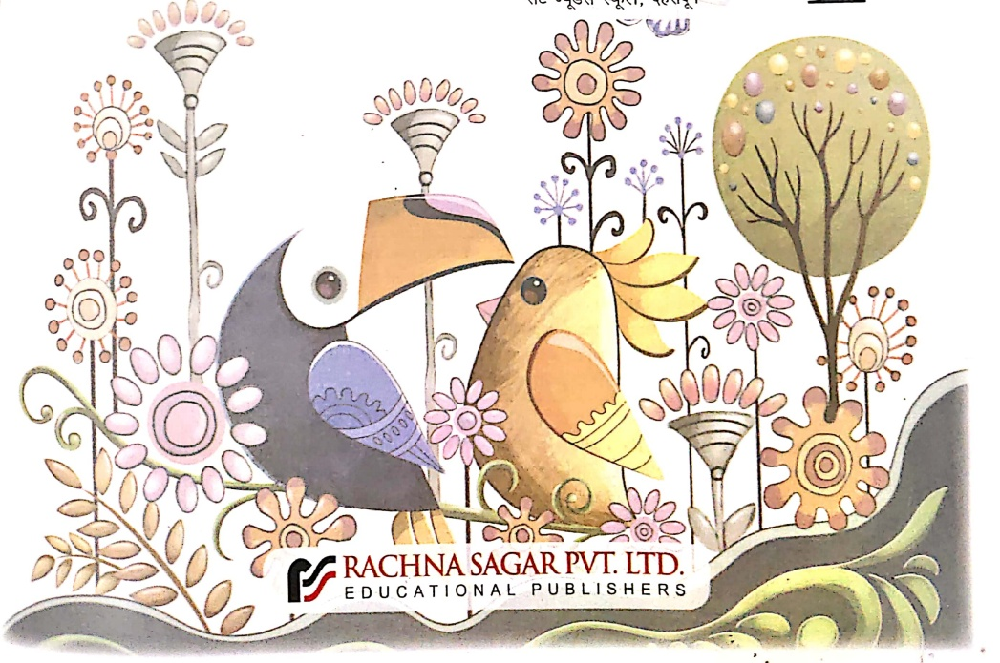
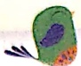
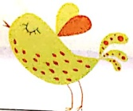
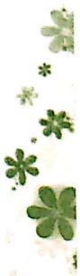

Together with $ ^{®} $

# e ओशेन के मोटी

# हिंदी पाठ्यपुस्तक

डॉ॰ प्रभात कुमार

एसोसिएट प्रोफेसर (सेवानिवुल)

हंसराज कॉलेज

दिल्ली विश्वविधாலय, दिल्ली

सुनीता गौड़

एम॰ए॰ए, फिल॰ (हिंदी), वी॰ एड॰

दिल्ली विश्वविधालय, दिल्ली

निशा त्यागी

एम॰ए (हिंदी) स्वर्णपदक विजेती,

एम॰ए (संस्कृत), बी॰एड॰

मॉन्टफोर्ट स्कूल, दिल्ली

संपादिका

आई॰ मेनुएल

हिंदी अध्यापिका,

सेंट ज्यूडस स्कूल, देहरादून

1

##### ATQrechH

[Table 1](tables/table_001.html)

[Table 2](tables/table_002.html)

[Table 3](tables/table_003.html)

