##### वर्णमाला

চৎকৎ:

35

ཐུགས

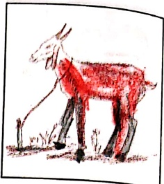

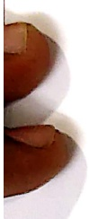

JA

जल्म

ছাণ:

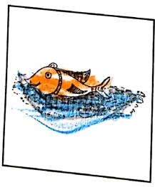

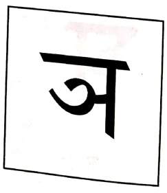

2
 

टगर:

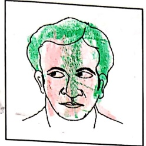

๒๐๖๖

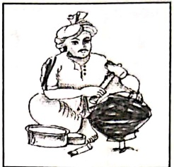

उयनम्

ん：

가

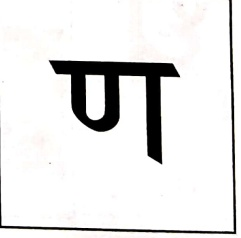

##### वर्णमाला

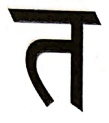

तट

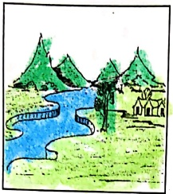

9

4:

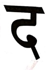

दर्शन:

탁

ध्वल:

नयनम्

तट: - नदी का किनारा, थ: - पर्वत, दशान: - दाँत, धवल: - सफेद, नयनम् - आँख

다

P2

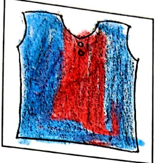

4

फिल्म

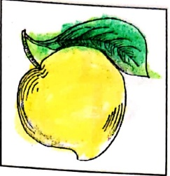

of

ཁག

भवनम्

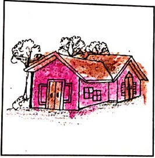

ㅐ

महाकः

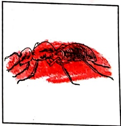

लवणम्

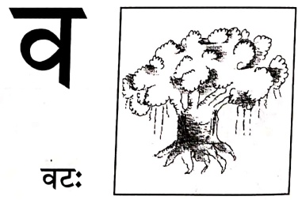

핑

शशक:

다

ఏర్పడ్

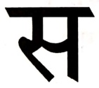

सरट

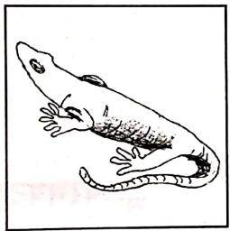

হয:

##### वर्णमाला

[Table 1](tables/table_001.html)

##### अभ्यास:-१

चित्र दृष्टा पदानि लिखत।

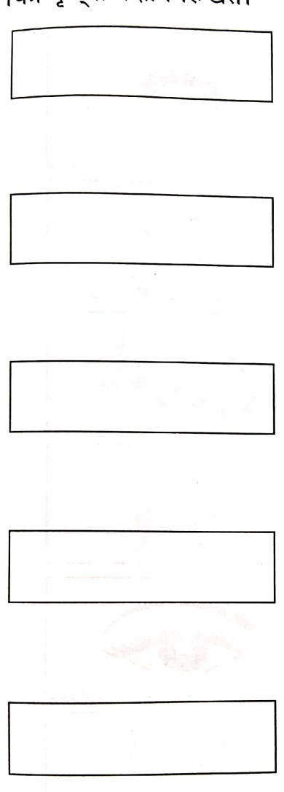

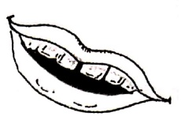

# 二

##### अभ्यास:-२

अक्षरािण क्रमोण सज्जीकृत्य पदनिर्माणं कुरुत ।

 $$ \begin{array}{c} यथा -  अल  नै:\quad=\\\quad\text{अनल:}\end{array} $$ 

 $$ \begin{array}{r l r}{\mathrm{~g:~3~r~}}&{{}=}&{\cdots\cdots\cdots\cdots\cdots}\end{array} $$ 

 $$ \begin{array}{r l r}{\mathrm{~n~m~}_{D}\mathrm{~a~l~o~}}&{{}=}&{\cdots\cdots\cdots\cdots\cdots}&{}\\ \end{array} $$ 

 $$ \begin{array}{c} गन्मग  = \cdots\cdots  \cdots  \cdots  \cdots  \end{array} $$ 

 $$ \begin{array}{l}\text{к:ч вч }=\\\end{array} $$ 

 $$ \begin{array}{r l}{\eta\colon\mathrm{~s h~d~}}&{{}=}\end{array} $$ 

 $$  支  枋  枰：\begin{aligned} 枰 &= 支  枰 \\ 枰 &=\begin{aligned}& 枰 & 枰 \\ &=& 枰 \end{aligned}\end{aligned} $$ 

 $$ \begin{array}{l l l}{v}&{\mathit{\Pi}\mathit{\Pi}\mathit{\Pi}\mathit{L}}&{=}&{\cdots\cdots\cdots\cdots\cdots  7}\end{array} $$ 

 $$ \begin{array}{l}\underline{\text{ć:}}~\underline{\text{s r}}\quad=\quad\cdots\cdots\cdots\cdots\cdots\\\end{array} $$ 

##### बालगीतানি

##### सूयं: गोलः

सुर्य: गोल: चन्द्र: गोल:

गोल: मम वागोल:।

पृथ्वी गोला चक्रं गोलं

गोल: मम रसगोल:॥

##### एफ: हस्त:

एष: हस्ता:

एष: हस्ता: दिक्षणहस्ता:

एष: वाम: हस्ता:।

एष: पाद: दिक्षणपाद:

एष: वाम: पाद:॥

का सा बाल? काखनमाला!

गच्छित कुत्र ? पितुं मित्र।

मधुरा बाला । भद्रसुशील।।

एवम् ? आम्, आम्।।

चलामि मार्ग जले तरामि

कूर्दे भूमौ सदा हसामि ।

पठामि गेहे कथां शृणोमि

भ्रामि नधास्तिरे ।

शीतलवायुर्वहित सुमन्दम्

आरोहित नौकां नरवृन्द ।

गच्छित नौका दूर ।

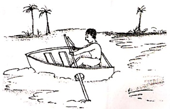

##### मात्रापरिचय:

[Table 2](tables/table_002.html)

काकः - कौवा, क्रिरणः - क्रिरण, कीटः - कीड़ा, कुमारः - बालक

कूपः - कुआँ, कृपणः - कंजूस, केसरः - केसर, कैलासः - कैलास

कोमलम् - कोमल, कौमुदी - चन्दमा की क्रिरण, कंसम् - कॉस, कः - कौन

##### अभ्यास:-१

..... ..... ..... ..... ..... .....