# मेरा वादா

सबसे सुंदर मेरी पुस्तक,

यह है मेरी मित्र।

रोकक और मोहक कहानियाँ,

सुंदर हैं सब चिंत्र।

अच्छी बातें मुझे सिखाती,

खेल-खेल में जान बढ़ाती।

रंग-बिरंगी, मुझे लुभाती,

हिंदी भाषा मुझे सिखाती।

हम सीखेंगे और समझेग,

हिंदी भाषा इससे।

पढ़-लिखकर विद्वान बनेंगे,

वादा मेरा सबसे।

संकेत-अध्यापक/अध्यापिका ‘मेरा वादा’ की प्रत्येक पंक्ति पहले स्वयं पढ़ें, फिर छात्रों से दोहराने को कहें। इस कविता के माध्यम से हिंदी भाषा सौखने के प्रति बच्चों की रचि जागुत करें।

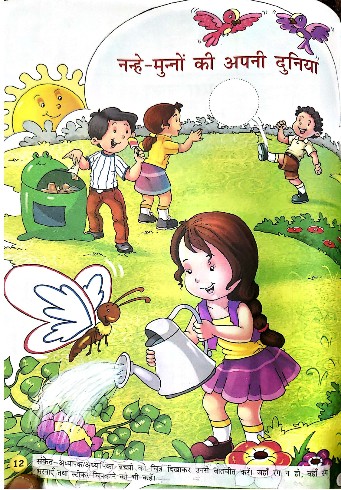

नहे-मुन्यों की अपनी दुनियाँ

12 संकेत-अध्यापक/अध्यापका बच्चों को चिट्र दिखाकर उनसे बातचीत करें। जहाँ रग न हो, वहाँ सभरवाएं तथा स्टीकर चिपकाने को भी कहें।

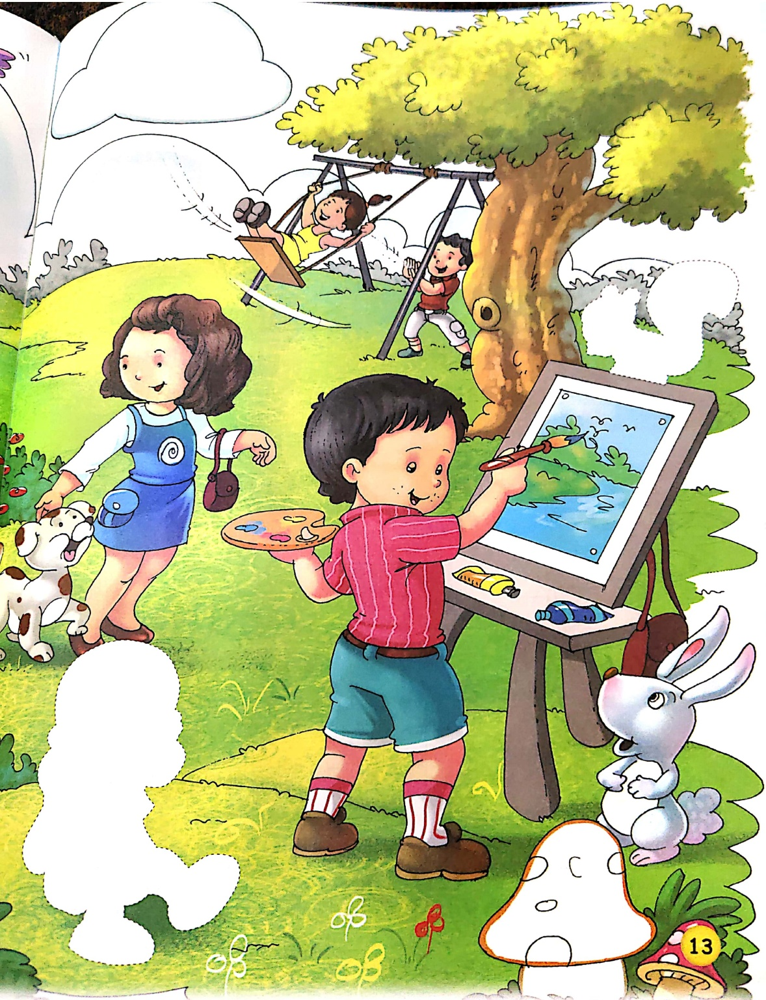

ཁར

##### पढ़ो और लिखो—

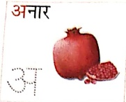

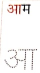

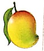

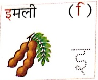

उपवन

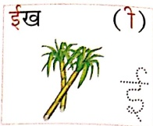

(一)

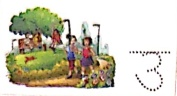

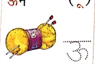

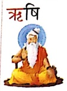

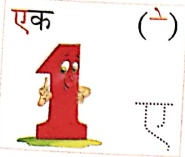

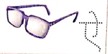

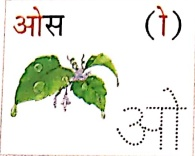

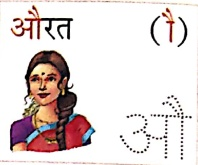

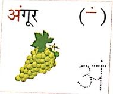

Let's Do 1

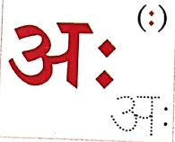

Let's Do 2

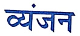

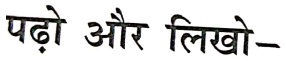

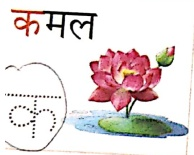

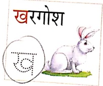

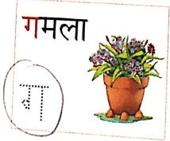

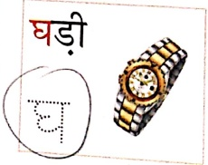

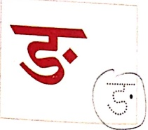

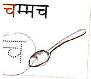

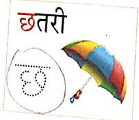

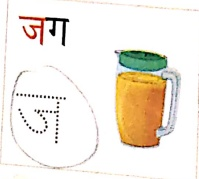

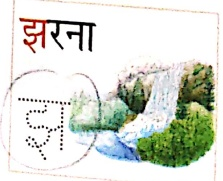

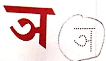

केत- अध्यापक/अध्यापिकी बच्चों को ‘अ’ की मात्रा के विषय में बताएँ। वे बच्चों को समझाएं कि ‘अ’ की कोई मात्रा नहीं होती, लेकिन हर व्यंजन में चिपा होता है, जैसे- क् + अ = क, ख् + अ = ख इत्यादि। ‘अ’ के बिना व्यंजनों के नीचे हलत (.) लगाकर लिखते हैं.

से- क्, ख्, ग् इत्यादि। बच्चों से व्यंजनों का उच्चारण करवाएं तथा व्यंजनों से निकलती ‘अ’ की धनिं से उन्हे परिचित कराएं।

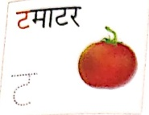

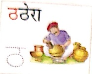

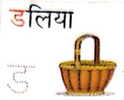

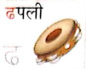

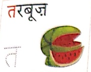

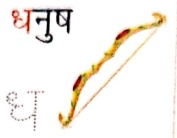

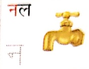

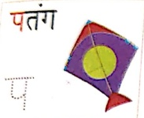

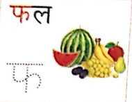

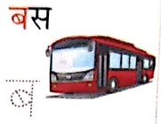

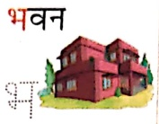

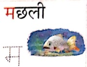

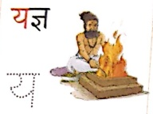

.et's Do 3

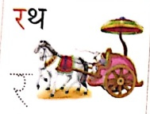

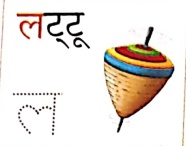

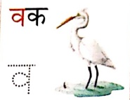

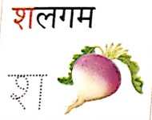

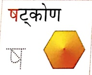

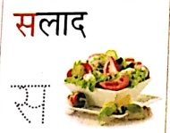

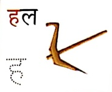

Let's Do 4

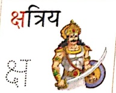

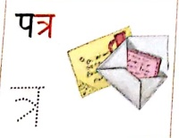

Let's Conclude

ise

Let's Learn

Let's Watch

Let's Listen

आओ बच्चे गाएं गाना,

स्वरों को हमने है पहचाना।

गाओ-गाओ मिलकर गाओ,

ताली बजाओ और दोहराओ।

अ आ इ इ उ ऊ

ऋ ए ऐ ओ औ

अब हम गाएं व्यंजन गीत,

सूम-सूमकर सब लो सीख।

क ख ग घ ड

च छ ज झ ज

ट ऽ ड ह ग

त थ द ध न

प फ ब भ म

य र ल व भूल न जान

श ष स ह गुनगुनाना।

क्ष त श शी दोहराना

हम मल गिराण -

हम सब मिलकर नाचे-गाएं,

वर्णों को सीखें-सिस्वलाएं।

बार-बार दोहराएंगे तो,

कभी भूल न पाएंगे।

Let's Smile

संकेत-अध्यापक/अध्यापिका कक्षा के भीतर होने वाली गतिविधियों के बारे में प्रश्न पूर्ण जैसे-अध्यापक/अध्यापिका जी के हाथ में क्या है?

