# शेर और चूहा

Lot's Excito

जंगल में एक शेर से रहा था। चूंहा उस पर

उछल-कूद कर रहा था।

चूहे की उछल-कूद से शेर की नींद खुल

गई।

में तुम्हे खा जाऊँगा।

मुझे छोड़

दो, मैं किसी

दिन अवश्य

तुम्हारे काम

आऊँगा।

तू छोटा-सा

चूहा भला मेरे

किस काम

आएगा? चल

भाग यहाँ से!

फिर एक दिन शेर जाल में फँस गया। चूहा वहाँ

से गुजर रहा था।

मेरी मदद करो।

में अभी जाल

कुतर देता हूँ।

चूहे ने जाल-कुतर-दिया। शेर-बच-गया।

शिशा— हमें कभी किसी को अपने से कमजोर नहीं समझना चाहिए।

सकेत-अध्यापक/अध्यापिका बच्चों से चिट्र देखकर कहानी समझने को कहें। बच्चों को कहानी पढ़कर

सुनाएं। बच्चों से कहानी से मिलने वाली शिक्षा पूछें और फिर उन्हें समझाएं।

शब्द-रचना

दो वपों वाले शब्द

Let's Watch 1

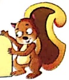

Let's Listen 1

आओ, दो वपों के मेल से शब्द बनाएं—

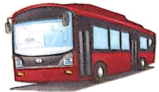

வச

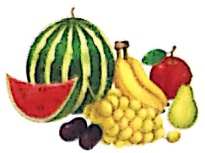

जब

वह

रथ

F4L

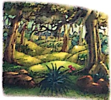

घर
 

नल

मन

कब

यह

रस

कल

दस

पल

धन

வன
 

तब

रह

नथ

तन

अब

कह

चल

ज

पल

##### पहले-

##### जोड़कर नए शब्द लिखो—

अमर हठ मत करे।

छत पर मत चढ़।

सच-सच कह।

डर-डर कर मत कह।

पग डग-मग मत रख।

रथ पर चढ़ा

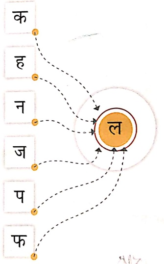

चल अब पढ़ा

दस तक पढ़ा

क्रियाकलाप— 1. अध्यापक/अध्यापिका छात्रों से पूछे कि वे स्कूल से घर कैसे जाते हैं?

2. बस में कैसे चढ़ना चाहिए?

तीन वर्णो वाले शब्द

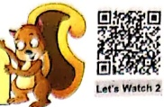

Let's Watch 2

Let's Listen 2

आओ, तीन वर्णों के मेल से शब्द बनाएं—

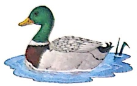

अत्यधिक

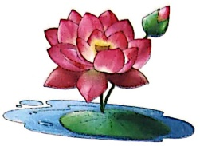

کامل

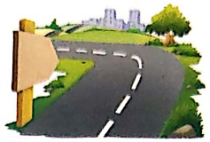

सड़क

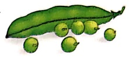

महर

कलम

लगभग

བཀའ

महल

गर्ग

हवन

लहर

खरब

पलतक

नरन

अहन्

भवन

परम

खड़

फ्रांसल

नगर

तयन

मगर

चमन

पवन

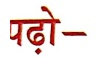

क्लेम इधर रख।

कलश उधर मत रख।

नरम-नरम मटर चख।

##### रिक्त स्थान भरो—

……ۇنۇش

वन

गरम-गरम शहद चख।

"लक्ष्मी"

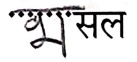

पवन सड्क पर चल।

……हर

पड़क पर शहर तक चला

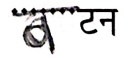

भटक मत, भटक मत।

गल अब खुबर पढ़ा

……लक

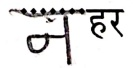

……డ

आराम

चार वर्णों वाले शब्द

Let's Watch 3

##### आओ, चार वर्णों के मेल से शब्द बनाएं—

Let's Listen 3

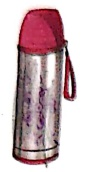

श्रमस

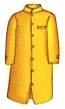

अच्छन

अन्यंन

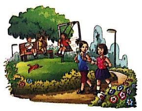

नटखर

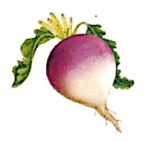

इलगम

तरकशा

उपवन

मलमल

अदरक

कसरत

हलचल

खट्तल

शरबत

सरपट

दमकरल

बरतन

बरगद

इटपेट

टमटम

অজগর

हड़षड

खरबर

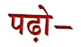

अनवर अच्छकन पहन कर चला।

सरपट मत चल।

अब झटपट घर चला।

#### दोनों शब्दों को मिलाकर न्

शब्द लिखो—

 $$ \begin{array}{c} \text{नट + गरह } =\cdots\cdots\cdots\cdots\cdots  \end{array} $$ 

बरतन खटखट मत कर।

 $$ \begin{array}{c} 39j+79r= \cdots\cdots \cdots \cdots \\ 39 \end{array} $$ 

थरमस इधर रख।

 $$ \begin{array}{c} अद  +  \text{रक  = } \cdots\cdots\cdots\cdots\cdots  है \end{array} $$ 

नट्सबट मत बन।

खेटमल मत पकड़।

हऐबड-हऐबड मत करे।

 $$ \begin{array}{r l}{\tau_{M}+{\tau_{M}}}&{{}={\cdots\cdots\cdots\cdots\cdots}}\\ \end{array} $$ 

 $$ \begin{array}{c}उप +  वन  =  \cdots\cdots\cdots\cdots\\ \end{array} $$ 

 $$ \overrightarrow{k d}+\overrightarrow{h l}=\cdots\cdots\cdots\cdots $$ 

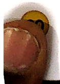

Let's Watch 4

Let's Listen 4

चल-चल-चल,

अब घर चला।

बस पर चढ़कर,

अब घर चला।

अटक मत, मटक मत,

लटक मत, भटक मत।

बस पर चढ़कर,

नमन अब घर चला।

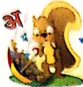

##### చర చల

Let's Watch 5

खटपट मत कर,

इटपट सब कर।

अगर-मगर मत कर,

चल, चल, घर चल।

सड़क पर मत चल,

अकड़ मत, झगड़ मत।

नटखट मत बन,

सरपट घर चल।

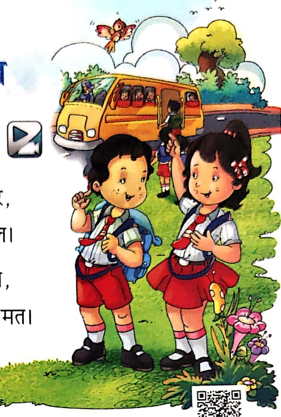

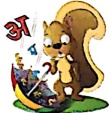

##### गर्ज-गरज कर

Let's Listen 5

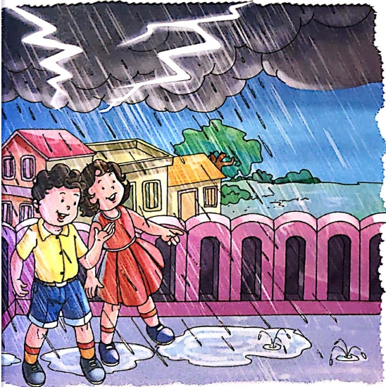

गरज-गरज कर, गरज-गरज कर,

बरस-बरस, जल बरस-बरस।

इधर-उधर, हम भटक-भटक,

हम सब गए, अब तरस-तरस।

बरस-बरस, जल बरस-बरस,

पल-पल बरस, बस बरस-बरस,

सब जगह जल भर कर बरस।

थल, गगन सब जगह हलचल,

चमक-चमक कर, गरज-गरज कर,

बरस-बरस, जल बरस-बरस।

संकेत— अध्यापक/अध्यापिका चিত्रों को दिखाकर छात्रों से छोटे-छोटे प्रश्न पूछें, जैसे-

• बच्चों ने किस रोग के जूते पहने हैं? • बादल क्या बरसा रहे हैं?

Let's Learn

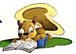

## 1. चित्रों को उनके नाम से मिलाओं—

Let's Do 1

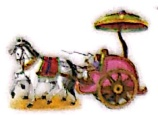

शरबत

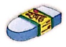

ཁུལ

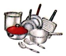

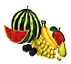

अरतन

رثا

مهل

खड़

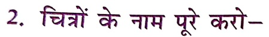

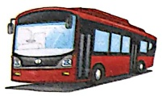

……

……ヨ

Let's Do2

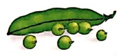

マラ

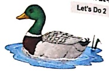

बत

***लश

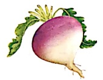

***लगभ

***रवत

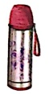

रामस

## 3. चित्रों को देखकर वाक्य पूरे करो-

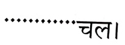

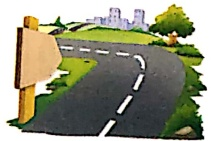

Let's Do 3

'पर मत टहल।

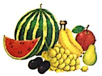

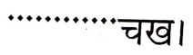

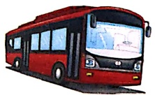

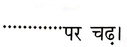

'पर चढ़ा

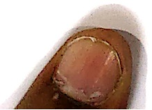

4. जोड़कर शब्द पूरा करो -

Let's Do 4

ह + ऱ = .....

भ + ग + त = .....

ऱ + ह + र = .....

श + र + ब + त = .....

प + त + झ + ड़ = .....

ब + च + प + न = .....

5. सही शब्द चुनकर उत्तर पूरे करो—

(क) नमन अब कहाँ चल?

नमन अब चल। (घर/पर)

(ख) किस पर चढ़ कर चल?

…… पर चढ़ कर चला। (बस/दस)

6. वर्णों को सही क्रम में लिखकर शब्द बनाओ—

(क) र ग न

(ख) व उ प न

(ग) ह ल म

(घ) ड ब र

Let's Smile

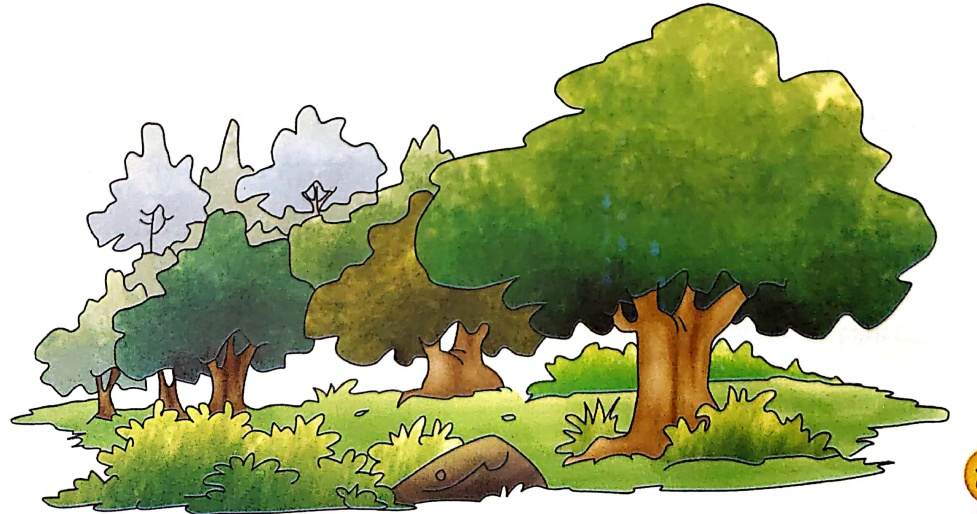

Let's Watch 1

