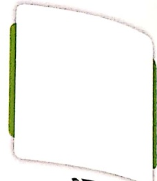
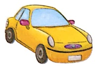
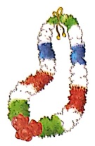
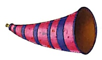
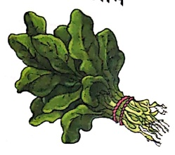
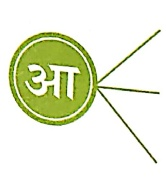
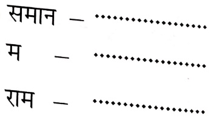
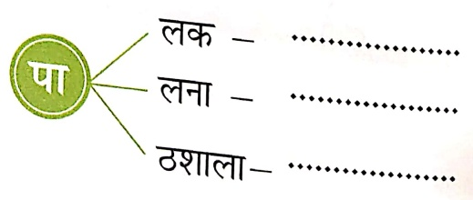
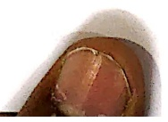

#### ‘आ’ की मात्रा ( τ )

3π

T

Let's Listen 1

चार

आम

ओस

शाम

आदत

মালা

पास

आना

आराम

नाम

जाना

गाजर

বাজা

लाल

खाना

मकान

पालक

हरा

अनार

मानव

नाव

बादल

टमाटर

##### पहले-

आकाश आ, खाना खा।

लाल गाजर खा, सलाद खा।

अनार, आम, पालक ला।

रमा पाठशாலी जा।

पढ़ कर आ, बाजार जा।

मामा ताला ला।

लाल-लाल टमारर ला।

#### जोड़कर शब्द पूरे करो-

संकेत-अध्यापक/अध्यापिकா बच्चों से खालि

में स्टीकर चिकपाने को कहें।

