# बादल आया-जल बरसाया

गड़-गड़, गड-गड बादल आया,

बादल आया, जल भर लाया।

कला-कला बादल छाया,

छम-छम, छम-छम जल बरसाया।

Let's Watch 2

Let's Listen 2

নাব বনা, নাব চলা,

চাতা তানকর মালা আ

হবা খল সর-সর-সর,

চাতা ডুফর-ফর-ফর।

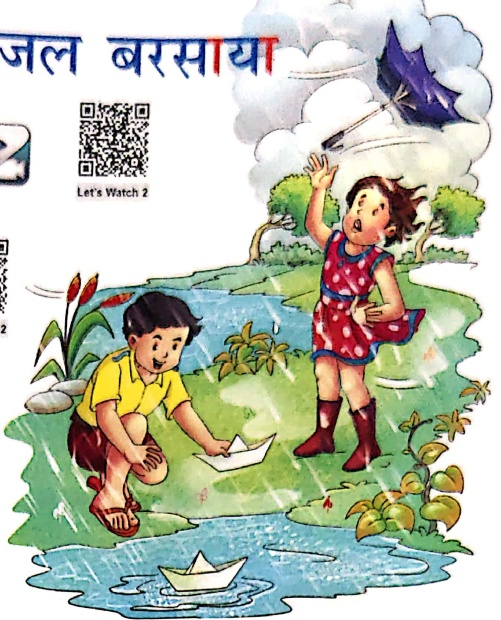

Let's Do 1

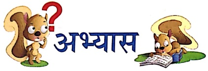

Let's Do 2

## 1. मिलान करो-

छम-छम

गड़-गड़

फर-फर

सर-सर

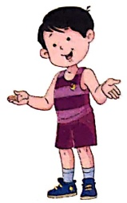

2. सही उत्तर पर ✓ लगाओ—

(क) बादल क्या भर लाया ? (काला/जल)

(ख) बादल कैसा था ? (काला/छाता)

(ग) माला क्या तान कर लाई ? (छाता/नाव)

Let's Do 3

निकत- अध्यापक/अध्यापिका छात्रों को चित्र दिखाकर प्रश्न पूर्ण, जैसे—

• चित्र में कितने बच्चे हैं? • लड़की के हाथ में क्या है? • लड़का क्या तैरा रहा है?

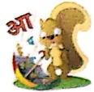

##### raja

आया-आया, राजा आया,

लाया-लाया, बाजा लाया।

Let's Watch 3

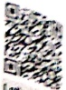

Let's Listen!

राजा बाजा बजा रहा,

बजा-बजाकर नाच रहा।

राजा करता हरदम काम,

वह न करता अब आरम।

जब-जब जाता वह बाजार,

लाता गाजर, आम, अनार।

अब न टालता कल पर काम,

आज करता आज का काम।

Let's

Summarise

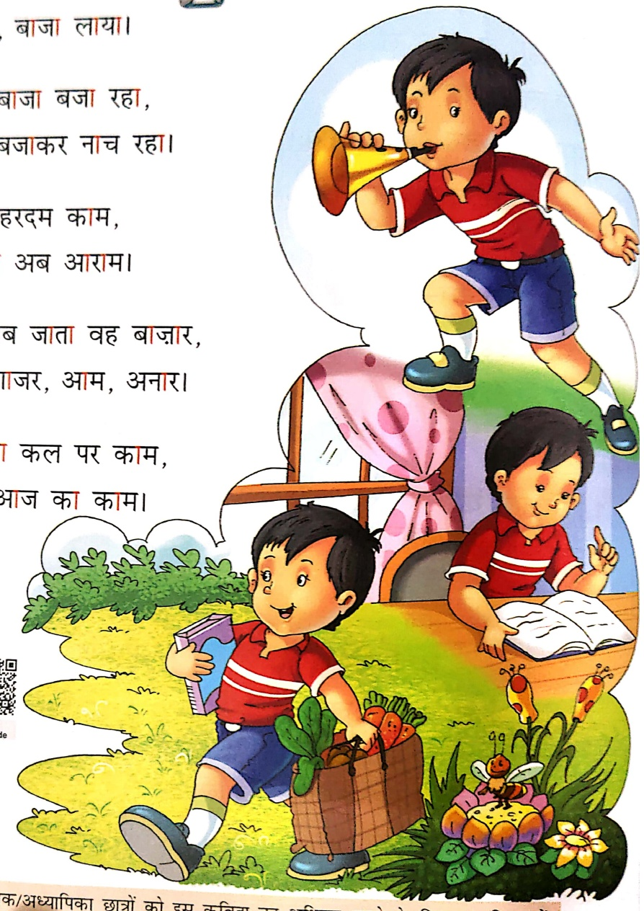

Let's Conclude

Let's Learn

संकेत-अध्यापक/अध्यापिकா छात्रों को इस कविता का अभिनय करने के लिए उल्साहित करें।

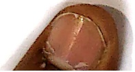

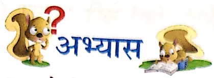

Let's Do 4

1. चित्रों को उनके नाम से मिलाओं—

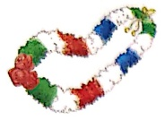

छाता

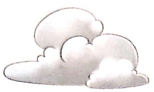

तवला

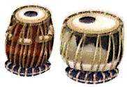

মালা

বাদল

2. सही शब्द भरकर प्रश्नों के उत्तर पूरे करो—

(क) राजा क्या लाया?

राजा ***** लाया।

(ख) राजा हरदम क्या करता है?

राजा हरदम ..... करता है।

## 3. चित्रों को पहचानकर उनके नाम लिखो—

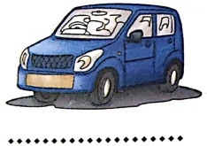

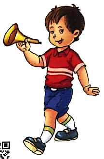

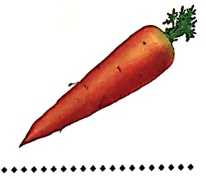

Let's Do 5

1. मात्रा लगाओ—

（ゆ）

अन्य ர

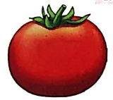

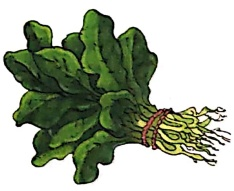

(π)

(ख)

 $$ \Sigma\mathbf{m}^{*}\leq\mathbf{r} $$ 

Let's Smile

प‘लक

(ཕ)

Let's Watch 1

