#### ‘इ’ की मात्रा ( f )

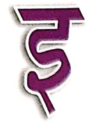

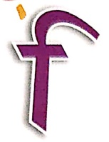

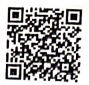

Let's Listen 1

कनाडा

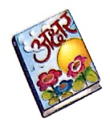

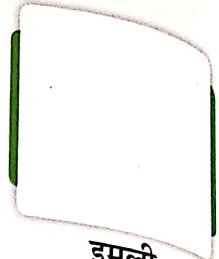

दिन

चिमटा

खरिया

हरन

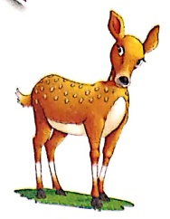

इमली

गिन

पहिया

साइक्लोहे

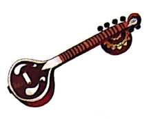

बिल

गिटार

किसान

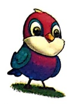

चिन्डिया

सितर

सिर

सियार

डांकिया

किला

टिकट

रिमिश्म

विमान

किधर

बिनयान

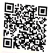

##### पहले-

Let's Do 1

किसरा कविता पढ़ कर आ।

कविता पढ़ कर चित्र बना।

चित्र बनाकर कपड़ा सिला।

मामा आया, आकर मिल।

मामा डिलिया भर कर लाया।

बादल रिमिझम बारिश लाया।

डांकिया तब साइक्ल पर आया।

गिरिमा का सितार वह लाया।

#### जोड़कर शब्द बनाओ—

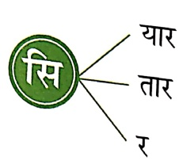

यार

तार

र

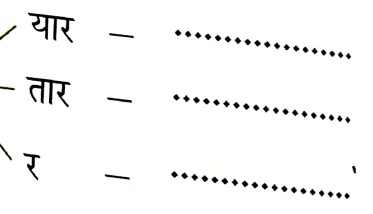

कि

वि

मि

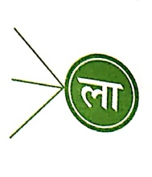

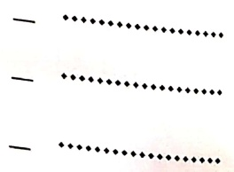

संकेत- अध्यापक/अध्यापिका बच्चों से खाली |  में स्टीकर चिकपाने को कहें।

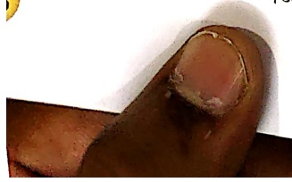

