# कलाकार का दिन

Let's Listen 2

आया आया कलाकार आया।

कितना महान कलाकार आया।।

चिडिया, चिड़ा, विमान बनाया।

हरन, किला विशाल बनाया।।

फिर कलाकार का मन ललचार

इटपट एक गिटार बनाया॥

इतना सारा मिला इनाम।

फिर बन गया वह धनवान।

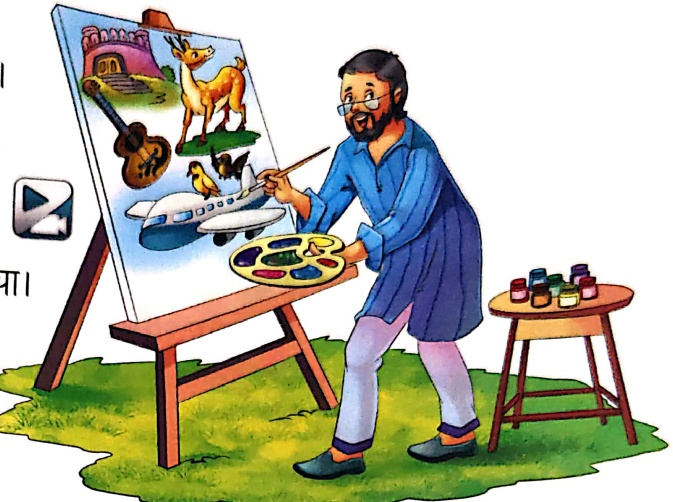

## 1. प्रश्नों के उत्तर एक शब्द में लिखो-

(क) महान कौन था?

(ख) कलाकार ने कैसा किला बनाया?

(ग) कलाकार ने इटपट क्या बनाया?

(घ) कलाकार को क्या मिला?

2. चित्र देखकर सही शब्द लिखो—

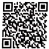

Let's Do 2

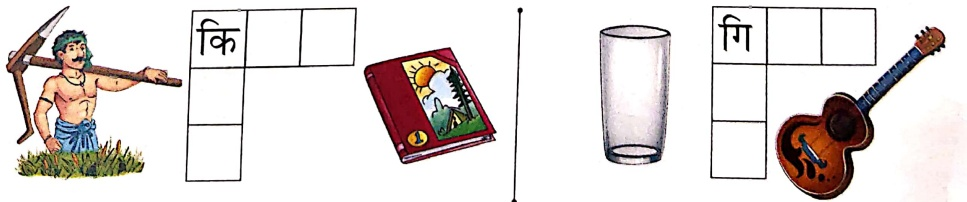

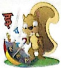

##### डांक्शन

Let's Listen 3

एक डिकिया था। उसका नाम हरिया था। हरिया साइक्लोन पर आता था। एक दिन वह हरिन का खत लाया। हरिन

मितिई लाया। हरिया मिठाई खाकर चल दिया। फिर

चिडिया का खत दिया। चिडिया किशिमश

लाई। हरिया किशिमश खाकर चल दिया।

फिर सियार का खत दिया। सियार एक

फल लाया। तभी रिमझिम-रिमझिम

बारिश आ गई। फिर डिकिया चला गया।

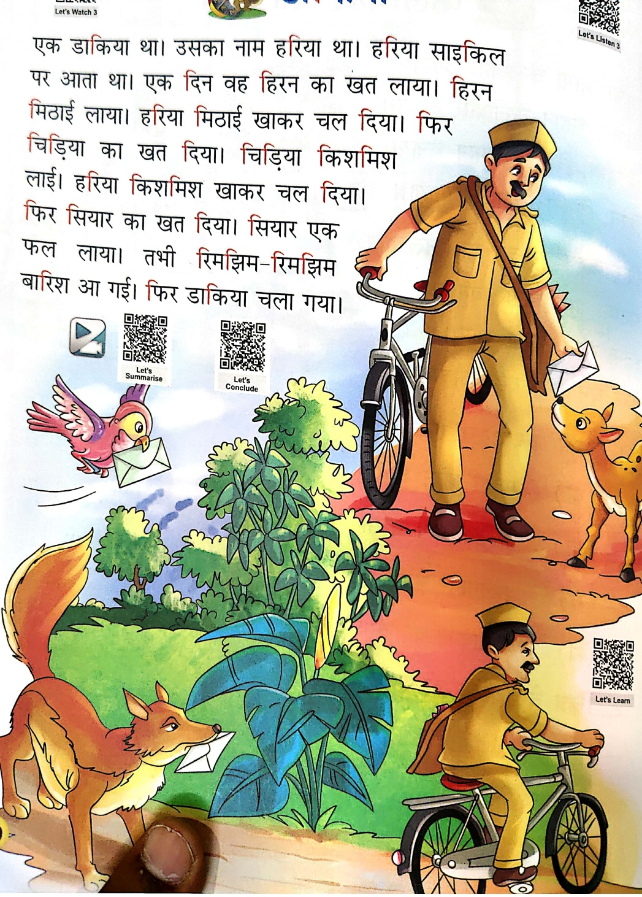

Let's Summarise

Let's Conclude

Let's Learn

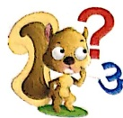

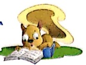

1. चित्रों को उनके नाम से मिलाओं—

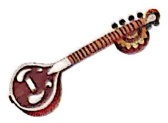

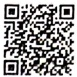

Let's Do 3

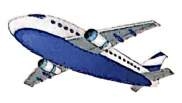

चिडियो

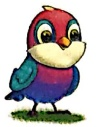

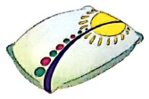

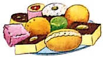

सितर

विमान

मिशई

तिकिया

2. चित्रों को पहचानकर उनके नाम लिखो—

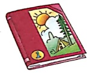

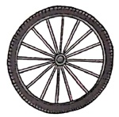

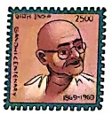

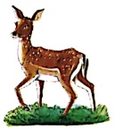

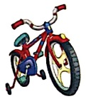

3. सही शब्द चुनकर रिकत स्थान भरो—

(क) डाकिया ***** लाया। (खत/बारिश)

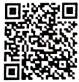

Let's Do 4

(ख) चिडिया ..... लाई (किशमेश/मिठाई)

(ग) रिमिड्मिंग-रिमिड्मिंग ..... आई। (बारिश/हिरन)

सही शब्द पर गोला लगाओ—

(क) गलास गिलास गलास

(ख)  पहिया  पिहिया  पहया

(ग) गिटिर गिटार गिटरा

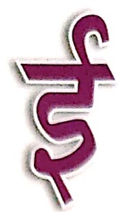

