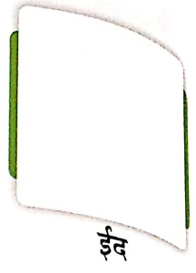
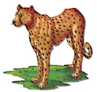
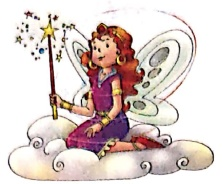
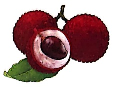
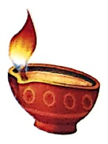
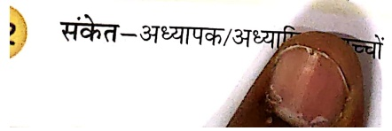
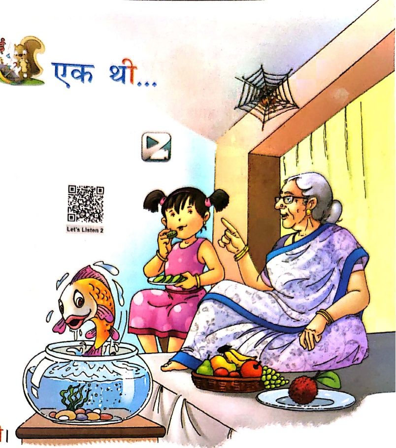
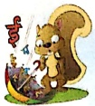

#### ‘ई’ की मात्रा ( Ξ )

Let's Watch 1

Let's Listen 1

चीता

 $ t_{0} $

चौल

घड़ी

बकीरी

पரி

तोस

नदी

पीपल

लीची

दीपक

झौल

नीला

शरीर

नौम

खौरा

पनीर

तोर

पीला

लकड़ी

कौल

पपीता

नाशपातौ

##### पहले-

चिता आया शील पर,

पानी पी गया आकर।

वीर का जब तीर चला,

चिता भागा घबराकर।

गीता की बकरी पास चर रही,

दिवंबती वह घबराई-सी।

भागी सरपट इतनी जल्दी,

लगती वह डरी-डरी-सी।

सही शब्द चुनकर रिकत स्थान भरो-

चिता °° पर आया। (शील/नदी)

वीर का °° चला। (तीर/खीर)

°° की बकरी चर रही। (मीरा/सीता)

°° सरपट भागी। (सीता/बकरी)

चिता °° पी गया। (पानी/पनीर)

से खालि

में स्टीकर चिपकाने को कहें।

Let's Watch 2

एक थी मकड़ी,

रहती थी अकड़ी।

एक थी मछली,

रहती थी गोली।

एक थी लीची,

थी बड़ी मीटी।

एक थे मीरा,

खाती थी खेरा।

एक थी नानी,

कहती थी कहानी।

नैकत-अध्यापक/अध्यापिका छात्रों को चित्र दिखाकर उनसे उसके बारे में छोटे-छोटे प्रश्न पूर्ण, जैसे-डिलिया में या रखा है?

1. सही उत्तर पर ✓ लगाओ—

(क) मछली कैसी रहती थी?

(गोली/पीली)

(ख) मीरा क्या खाती है?

(खौरा/लीची)

2. सही शब्द पर ○ लगाओ-

(क) नानि नानी

(ख) लिचि लीची

(ग) झील झिल

(घ) साडि साडि

