# मछली रानी

Let's Watch 3

Let's Listen 3

मछली रानी-मछली रानी,

पीతి रहती हरदम पानी।

इधर आती, उधर जाती,

सीप लाती, गौत गाती।

हरि और नीली-पीली,

रहती वह गीली-गीली।

पानी में वह इठलाती,

इधर-उधर वह आती जाती।

Let's

Summarise

मीठा-मीठा गाना गाती,

पी-पी-पी-पी सीटी बजाती।

हाथ लगाओ, वह डर जाती।

बहता पानी इसका साथी।

Let's Conclude

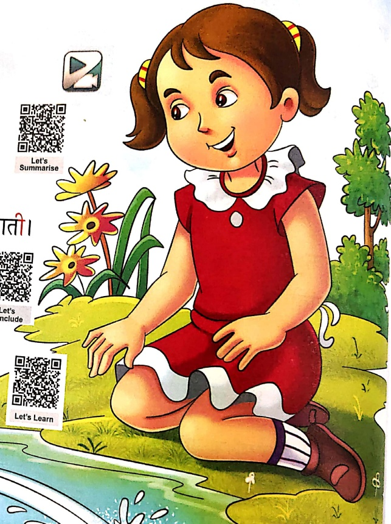

Let's Learn

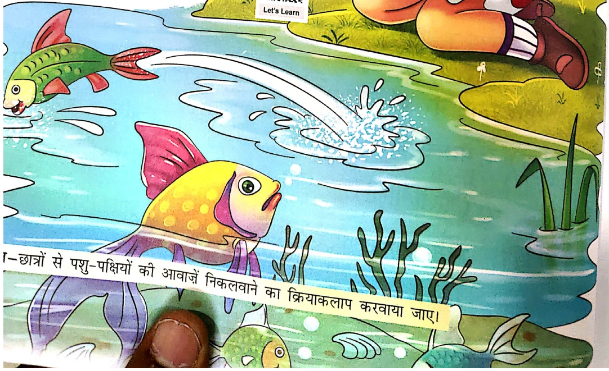

—छात्रों से पशु-पक्षियों की आवाजें निकलवाने का क्रियाकलाप करवाया जाए।

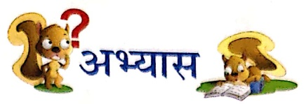

##### अभ्यास

1. शब्दों के सटीकर चिपकाकर उनका उनके घरों से मिलान करो—

मकड़ी

चिडिया

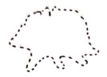

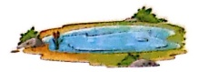

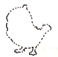

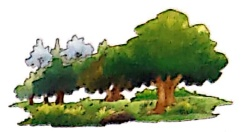

हरन्

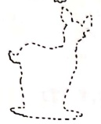

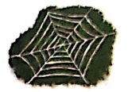

मछली

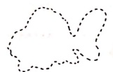

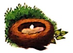

2. वाक्य पूरे करो-

Let's Do 1

(क) ..... रहती हरदम पानी।

(ख) सीप लाती गाती।

(ग) ..... वह गीली-गीली।

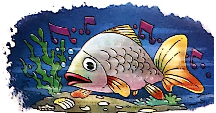

## 3. मिलान करो—

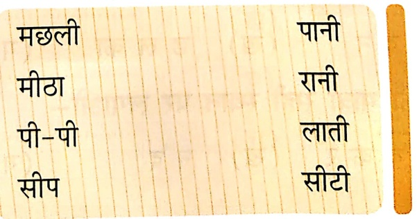

Let's Do 2

सौमित्र चटर्जी

