#### ‘उ’ की मात्रा (उ)

Let's Watch 1

Let's Listen 1

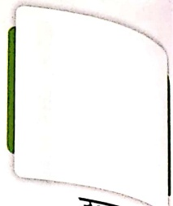

उत्तरपूर्व

गुलाब

पुल

करता

चुप

जాमुन

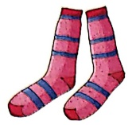

जुराब

सुन

गुलाबी

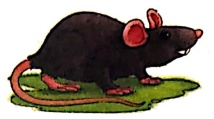

चुहिया

बुरा

चुनरी

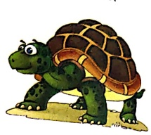

কণ্ঠু)আ

दुकान

कुरसी

लुकाट

पुजारी

घुटना

कुसும்

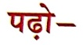

गुडिया सुन முरली की धुन

सुन सुन गुड्डिया सुन।

Let's Do 1

##### सही वर्ष

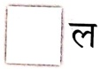

முরలి की धुन परा कांना।

 $$ ( 筲 / 甬 ) $$ 

सुन कर मुरली की धुन।

 $$ ( 枏 / 甪 ) $$ 

 $$ \Box  \div  \Bigg[ 21\pi \Bigg] \text{rli} $$ 

 $$ \begin{array}{l} \text{नाचे}\  जरा \  अब \  हाथ \  उठा \  कर।}\end{array} $$ 

सुन सुन गुडিया सुन।

 $$ \boxed{\phantom{a}} 竽 $$ 

 $$ ( ཤུ/ཞིབ ) $$ 

 $$ \begin{array}{l}\bar{u}_{n\kappa k}-\bar{u}_{n\kappa k}\quad\bar{u}_{n}-\bar{u}_{n}\end{array} $$ 

 $$ \Box  \div  \boxed{कान} $$ 

 $$ ( \text{दाई}) $$ 

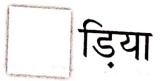

 $$ (g u/g a) $$ 

में स्टीकर चिपकाने को कहें।

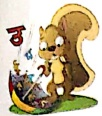

#### बुलबुल और बगुला

एक थी बुलबुल एक था बगुला,

उनका नित चलता था झगड़ा।

जब बुलबुल का चिछा तराना,

सुनकर बगुला हुआ दीवाना।

बुलबुल की सुनकर आवाज़,

फिर बगुला भी आया पास।

गाना सुन, दी बहुत बधाई,

अब बुलबुल कुछ-कुछ शरमाई।

आसमान पर लाली छोई,

फिर एक तितली उड़ती आई।

नई सुबह सिसखलाती आई,

इरागड़ा नहीं काम कर भाई।

Let's Watch 2

Let's Listen 2

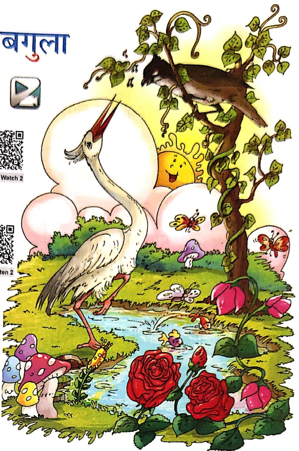

संकेत-अध्यापक/अध्यापिकாக छात्रों को चিত्र दिखाकर लघु प्रश्न पूर्ण जैसे- बादलों के पीछे से कौन झாँक रहा है?

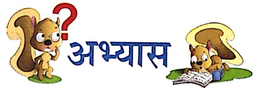

1. सही ✓ का निशान लगाओ—

(क) बुलबुल और बगुले में क्या चलता था? (इगड्आ/रगड़ा)

(ख)  बुलबुल ने क्या छेड़ा?

(तराना/नहाना)

(ग)  बगुले ने बुलबुल को क्या दिया?

(बधाई/मिठाई)

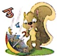

