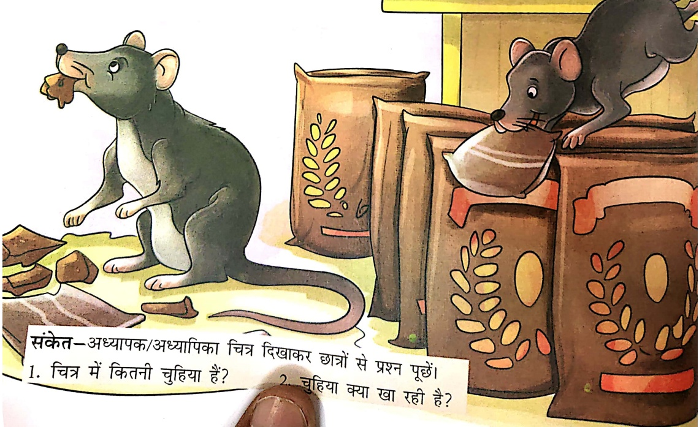
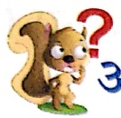

# चुटकी चुहिया

एक चुहिया थी। चुहिया का नाम चुटकी था। चुटकी दुकान पर जाती थी। एक दिन उधर एक बुडिया मिली। बुडिया पुडिया बना रही थी। चुटकी चुपचाप पुडिया उठाकर भाग गई। पुडिया गुड़ से भरी थी। चुटकी पुडिया कुतर रही थी। पुडिया खुल गई। चुटकी गुड़ खा रही थी। गुड़ खाकर चुटकी खुश हुई।

Let's Watch 3

Let's Listen 3

Let's Learn

संकेत-अध्यापक/अध्यापिका चित्र दिखाकर छात्रों से प्रश्न पूछें।

1. चित्र में कितनी चुहिया है? ___

2. चुहिया क्या खा रही है?

