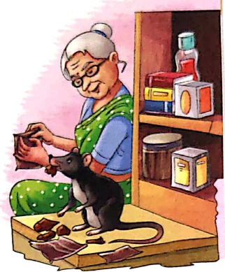
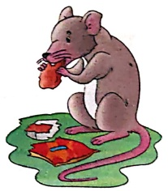
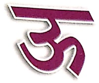

# अ१यास

1. रिक्त स्थान भरो-

कुतर खुल चुहिया पुडिया

(क) एक ..... थी।

(ख) बुढ़िया ..... बना रही थी।

(ग) चुटकी पुड़िया ..... रही थी।

(घ) पुড়िया ..... गई।

##### . सही उत्तर पर ✓ लगाओ—

Let's Do 2

(क) चुहिया का क्या नाम था? (चुटकी / मुटकी)

(ख) चुटकी कहां जाती थी? (दुकान / मकान)

(ग) चुहिया क्या उठाकर भागी? (चुहिया / पुडिया)

'र' में '‘’ की मात्रा कहाँ लगाऊ?

Let's Do 3

 $$ 7+3=7 $$ 

गुरु, रूपया, रकना,

रई, रचि

