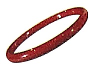
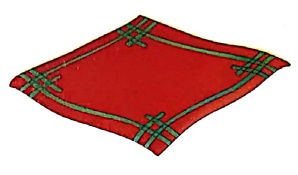
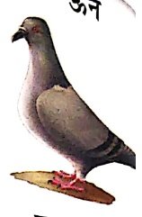
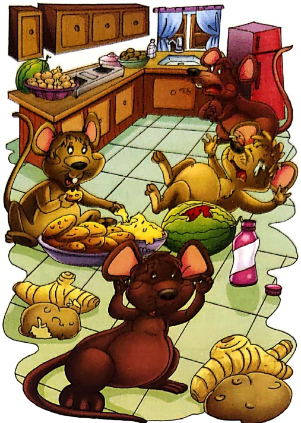
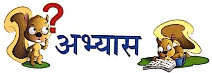
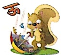

#### ‘ऊ’ की मात्रा (न)

Let's Watch 1

Let's Listen 1

ফুল

ཀུན་

धूप

मूली

चूंड़ी

भूर्व

ज़रुर

धूल

सूरज

हमाल

कंब्यूटर

भालू

शहतूत

बूढ़ा

तरबूज

चूंहा

मजदूर

छुला

खरबूजा

एक भूलवाली आया।

साथ एक भालु लाया।

भालु बड़ा नटखर था।

शहद खाता, तरबूज भी खा जाता।

एक दिन एक बूढ़ा आदमी तरबूज खा रहा था।

भालु उसका तरबूज चीनकर खा गया।

बूढ़ ने उसको लाती मारी।

#### रिक्त स्थान भरो-

एक ..... आया।

साथ एक .....

लाया। ***** बड़ा

भालू भाग गया।

नरखर था। एक बूढ़

आदमी ..... खा

रहा था। भालू उसका

भूखों कालू चूहा आया

खूब आलू-कचालू उड़ाया।

पूरी खाई, हलवा खाया

तरबूज पर फिर मन ललचाया।

दर्द उठा, फिर चूरन खाया

इतना खा कर फिर पछताया।

अब जा कर कुछ मिला आराम

कान छू रहा चूहा राम।

Let's Listen 2

1. रिक्त स्थान भरो—

(क) कालू चूहा ..... था। (भूखा/सूखा)

(ख) उसने உண்மை உண்மை உண்மை (पूरी/चूरी)

(ग) दर्द होने पर चूहे को चला पड़ा। (चूरन/आलू)

(घ) चूहा ..... छू रहा है। (कान/हाथ)

(ड) अधिक खाकर ***** पछताया। (चूहा/भालू)

संकेत- अध्यापक/अध्यापिका छात्रों को चিত्र दिखाकर प्रश्न पूछे, जैसे-

• चित्र में चूहे कहाँ बैठे हैं • वे क्या-क्या कर रहे हैं?

