# सीधी-साடி रूपा

Let's Watch 3

सूरज निकला धूप खिली,

जाग गई स्पा रानी।

पूजा करती और खुश रहती,

कभी न करती वह मनमानी।

स्पा नित दूध पीती,

घूमती रहती, झुमती रहती।

बाजार जाकर आलू लाती,

आलू पूरी जमकर खाती।

अमस्द, खरबूजा और तरबूज,

काटकर स्पो खाती खूब।

स्पो लड़की सीधी-सादी,

मीठी-मीटी बात सुनाती।

Let's Listen 3

Let's Learn

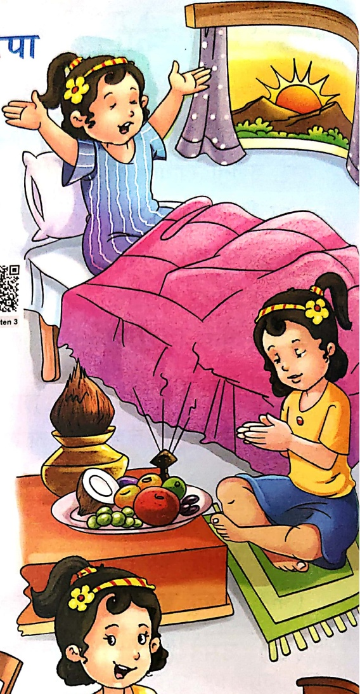

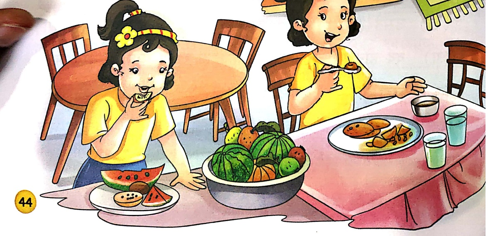

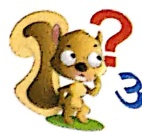

# अ१यास

1. जोड़कर शब्द बनाओ—

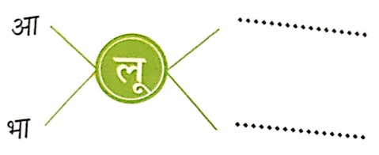

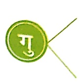

डिया -

2. खालि स्थान भरकर प्रश्नों के उत्तर पूरे करो—

(क) स्पता कभी क्या नहीं करती है?

स्पा कभी ..... नहीं करती है।

Let's Do 1

(ख) रूपा बाजार से क्या लाती है?

स्पता बाजार से ..... लाती है।

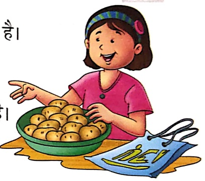

(ग) स्पापों केसरी लड़की है?

स्पाप ..... लड़की है।

'र' में '‘’ की मात्रा कहा लगाऊं?

Let's Do 2

 $$ \tau+\overline{\alpha}=\overline{\alpha} $$ 

स्पा, स्ठना, स्खा,

शुस्, अमस्द

1. जोड़कर नए शब्द बनाकर लिखो—

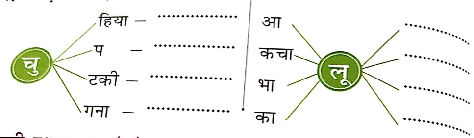

2. सही स्थान पर ‘उ’ (−) अथवा ‘उ’ (−) की मात्रा लगाओ और दुवारा लिखो-

## 3. चित्रों के नाम पूरे करो-

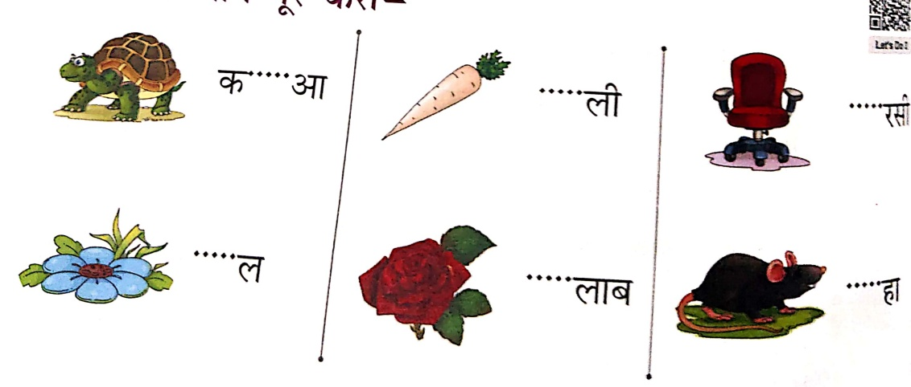

Let's Do!

4. (−) अथवा (−) की मात्रा सही स्थान पर लगाओ-

पजारी पजा के लिए गलाबी फल लाया। बढ़िया माला बना रही

थी। चिहिया आकर फल कतरने लगी। मजद्र पास ही तरबज

खरा था। सरज निकल आया तथा धप खिल गई।

5. नए शब्द बनाओ—

ऐ, गु, पा, मा, ड, ल, दू, ना, ध, ब, डू, गु, घू,

डि, म, या, दु, ट, ना

6. शब्द-सीढ़ी पूरी करो-

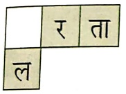

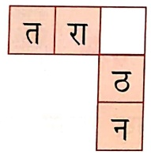

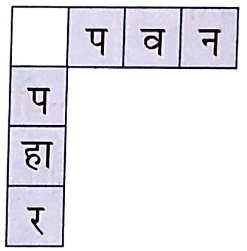

Let's Do 4

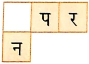

7. (−) की मात्रा वाली पिततयों में गुलाबी रंग तथा (−) की मात्रा वाली पिततयों में पीला रंग भरे-

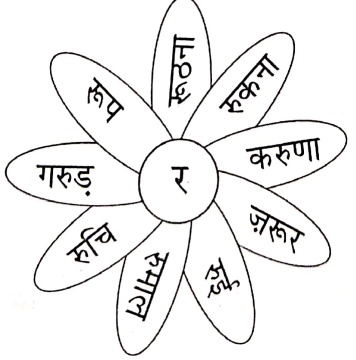

##### ‘ऑ’ की मात्रा ( _ )

Let's Watch

G

Let's Listen

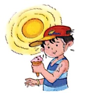

गरमी की जத்து

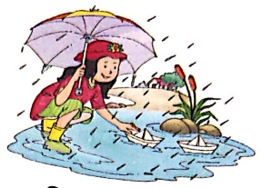

बारिश की ऑतु

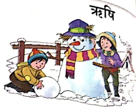

सरदी की जத்து

तृण

गृह

स्वजन

चृत

कृत

कृत

नृप

मातृ

हृदय

कृत

पित्त

कृषक

वृक्ष

मटु

कृतश

मग

कृषि

पृथ्वी

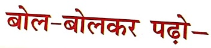

Let's Learn

बारिश की ऋतु खूब आई जब,

हरियाली बिखरी जगह-जगह तब।

कृषिक कृषि करता रहा,

मृग डर कर खड़ा रहा।

जब नप धनुष बाण लाया,

तब मृग बहुत घबराया।

वृक्ष महान धरती की भूषण,

फल, फूल, अमृत बरसाता है।

कृपा मिले शीतल छाया की,

जीवन सुख मिल जाता है।

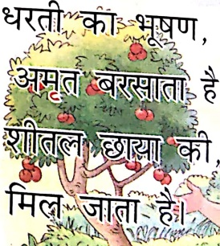  
  धरती  को भूषण , अमृत बरसাতो शौतक मिल जाता है  
   

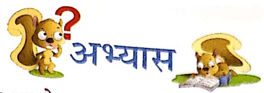

1. चित्र पहचानकर उनके नाम लिखो—

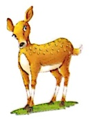

Let's Do 1

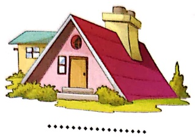

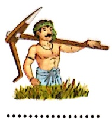

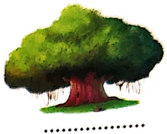

## 2. चित्र देखकर सही वाक्य पर ✓ लगाओ—

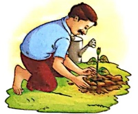

अमृत वृक्ष लगाता है।

अमृत घर जाता है।

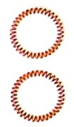

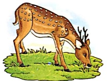

मृग दौड़ता है।

मृग तृण खाता है।

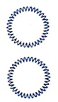

##### . उचित स्थान पर (−) की मात्रा लगाओ—

मग

हदय

वक्ष

কণ্টি

잔잔

གཙག

Let's Do 2

सही शब्द चुनकर उत्तर लिखो—

(क) कुंकि कौन करता है? (कृषक/मृग)

Let's Do 3

(ख) धनुष-बाण कोन लाया? (नृप/कृषक)

(ग) धरती का भूषण कौन है? (वृश/कृपा)

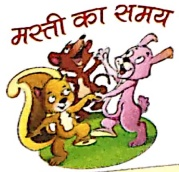

