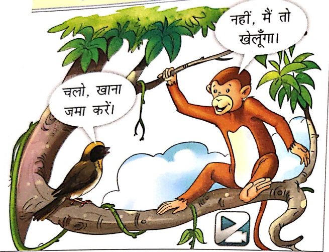
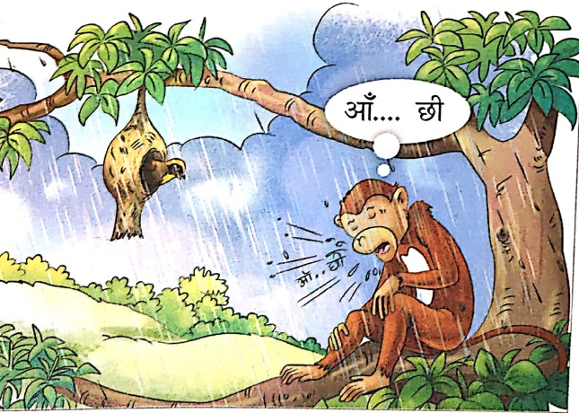
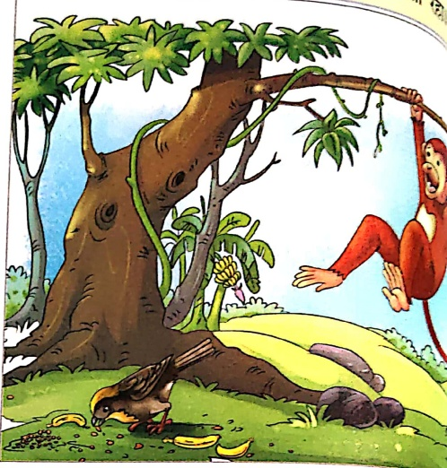
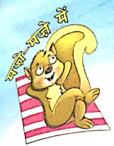
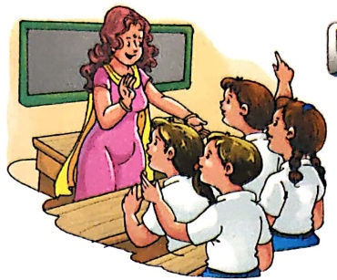
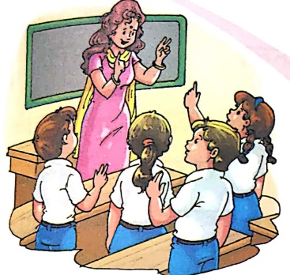
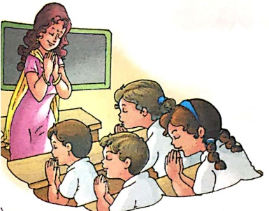
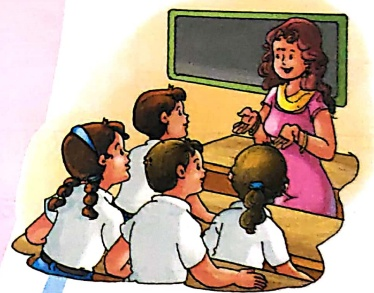

# बंदर और चिडिया

letzte;

कुछ ही दिनों में बारिश शुरू होने वाली थी।

चलो, खाना

जमा करें।

नहीं, मैं तो खेलगा।

बारिश शुरू हुई। सब पशु-पक्षी अपने-अपने घर में थे। चिडिया ने देखा, अकेला बंदर पेड़ पर बैठा तितुर रहा था।

आँ... छि

बंदर ने खाना जमा नहीं किया। वह खेलता है

बंदर को भूखा व तितुरता देख चिडिया को रु

पर बहुत दया आई। वह बोली—

लो खाना खा

लो।

मुझे माफ़क कर दो। आगे

से मै अपना सारा काम

समय पर कर्ला

शिश्ता— हमें आलास्य को ल्यागकर अपना कार्ये समय पर परा करना चाहते

संकेत-अध्यापक/अध्यापिकா बच्चों से चित्र देखकर कहानी समझने को कहे। वे उन्हें कहानी पढ़कर सु

और प्रश्न पूछें।

#### बहुत हुआ काम-अब करो आराम

एक दो तीन चार।

बच्चे! बनो होशियार।।

पाँच छह सात आठ।

साथ उठाओ! दोनों हाथ।।

Let's Excite 2

बैठ जाओ सब एक साथ।

हाथ मिलाकर जोड़ो हाथ।।

आँख बंद कर ध्यान लगाओ।

फेर ईश्वर को शीश झुकाओ।।

आठ सात छह पाँच।

नीचे लाओ अपने हाथ।।

चार तीन दो एक।

एयरे बच्चे! बनो नेक।।

करो प्रार्थना अपने मन में।

शान की ज्योति जले जीवन में।।

दूर अशान का हो औधियारा।

सुखी बने जग-जीवन सारा।।