## 9 'ए' की मात्रा (−)

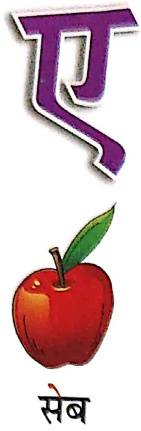

Let's Watch 1

Let's Listen 1

सेव

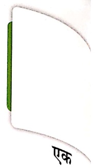

ཁོ

खेल

ंठला

नेवला

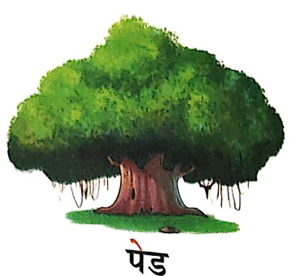

तेल

रेखा

ठेरा

बेर

सपने

पहली

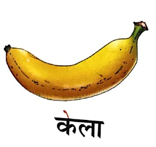

कोला

बेल

अनेक

सहेली

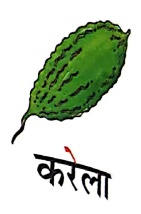

मेला

सवेरा

कपड़

कोला

बेसर

महत

##### पहले-

Let's Learn

महेश बाजार जाकर रेलगाड़ी लाया।

रेलगाड़ी छुक-छुक कर चली।

रेल सीटी बजा रही थी।

रेलगाड़ी लाल थी।

महेश रेलगाड़ी चला रहा था।

उसका मित्र दिनेश भी आ गया।

मुकेश तथा दिवेश भी आए।

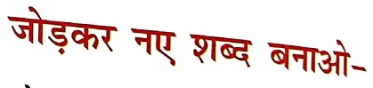

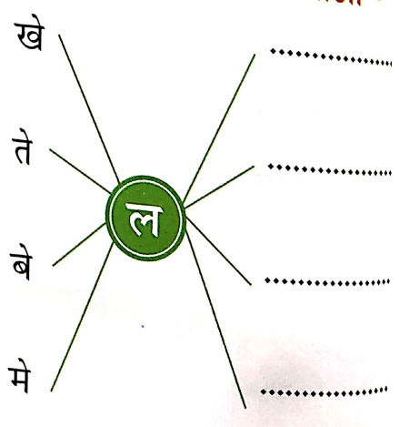

Let's Watch 2

मेरी माताजी आज बाजार गई। वे हमारे लिए लाल-लाल सेब, पीले-पीले केले, हरे-हरे बेर लाई। सारे फल

पिलाकर माताजी ने चार बनाई। चार खाकर हम सब

बहुत खुश थे। पिताजी शाम के समय बाजार से करोले

लाए। माताजी ने खाने के साथ पकाए हुए करोले भी

दिए। पिताजी ने बताया करोले खाने से सेहत ठीक

हती है। कल हम रेलगाड़ी से मेरठ घूमने गए थे।

रोठ से हम रेवडी लाए। रेवडी बहुत मीठी थी।

कैत-अध्यापक/अध्यापिकா फलवालों, सर्जीवालों तथा रेलवे फ्लेटफॉर्म पर सुनाई देने वाली आवाजों का

भिनेय करवाए।

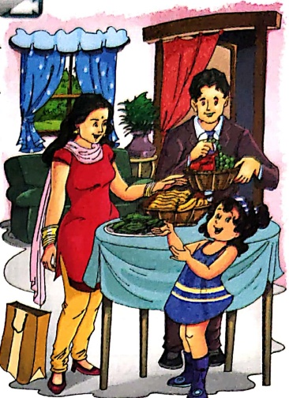

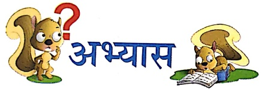

## 1. चित्र के नाम पर ✓ लगाओ—

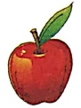

Let's Do 1

कनाडा

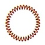

सेव

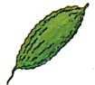

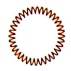

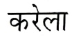

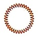

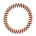

或

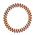

##### सही ✓ अथवा गलत × का चिह्न लगाओ—

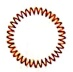

(क) माता जी सेब लाईं।

Let's Do 2

(ख) पिताजी लाल केले लाए।

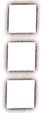

(ग) फल की मिठाई बनी।

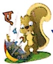

### सबने कुछ किया

दीपी मुझे लगी है भूख।

उछल-कूद कर खेला खूब।

सेब काट फिर वह ले आई।

खाकर महेशा ने भूख मिटाई।

नेह चल दी अब बाजार।

लेकर आई केले चार।

सबने मिलकर केले खाए।

नाचते-गाते मेल आए।

घर से अपने आई रेखा

तब उसने मिला देखा।

खुशी-खुशी घूमी मिल-जुलकर

फिर जाकर झुली झुले पर।

Let's Watch 3

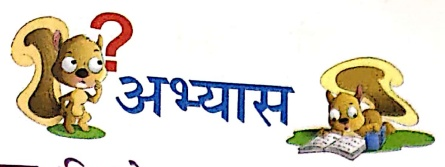

चित्र देखकर शब्द लिखो-

Let's Do 3

(क) दीदी महेश के लिए

(ख) नेहा बाजार से

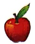

लाइјі

(π)

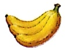

लाइјі

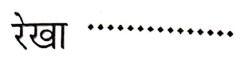

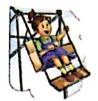

पर झूली।

चुनकर (✓) का निशान लगाओ—

(क) उछल-कुद कर कौन खेला? (दीді / महेशा)

(ख)  नेहा कहांच चल दी? (मेला / बाजार)

(ग) सब मेले में कैसे गए? (नाचते-गाते / रोते-धोते)

##### हो और समझो—

एक

Let's Do 4

अनेक

তার

तारे

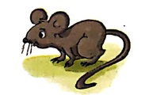

अनेक

चूंह

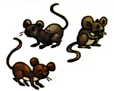

चूंहे

##### ख आप एक के अनेक लिखो-

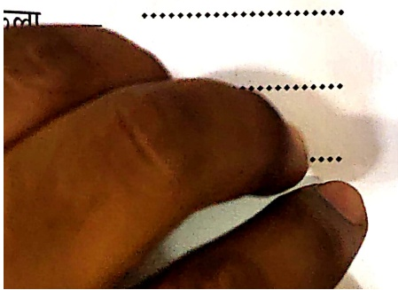

पेड़ा

कपड़ा

शूला

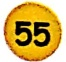

10