#### ‘ए’ की मात्रा (न)

Let's Watch 1

Let's Listen 1

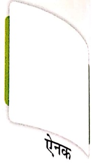

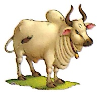

वैல்

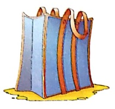

सैर

नैया

कलाश

খेलா

पेसा

मैल

जैसा

सैनिक

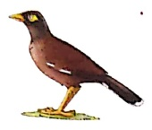

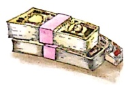

मैना

पैर

कैसा

दैनिक

मैदा

कैदी

तैनात

पेदा

बैठक

तैराक

मैया

वैभव

मैदान

##### पहले-

धीरे चल नैया मेरी, धीरे चल।

मेना गुनगुना रही, भैया को मना रही।

नैया तू बहती जा रही, लहर भी साथ आ रही।

पर, धीरे चल नैया मेरी, धीरे चल।

नैनीताल के ताल में, बहती है हर हाल में,

गवैये की सुन ले तान, नाविक की भी बात मान।

धीरे चल नैया मेरी, धीरे चल।

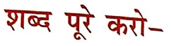

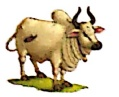

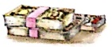

……सा

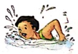

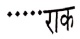

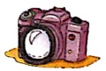

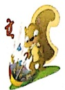

#### नैनीताल की सैर

वैभव अपने परिवार के साथ घूमने

गया। वे सब बस से नैनीताल गए।

नैनीताल में वे चार दिन रहे। वे ताल

में नैया में सेर कर रहे थे। वैभव ने

छड़-छड़ केमरे से नैया का चित्र लिया।

अचानक वह फिसल गया। उसका पैर

मुड़ गया। उसकी बहन शैली ने उसे

उठाया। शैली ने उसकी चोट पर मरहम

लगया। वह ताल में तैरना चाहती थी।

पिताजी ने मना कर दिया।

सकेत-छात्रों से पूछा जाएं कि क्या वे अपने परिवार के साथ कभी घूमने गए थे? कहाँ गए थे? कहाँ जाना

चाहते हैं? आदि मौखिक प्रश्न पूछे जाएं।

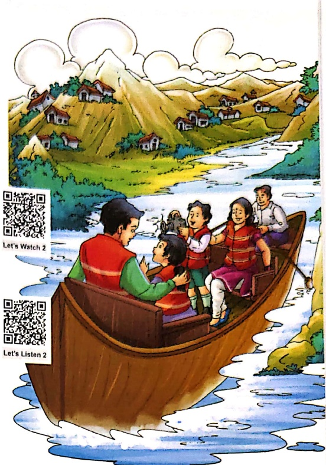

1. प्रश्नों के उत्तर एक शब्द में लिखो—

(क) अपने परिवार के साथ कौन घूमने गया?

(ख) सब कहां घूमने गए?

(ग) वैभव ने किसका चित्र लिया था?

(घ) वैभव को मरहम किसने लगाया?

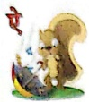

