# तेराक और गवैया

Let's Watch 3

कैलाश एक तैराक है। वह तैरे रहा है।

पास ही एक मैदान है। उधर गवैया गा

रहा है। साथ उसकी बहन शैली बैटी

है। तभी तैराक नदी से बाहर आया।

कपड़े पहनकर तैयार हुआ। गवैये के

पास जाकर उसका गाना सुना। फिर वे

पैदल चलते हुए सैर करने लगे। गवैये

ने बताया, “मेरा भैया सैनिक है।”

तैराक ने बताया, “मेरा भैया बैलगाड़ी

चलाता है।"

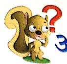

##### अभियास

1. किसने कहा, किससे कहा—

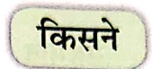

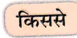

(क) मेरा भैया सैनिक है।

(ख) मेरा भैया बैलगाड़ी चलाता है। ..... .....

## 2. समान तुक वाले शब्द लिखो—

## 3. प्रश्नों के उत्तर पूरे करो—

(क) कैलाश व्या है?

(ख) कौन गा रहा है?

कैलाश एक ..... है।

Let's Do 1

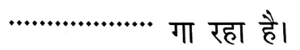

(ग) गवैये की बहन कौन है? गवैये की बहन .....

## 4. चित्र के सही नाम पर ✓ लगाओ—

सर

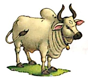

Let's Do 2

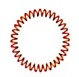

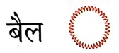

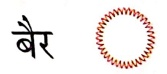

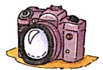

पेसा

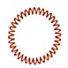

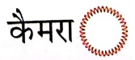

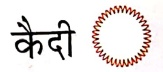

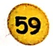

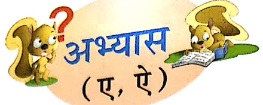

1. सही स्थान पर ‘ए’ (−) की मात्रा लगाओ—

उला, महमान, बर, पड़, नवला

२. सही स्थान पर ‘ए’ (^) की मात्रा लगाओ—

सनिक, बलगाड़ी, पदल, मदान, हरान

3. '२' अथवा '२' की मात्रा वाले शब्द अलग-अलग लिख

रामू जी ने केला खाया।

खाकर खिलका उधर गिराया।

खिलके पर जब फिसला पैर।

अपने से ही निकला बैर।

याद आ गई अपनी नानी।

बस इतनी सी है कहानी।

Let's Do3

## 4. जोड़कर नए शब्द बनाओ—

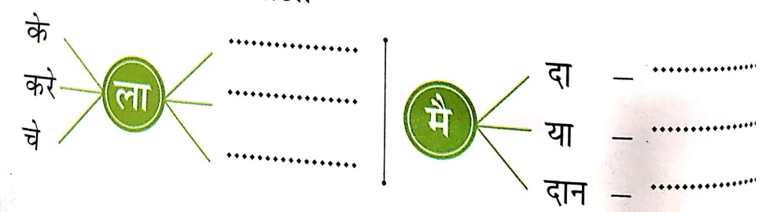

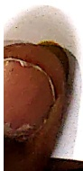

5. वर्णों को सही क्रम में लिखकर शब्द बनाओ—

(क) र या त  

(ग) क रा त  

(ख) त ह मे न  

(घ) न ता शे

## 6. चित्र देखकर रिकत स्थान भरो—

(ค)

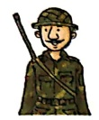

..... देश की रक्षा करता है।

(उ)

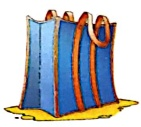

भरकर सामान लाई।

(π)

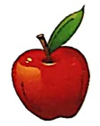

खाता है।

7. सही शब्द पर (√) का निशान लगाओ-

(क) थैला ○  थैला ○

(ख) देश ○  देश ○

(ग) भेया ○  भैया ○

(घ) तैराक ○  तेराक ○

8. दो-दो शब्द लिखो-

Let's Explore

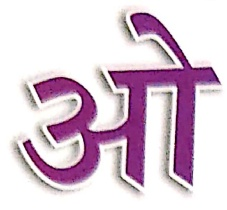

