#### ‘ओ’ की मात्रा (↑)

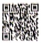

Let's Watch 1

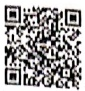

Let's Listen 1

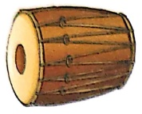

ཀུ་མཱ

होल

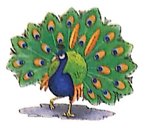

कोट

तोता

टोपी

मोर

शोर

छोटा

गोभी

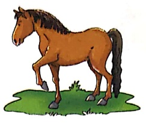

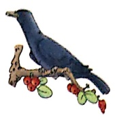

घोड़ा

कोयल

गोल

बोली

कटोरी

गोद

होली

टोकरी

जोश

धोबी

होलक

होश

मोटी

समो

##### पहले-

होली आ गई।

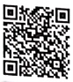

रोमी पिककारी लाईं।

Let's Learn

सोहन गुलाल लाया।

मोहन ने पिचकारी भरी।

པ་རུ

सबने खुब मजा किया।

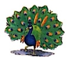

#### ‘‘ केी मात्रा सही जगह लगा

बाद में बच्चों की टोली ने गुझिया खाईं

टो-पी

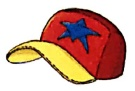

बज़ा-बजाकर सब नाचे।

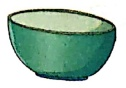

कटोरी

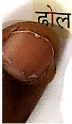

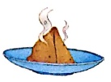

सम’ सा

संकेत-अध्यापक/अध्यापिका बच्चों से खाली

में स्टीकर चिकपाने को कहें।

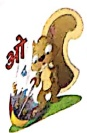

#### कोयल की टोकरी

Let's Watch 2

एक तोता था। उसकी मित्रता एक चोड़े

से थी। दोनों मित्र एक-साथ होली खेलते

थे। एक कोयल भी होली खेलने आती

थी। वह टोकरी में एक पोटली लाती

थी। पोटली में अखरोट और मिठाई लाती

थी। एक बार एक खरगोश ने टोकरी

रुचि। उसने टोकरी चुरा ली। दोपहर हो

है। तोता, घोड़ा तथा कोयल टोकरी लेने

गाए। टोकरी गायब थी। वे सब टोकरी

ं तलाश करने लगे। कोयल को टोकरी

ल गई। खरगोश को सजा मिली।

यल बहुत खुश हुई। सारे मित्र दोल

फाकर नाचने लगे।

Let's Listen 2

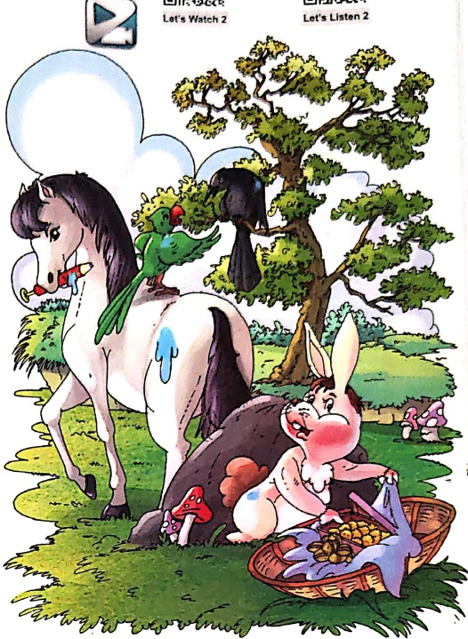

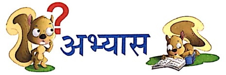

. चित्र देखकर शब्द भरो-

(क) एक ..... था।

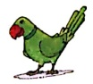

Let's Do 1

(ख) उसकी भिन्नता

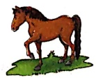

से थी।

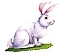

ने टोकरी चुरा ली।