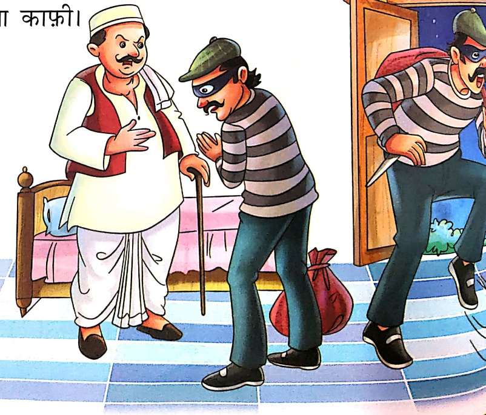
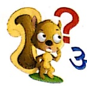
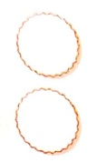
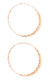
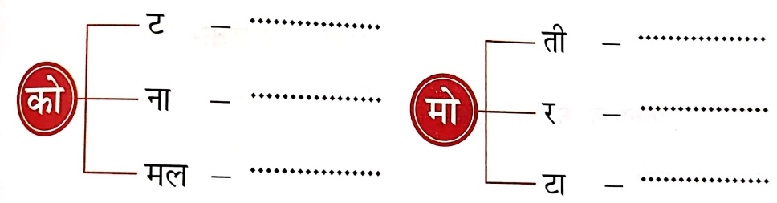
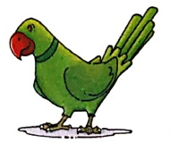
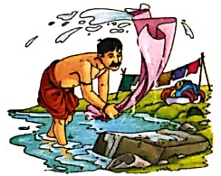
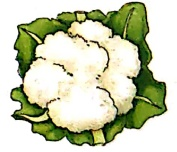

# चोரி छोड़ दी

Let's Watch 3

Let's listen to

एक चोर था तगड़ा-सा,

सबसे उसका झगड़ा था।

चोरी उसका काम था,

सोहन उसका नाम था।

देखकर चोर खुला दरवाजा,

चोरी करके सरपट भागा।

टोकर फिर खाई बरतन से,

सुन आवाज सेठ था जागा।

बोला चोर कि दे दो माफी,

सेठ ने उसको दे दी माफी।

छूट गई फिर चोरी उसकी,

भूल मानना ही था काफी।

#### अशेय

1. ‘से’ की मात्रा वाले शब्दों पर (√) का निशान लगाओ—

(ख) कोयल

## 2. प्रश्नों के उत्तर एक शब्द में लिखो—

Let's Do 2

(क)  चोर कैसा था?

(ख)  चोर का क्या काम था?

(ग)  चोर का क्या नाम था?

(घ)  सேत के माफ़क करने पर क्या हुआ?

## 3. जोड़कर शब्द बनाओ—

## 4. चित्र पहचानकर उनके नाम लिखो—

Let's Do 3

