#### ‘औ’ की मात्रा (①)

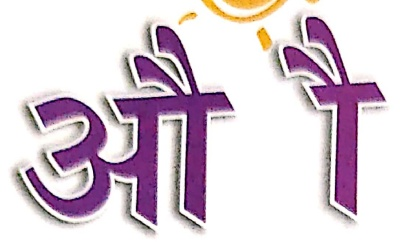

Let's Watch 1

Let's Listen 1

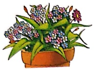

पोधा

ऑरत

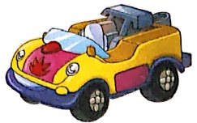

नौ

नौका

नैकर

विलानां

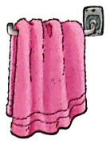

सौ

चौकी

मौसमी

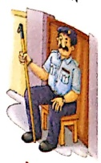

तोलिया

चौकीं दौर

दौर

गौरी

पकोडि

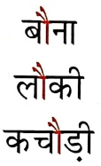

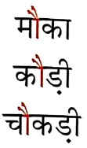

कोआ

मौसम

चौधरी

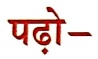

मौसी ने फल चौकी पर रखा,

मौनी ने उसे ठीक से परखा।

मौसमी काटकर जूस निकाला,

नौकर ने फिर नमक मिलाया।

तैलिये से साफ किए सब हाथ,

पकौड़ी भी थी सबके पास।

Let's Learn

जोड़कर शब्द बनाओं-

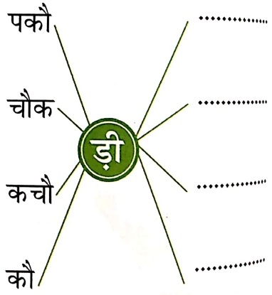

में स्टीकर चिपकाने को कहें।

#### पकोड़ी-कोछोड़ी

सोरव, गौरव थे दो भाई

पकोंड़ी, कचौड़ी पर हुई लड़ाई।

सोरव कहता - मेरी पकोड़ी।

गौरव कहता - मेरी कचोंड़ी।

इगड़ा सुनकर मौसी आई,

दोनों को फिर चपत लगाई।

चोंकी पर बिठाया उनको

मोसी ने समझाया उनको।

सबकी थी दो-दो कचोंड़ी।

सबकी थी दो-दो पकोड़ी।

अपनी खाकर दौड़ लगाओ,

चौकीदार से चाबी लाओ।

अब मत लड़ना दोनों भाई,

हड़ी तो होगी बहुत पिटाई।

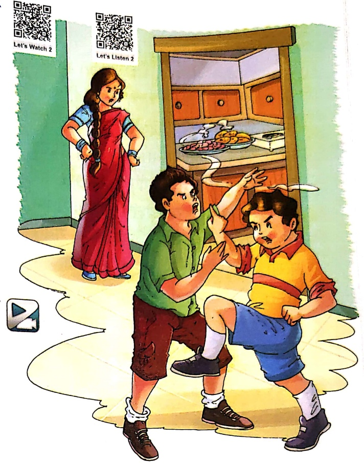

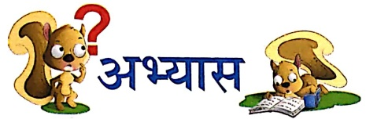

1. प्रश्नों के उत्तर दो-तीन शब्दों में लिखो—

(क) दोनों भाइयों के क्या नाम थे?

(ख) सौरव क्या कह रहा था?

(ग) गोरव क्या कह रहा था?

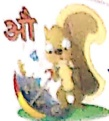

