# ग्रेव की मौसी

ग्रेगोरी की मौसी आई। मौसी के साथ

उनका बेटा सौरभ भी आया। नौकर

न मौसी के लिए गरम पकोड़ी और

कचौड़ी बनाई। इसके बाद नौकर

सौदा लेने चला गया। मौसी ने गौरव

को खिलोना दिया। गौरव बिछोने पर

बैठकर खिलोने से खेलने लगा। सौरभ

भी पास पड़ी चौकी पर बैठ गया।

मौसी ने माली से पोधे लगाने को

कहा। मौसी को पौधे लगाने का शोक

है। मौसी भी माली के साथ पोधे

Let's Watch 3

|

Let's Summarise

Let's Listen 3

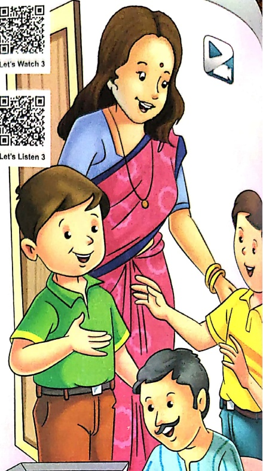

Let's Conclude

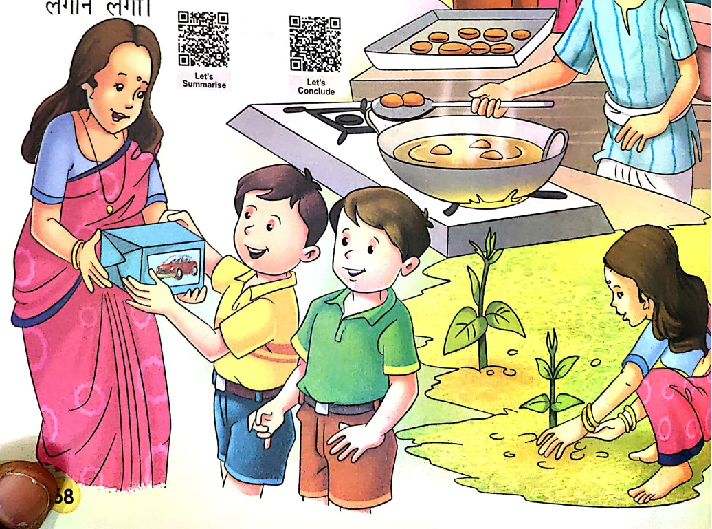

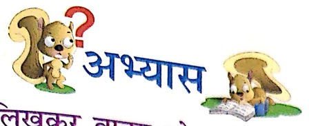

1. चित्त का नाम लिखकर वाक्य पूरे करो-

(ぁ)

Let's Do 1

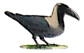

पेड़ पर बैठा है।

(ऑ)

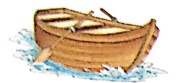

..... नदी में तैर रही है।

(π)

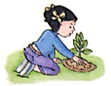

(घ)  सौरभ के हाथ में

लगा रही है।

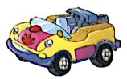

2. खालि स्थान भरकर प्रश्नों के उत्तर पूरे करो—

(क) गौरव के घर कौन आया?

गौरव के घर उसकी ..... आई।

Let's Do 2

(ख) नौकर क्या लेने चला गया?

नौकर ..... लेने चला गया।

(ग) मौसी को क्या लगाने का शोक है?

मौसी को ..... लगाने का शोक है।

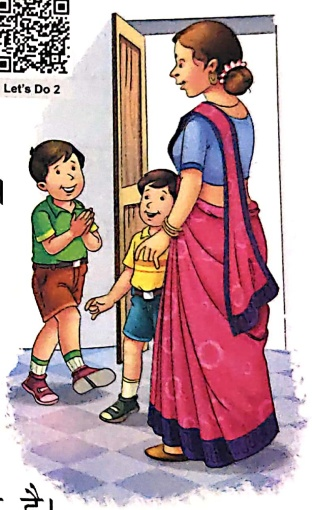

3. शब्द-सीढ़ी पूरी करो-

[Table 1](tables/table_001.html)

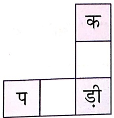

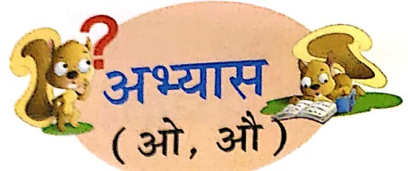

1. 'वे' अथवा 'वे' की मात्रा सही स्थान पर लगाओ—

ल म डी,  क य ल,  ख र ग श,  म र,  त ता

क च डी,  प क डी,  ख ल नै,  म स मी,  च ध रै

2. चित्र देखकर उचित शब्द लिखो—

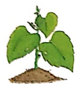

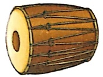

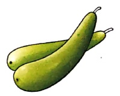

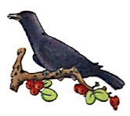

3. जोड़कर नए शब्द बनाओ—

शो

जो

मो

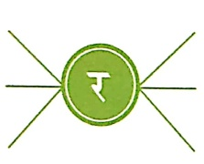

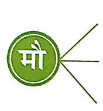

सी - .....

คำ — -----

सम - .....

4. सही शब्द चुनकर रिकत स्थान भरो—

(क) यह दूध की ..... है। (बोतल/बौतल)

(ख) नानी एक ..... लाई। (खिलोना/खिलोना)

(ग) ..... घास खा रहा था। (चोड़ा/चौड़ा)

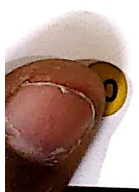

(घ) रमा ..... लाई। (अखरोट/अखरौट)

5. दो-दो शब्द लिखो-

(क) औ -

(ख) औ -

6. वपॉ को सही क्रम में लिखो-

(क) के री टो

(ख) र ह प दो

(ग) या लि तो

(घ) ड़ी म लो

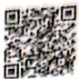

7. ‘ओ’ तथा ‘औ’ की मात्रा वाले शब्द अलग-अलग करके लिखो-

नौ सौ चूहे जब दौड़ कर आए, बिलली जी ने खूब उड़ाए।

नौकर बाजार से लाया खोया, खाकर खोया हाथ जो धोया।

पेंट ने खूब मचाया शोर,  रोते-रोते हो गई भोर।

द्वाई खूब खानी पड़ी, बिलली चूहे से खूब लड़ा।

ओ -  .....  .....  .....  .....

और -  .....  .....  .....

## 8. सही मात्रा को सही चित्रित से मिलाओ—

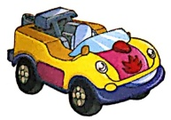

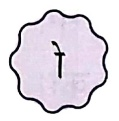

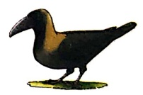

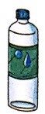

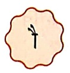

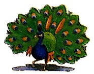

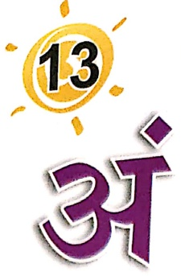

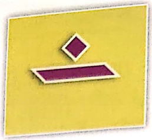

Let's Watch 1

Let's Listen 1

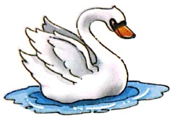

 $ \dot{H} $

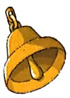

घंటి

अंक

झा

मंजन

पत्थग

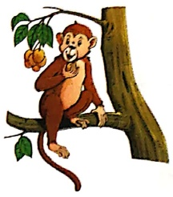

रंग

चंदा

मंगल

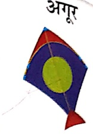

अंदर

पंख

॥

कचन

संग

कघा

जंगल

अंत

खंभा

कंगन

पांजा

गंदा

सतरा

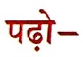

संजय सुबह आठ बजे उठा। मंजन करके ठेने पानी से नहाया। कंबे से बाल ठीक किए। कंचन के संग मंदिर गया। शंख बजाकर पूजा की। घंटा बजाया। फिर वे बाहर आए। कंचन ने रंग-बिरंगे सुदर कंगन खरीदे।

##### सही स्थान पर (−) लगाओ-

घटाघर

अगर

पत्नग

गेद

ཝེ

सत्रा

बदर

घटा

कघे

ठडा

में स्टीकर चिपकाने को कहें।

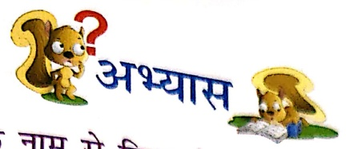

## 1. चित्तों को उनके नाम से मिलाओ-

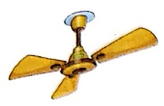

कर्णा

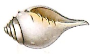

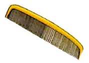

अंजा

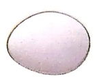

बंदर

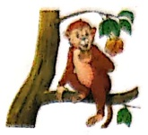

पंखा

शंत्र

2. चित्र पहचानकर उनके नाम लिखो—

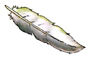

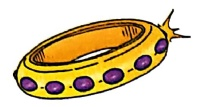

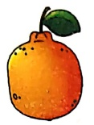

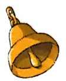

## 3. प्रश्नों के उत्तर लिखो—

(क) आठ बजे कौन उठा?

(ख) संजय कैसे पानी से नहाया?

(ग) संजय किसके साथ मंदिर गया?

## 4. जोड़कर नए शब्द बनाओ—

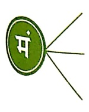

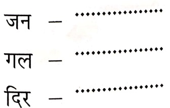

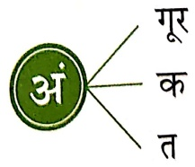

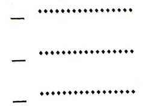

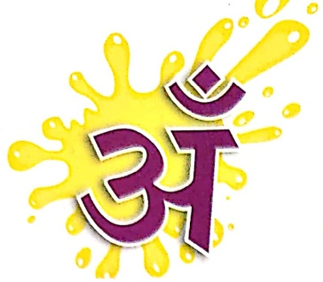

Let's Watch 2

Let's Listen 2

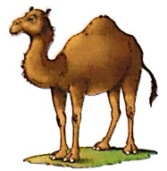

35

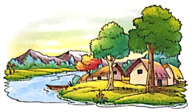

गांव

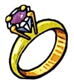

ऑगूठी

साँप

वहां

चूट

आगन

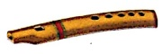

पाँच

जहा

सूड

छोटना

वाँसुरी

कहा

बाँस

गाठ

अंगूठा

दांत

चौद

बूद

आवला

यहाँ

टॉग

कोटा

अंगुली

##### पहले-

नदी किनारे गाँव है,

पेड़ों की तंडी छाँव है।

चारों तरफ हरियाली है,

सबके चेहरे पर लाली है।

आँगन में आँवले का पेড় लगा है,

उसके नीचे भैया खड़ा है।

मेरा नाम साँची है। मै शहर में रहती हूँ। मेरी माँ का नाम चौदनी है। वे हँसते-हँसते सारे काम करती हैं। जब मै खेलकर आती हुँ, वे मेरे हाथ-पाँव और मुह धुलवाती हैं।

अभियास

पढ़ो, बोलो और समझो—

तितली

Let's Do 1

तितिल्यां

चूंड़ी

चूंकि ऑस्ट्रेलिया

#### अब आप एक शब्द के अनेक शब्द लिखो—

कहानी

पहलेली

जल�ी

བཅུརི་

मछली

स्वारी

## 2. चित्त पहचानकर उनके नाम लिखो—

Let's Do 2

##### ) जोड़कर नए शब्द बनाओ—

Let's Watch 3

Let's Listen 3

प्रत:

규대

अत:  पुन:  अंतत:  शने:  स्वत:  पाय:

Let's

Summarise

बोल-बोलकर पढ़ो—

शनै: शने: तुम पढ़ना,

Let's Learn

पुनः पुनः याद करना।

नम: नम: सब जपना,

दुख में हँसते रहना।

प्रत: जल्दी तुम उठकर,

माता-पिता को सिर झुकाकर,

पुन: खेलना शाम को आकर।

स्वत: पाठशाला जाकर,

रिदमा प्रातः छह बजे उठती है।

शनै: शनै: पाठशाला जाने के लिए

तैयार होती है।

वह पुन: पुन: अपना पाठ याद करती है।

रंग भरो और लिखो यह किस समय का चित्र है—

2. दिए गए शब्दों से खालि स्थान भरो—

प्रत: , बंदर, चिडियाँ, झंडा, तितिल्यां

(क) ..... पेड़ पर बैठा है।

(ख) बाग में ..... उड़ रही है।

(ग) रिस्मा ..... छह बजे उठती है।

(घ) मोहन ..... फहरा रहा है।

(ड) दाना चुग रही है।

3. जोड़कर नए शब्द बनाओ—

अ

प्र

अंत

Let's Do 3

4. सही स्थान पर विसर्ग लगाओ—

पाय

पुन

शने

स्वत

# अभ्यास

( 3i, 3ẳ, 3π: )

1. सही वर्ष पर अनुनासिक (—) अथवा अनुस्वार (—) या

विसर्ग (:) लगाओ—

बदर, नम, पतग, बासुरी, अगूठी, झडा, प्रात

2. चित्र पहचानकर उनके नाम लिखो—

Let's Do

3. चित्रों को सही मात्रों से मिलाओ—

Let's Do 5

4. FIA

#### चित्र देखकर रिक्त स्थान भरो-

(ぁ)

(四)

कैला खाता है।

..... सेहत के लिए अच्छा होता है।

(π)

नदी किनारे है।

(घ)

संुदर दिखता है।

(5)

निकलता है।

#### सही शब्द भरो—

मोहन ..... बजाता है। (बांसुरी/बाँसुरी)

राहुल ..... उड़ा रहा है। (पतग:/पतंग)

मॉनार गई। (मंदिर/मॉनर)

वह ..... उठती है। (प्रतः/प्रत)

झूठ के ..... नहीं होते। (पांव/पाँव)

##### सुनो ध्यान से

Let's Listen (Listening)

##### पापक/अध्यापिका/वेब सपोर्ट् से वाक्य सुनकर रिक्त स्थान भरो-

पत्र ला रहा था।

नै चित्र बनाया।

2. दूधवाला ..... लाया।

4. ..... नाव चला रहा था।

Let's Watch

한국

丁

Let's Listen

29

राष्ट्रीय

रोडी

라

रमा

पाक्

पर्वत

नर्तक

सूयं

कर्म

धर्म

गर्ब

दर्प

सर्प

कार्य

पर्व

मागं

पर्ियटक

आशीवांद

##### पहले '/-/-

๑๑๖

गह

ཌཱཾ

इम

कम

देन

प्रतिक

डेस

वत

ट्राम

प्रकाश

राष्ट्र

##### मेरी मेट्रो

में रोज मेट्रो में जाती हुँ। वहाँ कम से चढ़ना पड़ता है। मेट्रो के मार्ग में कोई बाधा नहीं आती। सुर्य का प्रकाश आता है परंतु गम्मा नहीं लगती। मेट्रो राष्ट की प्रगति की सूचक है। मेट्रो में हम धर्म तथा जाति का फकर् नहीं करते। मेट्रो में कभी हम पाक के ऊपर से गुजरते हैं, कभी ऊँची मूर्ति के सामने से, तो कभी सड़क के नीचे से। इसमें धूप और वर्ण से बच्चे रहते हैं।

## 1. चित्रों को उनके नाम से मिलाओं—

Let's Do 1

こん

पर्व

ड्फूईफ़़् === जनवरी-मार्च ===

सर्प

2. चित्र देखकर वाक्य पूरे करो-

ภร

प्रतिक

से पानी निकालो।

से उत्तर।

Let's Do 2

गव्त

नृत्य करता है।

..... से चित्र बनाता है।

3. सही शब्द चुनकर उत्तर पूरे करो

(क) मेटो में कैसे चढ़ना पड़ता है? ..... से (कर्मा / क्रमा)

(ख) मेटो में क्या नहीं लगती? ..... (गम्री / ग्रमी)

(ग) मेट्रो में हम किसका फर्क नहीं करते?

..... और जाति का। (धरम / धर्म)

(घ) मेट्रो में हम किससे बच्चे रहते हैं?

धूप और ..... से। (वर्षा / वर्षि)

4. जोड़कर शब्द बनाओ—

## 5. निम्नलिखित वाक्यों का अनुलेख लिखो—

(क) माँ ने रोटी बनाई।

(ख)  सूयं निकल आया।

Let's Watch

$$\tilde{k}+\tilde{n}+3\pi$$

श

क्षत्रिय

Let's Listen

त्+र्+अ

त्र

त्रिशूल

ज्+ज्+अ

ज

शानि

 $ q_{1}+r_{1}+3 $

##### पहले-

एक क्षित्य कृपाण लेकर आया। वह मुनि के आश्रम में आया था। वह मुनि के यज की रक्षा के लिए आया था। मुनि बहुत शानी थे। उनके आश्रम में छात्र जान प्राप्त करने आते थे। वह श्रीमकीको वहाँ आकर श्रेष्ठ कथा श्रवण करने को कहते थे। मुनि को सादर पणाम है।

1. चित्रों को पहचानकर उनके नाम लिखो—

2. रिवत स्थान भरो—

यह एक

힘

(बृह्म / वरिकश)

Let's Do

शिवाजी के पास

(तिरशूल / त्रिशूल)

आज मुझे एक

(पत्थर / पत्र)

3. सही शब्द चुनकर प्रश्नों के उत्तर लिखो—

(क) क्षित्य क्या लेकर आया?

(कृपाण/धनुष-बाण)

(ख) क्षित्य किसकी रक्षा के लिए आया?

..... की

(आश्रम/यह)

(ग) छात्र आश्रम में क्यों आते थे?

प्राप्त करने।

(विशान/शान)

#### द्विति व्यंजन व संयुक्तक्षर

द्वित्य व्यंजन

a

संयुक्तवादियों

रस्सी

Let's Watch

Let's Liston

सवंज़ी

विस्फूट

विलंबित्त

गुण और

पुस्तक

पवका

क चचा

अस्सी

लस्मी

अध्यापक

मम्मी

कुत्ता

गद्दा

लड्डू

गना

पता

मक्का

चमलच

प्याज

मक्खी

मच्छर

पत्थर

ग्वालो

तछौ

युद्ध

चिट्ठी

विधन

गुंछा

कांना

समाप्त

##### बोल-बोलकर पढ़ो-

पम्मी लेकर आई मक्का,

बिलका छिल निकाला मक्का।

साग बनाया खट्टा-खट्टा,

आम मिलाया कच्चा-कच्चा।

चमच से फिर उसे चलाया,

सब बच्चों ने जमकर खाया।

हमारे अध्यापक बहुत अच्छे हैं।

हम उनसे विद्या प्राप्त करते हैं। वे

हमें सत्य बोलना सिखाते हैं। वे हमें

स्वच्छ रहना सिखाते हैं। वे नित्य हमें

अच्छी बातें सिखाते हैं।

1. दिए गए द्वित्त व्यंजनों तथा संयुक्तताशरों से बने दो-दो शब्द लिखो-

कक - .....

मम - .....

सत - .....

च्छ - .....

न - .....

2. चित्र का नाम लिखकर वाव्य पूरे करो-

(क) यह लकड़ी का

Let's Do 1

……

(ख) इस को भगा दो।

(ग) बाजार से

…… ले आओ।

(ཕ)

नेहां ने

..... लिखा।

## 3. चित्रों को उनके नाम से मिलाओं—

Let's Do 2

बिल्मी

ग्वालா

कुत्ता

पुस्तक

4. जोड़कर नए शब्द बनाओ—

अ

व्य

म

स

ब

क

5. उचित शब्द से रिक्त स्थान भरो-

पम्मी लाई

(

[मक्का/पक्का]

साग बनाया "……।

[मट्ठा/खट्टा]

आम मिलाया *****।

[तीख़ा/कच्चा]

..... से फिर उसे हिलाया,

सब बच्चों ने ***** खाया।

[चममच/गना]

[जन्मकर/जन्मकर]

### ड्-ह्, ज्-फ्, औ (−)

Let's listen

[Table 2](tables/table_002.html)

## 1. चित्र पहचानकर उनके नाम लिखो—

Let's Do 1

## 2. सही वर्ष चुनकर लिखो—

Let's Do2

इंगेन ग्लेन टीमर

##### दसवेड़ी

Let's Watch

Let's Listen

समझो और लिखो-

ह.....

##### सुनो ऋण से

Let's Listen (Listening)

अध्यापक/अध्यापिका/वेब सपोर्ट् से पहली सुनो और सही उत्तर लिखो-

1. 2. 3.

4. …… 5. …… 6. ……

Let's Watch

Let's Listen

जब बोलो, तब हँसकर बोलो,

बातों में मिसरी-सी घोलो।

जब बोलो, तब सच-सच बोलो

कभी न बाते रच-रच बोलो।,

जब बोलो, तब झुककर बोलो,

सोच-समझकर, रूककर बोलो।

हँसकर मन की गाँठे खोलो,

जब बोलो तब हँसकर बोलो।

##### अभ्यास

1. सही उत्तर छॉटकर लिखो—

Let's Do t

(क) हमारी बातें कैसी होनी चाहिए?

(मठरी जैसी / मिसरी जैसी)

(ख) हमें कैसी बातें नहीं बोलती चाहिए?

(सच-सच / रच-रच)

(ग)  मन की गाँठे कैसे खोलनी चाहिए?

..... (हँसकर / रोकर)

(घ) हमें कैसे बोलना चाहिए?

(सोच-समझकर / लड़-झगड़ कर)

2. चित्रों को देखकर शब्द सीढ़ी पूरी करो—

Let's Do 2

3. जोड़कर शब्द बनाओ—

रो

हँस

ना

.....

.....

| बो

खो

लो

.....

4. सही शब्द चुनकर पंकितयाँ पूरी करो-

जब बोलो, तब ..... बोलो,

में मिसरी-सी .....।

जब बोलो, तब ..... बोलो,

कभी न बातें ..... बोलो।

5. उल्टे अर्थ वाले शब्द लिखो—

हँसकर

सच

Let's Do 3

6. नीचे दिए शब्दों से वाव्य बनाओ—

(क) मिसरी -

(ख) हँसकर -

(ग) कबूतर -

(घ) काँपी -

(ड) स्माल -

जीवन कौशल (Life skills)

सही चित्र पर 😊 का स्टीकर व गलत चित्र पर 😊 का स्टीकर चिपकाओ—

Let's Smile

##### सुनो ध्यान से

Let's Listen (Listening)

अध्यापक/अध्यापिका/वेब सपोर्ट से प्रश्न सुनकर उनके उत्तर एक शब्द में लिखो।

1. ……

3. ……

4. .....

5. ……

म्यांक-म्यांक बोल-बोलकर,

इधर-उधर रहती मैंडराती।

जब भी पा जाती है मौका,

इटपट घर में है घुस जाती।

लाख लगा लो उस पर पहरा,

दूध-दही वह चट कर जाती।

जब दिख जाए कोई चूता,

मार झपट्ठा वह खा जाती।

दिवच जाए जो खीर-मलाई,

लप-लप करके वह खा जाती।

अगर पकड़ लो चोरी उसकी,

भोली-भाली है बन जाती।

Let's Watch

Let's Listen

##### अ१가

1. समान अर्थ वाले शब्द जानो और लिखो—

में - मना

राजा - गुण

शाय - कर

आँख - गयन

పర - పృథ

शాम - संख्या

2. प्रश्नों के उत्तर एक वाक्य में लिखो—

(क) मेघा किसके साथ बाजार गई?

Let's Do 1

(ख) माँ ने हाथ में क्या पकड़ा था?

(ग) प्रतिदिन क्या खाने से डॉक्टर की ज़रूरत नहीं पड़ती?

(घ) फलों का राजा कौन है?

[Table 3](tables/table_003.html)

4.्रंग भरो व नाम लिखो—

सज्जन्याँ
 

#### गानती

Let's Explore

[Table 4](tables/table_004.html)

जीवन कौशल (Life skills)

सही चित्र पर 😊 का स्टीकर व गलत चित्र पर

का स्टीकर चिपकाओ—

##### सुनो ऋण से

Let's Listen (Listening)

#### अध्यापक/अध्यापिका/वेब सपोर्ट से पहली सुनो और सही शब्द पर गोला लगाओ—

1. आम/जानुन

2. नाशपाती/सेब

3. अंगूर/सत्रा

4. आम/अनार

