# 23 चिडियाधर

Let's Watch

Let's Listen

चलो चले हम सब चिड्याचर,

ममी और पापा के साथ।

वहाँ मिलेंग काले भालू,

करते आपस में कुछ बात।

हिरन भी होंगे, बंदर भी होंगे,

होंगे खरगोश और चीता।

दरिया में होगा घिड्याल,

शायद जल को पीता।

हाँ मिलेंगी प्यारी चिडियाँ,

ते गीत सुनातीं।

छली होंगी, बतखें होंगी।

हरी पर इठलातीं।

तोते, उल्लू, हंस और बगुले,

वहाँ मिलेंगे सारे।

वहाँ जिराफ और जेला होंगे,

लगते मन को प्यारे।

हाँ मिलेंगे शेर और हाथी,

ज-तेज चில்लाते।

धिड्याचर के पशु-पक्षी,

मेरे मन को भाते।

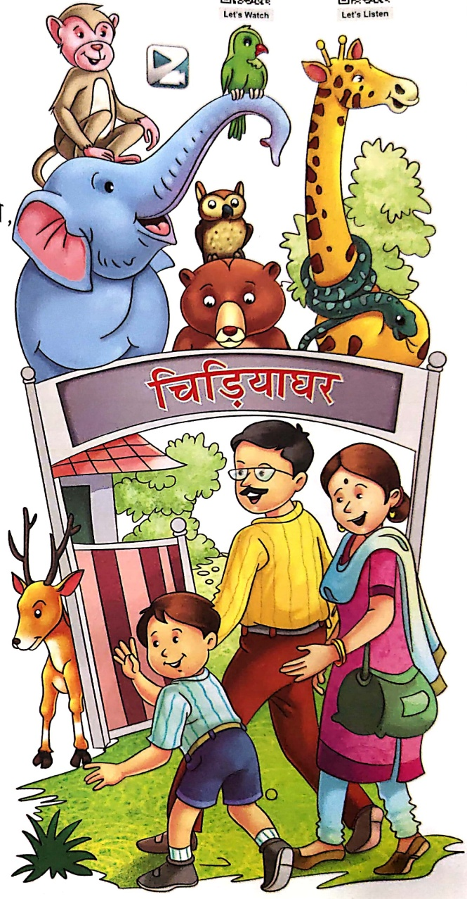

#### চিডিয়ার

Let's Do 1

## 1. चित्र देखकर नाम लिखो-

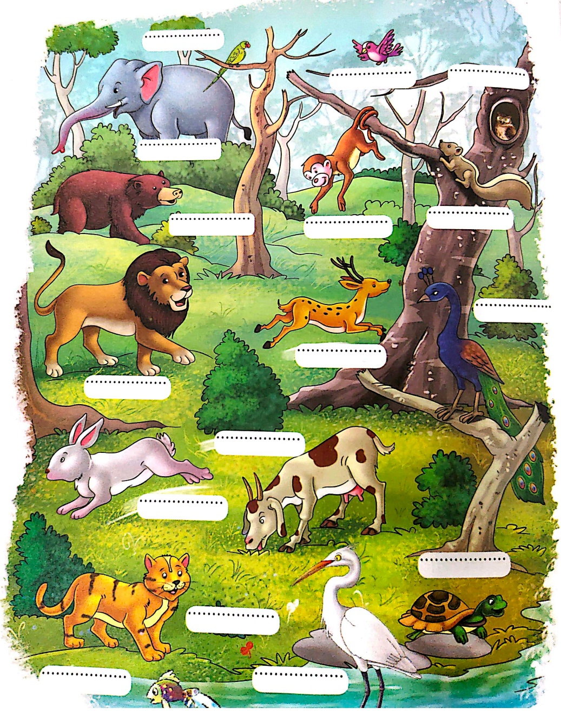

2. खालि स्थान भरकर प्रश्नों के उत्तर पूरे करो—

(क) हम चिडियाघर किसके साथ जाएंगे?

हम चिडियाघर

कै साथ जाएंगे।

Let's Do 2

(ख) भालु वहाँ क्या कर रहे होंगे?

भालु वहाँ आपस में ..... कर रहे होंगे।

(ग) प्यारी चिड्यों वहाँ क्या कर रही होंगी?

प्यारी चिड्यों ..... रही होगी।

## 3. चित्र देखकर उनके नाम लिखो—

(ค)

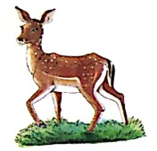

(ऑ)

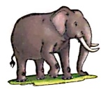

(π)

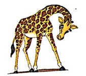

(๒)
 

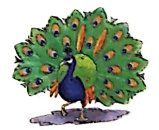

(ذ.)

(چ)

सही चিত्र पर 😊 का स्टीकर व गलत चিত्र पर  का स्टीकर चिपकाओ—

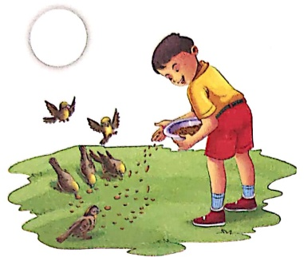

Let's Smile

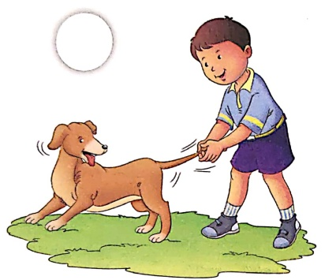

##### सुनो ध्यान से

### अध्यापक/अध्यापिका/वेब सपोर्ट से प्रश्नों को सुनें और सुनकर सही उत्तर में रंग भरे—

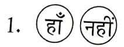

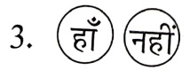

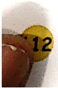

