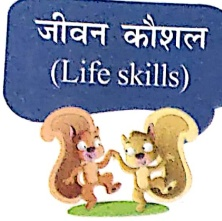
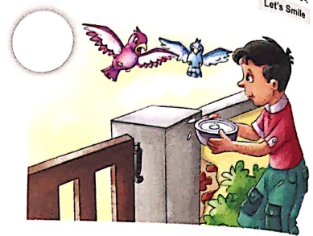
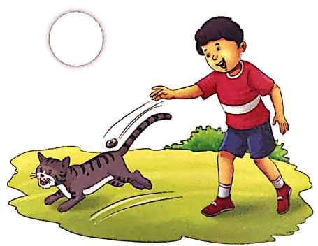
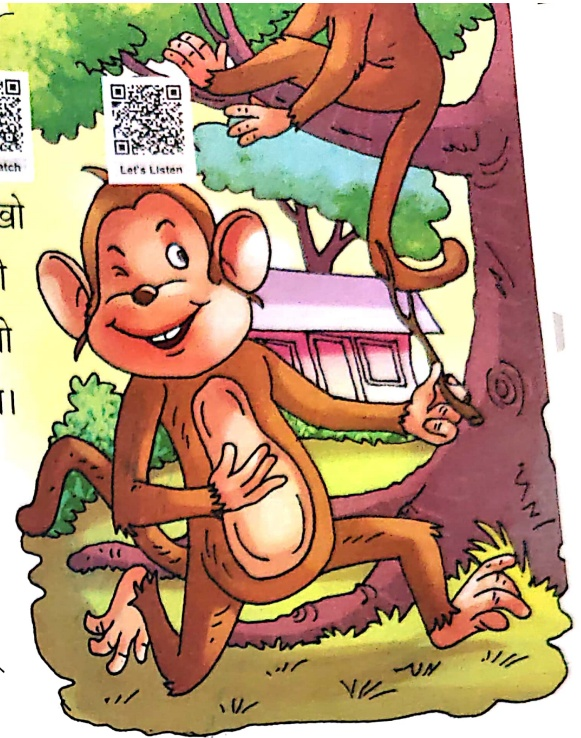
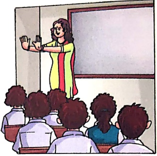
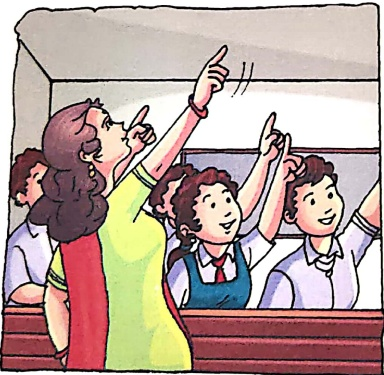

# 23 चिडियाधर

Let's Watch

Let's Listen

चलो चले हम सब चिड्याचर,

ममी और पापा के साथ।

वहाँ मिलेंग काले भालू,

करते आपस में कुछ बात।

हिरन भी होंगे, बंदर भी होंगे,

होंगे खरगोश और चीता।

दरिया में होगा घिड्याल,

शायद जल को पीता।

हाँ मिलेंगी प्यारी चिडियाँ,

ते गीत सुनातीं।

छली होंगी, बतखें होंगी।

हरी पर इठलातीं।

तोते, उल्लू, हंस और बगुले,

वहाँ मिलेंगे सारे।

वहाँ जिराफ और जेला होंगे,

लगते मन को प्यारे।

हाँ मिलेंगे शेर और हाथी,

ज-तेज चில்लाते।

धिड्याचर के पशु-पक्षी,

मेरे मन को भाते।

#### চিডিয়ার

Let's Do 1

## 1. चित्र देखकर नाम लिखो-

2. खालि स्थान भरकर प्रश्नों के उत्तर पूरे करो—

(क) हम चिडियाघर किसके साथ जाएंगे?

हम चिडियाघर

कै साथ जाएंगे।

Let's Do 2

(ख) भालु वहाँ क्या कर रहे होंगे?

भालु वहाँ आपस में ..... कर रहे होंगे।

(ग) प्यारी चिड्यों वहाँ क्या कर रही होंगी?

प्यारी चिड्यों ..... रही होगी।

## 3. चित्र देखकर उनके नाम लिखो—

(ค)

(ऑ)

(π)

(๒)
 

(ذ.)

(چ)

सही चিত्र पर 😊 का स्टीकर व गलत चিত्र पर  का स्टीकर चिपकाओ—

Let's Smile

##### सुनो ध्यान से

### अध्यापक/अध्यापिका/वेब सपोर्ट से प्रश्नों को सुनें और सुनकर सही उत्तर में रंग भरे—

## 24 गुलाब ने कहा

लंदर बहुत शररती था। जब देखो

कुछ-न-कुछ गड़बड़ करता रहता था। कभी

किसी की पूछ खींचकर भाग जाता, तो

कभी खीं-खी कर दूसरों का मजाक उड़ाता।

लट्ट की माँ उसे रोज समझाती, पर वह

नहीं मानता।

एक दिन लट्टू ने गुलाब का एक पौधा

देखा। बड़-बड़, लाल-लाल गुलाब। लट्टू

को वे बहुत सुंदर लगे। लट्टू न एक

गुलाब को तोड़ने के लिए हाथ

बढ़ाया। उसे अचानक किसी के

रोने की आवाज सुनाई दी। लट्टू

ने ध्यान से देखा, पर वहाँ कोई

नहीं था।

तभी लट्दू की नजर उसी

गुलाब पर पड़ी। गुलाब के

गालों पर दो मोटे-मोटे आँसू

लुढ़क आए थे। लट्दू ने

हरण होकर पूछा—“तुम क्यांटो रहे हो?”

“तुम मुझे मत तोड़ो। यह पौधा मेरा घर है। मुझे यही रहना अच्छा लगता है। मैँ तुम्हे भीनी-भीनी खुशबू दूगा। उस खुशबू से तुम्हारा तन-मन हमेशा खुश रहेगा।”

-गुलाब ने कहा।

गुलाब की मास्फ़िमियत देख लट्टू मान गया।

उसने फूल-पितयों को कभी न तोड़ने की कसम खाईं।

##### अ१गास

1. सही उत्तर पर सही (√) का निशान लगाओ—

Let's Do

(क) लट्दू कैसा बंदर था?

शरारती

भोला-भोला

(ख)  बड़े-बड़े लाल-लाल क्या थे?

आम  □ गुलाब के फूल

(ग) 'यह पौधा मेरा घर है' - यह किसने कहा?

गुलाब ने

□ लट्टू ने

2. प्रश्नों के उत्तर लिखो—

(क) एक दिन लट्टू ने क्या देखा?

(ख) लट्दू को क्या सुनाई दिया?

(ग) लट्टू ने गुलाब से क्या पूछा?

(घ) गुलाब ने लट्टू को क्या उतर दिया?

.....

3. अगर आपकी माँ भी आपको शरारत करने के लिए मना करें, तो आप क्या करोगे? सोचकर सही उत्तर के सामने (✓) का

निशान लगाओ—

(क) शरारत करना बंद कर देगे।

(ख)  थोड़ी शरारत करते रहेगी।

(ग) माँ से छिपकर शरारत करेंगे।

Let's Explore

(घ) माँ की बात नहीं मानेगे।

4. रिक्त स्थान भरो-

(क) लट्टू एक ..... था।

(ख) गुलाब ..... रंग का था।

(ग) लट्टू की ..... उसे समझाती।

(घ) गुलाब हमें ..... देता है।

#### बहुत हुआ काम-अब करो आरम्भ

Let's Excite

आओ बच्चों पারে प्यारे।

बैठो हाथ बढ़ाओ सारे॥

हाथ के पंजे सामने लाओ।

उंगिलियाँ कितनी हैं बतलाओ॥

एक हाथ में पाँच उंगिलियाँ।

हर उंगली में छिपी शक्तियाँ।।

मुट्టి बनाकर इन्हे मिलाओ।

शक्ति एकता में बतलाओ॥

देखो ऊपर आँख उठाओ।

आसमान कैसा बतलाओ।

धरती और आकाश हमारा।

कितना सुदर प्यार-प्यारा।

आँख बंद कर शीश झुकाओ।

धन्यवाद प्रभु मन में गाओ।।

हरि-भरी इस सुदर धरती

की हरियाली और बढ़ाओ।।

