# 25 बिलली और दिल्ली

Let's Watch

Let's Listen

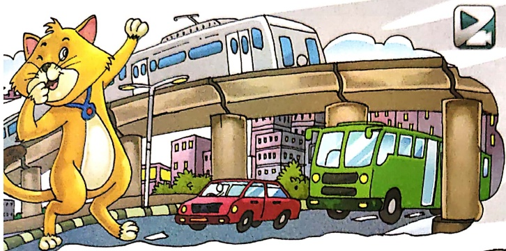

छोटी-सी बिलली,

पहुँच गई दिल्ली।

अटक गई मटक गई,

भटक गई बिलली।

कोई भी न जानता,

जगह भी है नई-नई।

कहाँ जाएं, कहाँ जाएं,

सोच रही बिलली।

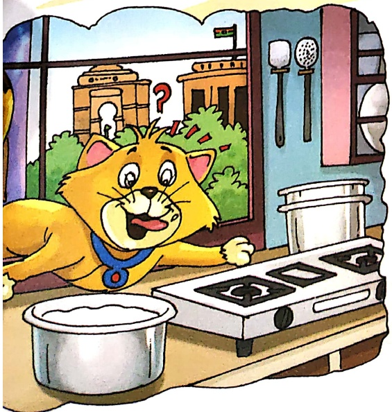

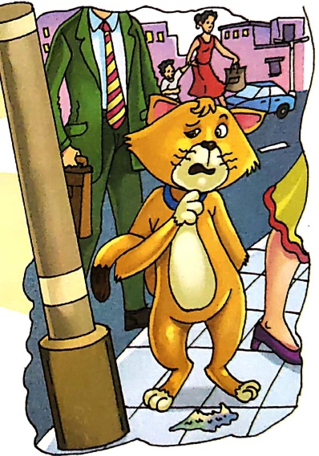

एक रसोई देखकर,

चौक गई बिलली।

दूध की पतिली देख,

खुश हुई बिलली।

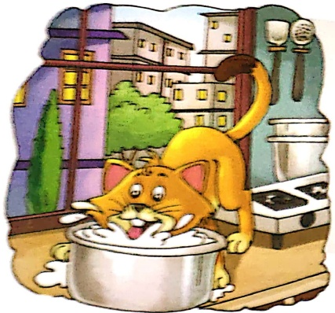

चटपट देखकर,

इटपट पी गई।

खटपट हुई तो,

भाग गई विलली।

हाथ फेर मुँह पर,

सोच रही विल्லी।

आते ही दूध मिला,

वड़ी अच्छी दिल्ली।

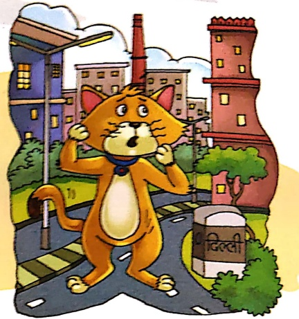

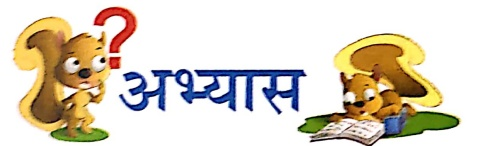

1. खालि स्थान भरकर प्रश्नों के उत्तर पूरे करो-

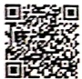

Let's Do 1

(क) विलली कहा पहुँच गई?

विलली

पहुँच गई।

(ख) विलली क्या देखकर खुश हुई?

विलली ..... देखकर खुश हुई।

(ग) विलली को दिल्ली कैसी लगी?

.....

2. दो-दो शब्द लिखो-

लल

चछ

-

Let's Do 2

3. पंक्तियाँ पूरी करो—

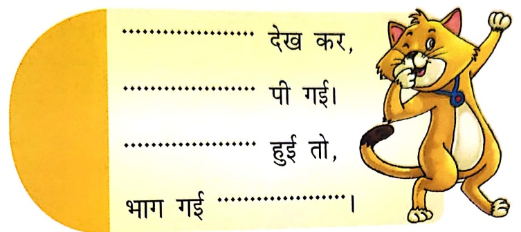

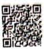

Let's DO J

4. सही-गलत के निंशान लगाओ—

(क) बिलली दूध पीती है।

(ख) आप दूध पीते हैं।

(ग) बिलली आगरा गई।

(घ) दूध रसोंई में पड़ा था।

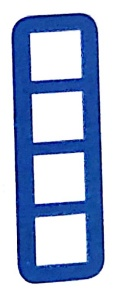

5. नीचे लिखे वाक्यों को देखकर फिर से लिखो—

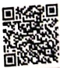

Let's Smile

(ख)  नौ सौ चूहे खाती है।