# निर्देश:- चित्र देखकर वाक्य पूरा कीजिए-

9. ___ लीची खा रही है।

२. ___ नाच रही है।

३. ___ जल की रानी है।

8. एक ___आया।

५. ___ समय बताती है।

६. ___ जलाकर जा।

७. ___ बजा।

ए. ___ जाला बनाती है।

[Table 1](tables/table_001.html)

दिनांक ___

निर्देश:- निम्नलिखित कविता को पदिएं। आ, इ और इ मात्रा वाले शब्दों को कविता में से दूढ़कर दी गई जगह में लिखित

अब आ बादल काले-नीले

अब आ बादल गड्गड्-गरजे

बादल दादा बादल दादा।

जल ला दादा आजा-आजा ।

[Table 2](tables/table_002.html)

सिसमिस-सिसमिसम तितली रानी

ड्शलमिल-ड्शलमिल तितली रानी

तितली रानी बड़ी सयानी

थिरक-थिरक कर नाची रानी।

[Table 3](tables/table_003.html)

रिमिझम-रिमिझम बरसा पानी

शीतल चलती हवा सुहानी

दादि के संग बैठी रानी

सुनी सभी ने नयी कहानी।

[Table 4](tables/table_004.html)

[Table 5](tables/table_005.html)

कोशल- मात्रा जान एवं शब्द निर्माण

दिनांक ___

निर्देश:- 'उ' (उ) की मात्रा लगाइए और नए शब्द बनाइए-

जैसे - कसम-कुसुम

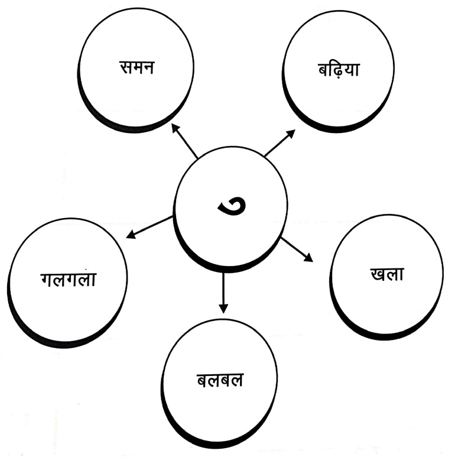

[Table 6](tables/table_006.html)

कोशल- मात्रा जान एवं शब्द निर्माण

दिनांक ___

निर्देश:- 'उ' (न) की मात्रा लगाकर दो-दो शब्द बनाइए-

जैसे-

[Table 7](tables/table_007.html)

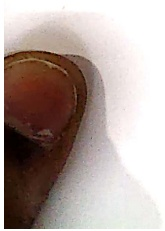

[Table 8](tables/table_008.html)

कौशल- चित्र पहचान एवं शब्द निर्माण

दिनांक ___

निर्देश:- चित्र पहचानकर ‘उ’ (−) की मात्रा वाले शब्द लिखिये-

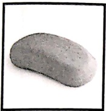

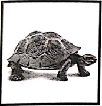

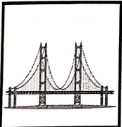

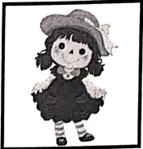

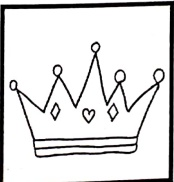

9. ___

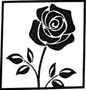

2. ___

3. ___

8. ___

4. ___

E.

[Table 9](tables/table_009.html)

कोशल- मात्रा बोध एवं शब्द निर्माण

दिनांक ___

निर्देश:- 'ऊ' (—) की मात्रा वाले वर्णों को दूढ़िए और शब्द बनाइए-

[Table 10](tables/table_010.html)

—— —— —— —— —— ——

वर्ण भिलाइए और शब्द लिखिए-

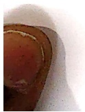

[Table 11](tables/table_011.html)

कौशल- चিত्र पहचान एवं शब्द निर्माण

दिनांक ___

निर्देश:- चित्र पहचान कर ‘ऊ’ (न) की मात्रा वाले शब्द लिखिए-

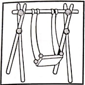

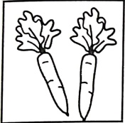

9. ___

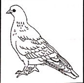

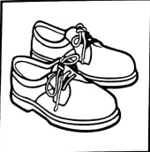

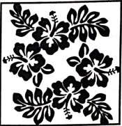

2. ___

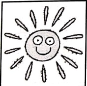

3. ___

8. ___

4. ___

n

[Table 12](tables/table_012.html)

कौशल- प्रत्यारमरण

दिनांक ___

निर्देश:- निम्नलिखित कविता को पढ़िए और ७, ७ की मात्रा वाले शब्दों को कविता में से

दूढ़ कर खाली स्थान में लिखिए-

सुबह सुहानी, बुलबुल गाए

गुडिया तुमके-तुमके करे आप

गुलाब, गुलमोहर खूشबू फैलाए

उमंड-घुमंड कर बादल छाए।

[Table 13](tables/table_013.html)

बुआ! आज लगा दे झूला,

इस झूले पर मैं झूलूगी।

इस पर चढ़ कर, ऊपर ऊँचा बढ़ कर,

आसमान को मैं छु लूगी।

[Table 14](tables/table_014.html)

[Table 15](tables/table_015.html)

कौशल- शब्द सामर्थ्य एवं प्रतिस्पर्धा

दिनांक ___

निर्देश:- दिए गए शब्दों को उनकी मात्रा के अनुसार लिखित

[Table 16](tables/table_016.html)

[Table 17](tables/table_017.html)

कोशल- मात्रा बोध एवं शब्द निर्माण

दिनांक ___

निर्देश:- दो व्यंजन जोड़कर 'ए' (−) की मात्रा वाले शब्द बनाइए-

[Table 18](tables/table_018.html)

二

दिए गए उदाहरण की तरह नए शब्द बनाइए-

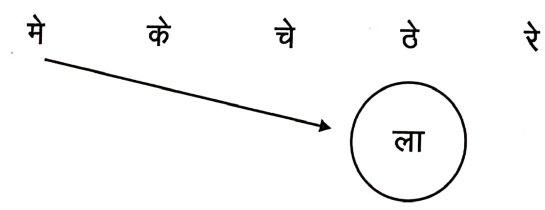

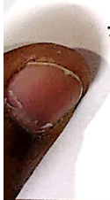

[Table 19](tables/table_019.html)

कौशल- चित्र पहचान एवं शब्द निर्माण

दिनांक ___

निर्देश:- चित्र पहचान कर रिक्त स्थान भरीए-

क) दिनेश ___ लाया।

ख) सहेली ___ पहन।

ग)  नरेश गरम ___ खा।

ध) मु केश ___ जला।

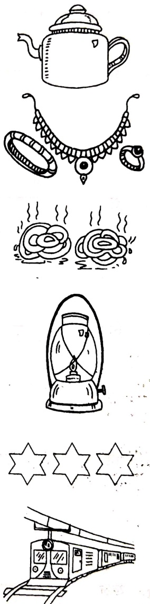

ड)  आसमान में ___ चमके।

च)  सवेरे —————— से बरेली जा।

[Table 20](tables/table_020.html)

कौशल- वाक्य निम्नलिखित हैं-

दिनांक ___

निर्देश:- नीचे दिए गए शब्दों से वाक्य बनाइए-

9. बेर

२. शोर ___

३.  तेल ___

8. पेड़

५. खेल ___

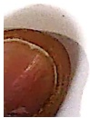

[Table 21](tables/table_021.html)

कौशल- शब्द सामर्थ्य एवं प्रतिस्पर्धा

दिनांक ___

निर्देश:- नीचे लिखें वाक्यों में से आ, इ, ई, ७, ७, एक की मात्रा वाले शब्द दूढ़कर लिखिए-

बाबूलाल के पास थी एक गाय, नाम था उसका भूरी,

थी वह सभी की प्यारी, दुनिया, दुनिया में निराली।

खाती वह हरी-हरि घास, रहते सब उसके आस-पास।

अत्त

ए

ए

ए

ए

ए

ए

[Table 22](tables/table_022.html)

कौशल- कल्पना एवं शब्द निर्माण

दिनांक ___

निर्देशा- थेले में रखी जाने वाली किन्हीं ५ वरतुओं के नाम लिखिए जिसमे

१. , , , , -, की मात्रा लगी हो एवं उनके चित्र भी बनाइए-

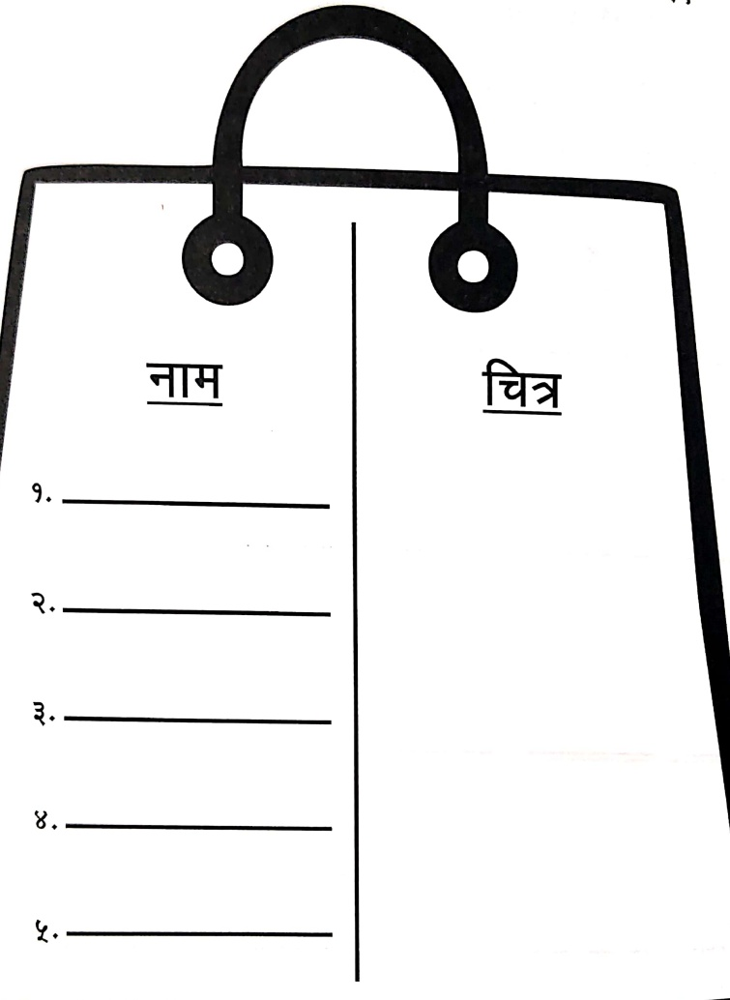

নাম

9. ___

विश्व

2. ___

3. ___

8. ___

4. ___

[Table 23](tables/table_023.html)

कौशल-शब्द सामर्थ्य

दिनांक ___

निर्देश:- नीचे दिए गए शब्दों में ‘ए’ (—) की मात्रा लगाइए-

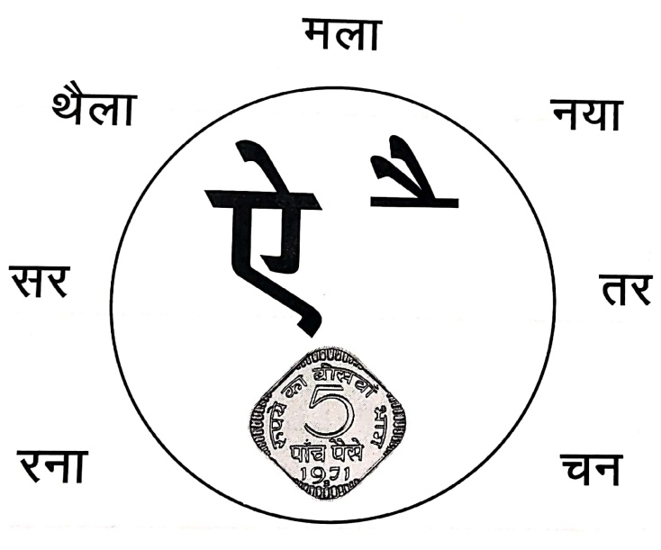

फ्ला
 

～～～～～～～～～～

कौशल-वाव्य निम्नण

दिनांक ___

निर्देशांको- नीचे दिए गए शब्दों से वाक्य बनाइए-

9. तैर

२. बैलगाड़ी ___

३. पैर

8. थैला ___

५. नैनीताल ___

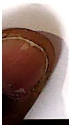

25

[Table 24](tables/table_024.html)

कौशल- मात्रा परिचय, शब्द निर्माण

दिनांक ___

निर्देश:- नीचे दिए गए शब्दों में सही जगह पर ‘ओ’ (이) की मात्रा लगाइए-

[Table 25](tables/table_025.html)

[Table 26](tables/table_026.html)

[Table 27](tables/table_027.html)

[Table 28](tables/table_028.html)

[Table 29](tables/table_029.html)

कौशल- कल्पना एवं शब्द निर्माण

दिनांक ___

अभ्यास कार्य

निर्देश:- 'ओ' (¹) की मात्रा को वस्तुओं के नाम लिखिए एवं उनके चित्र मेज पर बनाइए

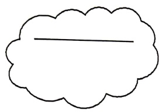

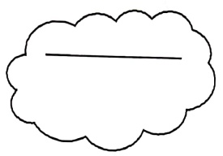

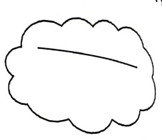

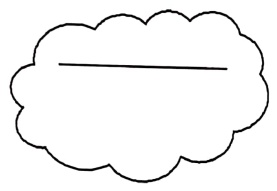

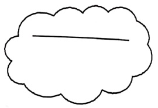

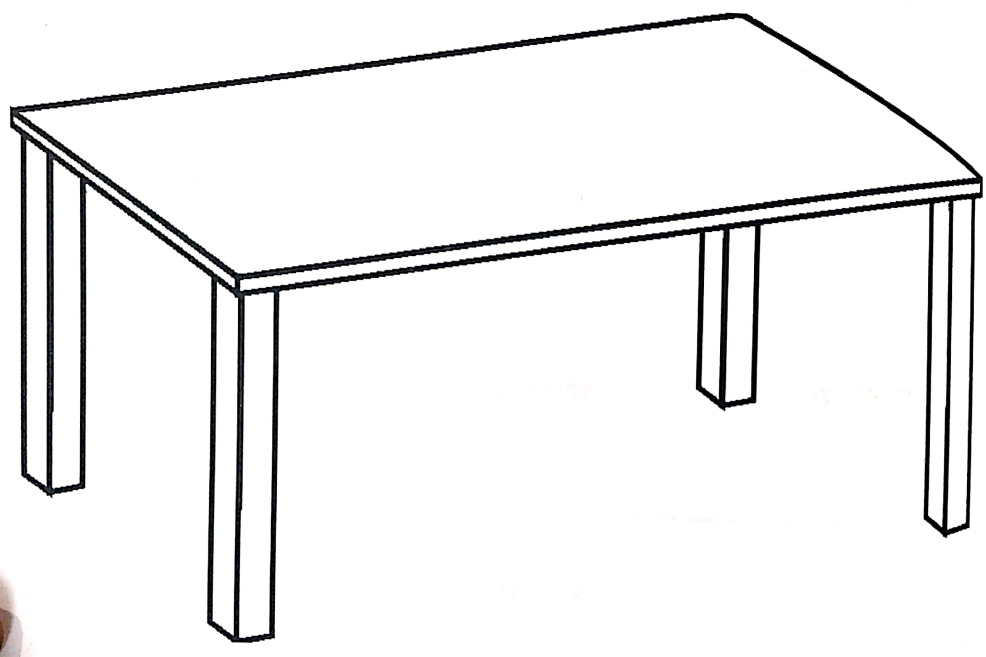

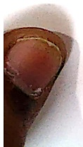

[Table 30](tables/table_030.html)

कौशल- वाक्य निम्नलिखित हैं-

दिनांक ___

निर्देश:- नीचे दिए गए चित्र को देख कर 'औ' (¹) की मात्रा वाले शब्दों से वाक्य बनाइए-

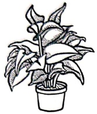

9. ___

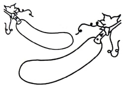

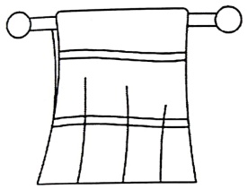

2. ___

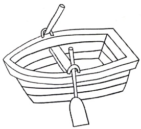

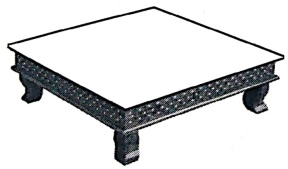

3. ___

8. ___

4. ___

[Table 31](tables/table_031.html)

कौशल- शब्द सामथ्य एवं प्रत्यासमरण

दिनांक ___

निर्देश:- नीचे दिए गए चित्र को देख कर उनमें सही मात्रा लगाइए और रंग भिर्गत

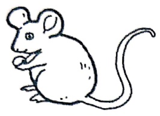

चा

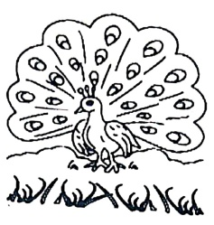

マラ

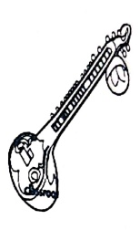

सत्ताएँ

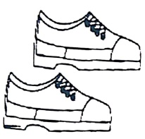

अत

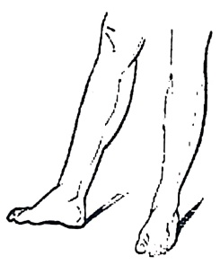

pr

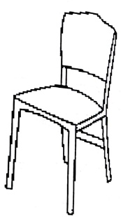

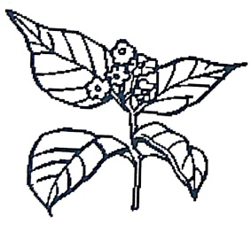

ครรร

పదా

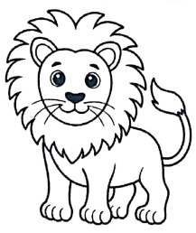

शर

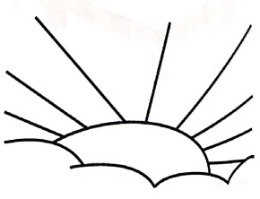

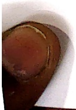

सबह

[Table 32](tables/table_032.html)

कौशल- शब्द सामग्री: मात्रा परिचय

दिनांक ___

अनुस्वार - अं (−)
 

निर्देश:- निम्नलिखित शब्दों में से 'अनुस्वार' शब्दों को छोڑ कर तालिका 1 में तथा अन्य शब्दों को तालिका 2 में लिखिए-

शब्द पेటి
 

पतंग, मछली, रंग, मंगल, काम, सपेरा,

सुगंध, कंचन, बंदर, सूरज, हंगामा, संसद

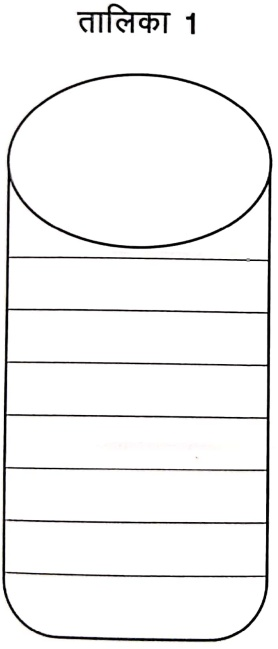

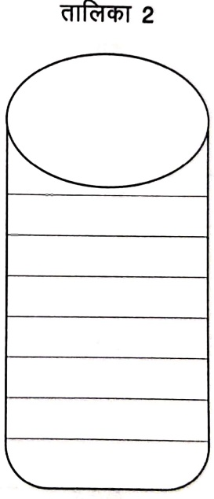

[Table 33](tables/table_033.html)

कौशल- शब्द सामध्य्य: प्रतियासरण

दिनांक ___

निर्देशांको- नीचे दिए गए शब्दों में 'अनुरवार'() लगाकर शब्द पुनः लिखित

शिव ___

झाडा

रग ___

चंपा ___

तग ___

मतः —

गगा ——

334 — —

मंगल ___

लवा ___

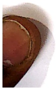

ककड़ ___

जगल —————

[Table 34](tables/table_034.html)

कौशल- प्रतियासमेंट

दिनांक ___

##### बारह खड़ी

[Table 35](tables/table_035.html)

[Table 36](tables/table_036.html)

कौशल- शब्द सामध्य्य: मात्रा परिचय

दिनांक ___

 $$ \underline{\mathrm{अनुनाशिक}}-\underline{\mathrm{चन्द्रबिदु}}\left( \right) $$ 

ぉ

อูซิ

う

చి

に

చ

ཀྱི

ᠵᠠ

ཧཱུྃ

 $$ 4C $$ 

de

64

34

印

สิ

Ỉ

35

Ả

う

다

や

읽

う

す

[Table 37](tables/table_037.html)

कौशल- शब्द सामध्य्य: मात्रा परिचय

दिनांक ___

निर्देश:- नीचे दी गई कविता को पढ़िए एवं 'अनुनासिक' (−) वाले शब्द दूढ़कर लिखित

चॉँद की चॉँदनी में, ___ ___

और मनाएँ खुशियाँ। ___ ___

[Table 38](tables/table_038.html)

[Table 39](tables/table_039.html)

कौशल- कल्पना एवं वाक्य निर्माण

दिनांक ___ अभ्यास कार्य

निर्देश:- नीचे दिए गए शब्दों से वाक्य बनाइए एवं उन्हें चित्र के माध्यम से दर्शाईए-

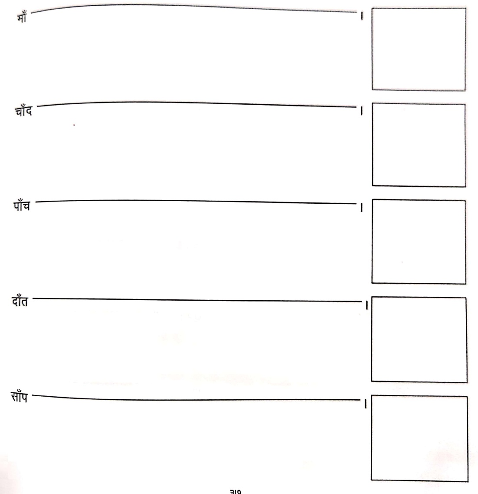

[Table 40](tables/table_040.html)

कौशल- शब्द सामथ्य: मात्रा परिचय

दिनांक ___

अर की मात्रा (–)

निर्देशांको- नीचे दिए गए शब्दों को देखकर पुनः लिखित

नृप

पृथ्वी ___

कृपा

वृक्ष ___

गृह ___

भृगु

कृषि ___ कृषिक ___

मृग ___  धृणा ___

दृश्य ___ अमृत ___

[Table 41](tables/table_041.html)

[Table 42](tables/table_042.html)

कोशल- शब्द सामथ्य: कल्पना एवं शब्द निर्माण

दिनांक ___

निर्देश:- निम्नलिखित वर्णों से आरम्भ होने वाली किसी एक वस्तु का नाम लिखित और चित्र बनाकर रंग भरिए-

वर्ण

[Table 43](tables/table_043.html)

[Table 44](tables/table_044.html)

कौशल- शब्द सामथ्य: प्रतियासमरण

दिनांक ___

#### संयुक्तताशर

9. क् + φ + अ + ধा = क्षमा

2. त् + र् + अ + ꞊ = पत्र

3. ज् + न् + अ + ड़ा = ड़ान

8. श् + र् + 3 + श = शम

[Table 45](tables/table_045.html)

कौशल- शब्द सामध्य्य: प्रतियासमरण

दिनांक ___

निर्देश:- नीचे दिए गए चित्र को देखकर सही संयुक्तक्षर लिखिए-

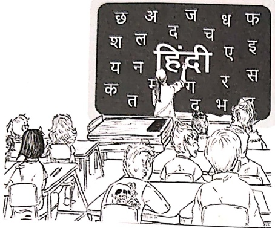

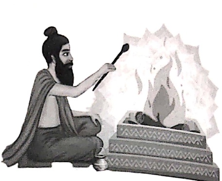

[Table 46](tables/table_046.html)

कौशल- शब्द सामथ्य: वर्ण परिचय

दिनांक ___

नीचे दी गई कहानी से द्विती व्यंजन शब्द छोट कर लिखी

[Table 47](tables/table_047.html)

[Table 48](tables/table_048.html)

[Table 49](tables/table_049.html)

कौशल- शब्द सामध्य्य: मात्रा परिचय

दिनांक ___

निर्देश:- "मै" या "में" लगाकर वाक्य पूरा करिए और रंग भरिए-

##### में पूजा कर रही है।

9. गिलास ___ पानी है।

2. आज ___ बाजार जाऊँगा।

३. चूहा बिल ___ घुस गया।

8. ___ खाना खा रहा हूँ।

५. ___ पाक ___ खेलता हूँ।

आसमान में चौद और तारे चमकते हैं।

[Table 50](tables/table_050.html)

कोशल- भाषा एवं व्याकरण: शब्द भेद

दिनांक ___

निर्देश- नीचे दिए गए रिक्त स्थान में संज्ञा शब्द लिखीए एवं उनके चित्र बनाइए-

9.

2. ___

2.

× ___

[Table 51](tables/table_051.html)

कौशल- शब्द भेद: वाक्य विन्यास

दिनांक ___

निर्देश:- निम्नलिखित शब्दों से वाक्य बनाइए-

9. सूरज - ___

२. छड़ी - ___

३. लखनऊ -

8. चुहिया - ___

५. ताला - ___

£. हिरन - ___

७. तितली - ___

ए. जलबी - ___

[Table 52](tables/table_052.html)

कौशल- शब्द भेद: शब्द चित्र

दिनांक ___

निर्देशांको- नीचे दिए गए शब्दों में से क्रिया शब्दों पर गोला बनाइएप तथा उनके चিত्र भी बनाइए-

लकड़ी, खेलना, गिलास, किताब, गाना, कछुआ,

पीना, कलम, लिखना, पेड़

9.

？

[Table 53](tables/table_053.html)

कौशल- शब्द भेद: प्रतियासमरण

दिनांक ___

निर्देश:- नीचे दिए गए वाक्यों में क्रिया शब्दों को रेखांकित कीजिए-

9.

मोहन नहा रहा है।

？
 

रोहन लिखता है।

3.

माला खाना खाती है।

8.

बजे मैदान में खेल रहे हैं।

4.
 

में दूध पिता हूँ।

ξ.
 

रिया सो रही है।

 $ 8\tau $

[Table 54](tables/table_054.html)

कोशल- शब्द भेद: प्रतियासमरण

ननक

पढ़ा:- नीचे दिए गए चित्र को देखकर क्रिया शब्द लिखिए-

9.
 

2.
 

3.
 

8.
 

4.
 

___

 $ £ $.
 

0.
 

___

て.
 

8€

[Table 55](tables/table_055.html)

कौशल- शब्द भेद: कार्यालयन

दिनांक ___

निर्देश:- निम्नलिखित वाक्यों में क्रिया भरीए-

9. शాम को पैदल ___

२. सुसन सुबह

३. रेखा ___ ।

8. माँ ने ___

५. रमेश पाठशाला ___

ए. तुम एक कहानी ___।

[Table 56](tables/table_056.html)

निर्देशांको- खालि स्थान पर उचित सर्वनाम शब्द भरीए-

२. ___ मेरे सच्चे मित्र हो।

३. ___ दुकान लखनऊ में है।

8. ___ चशमा सफेद है।

५. भारत ___ देश है।

£.

भुख लगी है।

0. कल ___ बुआ के साथ मेला देखने जाएंगे।

5. ___ का व्याना नाम है?

[Table 57](tables/table_057.html)

कौशल- शब्द परिचय: स्मरण

दिनांक ___

निर्देश:- निम्नलिखित शब्दों को याद करिए-

[Table 58](tables/table_058.html)

कौशल- वाव्य सामर्थ्य: कारियन्वयन

दिनांक

दिनांक

निर्देश- रेखाकित शब्दों के लिए बदलिए तथा लिंग के अनुसार क्रिया बदलकर वाक्य

पुन: लिजिए-

नाना जी बाहर टहल रहे हैं।

9.

2. श्र जंगल का राजा है।

2. ___

3. मेरा भाई कानपुर में रहता है।

3. ___

8. पेड़ के नीचे  $ \underline{\text{लड़की}} $ बैठी है।

8. ___

4. घोषी कपड़े धो रहा है।

4. ___

[Table 59](tables/table_059.html)

कौशल- शब्द सामध्य्य: स्मरण

दिनांक ___

शब्दों के विपरीत अर्थ विलोम कहलाते हैं।

निर्देश- निम्नलिखित विलोम शब्दों को याद कीजिये-

[Table 60](tables/table_060.html)

[Table 61](tables/table_061.html)

शाल- वाव्य सामथ्य: प्रतियासरण एवं कार्यव्यन

दिनांक ___

निर्देशा- रिक्त स्थान में रेखांकित शब्दों के विलोम लिखिए-

9. मेरे पास पुराना नहीं, ___ खिलोना है।

२. कहुआ ___ नहीं धीरे चलता है।

३. मै सुबह नहीं, ___ को खेलती हूँ।

8. राजा और रानी महल के अंदर नहीं, ___ टहल रहे थे।

4. कोआ  $ \underline{\text{सफेद}} $ नहीं, _____ होता है।

६. चाय  $ \underline{\text{उंडी}} $ नहीं, _____ थी।

कौशल- संख्या बोध

दिनांक ___

निर्देशांको- गणिती पक्षिए और याद कीजिए-

9. - एक

2. - दो

3. - तीन

8. - चार

५. - पाँच

ξ. - ∇:

0. - सात

. - आठ

ऑ. - नो

90. - दरस

[Table 62](tables/table_062.html)

कोशल- संख्या बोध एवं कार्यालयनयन

- सही मिलान करिए और शब्दों में लिखित

[Table 63](tables/table_063.html)

अंक

ཀྲ་ཉང

[Table 64](tables/table_064.html)

दिनांक ___

निर्देश:- निम्नलिखित मात्राओं के २-२ शब्द लिखिए-

。 ……

___ ___

† _____ _____

f ___ ___

[Table 65](tables/table_065.html)

निर्देशांको- किनही तीन मात्राओं वाले शब्दों के चিত्र बनाइए-
 

[Table 66](tables/table_066.html)

[Table 67](tables/table_067.html)

कौशल- चিত्र अवलोकन एवं वाक्य सामर्थ्य

दिनांक ___

निर्देशांको आधार बना कर कोई चार शब्द लिखिए एवं वाक्य बनाइए

9. ___

वाक्य-

२. ___

वाक्य- ___

३. ___

वाक्य-

8. ___

वाक्य-___

[Table 68](tables/table_068.html)

कौशल- रचनात्मक लेखन

दिनांक —  —

बर्ग्श्- चितन को आधार बनाकर ५ वाक्य लिखिए-

9.

2.

3.

8.

k.

कौशल- रचनात्मक लेखन

दिनांक ___

निर्देश:- चित्र को आधार बनाकर उसका वर्णन करिए-

मेले की सैर

[Table 69](tables/table_069.html)

कौशल- रचनात्मक लेखन

दिनांक ___

निर्देश:- कल्याण कीजिए कि आप मित्रों के साथ पिक्सिनक पर गए हैं। चित्र को आधार बनाकर अपने अनुभव लिखित

[Table 70](tables/table_070.html)

कौशल- भाषा सामर्थ्य एवं प्रतियासरण

दिनांक ___

निर्देश:- रिकत स्थान में खर लिख्छ-

##### पुनरावृत्ति कार्य

निर्देश- रिकत स्थान में स्वर लिख्न-

निर्देश- रिकत स्थान में व्यंजन भरीए-

क

च

ट

त

प

य

शा

ह

ज़

निर्देश- निम्नलिखित तालिका को पूर्ण कीजिए-

[Table 71](tables/table_071.html)

[Table 72](tables/table_072.html)

[Table 73](tables/table_073.html)

कौशल- थाषा सामध्य्य एवं प्रतियासरण

दिनांक ___

निर्देशांको- चिन्ह देखकर मिलान कीजिए-

[Table 74](tables/table_074.html)

कौशल- थाषा सामध्य्य एवं प्रतिस्पर्धा

निर्देश:- निम्नलिखित शब्दों में से 'अनुस्वार' (—) और 'अनुनासिक' (−) शब्दों को छोड़कर लिखिए-

9. निदेश:- अनुस्वार और अनुनासिक शब्दों को छोटकर लिखिए-

रंग  आँख  चंदन  पंकज  संगीता

ऊँट  साँप  डॉटना  मयंक  बाँसुरी

अनुस्वार

अनुनासिक

२. निदेश:- नीचे दिए गए रिकत स्थान को पूर्ण करिए-

  १. कौआ =होता है।

  २. मुझे =पसंद है।

  ३. = घर जाती हूँ।

  ४. = खाना बना रही है।

  ५. मेरी बहन = है।

३. निर्देश:- दिए गए शब्दों से वाक्य बनाइए-

9. मृग-

२. कृषिक

३. वृश-

[Table 75](tables/table_075.html)

कौशल- भाषा सामर्थ्य: शब्द बोध

9. निर्देशः- चित्त देखकर मिलान करिए-

पेड़

तोता

छाड़ा

छाला

हंसना

नोट

## २. निदेश:- सही शब्द पर गोला बनाइए:-

हँसना

हंसान

पंखा

पाउंड

पन्चा

খेंला

খెলা

थेल

গুল্লব

गुलब

गुलाब

[Table 76](tables/table_076.html)

कौशल- भाषा सामर्थ्य: रचनात्मक लेखन

निर्देश:- नीचे दिए गए शब्दों का प्रयोग करते हुए चित्र वर्णन कीजिए-

बच्चे, पंख, सुंदर, चोंच, काला, रंग-बिरंगे, उड़ना, घोंसला, माँ

二

[Table 77](tables/table_077.html)

कीकाम- कनचया हत शतायिकीकाम-

विमानक ___

##### 허가번호 폰이 참고하면서 허가번

निर्देशांको को आधार पर एक आकाशिक रेखा रूकाएं.

[Table 78](tables/table_078.html)

कौशल- तर्क, विश्लेषण एवं कल्पना बौध।

दिनांक ___

निर्देश:- पाठ के मनपसंद भाग को चित्र के माध्यम से दर्शिएर। यह भाग आपको क्यों पसंद है बताइए

[Table 79](tables/table_079.html)

कौशल- भाषा सामर्थ्य: विश्लेषण एवं भाव-बोध

दिनांक ___

निर्देशांको- नीचे लिखे अनुच्छेद को पढ़कर प्रश्नों के उत्तर दीजिए-

सीमा के घर में एक सुंदर बगीचा था। बगीचे में गुलाब, चमेली और सूरजमुखी के फूल खिले थे। बगीचे में एक आम का पेड़ था। सीमा और उसकी छोटी बहन मीना रोज सुबह बगीचे में खेलती थी। वे फूलों को पानी देती थीं और पेड़ के नीचे बैठकर किताब पढ़ती थीं।

प्रश्न-9. सीमा के घर में क्या था?

उत्तर-9. ___

प्रश्न-२. बगीचे में कौन-कौन से फूल खिले थे?

उत्तर-२. ___

प्रश्न-३. बगीचे में कौन-सा पेড় था?

उत्तर-३. ___

प्रश्न-8. अनुच्छेद में से किन्हीं दो संशा शाब्दों के नाम लिखिए-

उत्तर-४. ___

)

[Table 80](tables/table_080.html)

कोशल- चरित्र चित्रण, साक्ष्य एवं प्रमाण

दिनोंक ___

निर्देश- दिए गए अनुच्छेद को पढ़कर प्रश्नों के उत्तर दीजिए-

रमेश एक स्वस्थ बालक है। उसकी आँखें सुंदर और चमकीली हैं। वह बहुत ही आज्ञाकारी और दयालु बालक है। उसकी खेल-कूद में भी बहुत रुचि है। वह अपने मिट्रों की सहायता करता है। रमेश अपने अध्यापकों की बात ध्यान से सुनता एवं मानता है।

प्रश्न-9.  रमेश के स्वभाव की दो विशेषताएँ लिखिए।

उत्तर-9.

प्रश्न-२.  किसी एक विशेषता को प्रमाणित करती हुई पंक्ति लिखीं।

उतार-२. ___

[Table 81](tables/table_081.html)

कौशल- भाषा सामर्थ्य: विश्लेषण एवं भाव-बोध

दिनांक ___

निर्देश - नीचे लिखे अनुच्छेद को पढ़ कर प्रश्नों के उत्तर दीजिए-

एक नन्ना तोता पेड़ पर बैठा था। वह हर दिन सुबह जल्दी उठता था और आसपास के पेड़ों पर उड़ता था। तोते का रंग हरा था। उसे फल खाना बहुत पसंद था। तोता बहुत चंचल और खुश रहता था। वह अपनी मीटी आवाज में गाता भी था। बच्चे उसे देख कर खुश होते थे।

प्रश्न-9. नन्ना तोता कहाँ बैठा था?

उत्तर-9. ___

प्रश्न-२. तोता क्या करता था ?

उत्तर-२. ___

प्रश्न-3. तोते का रंग कैसा था?

उत्तर-३. ___

प्रश्न-8. आपको कौन सा फल खाना पसंद है और क्यां ?

उत्तर-8. ___

प्रश्न-५. अनुच्छेद में आए किन्हीं दो सर्वानाम शब्द डूढ़ कर लिखिए।

उत्तर-५. ___

निर्देश - खालि स्थान भरकर कविता पूर्ण कीजिए-

(बताते, प्रकाश, सिखलाते, खिलते, बढ़ते, आकाश, धार, सुनाते, जाते, संस्कार, दुलार, परिवार

हर दिन न्या कुछ हमें

वे धुव प्रहलाद की कहानिया ___

देते मुझको सभी —————

देवभाषा

कक्षा - १

##### विषयानुक्रमणिकா

प्रथम: पाठ:    
द्वितीय: पाठ:    
तृतीय: पाठ:    
चतुर्थ: पाठ:    
पश्चिम: पाठ:    
षष्ठ: पाठ:    
सप्तम: पाठ:    
अष्टम: पाठ:    
नवम: पाठ:    
दशम: पाठ:    
एकादश: पाठ:    
द्वादश: पाठ:    
ज्योदश: पाठ:    
चतुর্दशा: पाठ:    
पश्चदशा: पाठ:    
षोडशा: पाठ:    
सप्तदशा: पाठ:    
परिशिष्टाला    
प्रार्थना    
वर्णमाला    
बालगीतानि    
मात्रापरिचय:    
एहि एहि वीर रे    
दण्डलोगि अक्षरम्    
मातृभूमे नमः    
क्रियाबोधः    
भगवत्सुति:    
सड्बूच्बोधः    
असित-नासित    
पिपासितः काकः    
सुभाषितानि    
मम शरीरम्    
शूगाल: द्राक्षाफलं च    
अमरकोशः    
दिव्याणांगी    
पेगेशनो    
स्वतंत्रा: पाठ:    
पराश्धानि

3T

अनल

3π

आननम्

इंशा:

अनल: - आग, आननम् - चेहरा, इन: - सूरज, ईश: - ईश्वर

3

3:3

3

ཅུན་གནོ

来

สุขศาท:

お〓

ろ

乜

एणः

艹

ऐरावत :

3

ओदनम्

30

औषधम्

# अभ्यास:

##### चित्र हृद्रा लिखित।

#### わ

कमलम्

왕

खग:

ㄱ

गगनम्

གང

