# कल वाली बात

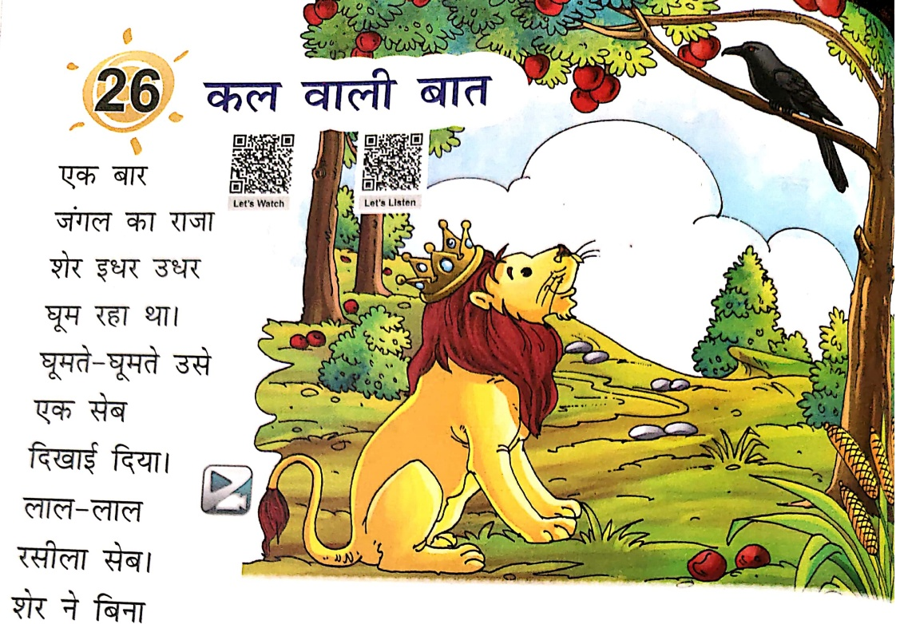

Let's Watch

एक बार

जंगल का राजा

शोर इधर उधर

चूम रहा था।

चूमते-चूमते उसे

एक सेब

दिस्वाई दिया।

लाल-लाल

रसीला सेब।

शोर ने बिना

धोए सेब चखा। रोज मांस खाने वाले शेर को सेब अच्छा नहीं लगा।

शेर ने सोचा - “में सेब नहीं खाता। लालच के कारण मैने सेब बिना

धोए खा लिया। अगर किसी ने देख लिया होता, तो वह सबको बता देता।

सब तो यही सोचते कि राजा शेर कितना गंदा है। बिना साफ़ किए कुछ

भी खा लेता है।"

तभी शेर ने देखा कि सुरीली कोयल ऊपर पेड़ पर बैठी मुसकुरा रही है।

गेर को लगा कि कोयल ने जस्त्र उसे गंदा सेब खाते देखा है। शेर चुपचाप

गपनी गुफा में आ गया।

गले दिन जंगल में उतसव था। वहाँ सुरीली कोयल भी आई थी। सबने

गयेल से गाने के लिए कहा। कोयल ने गाना शुरू किया—

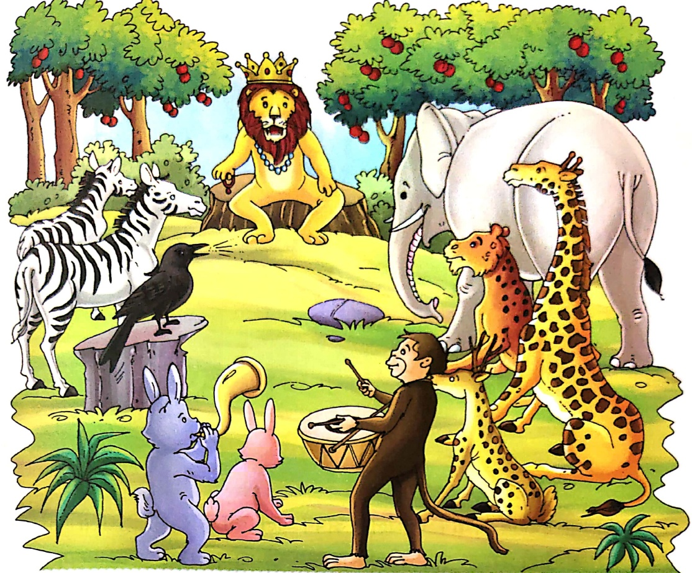

“राजा कल वाली बात बता दूगी।

चुप रहने के बदले ऑगूठी लूगी।”

राजा ने डरकर अपनी ऑगूठी कोयल को दे दी। सुरिली तो कोई बात जानती

ही नहीं थी। सुरिली ने सोचा, राजा को गाना बहुत अच्छा लगा। वह आगे

गाने लगी—

“राजा कल वाली बात बता दूगी।

चुप रहने के बदले हार लूगी।”

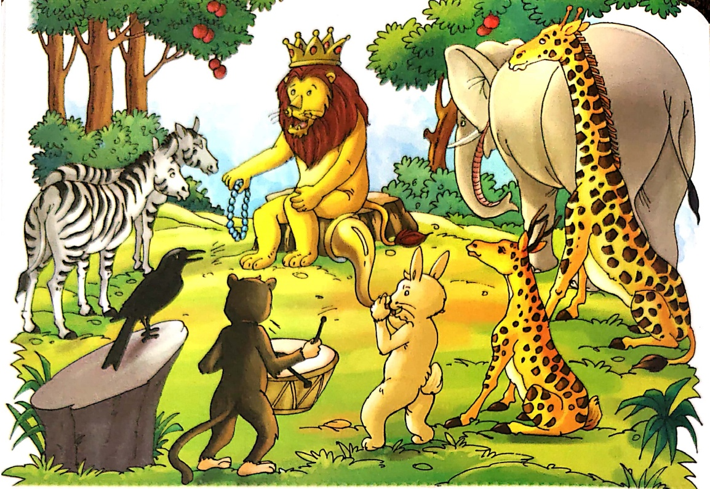

शेर ने अपनी इज्जत बचाने के लिए अपने गले का हार भी सुरीली को दे दिया। सुरीली यही समझ रही थी कि राजा को गाना बहुत अच्छा लग रहा है। सुरीली ने आगे गाना शस्क किया—

“राजा कल वाली बात बता दूगी।

चुप रहने के बदले मुकुट लूगी।"

कोयल का इतना गाना सुनते ही शेर को गुस्सा आ गया। वह बोला—“बता दो। क्या बताओगी? सेब ही तो खाया था बिना धोए। गलती हो गई। मुझे पता है, बिना धोए फल नहीं खाते।"

शेर को एकदम इतना गुस्सा होते देख सुरीली को कुछ भी समझ नहीं आया।

बाद में पूरी बात समझकर सभी जानवर हँसते-हँसते लोट-पोट हो गए।

Let's Learn

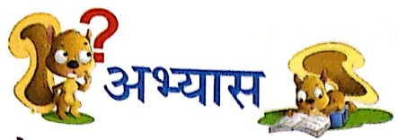

1. प्रश्नों के उत्तर दो-

(क) जंगल का राजा कहाँ घूम रहा था?

(ख) सेब कैसा था?

.....

(ग)  कोयल कहां बैठी थी?

.....

(घ) सबने कोयल से क्या करने को कहा?

.....

(ड)  शेर ने सुरीली कोयल को अपना क्या-क्या दिया?

.....

2. सही (√) अथवा गलत (×) का निशान लगाओ

(क) शेर ने बिना धोए सेब चखा।

(ख) जंगल का राजा हाथी था।

(ग) सुरिली कोयल मुसकुरा रही थी।

(घ) राजा को गाना अच्छा लगा था।

Let's Do 1

3. उल्टे अर्थ वाले शब्द लिखो—

उपर × …… | आगे × ……

अच्छा × …… कल × ……

Let's Do 2

4. कोयल ने शेर से जो वस्तुएँ माँगी, उनके नाम लिखिए—

5. वर्ग पहेली सुलझाओं—

दस जानवरों के नाम दूढ़कर लिखो

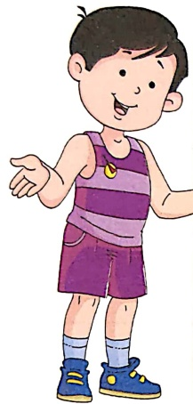

[Table 1](tables/table_001.html)

Let's Explore

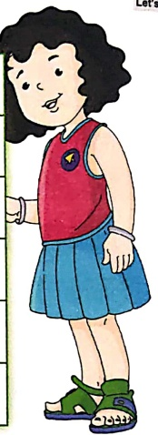

6. नीचे लिखी कविता की पंकितयाँ पूरी करो- (सुनाता था, दिखाता था, नहता था, बजाता था) शेर नहीं

बंदर ड्रम

भालू राग

हाथी नाच

7. सही शब्दों से मिलान करो—

(क) कोयल

(ख) शेर

(ग) सेब

(घ) गाना

जंगल का राजा

सुरिली

अच्छा

लाल-लाल

##### सुनो ध्यान से

Let's Listen (Listening)

##### थापक/अध्यापिका/वेब सपोर्ट से वाक्य सुनकर सही उत्तर पर गोल लगाएं—

चंपरासी/मित्र

मॉनिकर/माल्टा

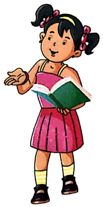

##### अध्यापक/अध्यापिका के लिए

##### पाठ-13 (पृष्ठ-79)

एक डाक्का का एक ला रहा था। सामने से एक दूधवाला दूध लेकर आया और उससे टकराया। कलाकार ने किसान का चित्र बनाया। नाव चलाने वाले नाविक को यह देखकर बहुत गुस्सा आया।

##### पाॅट-18 (पृष्ठ-89)

1. मममी के भैया है, वो नानी के बेटे हैं वो।

2. मममी की मममी है आई, आते ही कहानी सुनाई।

3. चीजे हमें सारी दिलवाएं, ऊँचे हम तो झट से मनाएं।

4. मममी की घारी बेटी है वो, लेकिन तुमसे छोटी है वो।

5. पापता को वो डॉट लगाए, वह उनकी मममी कहलाएं।

6. पापा के भैया है वो, पर नहीं मामा है वो।

##### पाॅट-19 (पृष्ठ-93)

1. तुम्हारे पापों का नाम क्या है?

2. तुम्हारी मम्मी का नाम क्या है?

3. तुम्हे कौन-सा रंग पसंद है?

4. तुम्हे कौन-सा खेल पसंद है?

5. तुम स्कूल से कैसे घर जाते हो?

#### पाठ-20 (पृष्ठ-98)

1. गर्मी में है वो आता, फलों का राजा कहलाता-

2. अंदर लाल रस से भरा, बाहर से दिखता है हरा-

3. हरा/काला रस से भरा, गुच्छे पर है वो लटका

4. लाल-लाल दानों से भरा, क्या है उसका नाम भला

##### पाॅह-23 (पृष्ठ-112)

पठ-२३ (पृष्ठ-११२)

1. आप कभी गुडियाघर गए हैं?

2. क्या आप के पास टेडी बियर है?

3. पाँक्ति में आप फूल देखते हैं?

4. क्या आपको विद्यालय में खेल खिलाए जाते हैं?

5. गुडियाघर में गुडिया रहती है।

##### पाॅट-26 (पृष्ठ-125)

विद्यालय में आपको यह कौन कहता है-

1. फूल को हाथ मत लगाओ!

2. बच्चे! चुप बैठो।

3. आओ! खाना खाएँ!

4. धक्का-मुककी मत करो।

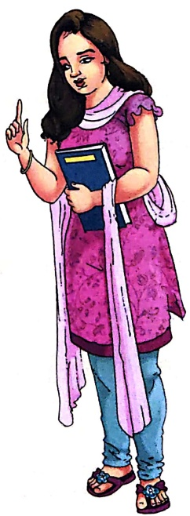

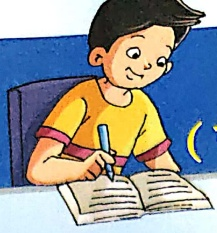

### प्रोत्साहन नष्टी कालम से)

##### मेरी पैशल

पेसिल है मेरी दोست,

लिखती है बड़ी फास्ट।

कला है इसका रंग,

पर गोल्डन है इसका मन।

इशान गुप्ता

Class: I

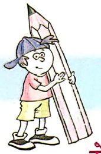

##### मेरी मैडम

मेरी मैडम! कितनी अच्छी,

कितनी सुंदर, कितनी प्यारी,

शिंशा का पाठ पढ़ाती है।

सच्ची राह पर हमको है चलना,

यह हमको सिखाती हैं।

सीजत भुल्लर

Class: I

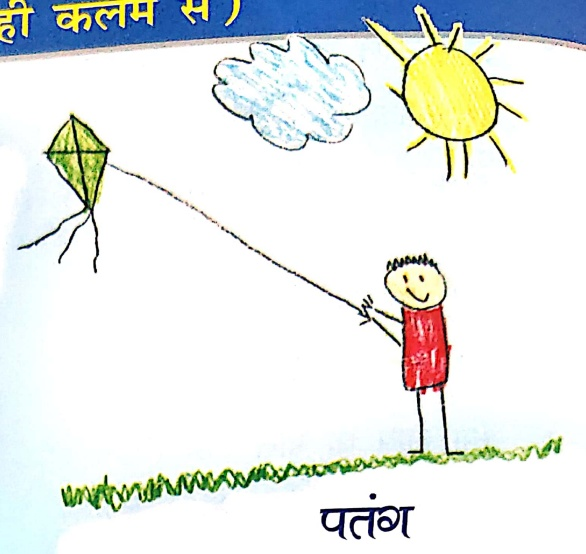

कैसी न्यारी बनी पतंग,

सबको प्यारी लगी पतंग।

आसमान में उड़ती रहती,

बादल के संग बातें करती।

भ्या विजयरन

Class: I

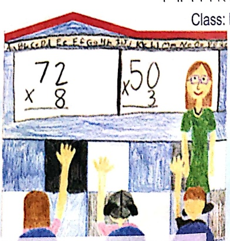

मेरी फैमिली

सबसे घारी मेरी फैमिली,

आओ देखो! हम कितने लोग,

मममी, पापा, दादा, दादी और,

में सबसे छोटी गुडिया न्यारी,

सबसे अच्छी बात हमारी,

कुछ भी कैसे हों हलात,

हम करते एक दूसरे से प्यार।

देवாशि

Class: 1

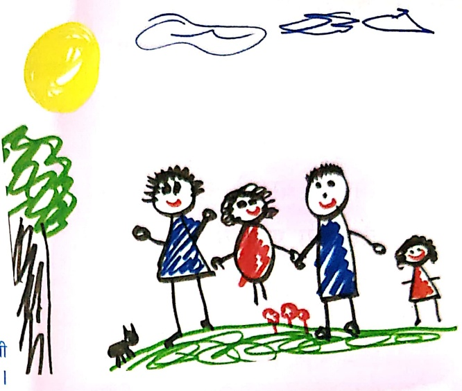

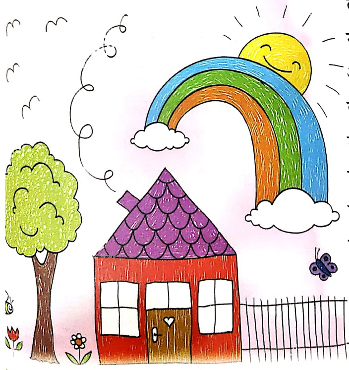

लाल, हरे, नीले, पीले,

रंग हैं सुंदर चमकीले।

आओ-आओ, मेरे संग,

देखो-देखो! कितने रंग।

मेरे मन को भा गए रंग,

देख इन्हे मैं रह गया दंग।

कितने साज-सजीले रंग,

मेरे, उसके, सबके रंग।

कैश केश

Class: I

##### আহলে

बादल आया, बादल आया,

छम-छम-छम बारिश लाया।

बारिश ने लोगों को भिगाया,

पर बच्चों को बहुत हँसाया।

बिजली चमकी, बादल गरजा,

देर सारा पानी बरसा।

बादल आया, बादल आया,

छम-छम-छम बारिश लाया।

आरव कपूर

Class: I

# 1 4 6 8 9 5 7 2 10 30

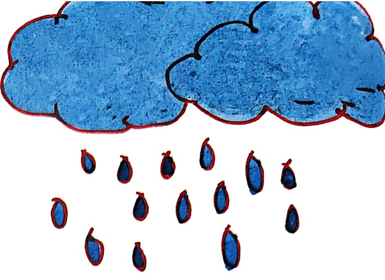

##### वियतनी

एक महल है, चल-पहल है,

दो दरवाजे, तीन खिड़कियाँ,

चार हैं लड़के, पाँच लड़कियाँ,

छह घोड़े हैं छोटे-छोटे,

सात सिंपाही मोटे-मोटे,

आठ हैं कुते भौं-भौं करते,

नौ चूहे बिलली से डरते,

दस चिडियाँ उड़ती हैं ऊपर

आएंगी बादल को छूकर।

पार्थ बजाज

Class: I

## 310

स्वाद में खर्दता मीठा आम,

बात है इसमें कोई खास।

हर कोई देख इसे ललचाए,

बिन खाये फिर रह न पाए।

गमी के मौसम में आता है,

फलों का राजा कहलाता है।

सोनाक्षी

Class: I

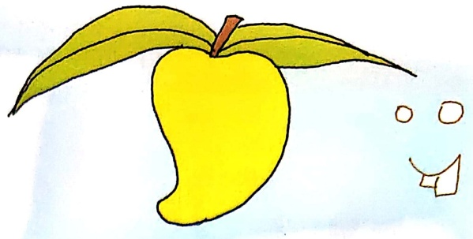

##### ★

जग-मग, जग-मग चमकीले तारे,

शिल-मिल, शिल-मिल घारे-घারে।

आसमान में निकलें ऊपर,

जहाँ न पहुँचे हाथ हमारे।

चुहिया लाई मट२ का दोना

आजा काले बादल आजा,

जल्दी से जल बरसा जा।

जल से भर जाएगी नदिया,

वह सीचेगी खेत और बिगया।

तब मिले मटर का मोटा दाना,

तब चूहा खाएगा खाना।

टुक-टुक, टुक-टुक,

दाना दाना।

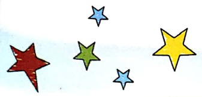

देवांगी दास

Class: I

जसमहर सिंह

Class: I

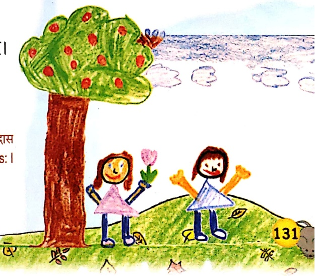

पूच-12 वच 13
 

स्ट्रीकर पेज

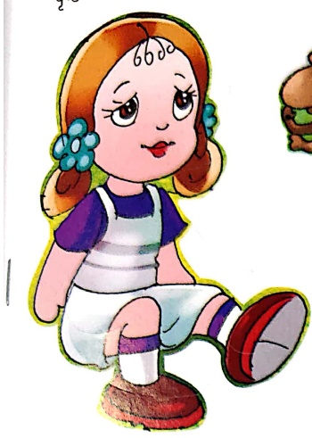

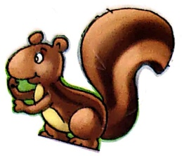

γ-24

9-28

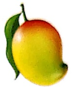

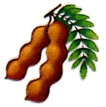

9-32
 

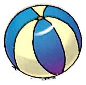

पृष्ठ-35

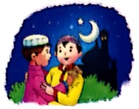

पृष्ठ- 58
 

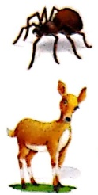

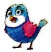

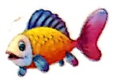

च्व्ब्च्व्-42
 

98-52

च्व्ब्च्व्—48
 

48-56

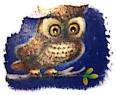

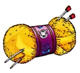

98-62
 

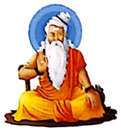

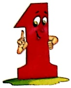

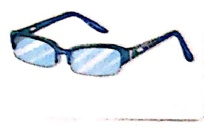

च्व्ब्च्व्—66

१५-72

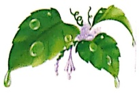

98-74
 

पृष्ठ-76

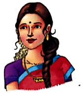

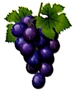

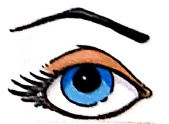

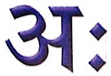

۶-۹3

-103
 

च्व्ब्च्व्—98

पृष्ठ-112

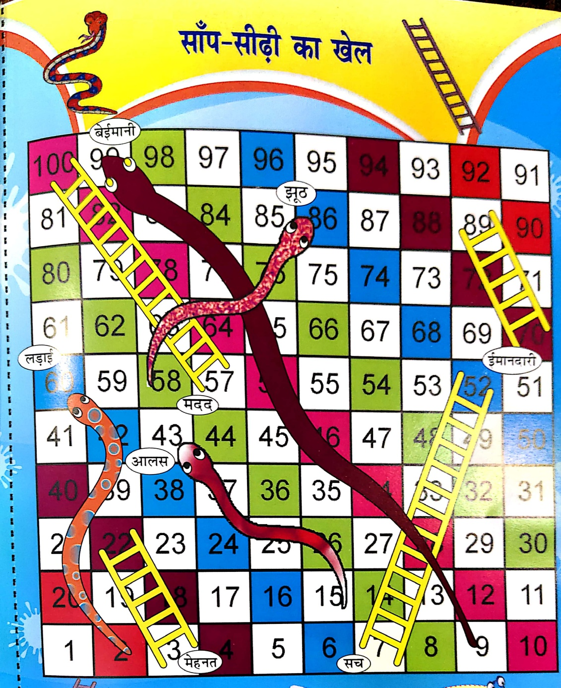

## हिन्दी अभ्यास-पुस्तिका कक्षा-9

[Table 2](tables/table_002.html)

कौशल-प्रत्यारमरण

दिनांक 3.1.834

निर्देशांको- रिकत स्थान में सही स्वर लिखकर रंग भरीए -

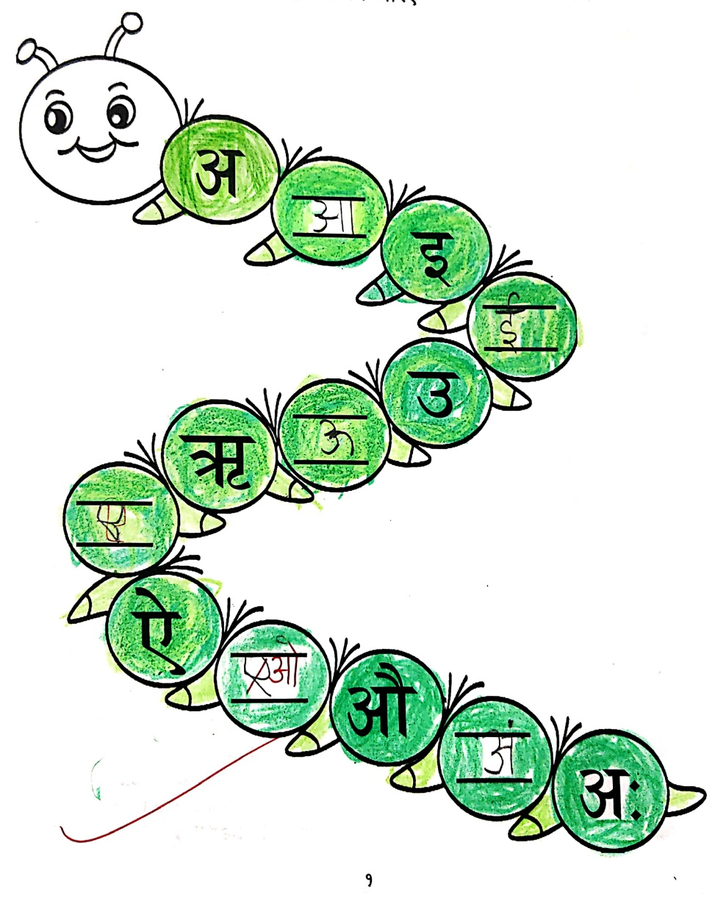

[Table 3](tables/table_003.html)

कोशल-अक्षरबोध

दिनोंक 34.74

निर्देश:- नीचे दिए गए स्वरों को उनके शब्दों से मिलाइए और खाली जगह पर फिर से

लिखिए-

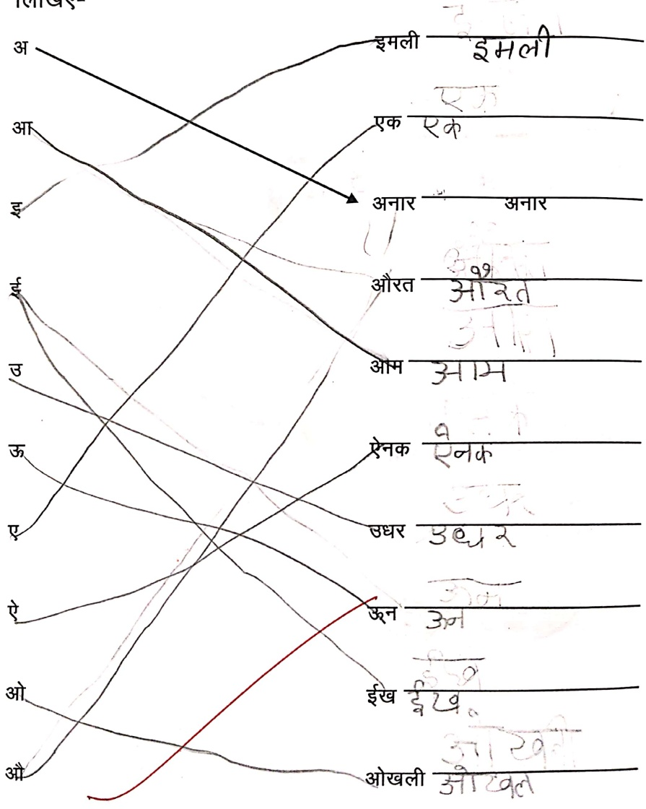

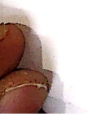

[Table 4](tables/table_004.html)

कौशल-शब्द बोध

दिनांक ०५४८२ ०१५

शब्द पहले

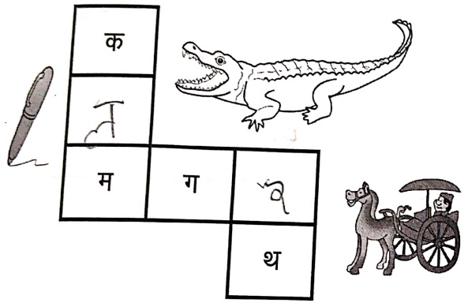

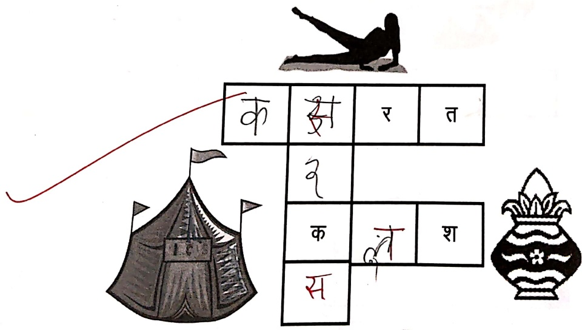

[Table 5](tables/table_005.html)

कौशल-शब्द बोध

दिनांक ___

निर्देश:- चित्र देखिए, और सही शब्द लिखिए-

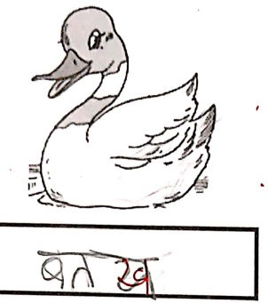

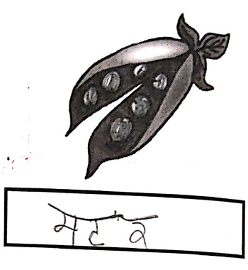

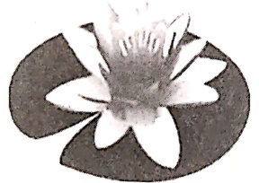

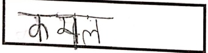

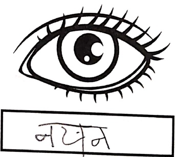

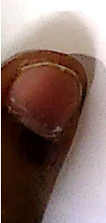

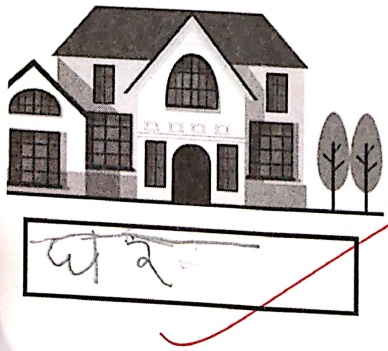

[Table 6](tables/table_006.html)

कोशल-शब्द बोध: मात्रा परिचय

दिनांक ८३०१३

9. आ 'T ' की मात्रा वाले वर्णों को दूढ़िए और उसके घर में रंग भरिए-

[Table 7](tables/table_007.html)

२. वर्ण मिलाइए और शब्द बनाइए-

[Table 8](tables/table_008.html)

कौशल- शब्द सामर्थ्य एवं शब्द चित्र

दिनांक ९३,४०३५

निर्देश:- 'आ' (¹) की मात्रा से संबंधित पाँच शब्द लिखीए एवं उनके चित्र बनाइए-

[Table 9](tables/table_009.html)

[Table 10](tables/table_010.html)

कौशल- वाक्य बोध: पठन-लेखन

दिनांक ९२४३

निर्देशांको- पढ़ाए और लिखित

9.  $ H_{2}Cl_{2} + 6HCl \rightarrow 2HCl + 3H_{2}\uparrow $

2.

3.

8.

[Table 11](tables/table_011.html)

कौशल- शब्द बोध: मात्रा परिचय

दिनांक 89.29,

निर्देश:- शब्दों को चित्रों से मिलाइए और रंग भरिए-

[Table 12](tables/table_012.html)

कोशल- शब्द निर्माण

दिनांक 89, 913

निर्देश:- नीचे दिए गए वर्णों में 'इ' (ि) की मात्रा लगाकर शब्द बनाइए और उन्हें नीचे लिखिए-

उदाहरण - ख - खिलना

[Table 13](tables/table_013.html)

कौशल- मात्रा बोध

दिनांक ___

निर्देश:- शब्दों को पदोए और चित्र पहचान कर लिखए-

बकरी, हाथी, छतरी, दीपक, मछली, लीची

9.

2.

3.

8.

4.

5.

[Table 14](tables/table_014.html)

कौशल- भाषा समूहि

दिनांक ___

