# अभ्यास:

##### चित्र हृद्रा लिखित।

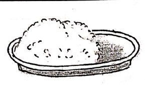

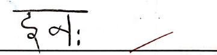

#### わ

कमलम्

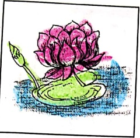

왕

खग:

ㄱ

गगनम्

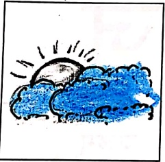

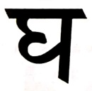

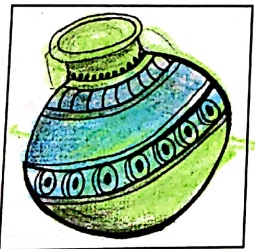

གང

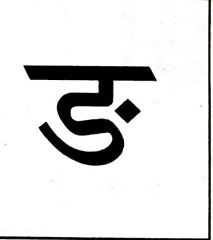

##### वर्णमाला

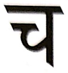

চৎকৎ:

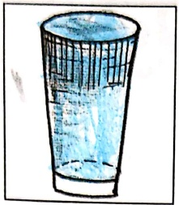

35

ཐུགས

JA

जल्म

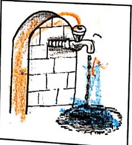

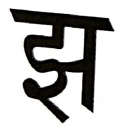

ছাণ:

2
 

टगर:

๒๐๖๖

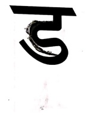

उयनम्

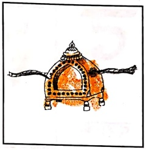

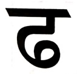

ん：

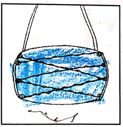

가

##### वर्णमाला

तट

9

4:

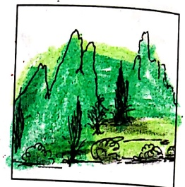

दर्शन:

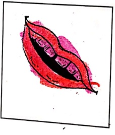

탁

ध्वल:

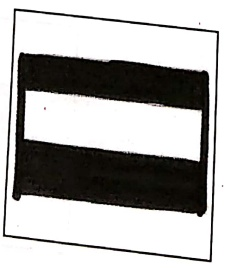

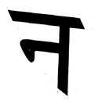

नयनम्

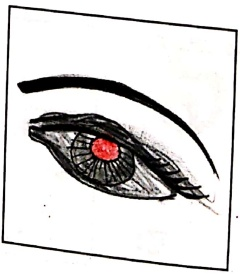

तट: - नदी का किनारा, थ: - पर्वत, दशान: - दाँत, धवल: - सफेद, नयनम् - आँख

다

P2

4

फिल्म

of

ཁག

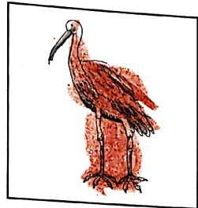

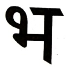

भवनम्

ㅐ

महाकः

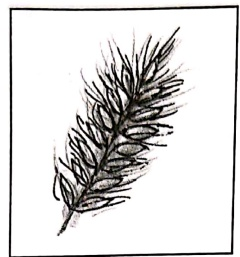

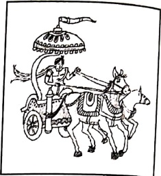

लवणम्

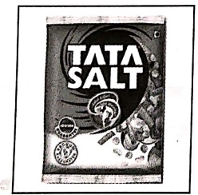

핑

शशक:

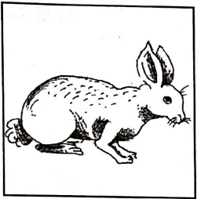

다

ఏర్పడ్

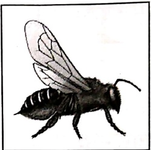

सरट

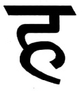

হয:

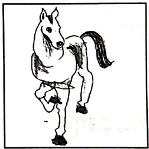

##### वर्णमाला

[Table 1](tables/table_001.html)

##### अभ्यास:-१

चित्र दृष्टा पदानि लिखत।

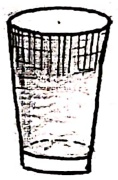

# 二

##### अभ्यास:-२

अक्षरािण क्रमोण सज्जीकृत्य पदनिर्माणं कुरुत ।

 $$ \begin{array}{c} यथा -  अल  नै:\quad=\\\quad\text{अनल:}\end{array} $$ 

 $$ \begin{array}{r l r}{\mathrm{~g:~3~r~}}&{{}=}&{\cdots\cdots\cdots\cdots\cdots}\end{array} $$ 

 $$ \begin{array}{r l r}{\mathrm{~n~m~}_{D}\mathrm{~a~l~o~}}&{{}=}&{\cdots\cdots\cdots\cdots\cdots}&{}\\ \end{array} $$ 

 $$ \begin{array}{c} गन्मग  = \cdots\cdots  \cdots  \cdots  \cdots  \end{array} $$ 

 $$ \begin{array}{l}\text{к:ч вч }=\\\end{array} $$ 

 $$ \begin{array}{r l}{\eta\colon\mathrm{~s h~d~}}&{{}=}\end{array} $$ 

 $$  支  枋  枰：\begin{aligned} 枰 &= 支  枰 \\ 枰 &=\begin{aligned}& 枰 & 枰 \\ &=& 枰 \end{aligned}\end{aligned} $$ 

 $$ \begin{array}{l l l}{v}&{\mathit{\Pi}\mathit{\Pi}\mathit{\Pi}\mathit{L}}&{=}&{\cdots\cdots\cdots\cdots\cdots  7}\end{array} $$ 

 $$ \begin{array}{l}\underline{\text{ć:}}~\underline{\text{s r}}\quad=\quad\cdots\cdots\cdots\cdots\cdots\\\end{array} $$ 

##### बालगीतানি

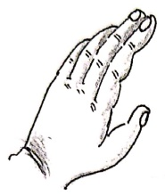

##### सूयं: गोलः

सुर्य: गोल: चन्द्र: गोल:

गोल: मम वागोल:।

पृथ्वी गोला चक्रं गोलं

गोल: मम रसगोल:॥

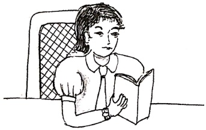

##### एफ: हस्त:

एष: हस्ता:

एष: हस्ता: दिक्षणहस्ता:

एष: वाम: हस्ता:।

एष: पाद: दिक्षणपाद:

एष: वाम: पाद:॥

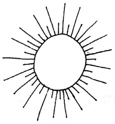

का सा बाल? काखनमाला!

गच्छित कुत्र ? पितुं मित्र।

मधुरा बाला । भद्रसुशील।।

एवम् ? आम्, आम्।।

चलामि मार्ग जले तरामि

कूर्दे भूमौ सदा हसामि ।

पठामि गेहे कथां शृणोमि

भ्रामि नधास्तिरे ।

शीतलवायुर्वहित सुमन्दम्

आरोहित नौकां नरवृन्द ।

गच्छित नौका दूर ।

##### मात्रापरिचय:

[Table 2](tables/table_002.html)

काकः - कौवा, क्रिरणः - क्रिरण, कीटः - कीड़ा, कुमारः - बालक

कूपः - कुआँ, कृपणः - कंजूस, केसरः - केसर, कैलासः - कैलास

कोमलम् - कोमल, कौमुदी - चन्दमा की क्रिरण, कंसम् - कॉस, कः - कौन

##### अभ्यास:-१

..... ..... ..... ..... ..... .....

# अभ्यास:-२

रिक्तस्थानपूरणं कुकृतं ।

गायक:

-

ग् + आ + य + अ + क् + अ:

नायक:

-

 $ \eta + \alpha + \cdots + \alpha + \kappa + \alpha $

बालक:

-

ब् + आ + ***** + अ + क् + अ:

गिरी: - ग् + ई + र्+ *****

सिललम् - स् + अ + ……+ इ + ल् + ……

मौन: - म् + *+ *+ *+ + अ:

नदी

-

 $ \eta + \alpha + \cdots + \xi $

नगरी - न् + अ + *****+ अ + *****+ ई

कुमुद: - क् + …… + म् + …… + द्+ अ:

सुखम् - स् + ***** + ख् + अम्

गुफ: - ग् + 3+ …… + ……

वर्णनिं पृथककृत्य लिखित।

[Table 3](tables/table_003.html)

##### अभ्यास:-३

# अक्षरािण योजितता पदनिर्माण कुरुत।

[Table 4](tables/table_004.html)

यथा - गायक:

##### एहि एहि वीर रे,

##### जीवन प्रदर्शित रहे थे

वंह हि मार्गदर्शक:

वंह हि देशरक्षक:

वंह हि शतुनाशक:

कालनागतक्षक: ||

##### साहसी सदा भवे:

भारतीयसंस्कृत्ति

मानसे सदा धेरेः ।।

भारतस्य गोरवाय

सर्वादौ जयो भवेत् ।।

(सं) लक्ष्मीकान्त जाम्बोरकर

[Table 5](tables/table_005.html)

##### अभ्यास:

य: यस्य दण्डलोपी तं समानरर्जेण रुज्यत।

यथा - ७ब

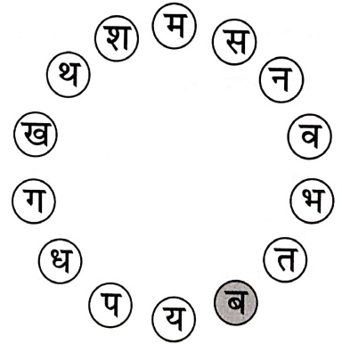

# मातृभूमि नाम:

मातृभूमे नमः मातृभूमे नमः।

मातृभूमे नमः मातृभूमे नमः।।

अग्रतस्ते नमः पृष्ठतस्ते नमः।

वामतस्ते नम: दक्षिणे ते नम:।। मातृभूमे नम:।।

ते गिरिभ्यो नमः ते नदीभ्यो नमः।

ते वनेभ्यो नमः जनपदेभ्यो नमः॥ मातृभूमे नमः॥

प्राप्त होने के बाद देने वैशिक है।

ऋதिंदर सिंहदरे भुक्तिमुक्तिप्रदे।

सर्वेद सर्वदा देिव तुभ्यं नमः॥ मातृभूमे नमः॥

पं. वासुदेव द्वेवेदी शास्त्री

5

Scanned with OKEN Scanner

#### क्रियाबोध:

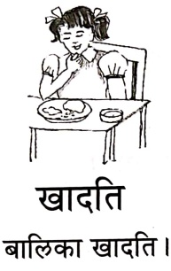

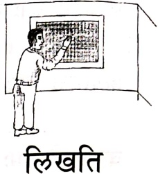

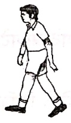

आगच्छित

छात्र: आगच्छित।

चलित

यानं चलित।

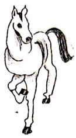

हसित

बालक: हसित।

धावित

घोटक: धावित।

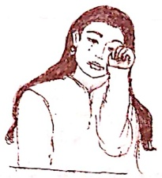

गायति

गायक: गायति ।

कन्दति

बालिका कन्दित ।

नृत्यित

नर्तरी नृत्यित ।

यानम् - वाहन, घोटक: - घोड़ा

##### क्रियाबोध:

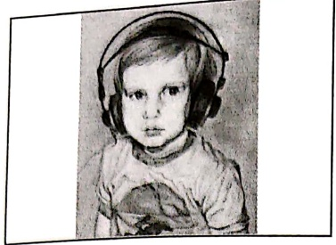

शृणोति

बालक: शृणोति ।

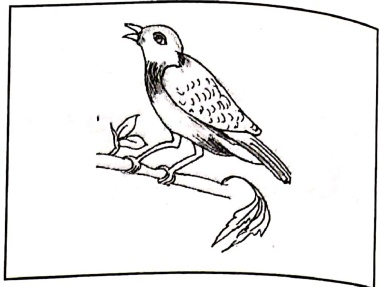

पश्चात्

खग: पश्चात्।

उतिष्ठति

छात्र: उतिष्ठति ।

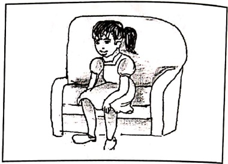

उपविशति

बाला उपविशति।

वदित

साधु: वदित ।

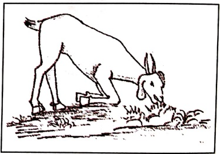

चरित

छगल: चरित ।

# अभ्यास:

किसरोति इति लिखित।

यथा-

पठित

(लिखित, खादित, पठित)

わ。

.(खादित, पिबित, गच्छित)

ঝ

(वदिति, हसिति, नमिति)

 $ T_{1} $
 

(पश्यित, चरित, नन्दित)

4.
 

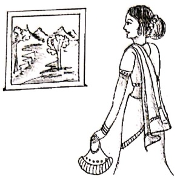

.....(हसित, पश्यित, गच्छित)

ذ.
 

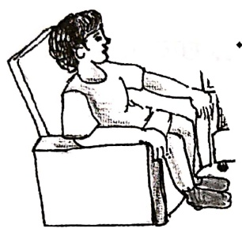

.....(आगच्छित, उपविशति,

उतिष्ठित)

हसित गायति नृत्यित पश्यित भ्रमित धावित गच्छित पृच्छित ।

पिबित खादित कन्दित नन्दित वदित निन्दित खेलित हृषित ॥ १॥

नमित गणेशं लिखितं च लेखम् ।

पठित पुस्तकं स्वपितं च ससुखम् ।। २॥

माज़रीयं खादित मौनम् ।

पिबित्त च दुग्धं तिष्ठित मौनम् ।। ३।।

सम्मानदानद मिश्रण

वक्తుण्ड महाकाय सुर्यकोटिसमप्रभ ।

निर्विध्न कुरु मे देव सर्वकार्येषु सर्वदा ।। १॥

सरसवित महाभागे विधे कमललोचने ।

विश्वरूपे विशालाक्षि विधां देहि नमोऽस्तु ते ॥ २॥

गोविन्द गोविन्द हरे मुरारे

गोविन्द गोविन्द रथाঙ্पाने ।

गोविन्द गोविन्द मुकुन्द कृष्ण

गोविन्द गोविन्द नमो नमस्ते ॥ ३॥

महालक्षिण नमस्तुभ्यं नमस्तुभ्यं सुरेशविर ।

हरिप्रिये नमस्तुभ्यं नमस्तुभ्यं दयानिधे ॥ ४॥

श्रीराम राम रघुनन्दन राम राम

श्रीराम राम रणकर्कश राम राम ।

श्रीराम राम भरताग्रज राम राम

श्रीराम राम शरणं भव राम राम ।। ५॥

शहू-चक-गदा-पद्म-वनमाला-विभूषितम् ।

पीताम्बरधरं देवं वन्दे विष्णुं चतुभुजम् ॥ ६॥

तब तत्वं न जानामि कीदृशोऽसि महेश्वर ।

यादृशोऽसि महादेव तादृशाय नमोनमः ।। ७॥

नमस्ते शरणये शिवे सानुकमे

नमस्ते जगद्व्यापिके विश्वस्पे ।

नमस्ते जगद्वन्धपादारविन्दे

नमस्ते जगतारिणी तारीख़ दुर्ग्रहण के दौरान ८० दशक पहले शुरुआत पर हुई है

अज्जनानन्दन वीरम् जानकीशोकनाशनम् ।

कपीशमक्षहन्तांर वन्दे लड़ाभयड्करम् ॥ ९॥

तवैवाहं तवैवाहं तवैव शासवती: समा: ।

सेवासकत: सदा भक्त: प्रेमयोगपरायण: ।। १०।।

##### एकम्

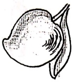

##### さ

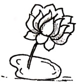

##### ऑपेरा वेब ब्राउज़र

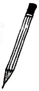

##### चटवाई

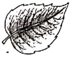

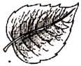

##### 핑

##### சாட்ட

# अभ्यास:

चित्र दृश्य लिखते।

ཀཱ་ཡ

あ。

एकम्

ऑ.

 $ T_{1} $
 

4.
 

3.

मिलीला गायत ।

एकम् एक्म । देह देह । ज्रीण ज्रीण । चत्वारि ।

पश्च पश्च । षट्षट् । सपत अखे । सपत अखे ।

नव दश नव दश नव दश नव दश ।।

[Table 6](tables/table_006.html)

##### अर्सित-नास्ति

### वृश: अस्ते। फिल्म अस्ते।

### वृक्ष: अस्पताल। फलों निष्सित।

### पुस्तक्म अस्तेडन्स। लेखनी अस्तेजदः

### पुस्तकम् अस्पताल लेखनी नागिल ।

अभ्यास:

वृत्तमध्ये किं किम् अस्तित पश्यत।

उपरिस्थवृते यद्यद् अस्ित तेषु अस्मिन् बृते किक किक नास्ित लिखत।

पिपासितः काकः
 

एक: काक: अस्त। स: पिपासित: अस्त। स: जल पातुम् इच्छित। स: सर्वेर भ्रमित किन्तु जलं न पश्यित। स: एक्म उदानं गच्छित। तत्र एक: घट: अस्त। काक: घटं पश्यित । घटे अल्पं जलम् अस्त। काक: जलं पतुं चेष्टा करोति, कित्त तस्य मुखं जलं न स्पृशित। काक: अत्र तत्र पश्यित, तस्य बुड्ः न स्फुरित । स: शिलाखण्डसमूहं पश्यित । तत: शिलाखण्डम् आनयित। एकम् एकं शिलाखण्डं घटे पातयित। तत: जलम् उपिरे आगच्छित। काक: जलं पिबित सानन्दं गच्छित च।

##### अभ्यास:

१. संस्कृतभाषया उत्तर लिखित।

क. क: पिपासित: अस्ति ? (काक:, शुक:, बक:)

ख.  काकः किम् इच्छित?  (फलम्, जलम्, धनम्)

ग.  सः कुत्र गच्छित?  (नदीम्, नगरम्, उधानम्)

च.  कियत् जल्म् अस्ति ? (अल्पम्, पूर्णम्, बहु)

ड.  काक: किम् आनयित? (शिलाखण्डम्, जल्म्, पात्रम्)

च.  अन्ये काक: किं करोति ? (गच्छित, पश्यित, आगच्छित)

सदा करोति विधाधी सहन सुखदुःखयो:।

सुखं भवतु वा दुःखं विधाभ्यासं करोति स:॥ १॥

हस्सत्य भूषणं दानं सत्यं कण्ठस्य भूषणम् ।

श्रेत्रस्य भूषणं शास्त्रं भूषणैः किं प्रयोजनम् ।। २।।

काक: कृष्ण: पिक: कृष्ण: को भेद: पिककाकयो: ।

प्राणे वसनतकाले तु काक: काक: पिक: पिक: ॥ ३॥

नाست लोभसमो व्याधि: नास्त क्रोधसमो रिपु: ।

नाستल विधासमो बन्धु: नास्त शानसमं सुखम् ॥ ४॥

आचार: परमो धर्म: आचार: परमॅन तप: ।

आचार: परमं शान் आचारात्िकि न सिद्धचिते ।।५ ।

ज्योदश: पाठ:

सुभाषितানি

[Table 7](tables/table_007.html)

##### मम शरीरम्

मिलीता गायत

मदियं शरीरं स्वस्थं सुरूपं रोगविरहितं हढं च नम्यम् ।

कार्ये सुदक्षं रचिरं सुरम्यं भगवत्कार्यं कर्तु निष्ठम् ।

सम्दानन्द मिश्र

#### शूगाल: द्राक्षाफलें च

एक: शृगाल: असित। स: वने अत्र तत्र भ्रमित। एकदा स: वृक्षे द्राक्षाफलं पश्यित । स: तत् खादितुम् इच्छित । फलम् उपरि असित । स: तत् प्राप्तुं कूर्दित। एकवारं कूर्दित कিন्तु फलं न स्मृशित। पुनः एकवारं कूर्दित किन्तु फलं न स्मृशित। पुनं: पुनः कूर्दित तथापि फलं न प्राप्ति। अन्ते कलान्त: भवित कथयित च - ‘अहो द्राक्षाफलं तु अम्लं भवित। क: अम्लफलं खादित ? अहं वृथा श्रमं करोमि ।' तत् कथयित अन्यत्र गच्छितं च ।

##### अभ्यास:

१. संस्कृतभाषया उत्तर लिखत।

(क) वने कः भ्रमित ? (शुकः, शृगालः, सिंहः)

(ख) शृगालः कि पशयित ? (जलम्, द्राक्षाफलम्, पुषम्)

(ग) फलं कुत अस्ति ? (आकाशो , उपरि , तले )

(घ) द्राक्षाफलं कथं स्वदते ? (मधुरम् , तिकतम् , अम्लम्)

(ड) अन्ते शृगालः कि करोति ? (खादित , पश्यित , गच्छित)

२. समुचितपदन रिकतस्थानं पूरयत ।

(क) शृगालः वने …… (भ्रमित, पश्यित, प्राप्ोति)

(ख) शृगाल: द्राक्षाफल …… (खादित, पश्यित, प्राप्ोति)

(ग) शृगाल: द्राक्षाफलें खादितुम् … (स्पृशित, कथ्यति, इच्छित)

(घ) शृगाल: फलें प्राप्तु …… (स्पृशित, कूर्दित, पशयित)

(ड) अन्ते शृगालः …… (कलान्: भवति, अम्लफलं खादित,

पुनः पुनः कूर्दित)

# देवताओं के अनेक नाम

१. सुरः - प्रकाश से देदीण्यमान ।

२.  अमर: - मृत्यु से रहित ।

3. देव: - सदा देदीण्यमान ।

8. अदितिनन्दन: - अदिति यानि अखण्ड चेतना की संतान ।

4. दानवारिः - राक्षसों का विनाश करने वाला ।

अमरा निजरा देवास्वरदशा विबुधा: सुरा: ।

सुपविण: सुमनसिस्त्रिदवेशा दिवोंकस: ।।

आदितेया दिवषदो लेखा अदितेनन्दना: ।

आदित्या ऋभवो5सव्रा अमत्या अमृतान्धस: ।।

बहिमुख्या: कृतभुजो गौविणा दानवारय: ।

वृन्दारका देवतानि पुसि वा देवता: सिख्याम् ।।

# दिल्యवाणी

देवभाषा पुरस्तक के प्रत्येक भाग में दिल्यवाणी नामक विशेष पाठ रखा गया है। इस पाठ में वेद, उपनिषद और श्रीमद्भगवद्गीता के चयनित मंत्री व श्लोकों का संकलन किया गया है। नि:सन्देह ये प्रथम दृष्टि में छाओं के लिए कितन प्रतित होंगे। हम सब का उद्देश्य यह है कि बाल्यावस्था में इनके उच्चारण एवं स्मरण से छाओं में जो नीचे पड़ जायेगी उससे उनका भावी जीवन संस्कारवान् बनेगा।

इन मंत्रों के अर्थ कितन प्रतित होंगे पर हम सबने यह प्रयास किया है कि शिक्षाकों के समझने व्यवहार के सत्र तक इनका अर्थ लिखा जाएं। आगे यह शिक्षाकों पर निर्भर करता है कि वे छात्रों तक इन मंत्रों का सार कैसे प्रस्तुत करें।

##### वेस्टमिंस्टर पैलेस

# १- अग्रिमीले पुरोहितं यशस्य देवम् ऋत्वजम् ।

#### होतारं रलधातमम् ॥ ऋग्वेद:, १.१.१

अग्रिम्- संঙ্कूल्य या अभीक्षा स्पेरी जो अग्नि/आत्मा देव हमारे सबके हदय में उपस्थित हैं, इंके - मैं उपासना करता हूँ, पुरोहितम् यशस्य - जो हमारे यज्ञ स्वरूप जीवन में अग्रिणी होकर हमारे संঙ্कूल्य या अभीक्षा को आगे बढ़ाते हैं, देवम्- जो हमारे सारे कर्मों का देव है, ऋत्विजम्- सत्य के संवोतम जाता, होतारम्- देवों का आवाहन करने वाले, रलधातम्म्- आनन्द के संवोतम धारण और वितरण करने वाले।

अर्थ - उपयुक्त मंत्र ऋगवेद के प्रथम (१) मण्डल के प्रथम (१) सूक का पहला (१) मंत्र है। इस

मंत्र के दृष्टा ऋषि मधुच्छन्दा वैश्वामित्र है। देवता अग्नि हैं और छन्द गायत्री है।

वेदों में जहाँ-जहाँ अग्नि की स्तुति की गयी है, वहाँ-वहाँ अग्नि को दो रूपों में देखा गया है-वाह और आर्तिक । कुछ लोग वाह्य अग्नि को आहूति देते समय वैदिक मंत्रों का प्रयोग करते हैं। कुछ लोग आत्मा रूपी अग्नि को आहूति देते हैं।

इस मंत्र के माध्यम से खर्ष मधुचन्द्रा वैश्वामित्र ने अपने भीतर छिपी हुयी आत्मा को सम्बोधित किया है। वे इस आत्मा को अग्नि की उपாधि देते हैं- वह अग्नि जो ऊपर की ओर प्रज्जलित है। हे अग्नि! आप प्रज्जलित हों। इस जीवनरूपी यह के आप ही पुरोहित हैं। आप ही हमारे जीवन का संचालन करें। आप ही पूर्ण परमेश्वर के स्वरूप हैं। आप ही उचित समय के पूर्णसात हैं । आहूति के द्वारा दिव्यस्वरूप परमात्मा का आह्वान करने वाले आप ही हैं। हे अग्नि! परम आनन्द का आप ही अनुभव कर सकते हैं। यहाँ ख्रिष का यह अभिप्राय है कि अपने विचार, अपने भाव व अपने कर्म, समिधा की भाँति, अपने भीतर स्थित अग्निकपी आत्मा में आहूति चढ़ाने से और उन्हें मार्ग प्रदर्शन के लिए आहान से, मनुष अपने

आत्मारूपी ईश्वर से संबंध स्थापित कर, उन्हें अपना मार्ग प्रदर्शक/ पुरोहित बना सकता है।

## २ - अग्रे तंत्र सु जाग्रही वयं सुमनिद्धीमहि । रक्षा गो अप्रयुच्छन् प्रबुधे नः पुनस्कृधि ।। यजुवेंद, ४.१४

सुजागृहि - सम्यक् रूप से जागो, सुमन्दषीमिह - हम पूर्ण रूप से आनन्दत होंव, रक्षाणो - हम सब की रक्षा करो, अप्रयुच्छन् - सतत जागरूक होते हुए, प्रबुधे - हमारे प्रबोधन के लिए अर्थात् हमं अज्ञानरूपी निद्रा से मुक्त करने के लिए, पुनस्कृधि - बार-बार प्रेरित करें ।

अर्थ - यह मंत्र यजुर्वेद के चौथे (४) अध्याय का चौदहवाँ (१४) मंत्र है। इस मंत्र के दर्शा खींप्रजापति है तथा देवता अग्नि हैं।

हे अग्नि ! आप सम्यक्स्फप से हमारे भीतर प्रज्वलित हों जिससे कि हम सजग रहं और हमें बार-बार आपसे प्रेरणा मिले। आप हमें दुष्कर्म करने से रोकें एवं हमारी रक्षा करें। हमें हमेशा जागफुक रखने के लिए और हमें अज्ञानता से मुक्त करने के लिए आप हमें बार-बार प्रेरित करें। आपके अनुभव में ही हमारा परम आनन्द है।

##### उपनिषद्वचनम्

३ - सत्यं वद। धर्मं चर। स्वाध्यायान् मा प्रमद: ।

मातृदेवो भव। पितृदेवो भव। आचार्यदेवो भव।

श्रह्या देयम्। अश्रह्या अदेयम्। श्रिया देयम्। हिया देयम्।

भिया देयम्। संविदा देयम्।। तैतिरीय-उपनिषद्

मा प्रमदः - विमुख मत हो, श्रिया - समस्त प्रकार के विकारों से रहित प्रसवता के साथ, हिंया - विनप्रता के साथ, श्रिया - निःसड्जोच या समर्पित होकर, संविदा - शान के साथ या सचेतन होकर।

अर्थ - यह मंत्र तैतरीय उपनिषद् के प्रथम (१) वर्लूरी का ग्यारहवाँ (११) अनुवाक है, जिसमें समदर्शी गुरु अपने शिष्य को वेद का भली-भाँति अध्ययन करवा करके समावर्तन संस्कार के

समय ग्रहस्थ धर्म का पालन करने की शिक्षा देते हैं।

सत्य वद.....आचारियेदवो भव।

अर्थ - सर्वदा सत्य बोलो। सही मार्ग,धर्म के मार्ग पर चले। स्वाध्याय (स्वयं अकेले बैठकर अध्ययन) में आलख्य मत करो । माता एवं पिता को ईश्वर के समान समझ कर उनका सम्मान एवं सेवा करो । विधा या जान देने वाले गुरु को भी ईश्वर के समान समझो एवं उनको आदर एवं सेवा प्रदान करो ।

प्रश्नका दैनम्न.....संविदा दैनम्य।

अर्थ - जो कुछ भी दिया जाए, वह श्रद्धापूर्वक देना चाहिए। अश्रद्रापूर्वक कोई दान नहीं देना चाहिए। सब प्रकार के विकारों से रहित होकर, प्रसन्नता के साथ देना चाहिए। दान लज़ापूर्वक एवं विनम्रता के साथ देना चाहिए। नि:संकोच भाव एवं समर्पित होकर दान देना चाहिए। दान सदा जाग़रूक्त होकर जाने के साथ देना चाहिए।

एक बार रहोम जी अपने घर के बाहर किसी व्यक्ति को कुछ दे रहे थे, तभी उनके मित्र गंग कवि पूछते हैं -

कहां से सीखे खान जू, एहि प्रकार को देन।

ज्यॉ-ज्यॉ ऊँचो कर उठे, त्यों-त्यों नीचे नैन।

रहीम जी उत्तर देते हैं -

देनहार कोउ और है, देत रहत दिन रेन।

लोग भरम मोहि पर करें, तातै नीचे नैन।

गीतामृतम्

8 - यत्र योगेशर: कृष्णो यत्र पार्थो धनुधर: ।

तत्र श्रीविजयो भूित: धुवा नीतिमितमम् ।। श्रीमद्भगवद्गीता, १८.७८

यत्र - जहॉर्स, योगेशर: - भगवान, पार्थ: - अजुन का एक नाम, श्री: - समृद्रि, भूति: - ऐश्यर, धुवा - निशित, नीति: - सिद्धान्ना, मति: - मत ।

##### दिल्खवाणी

अर्थ - यह एलोक महिषी वेदव्यास के द्वारा रचित श्रीमद्भागवद्गीता के अठारहवें (१८) अध्याय का अन्तम अठतरावां (७८) एलोक है।

स्वजय कहते हैं कि जहाँ-जहाँ श्रीकृष्ण और अर्जुन हैं, वहाँ-वहाँ समुद्रि, विजय एवं ऐश्वर्य हैं। ऐसा सज्जन का दृढ़ विश्वास है।

ईश्वर सदैव हमारे भीतर आत्मा के रूप में विधमान हैं। यदि हम आत्मस्पी गुरु को अपने विचार, अपने भाव और अपने कार्य समर्पित करते रहे तो निश्चित ही अजुन की भाँति हम भी समृष्टिकी, विजय एवं ऐश्वर्य को प्राप्त करते रहे हो।

## ५ - यो मां पश्यित सर्वत सर्वं च मिय पश्यित ।

तस्फाहं न प्रणेध्यामि स च मे न प्रणेध्यिते ।। श्रीमद्भगवद्गीता, ६. ३०

पश्यित - देखता है, सर्वत्र - सब जगह, सर्व - सब कुछ, मयि - मुझमें, प्रणस्थामिन - नष्ट होना, प्रणस्थित - नष्ट करता है।

अर्थ - यह श्लोक महर्षि वेदव्यास रचित श्रीमद्भगवद्गीता के छठवें (६)अध्याय का तीसवाँ (३०) श्लोक है।

श्रीकृष्ण अजुन को अपनी सर्व्यापकता के बोरे में बताते हुए कहते हैं कि हे अजुन! जो मुझे चल-अचल तथा सभी जगह देखता है और सबको मुझमें देखता है, वह मेरा अनुभव कर सकता है। मै उसके साथ सदा रहता हूँ और उसका कभी नाश नहीं होने देता हूँ। वह कभी मुझसे दूर नहीं होता है।

##### नित्यपाठ:

करदर्शनाय

करग्रे वसते लक्ष्मी: करमधे सरसवती।

करमूले तु गोविन्द: प्रभाते करदर्शनम्॥

भूमिनमनाय

समुद्रवसने देवि पवितस्तनमण्डले।

विष्णुपति नमस्तुभ्यं पादसर्शं शमस्व मे॥

सनाय

गड़े च यमुने चैव गोदाविर सरसवति।

नमदे सिंभु कावोरी जलेऐसिम्न् सरिप्रिधं कुर॥

चन्दनधारणाय

चन्दन वन्दते नित्यं पवित्र पापनाशनम्।

आपदं हरते नित्यं लक्ष्मी: वसतु सर्वा॥

सूर्धार्य

एिं सूर्य सहस्रांशो ! तेजोराशे ! जगतपते !

अनुकम्य मां भकत्या गृहाणाच्यं दिवाकर॥

भोजनाय

त्वदीयं वस्तु गोविन्द ! तुभ्यमेव समपेये।

गृहाण सममुखो भूत्वा प्रसीद परमेधर॥

पुच्छहीन: भलुक:

जानासि, कुक्करस्य पुच्छम् अस्ित न वा ? आम् अस्ित। शृगालस्य ? आम्

अस्ित। व्याप्रस्य ? आम्, अस्ित। भलुकस्य ? न हि, भलुकस्य पुच्छं नास्ित। भलुकस्य

पुच्छं किमथं नास्ित ? कुकुरस्य अस्ित, शृगालस्य अस्ित। पूर्व भलुकस्य अपि पुच्छम्

आसीत्-अतीव सुन्दर पुच्छम्, विशालं पुच्छम्। जानासि, कथं तस्य पुच्छं गतम्?

कथयामि, शृणु।

पूर्वम्, बहुवर्ष्यः पूर्व भल्यक:, कुकुर:, शृगाल: मित्रिंग आसन्। एकदा बहुशीत

भवित।

तदा दिने अति शीतम्। कुज़ापि भोजनं नास्ित। शौतरात्रिः। शृगालाः कुज़रंशच मत्यं धर्तुं गतौ। सर्वत्र हिमम्। शृगालाः हिमे गतर्च करोति। परं दौं मिलित्वा मत्यान् धरतः, एकं: द्वै, ज्यं: चत्वारः ..... यदा नव मत्याः भवितं तदा भलुकः आगच्छित। भलुकः पृच्छित, “किं कुरुथः? अहो मत्यः ! अहम् इच्छामि, अहं खादिष्यामि, अहं भृशं शुधितः। शृगालाः कथ्यति, भ्रातः भलुकं ! विभजाम। मम ज्यः मत्याः, कुकुरर्य ज्यः मत्याः तव ज्यः मत्याः।” भलुकः न शृणोति। सः सर्वान् मत्यान् खादिते। कुकुरः दुःखितः। शृगालाः शुधितः। भलुकः आनिन्दतः गतः। शृगालाः कथ्यति “भलुकः कथ्यएवं सर्वान् मत्यान् खादिते ! अहं दर्शिय्यामि तम्।

शृगाल: अतिच्तुर:। स: भलुकस्य पाश्वं गच्छित, सुन्दरभावेन वदित, “भ्रात: भलुक! त्वं मतस्यान् इच्छिस ? बहून् मतस्यान् दास्यामि। आगच्छ मया सह। लोभी भलुक: शृगालेन सह गच्छित। शृगाल: तं बहुदूरं नयित। परं हिमे एकं गतं खनित। “भात: ! अत्र नीचे: बहव: मतस्या: सिनत। त्वं गतं पुच्छं पूर्य । शान्तभावेन उपविश। किंच्वतकालात् परं मतस्या: आगमिषचित्त, पुच्छं धिरधिन्त। एकं: मतस्या: दौए मतस्या, ज्य: मतस्या:, परं बहव: मतस्या: आगमिषचित्त। श्व: प्रभाते, यदा पुच्छं भारी भवित, तदा एकम्, दे, ग्रीण गणयित्वा पुच्छं बलेन कर्ष। सर्वं मतस्या: गतित् बहिर् आगमिषचित्त। करिष्यिंसि ?

भलुकः आम् कथियत्वा गतं पुच्छं पूर्ियत्वा तत्र शान्तभावेन उपविशति। शूगालः तस्य पुच्छस्य चतुदिशं हिमं स्थापयित। पुनर्देश्नाय इति कथियत्वा गच्छित। लोभी भलुकः तत्वं उपविशति। रात्रिः आगता। शीतं प्रबல்ं भवति। हिमं पतति। हिमं पुच्छस्य उपरि मन्दं मन्दं ह॒तं भवति। गतं मन्दं मन्दं पूर्णं भवति। भलुकस्य पुच्छं मन्दं मन्दं भारी भवति। सः चित्यति श्वः प्रभाते बहून् मतस्यान् प्राप्थ्यामि। प्रभातं भवति। दूरात् शूगालः आहृयति, “भलुकभ्रातः! पुच्छं भारि भवति?” भलुकः कथियति-“ आम्,” बहु भारि। अहं पुच्छं चालियतुम् अपि न शकनोमि।” शृगालः हसन् कथियति, “भलुकभ्रातः! एकम्, दे, ग्रीणं कथियत्वा कर्ष, बलेन कर्ष। अधुना सर्वे मतस्याः तव।" भलुकः दीर्घं श्वसित्, गणयित्- एकम्, दे, ग्रीणं। परं पूर्णबलेन कर्षितं। तस्य मुखं रक्षितं। सः पुनः कर्षितं, अधिकबलेन कर्षितं। हठात् ठक्न्। भलुकः भूमौ पित्तः। सः पृष्ठे पश्यति।

कानपुर की विजयतत? मम पुच्छों कुछ? कुछ मतस्या: ? भलुकस्य पुच्छे खुटात् । स: स्वपुच्छे हिमे पश्यति। भलुक: पुन: पुन: पुच्छम् अन्वेषयति। गतं पुच्छे हृदा स: कथयति, "अरे मम पुच्छे खुटात्। तदा दूरात् शृगाल: हसन् कथयति, "अरे भलुकक्षात:! मतस्या: धृता: ? कित मतस्या: प्राप्त: ? भलुक: क्रोधेन गजित्त। स: शृगालं मारियतुम् धावति। शृगाल: पलायते। तस्मात् दिनात् भलुकस्य पुच्छे नास्ते। केवलम् एकं लघुखण्डं तिष्ठति। तदेव तस्य पुच्छम्। अधुना जानासि, भलुकस्य पुच्छे किमथ् नास्ते?

##### पரிशिस्తानि

##### कः कि करोति ?

##### पரிशिस्लानि

##### ्यावहारिक: शब्दकोश:

[Table 8](tables/table_008.html)

भह्य-लेह्य-पेय-चोष्यवगिण

दाल (कच्ची)- हिन्दलम्

दाल (रंक्षी) - दालि:

मिश्र - सितोपला

मिठाई - मिखान्म्

लड्डू - लड्डुक:

जलेबी - कुण्डिलिनी

वस्ताणि शायोपरकराणि च

धोती - धौतवसम्

साड़ी - शाटी

लंगोटा - कौपीनम्

कमीज - कखुकम्

हाफ कमीज - अर्धकखुकम्

अंगरखा - अझरक्षकम्

चادر - उतरियम्

अगौछी - अझप्रोछनी

रमाल - करवसम्

पगड़ी - उर्णीष:

टोपी - टोपिका

बिछेना - आस्तरणम्

रजई - नीशार:

कम्बल - कम्बल:

गद्दी - संस्तर:

मच्छरदानी - मशहरी

तिकिया - उपधानम्

वाहनानि

सवारी - यानम्

रेलगाड़ी - संयानम्, गनी

बैलगाड़ी - शकटम्

हवाई जहाज - वायुयानम्

जहाज - पोत:

एम्बुलेस - रोगीवाहनम्

फायर ब्रिगेड- अग्निशमनयानम्

टेलि - हस्तवहम्

रिकशा - त्रिचिकका / वहम्

बस - लोकयानम्

आटो रिकशा - इर्यवहम्

ट्रक - भार्यानम्

सूल बस - शाल्यानम्

јелікапстর - उदग्रविमानम्

- पात्रम्

बरतन

बटलोही - स्थाली

कराही - कनु:

तावो - ऋजीषम्

कंछुल - द्वि:

सड़सी/चिमटा - संदेशक:

##### गृहोपकरणानि

अरगनी - लड़नी

ताला - तालकम्

चாबी - कुच्चका

खार - खटवा

पलज्ज - पयर्ज्ः

कुलहड़ी - कुठारः

कैची - कतिरी

पीछा - पीठ:

छूरी - घुरीका

चौकी - पीठिका

दिया  -  दोप:

बती - वर्तिका

ऐना - दर्षणः

आगन - अड़नम्

माचिस - अग्निपेटिका

कटोरा - कटोर:

कुआ - कूप:

चमलच - चमस:

दौत ब्राश - दनाकूचि:

बाल्टी - दोल:

छत - छादम्

विश्वकी - वातायनम्

बाथ्सम - स्नानागर:

कंची - कंकतिका

डोरा - सूत्रम्, तत्त्व:

छाता - छनम्

छड़ी - यष्टि:

खड़ाऊँ - काष्ठपादुका

सीढ़ी - सोपानम्

बिजली का पंखा - विधुद्यजनम्

पंखा - व्यजन्म

ఏఱ్ఱ - చెట్ల

तराजू - तुला

संदूक - मंजूषा

पेटी - पेटिका

माचिस तोली - अगनीषिका

आयरन - आस्त्री/समीकरम्

चटार्ई - कटर्ः

टोकरो -  करण्ड:

बोतल - कूणी

कप - चषक:

मॅजन - दनतमॅजनम्

दरवाजा - द्वारम्

बरामदा - वरण्ड:

बेड्सम - शयनकक्ष:

कूलर - शीतकम्

##### अद्वारतं संस्कृतम्

एयरे बच्चों इस पाठ में हम आपको संरक्षित साहित्य के उस जगत से परिचित करावियों जो अद्वार होने के साथ साथ चमत्कारिक भी हैं । जिसे पढ़कर आपके मुख से अनायास ही निकल पड़ेगा अद्वारतंसकृतम्। तो आइये जानते हैं इस अनुपम काल्योंली के विषय में । क्या आपने कभी ये सुना है कि एक ही अक्षर के प्रयोग से एक पूरा पधबन सकता है ? क्या आप ये जानते हैं कि एक पध को दाएं से बाएं पड़े हो एक अर्थ तथा बाएं से दाएं पढ़ो तो दूसरा अर्थ निकलता है ? क्या है न शचकर ? इस कालयोंली के विषय में सुनकर स्वतः ही इसको पढ़ने का कुतूहल उत्पद हो जाता है और साथ ही साथ उन उच्च कोटि के विद्वान कवियों के प्रति भी मस्तक शब्द से झुक जाता है, जिन्होंने ऐसे अद्वारतंसकृतता का सुजन किया।

इन महाकावियों ने अपनी लेखनी द्वारा प्रखर विद्वाता का परिचय देते हुए সংस्कृत जगत को एक न्यास्प दिया है। धन्य है ऐसे यशस्वी कवि और उनका काल्यकौशल । नमन योग्य है वह সংस्कृत भाषा जो असंभवको संभव करने में समर्थशालिनी है । वन्दनीय है वह সংस्कृत जिसने इस देवभाषा को न केवल जन्म दिया वर्नपाल पोषकर इतने सालों से जीवित रखा है । आगे भी ये देवभाषा सदियों तक चिरायु रहते हुए अपनी विद्वाता से विश्व की उद्यत का मार्ग प्रशस्त करे, ऐसी कामना हम करते है ।

३२ अक्षरों का यह अविशेषसनीय श्लोक है । जिसमे एक ही स्वर और एक ही व्यक्त का प्रयोग मिलता है । पूरे पय में ‘य’ और एक स्वर ‘आ’ का प्रयोग किया गया है ।

यायायायायायायायायायायायायाया। यायायायायायायायायायायाया।

अर्थ - भगवान को शोभित करने वाली पादुकार्ण । जो सभी प्रकार के मंगल और शुभ की प्रास में सहायक है । जो

हान देती है । जो भगवान को अपना बना लेने की इच्छा को जगाती है । जो सारे श्रुततापूर्ण भाव को हटती है ।

जिन्होंने प्रशु को प्रातिकिया है । जिनका एक स्थान से दूसरे स्थान तक आने-जाने में उपयोग होता है । जिनके

द्वारा संसार के सभी स्थानों तक पहुँचा जा सकता है । ये पादुकार्ण भगवान विषणु के लिए हैं ।