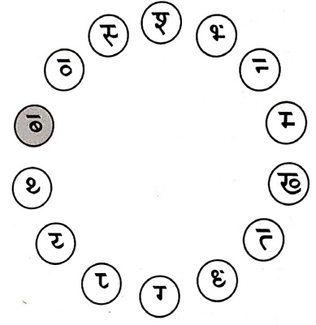

# अक्षरािण योजितता पदनिर्माण कुरुत।

[Table 1](tables/table_001.html)

यथा - गायक:

##### एहि एहि वीर रे,

##### जीवन प्रदर्शित रहे थे

वंह हि मार्गदर्शक:

वंह हि देशरक्षक:

वंह हि शतुनाशक:

कालनागतक्षक: ||

##### साहसी सदा भवे:

भारतीयसंस्कृत्ति

मानसे सदा धेरेः ।।

भारतस्य गोरवाय

सर्वादौ जयो भवेत् ।।

(सं) लक्ष्मीकान्त जाम्बोरकर

[Table 2](tables/table_002.html)

##### अभ्यास:

य: यस्य दण्डलोपी तं समानरर्जेण रुज्यत।

यथा - ७ब

