# मातृभूमि नाम:

मातृभूमे नमः मातृभूमे नमः।

मातृभूमे नमः मातृभूमे नमः।।

अग्रतस्ते नमः पृष्ठतस्ते नमः।

वामतस्ते नम: दक्षिणे ते नम:।। मातृभूमे नम:।।

ते गिरिभ्यो नमः ते नदीभ्यो नमः।

ते वनेभ्यो नमः जनपदेभ्यो नमः॥ मातृभूमे नमः॥

प्राप्त होने के बाद देने वैशिक है।

ऋதिंदर सिंहदरे भुक्तिमुक्तिप्रदे।

सर्वेद सर्वदा देिव तुभ्यं नमः॥ मातृभूमे नमः॥

पं. वासुदेव द्वेवेदी शास्त्री

5

Scanned with OKEN Scanner

#### क्रियाबोध:

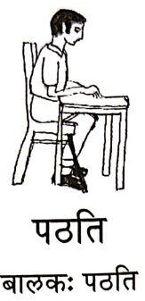

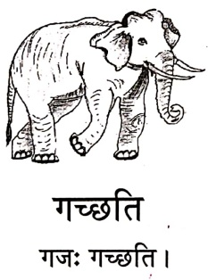

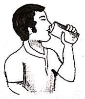

आगच्छित

छात्र: आगच्छित।

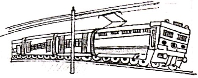

चलित

यानं चलित।

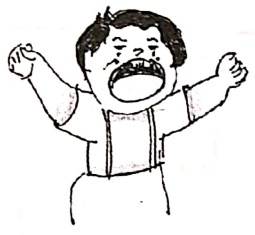

हसित

बालक: हसित।

धावित

घोटक: धावित।

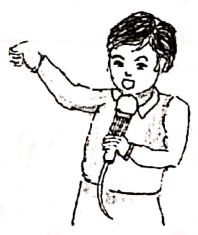

गायति

गायक: गायति ।

कन्दति

बालिका कन्दित ।

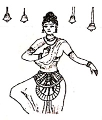

नृत्यित

नर्तरी नृत्यित ।

यानम् - वाहन, घोटक: - घोड़ा

##### क्रियाबोध:

शृणोति

बालक: शृणोति ।

पश्चात्

खग: पश्चात्।

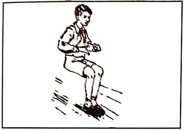

उतिष्ठति

छात्र: उतिष्ठति ।

उपविशति

बाला उपविशति।

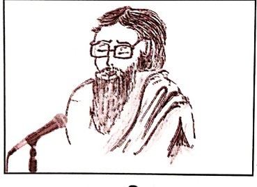

वदित

साधु: वदित ।

चरित

छगल: चरित ।

# अभ्यास:

किसरोति इति लिखित।

यथा-

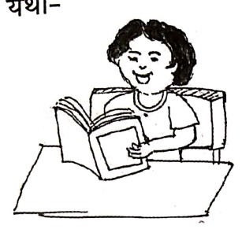

पठित

(लिखित, खादित, पठित)

わ。

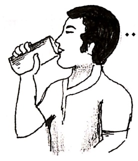

.(खादित, पिबित, गच्छित)

ঝ

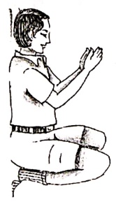

(वदिति, हसिति, नमिति)

 $ T_{1} $
 

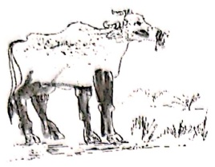

(पश्यित, चरित, नन्दित)

4.
 

.....(हसित, पश्यित, गच्छित)

ذ.
 

.....(आगच्छित, उपविशति,

उतिष्ठित)

हसित गायति नृत्यित पश्यित भ्रमित धावित गच्छित पृच्छित ।

पिबित खादित कन्दित नन्दित वदित निन्दित खेलित हृषित ॥ १॥

नमित गणेशं लिखितं च लेखम् ।

पठित पुस्तकं स्वपितं च ससुखम् ।। २॥

माज़रीयं खादित मौनम् ।

पिबित्त च दुग्धं तिष्ठित मौनम् ।। ३।।

सम्मानदानद मिश्रण

वक्తుण्ड महाकाय सुर्यकोटिसमप्रभ ।

निर्विध्न कुरु मे देव सर्वकार्येषु सर्वदा ।। १॥

सरसवित महाभागे विधे कमललोचने ।

विश्वरूपे विशालाक्षि विधां देहि नमोऽस्तु ते ॥ २॥

गोविन्द गोविन्द हरे मुरारे

गोविन्द गोविन्द रथाঙ্पाने ।

गोविन्द गोविन्द मुकुन्द कृष्ण

गोविन्द गोविन्द नमो नमस्ते ॥ ३॥

महालक्षिण नमस्तुभ्यं नमस्तुभ्यं सुरेशविर ।

हरिप्रिये नमस्तुभ्यं नमस्तुभ्यं दयानिधे ॥ ४॥

श्रीराम राम रघुनन्दन राम राम

श्रीराम राम रणकर्कश राम राम ।

श्रीराम राम भरताग्रज राम राम

श्रीराम राम शरणं भव राम राम ।। ५॥

शहू-चक-गदा-पद्म-वनमाला-विभूषितम् ।

पीताम्बरधरं देवं वन्दे विष्णुं चतुभुजम् ॥ ६॥

तब तत्वं न जानामि कीदृशोऽसि महेश्वर ।

यादृशोऽसि महादेव तादृशाय नमोनमः ।। ७॥

नमस्ते शरणये शिवे सानुकमे

नमस्ते जगद्व्यापिके विश्वस्पे ।

नमस्ते जगद्वन्धपादारविन्दे

नमस्ते जगतारिणी तारीख़ दुर्ग्रहण के दौरान ८० दशक पहले शुरुआत पर हुई है

अज्जनानन्दन वीरम् जानकीशोकनाशनम् ।

कपीशमक्षहन्तांर वन्दे लड़ाभयड्करम् ॥ ९॥

तवैवाहं तवैवाहं तवैव शासवती: समा: ।

सेवासकत: सदा भक्त: प्रेमयोगपरायण: ।। १०।।

##### एकम्

##### さ

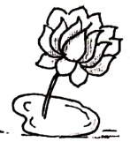

##### ऑपेरा वेब ब्राउज़र

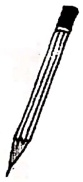

##### चटवाई

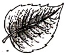

##### 핑

##### சாட்ட

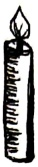

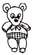

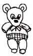

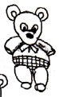

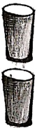

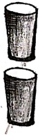

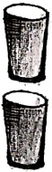

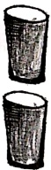

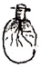

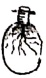

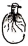

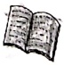

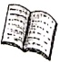

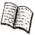

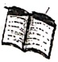

# अभ्यास:

चित्र दृश्य लिखते।

ཀཱ་ཡ

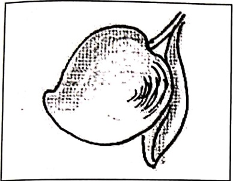

あ。

एकम्

ऑ.

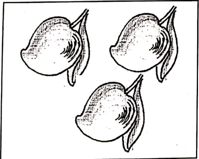

 $ T_{1} $
 

4.
 

3.

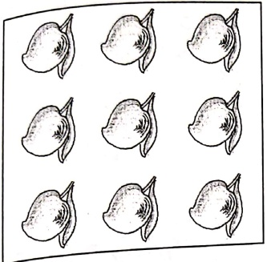

मिलीला गायत ।

एकम् एक्म । देह देह । ज्रीण ज्रीण । चत्वारि ।

पश्च पश्च । षट्षट् । सपत अखे । सपत अखे ।

नव दश नव दश नव दश नव दश ।।

[Table 1](tables/table_001.html)

##### अर्सित-नास्ति

### वृश: अस्ते। फिल्म अस्ते।

### वृक्ष: अस्पताल। फलों निष्सित।

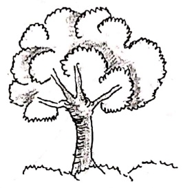

### पुस्तक्म अस्तेडन्स। लेखनी अस्तेजदः

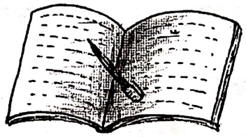

### पुस्तकम् अस्पताल लेखनी नागिल ।

अभ्यास:

वृत्तमध्ये किं किम् अस्तित पश्यत।

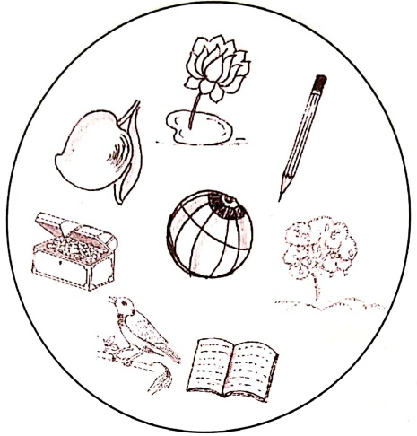

उपरिस्थवृते यद्यद् अस्ित तेषु अस्मिन् बृते किक किक नास्ित लिखत।

पिपासितः काकः
 

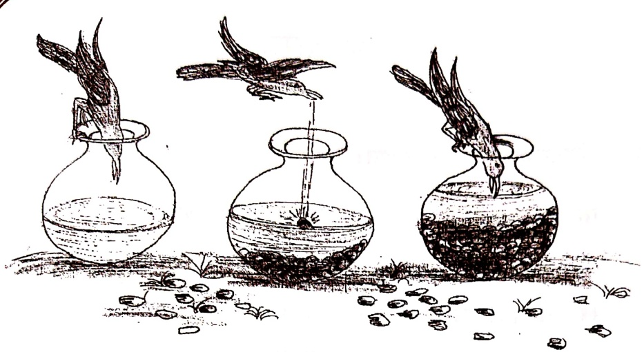

एक: काक: अस्त। स: पिपासित: अस्त। स: जल पातुम् इच्छित। स: सर्वेर भ्रमित किन्तु जलं न पश्यित। स: एक्म उदानं गच्छित। तत्र एक: घट: अस्त। काक: घटं पश्यित । घटे अल्पं जलम् अस्त। काक: जलं पतुं चेष्टा करोति, कित्त तस्य मुखं जलं न स्पृशित। काक: अत्र तत्र पश्यित, तस्य बुड्ः न स्फुरित । स: शिलाखण्डसमूहं पश्यित । तत: शिलाखण्डम् आनयित। एकम् एकं शिलाखण्डं घटे पातयित। तत: जलम् उपिरे आगच्छित। काक: जलं पिबित सानन्दं गच्छित च।

##### अभ्यास:

१. संस्कृतभाषया उत्तर लिखित।

क. क: पिपासित: अस्ति ? (काक:, शुक:, बक:)

ख.  काकः किम् इच्छित?  (फलम्, जलम्, धनम्)

ग.  सः कुत्र गच्छित?  (नदीम्, नगरम्, उधानम्)

च.  कियत् जल्म् अस्ति ? (अल्पम्, पूर्णम्, बहु)

ड.  काक: किम् आनयित? (शिलाखण्डम्, जल्म्, पात्रम्)

च.  अन्ये काक: किं करोति ? (गच्छित, पश्यित, आगच्छित)

सदा करोति विधाधी सहन सुखदुःखयो:।

सुखं भवतु वा दुःखं विधाभ्यासं करोति स:॥ १॥

हस्सत्य भूषणं दानं सत्यं कण्ठस्य भूषणम् ।

श्रेत्रस्य भूषणं शास्त्रं भूषणैः किं प्रयोजनम् ।। २।।

काक: कृष्ण: पिक: कृष्ण: को भेद: पिककाकयो: ।

प्राणे वसनतकाले तु काक: काक: पिक: पिक: ॥ ३॥

नाست लोभसमो व्याधि: नास्त क्रोधसमो रिपु: ।

नाستल विधासमो बन्धु: नास्त शानसमं सुखम् ॥ ४॥

आचार: परमो धर्म: आचार: परमॅन तप: ।

आचार: परमं शान் आचारात्िकि न सिद्धचिते ।।५ ।

ज्योदश: पाठ:

सुभाषितানি

[Table 2](tables/table_002.html)

##### मम शरीरम्

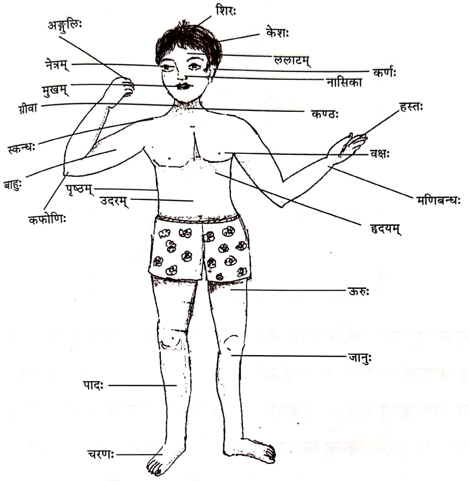

मिलीता गायत

मदियं शरीरं स्वस्थं सुरूपं रोगविरहितं हढं च नम्यम् ।

कार्ये सुदक्षं रचिरं सुरम्यं भगवत्कार्यं कर्तु निष्ठम् ।

सम्दानन्द मिश्र

#### शूगाल: द्राक्षाफलें च

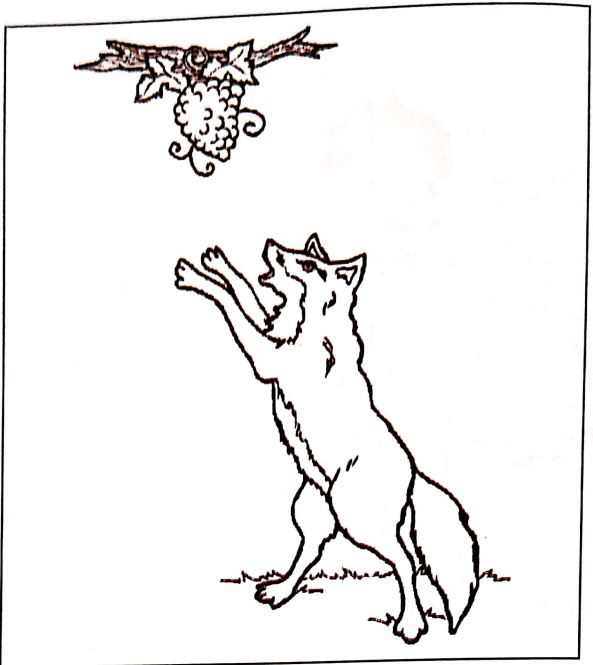

एक: शृगाल: असित। स: वने अत्र तत्र भ्रमित। एकदा स: वृक्षे द्राक्षाफलं पश्यित । स: तत् खादितुम् इच्छित । फलम् उपरि असित । स: तत् प्राप्तुं कूर्दित। एकवारं कूर्दित कিন्तु फलं न स्मृशित। पुनः एकवारं कूर्दित किन्तु फलं न स्मृशित। पुनं: पुनः कूर्दित तथापि फलं न प्राप्ति। अन्ते कलान्त: भवित कथयित च - ‘अहो द्राक्षाफलं तु अम्लं भवित। क: अम्लफलं खादित ? अहं वृथा श्रमं करोमि ।' तत् कथयित अन्यत्र गच्छितं च ।

##### अभ्यास:

१. संस्कृतभाषया उत्तर लिखत।

(क) वने कः भ्रमित ? (शुकः, शृगालः, सिंहः)

(ख) शृगालः कि पशयित ? (जलम्, द्राक्षाफलम्, पुषम्)

(ग) फलं कुत अस्ति ? (आकाशो , उपरि , तले )

(घ) द्राक्षाफलं कथं स्वदते ? (मधुरम् , तिकतम् , अम्लम्)

(ड) अन्ते शृगालः कि करोति ? (खादित , पश्यित , गच्छित)

२. समुचितपदन रिकतस्थानं पूरयत ।

(क) शृगालः वने …… (भ्रमित, पश्यित, प्राप्ोति)

(ख) शृगाल: द्राक्षाफल …… (खादित, पश्यित, प्राप्ोति)

(ग) शृगाल: द्राक्षाफलें खादितुम् … (स्पृशित, कथ्यति, इच्छित)

(घ) शृगाल: फलें प्राप्तु …… (स्पृशित, कूर्दित, पशयित)

(ड) अन्ते शृगालः …… (कलान्: भवति, अम्लफलं खादित,

पुनः पुनः कूर्दित)